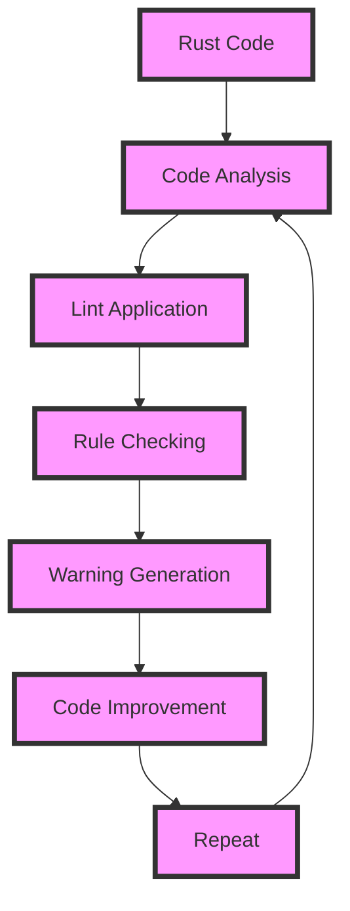

## Introduction
**cargo clippy** is a popular Rust linter that helps developers write more idiomatic, efficient, and safe Rust code. It is a part of the Rust ecosystem and is widely used in the industry. With **cargo clippy**, developers can catch common mistakes and improve their code quality before it reaches production. In this section, we will explore what **cargo clippy** is, why it matters, and its real-world relevance.

> **Note:** **cargo clippy** is not just a linter, but a tool that helps developers write better Rust code. It is an essential part of the Rust development workflow.

Rust is a systems programming language that prioritizes safety and performance. However, writing idiomatic Rust code can be challenging, especially for beginners. **cargo clippy** helps bridge this gap by providing a set of rules and guidelines that developers can follow to write better Rust code. With **cargo clippy**, developers can avoid common pitfalls and improve their code quality, making it more maintainable, efficient, and safe.

## Core Concepts
**cargo clippy** is built around several core concepts, including:

* **Lints**: **cargo clippy** provides a set of lints that check for common mistakes and patterns in Rust code. These lints can be customized and extended to fit specific use cases.
* **Rules**: **cargo clippy** has a set of rules that define what constitutes good Rust code. These rules are based on best practices and are designed to help developers write idiomatic Rust code.
* **Warnings**: **cargo clippy** generates warnings when it encounters code that does not conform to its rules. These warnings can be customized and filtered to suit specific needs.

> **Warning:** Ignoring **cargo clippy** warnings can lead to bugs and performance issues in production code. It is essential to address these warnings and improve code quality.

## How It Works Internally
**cargo clippy** works by analyzing Rust code and applying its set of rules and lints. Here is a step-by-step breakdown of how it works:

1. **Code Analysis**: **cargo clippy** analyzes Rust code and identifies potential issues.
2. **Lint Application**: **cargo clippy** applies its set of lints to the analyzed code.
3. **Rule Checking**: **cargo clippy** checks the code against its set of rules.
4. **Warning Generation**: **cargo clippy** generates warnings when it encounters code that does not conform to its rules.

> **Tip:** **cargo clippy** can be integrated into the Rust development workflow using various tools and plugins.

## Code Examples
Here are three complete and runnable examples of using **cargo clippy**:

### Example 1: Basic Usage
```rust
// clippy_example.rs
fn main() {
    let x = 5;
    let y = x; // This will trigger a clippy warning
    println!("{}", y);
}
```
To run this example, save it to a file named `clippy_example.rs` and run the following command:
```bash
cargo clippy --example clippy_example
```
This will generate a warning about the unnecessary clone.

### Example 2: Custom Lints
```rust
// custom_lint.rs
#![deny(clippy::all)]

fn main() {
    let x = 5;
    let y = x; // This will trigger a custom lint warning
    println!("{}", y);
}
```
To run this example, save it to a file named `custom_lint.rs` and run the following command:
```bash
cargo clippy --example custom_lint
```
This will generate a custom lint warning about the unnecessary clone.

### Example 3: Advanced Usage
```rust
// advanced_usage.rs
#![deny(clippy::all)]

fn main() {
    let x = 5;
    let y = x; // This will trigger a warning
    let z = y; // This will trigger another warning
    println!("{}", z);
}
```
To run this example, save it to a file named `advanced_usage.rs` and run the following command:
```bash
cargo clippy --example advanced_usage
```
This will generate multiple warnings about unnecessary clones.

## Visual Diagram

This diagram illustrates the internal workflow of **cargo clippy**. It shows how Rust code is analyzed, lints are applied, rules are checked, and warnings are generated.

> **Note:** This diagram is a simplified representation of the **cargo clippy** workflow.

## Comparison
| Linter | Time Complexity | Space Complexity | Pros | Cons | Best For |
| --- | --- | --- | --- | --- | --- |
| **cargo clippy** | O(n) | O(n) | Comprehensive set of lints, customizable, and integratable | Steep learning curve, can be overwhelming for beginners | Rust development |
| **rustfmt** | O(n) | O(n) | Consistent code formatting, easy to use | Limited customization options | Rust development |
| **rust-analyzer** | O(n) | O(n) | Advanced code analysis, integratable with IDEs | Resource-intensive, can be slow | Rust development |
| **lint-rs** | O(n) | O(n) | Simple and easy to use, customizable | Limited set of lints, not as comprehensive as **cargo clippy** | Rust development |

> **Interview:** What is the time complexity of **cargo clippy**? Can you explain how it works internally?

## Real-world Use Cases
Here are three real-world examples of using **cargo clippy** in production:

1. **Dropbox**: Dropbox uses **cargo clippy** to ensure that their Rust code is idiomatic and efficient.
2. **Mozilla**: Mozilla uses **cargo clippy** to improve the quality of their Rust code and catch common mistakes.
3. **Microsoft**: Microsoft uses **cargo clippy** to develop high-quality Rust code for their Azure cloud platform.

> **Tip:** **cargo clippy** can be integrated into CI/CD pipelines to automate code quality checks.

## Common Pitfalls
Here are four common mistakes that developers make when using **cargo clippy**:

1. **Ignoring Warnings**: Ignoring **cargo clippy** warnings can lead to bugs and performance issues in production code.
2. **Incorrect Configuration**: Incorrectly configuring **cargo clippy** can lead to false positives or false negatives.
3. **Insufficient Testing**: Insufficient testing can lead to **cargo clippy** warnings being overlooked or ignored.
4. **Inadequate Code Review**: Inadequate code review can lead to **cargo clippy** warnings being missed or ignored.

> **Warning:** Ignoring **cargo clippy** warnings can have severe consequences in production code.

## Interview Tips
Here are three common interview questions related to **cargo clippy**:

1. **What is the purpose of **cargo clippy****?**: A strong answer should explain the purpose of **cargo clippy** and its role in improving Rust code quality.
2. **How does **cargo clippy** work internally?**: A strong answer should explain the internal workflow of **cargo clippy**, including code analysis, lint application, and warning generation.
3. **What are some common pitfalls when using **cargo clippy****?**: A strong answer should explain common mistakes that developers make when using **cargo clippy**, including ignoring warnings, incorrect configuration, and inadequate testing.

> **Interview:** Can you explain the difference between **cargo clippy** and **rustfmt**?

## Key Takeaways
Here are ten key takeaways about **cargo clippy**:

* **cargo clippy** is a Rust linter that helps developers write idiomatic and efficient Rust code.
* **cargo clippy** has a comprehensive set of lints that can be customized and extended.
* **cargo clippy** works by analyzing Rust code and applying its set of lints and rules.
* **cargo clippy** generates warnings when it encounters code that does not conform to its rules.
* **cargo clippy** can be integrated into the Rust development workflow using various tools and plugins.
* **cargo clippy** has a steep learning curve, but it is essential for writing high-quality Rust code.
* **cargo clippy** can be used in conjunction with other tools, such as **rustfmt** and **rust-analyzer**.
* **cargo clippy** is widely used in the industry, including by companies like Dropbox, Mozilla, and Microsoft.
* **cargo clippy** has a time complexity of O(n) and a space complexity of O(n).
* **cargo clippy** is an essential tool for any Rust developer looking to improve their code quality and write idiomatic Rust code.