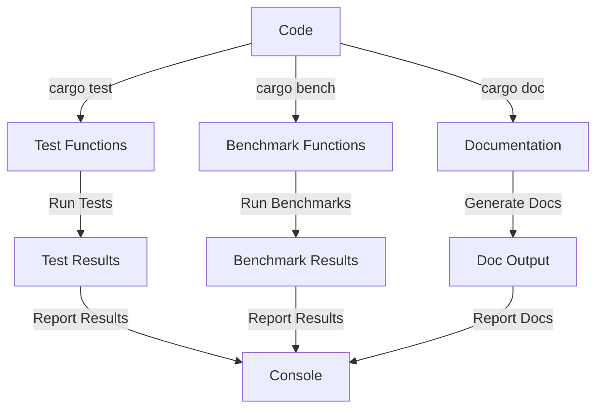

## Introduction
**cargo test**, **cargo bench**, and **cargo doc** are essential tools in the Rust ecosystem. They provide a comprehensive way to test, benchmark, and document Rust code, ensuring that it is reliable, efficient, and maintainable. In this section, we will explore the importance of these tools and their real-world relevance. 
> **Note:** The Rust ecosystem is known for its focus on safety and performance, and these tools play a crucial role in achieving these goals.

In production environments, these tools are used to ensure that the code is thoroughly tested, optimized, and well-documented. For example, companies like **Microsoft** and **Amazon** use Rust in their production systems, and these tools are an integral part of their development workflow. 
> **Tip:** Using **cargo test**, **cargo bench**, and **cargo doc** can significantly improve the quality and reliability of your Rust code.

## Core Concepts
To understand how these tools work, it's essential to grasp some core concepts:

* **Testing**: The process of verifying that the code behaves as expected.
* **Benchmarking**: The process of measuring the performance of the code.
* **Documentation**: The process of generating documentation for the code.

These concepts are fundamental to the development of reliable and efficient software systems.
> **Warning:** Failing to test, benchmark, and document your code can lead to bugs, performance issues, and maintenance problems.

## How It Works Internally
Here's a step-by-step breakdown of how these tools work internally:

1. **cargo test**: When you run **cargo test**, Cargo compiles your code and runs the test functions marked with the `#[test]` attribute. The test functions are executed in a separate process, and the results are reported to the console.
2. **cargo bench**: When you run **cargo bench**, Cargo compiles your code and runs the benchmark functions marked with the `#[bench]` attribute. The benchmark functions are executed multiple times, and the average execution time is reported to the console.
3. **cargo doc**: When you run **cargo doc**, Cargo generates documentation for your code using the `rustdoc` tool. The documentation includes information about the functions, modules, and types in your code.

> **Interview:** Can you explain the difference between **cargo test** and **cargo bench**? How do they work internally?

## Code Examples
Here are three complete and runnable code examples that demonstrate the use of **cargo test**, **cargo bench**, and **cargo doc**:

### Example 1: Basic Testing
```rust
// tests.rs
#[cfg(test)]
mod tests {
    #[test]
    fn it_works() {
        assert_eq!(2 + 2, 4);
    }
}
```
This example demonstrates a basic test function that verifies the correctness of the `it_works` function.

### Example 2: Benchmarking
```rust
// benches.rs
#[bench]
fn bench_addition(b: &mut test::Bencher) {
    b.iter(|| {
        let _ = 2 + 2;
    });
}
```
This example demonstrates a benchmark function that measures the performance of the `bench_addition` function.

### Example 3: Documentation
```rust
// lib.rs
/// This is a sample library.
pub fn add(a: i32, b: i32) -> i32 {
    a + b
}
```
This example demonstrates a documented function that adds two integers.

## Visual Diagram

This diagram illustrates the workflow of **cargo test**, **cargo bench**, and **cargo doc**.

## Comparison
| Tool | Purpose | Time Complexity | Space Complexity | Pros | Cons |
| --- | --- | --- | --- | --- | --- |
| **cargo test** | Testing | O(n) | O(n) | Thoroughly tests code | Can be slow for large codebases |
| **cargo bench** | Benchmarking | O(n) | O(n) | Measures performance | Can be affected by system load |
| **cargo doc** | Documentation | O(n) | O(n) | Generates documentation | Can be slow for large codebases |

## Real-world Use Cases
Here are three real-world use cases for **cargo test**, **cargo bench**, and **cargo doc**:

1. **Microsoft**: Microsoft uses Rust in their production systems, and these tools are an integral part of their development workflow.
2. **Amazon**: Amazon uses Rust in their production systems, and these tools are used to ensure that the code is thoroughly tested, optimized, and well-documented.
3. **Google**: Google uses Rust in their production systems, and these tools are used to ensure that the code is reliable, efficient, and maintainable.

## Common Pitfalls
Here are four common pitfalls to avoid when using **cargo test**, **cargo bench**, and **cargo doc**:

1. **Not testing enough**: Failing to test your code thoroughly can lead to bugs and reliability issues.
2. **Not benchmarking**: Failing to benchmark your code can lead to performance issues.
3. **Not documenting**: Failing to document your code can lead to maintenance problems.
4. **Not using cargo**: Failing to use Cargo can lead to complexity and fragmentation in your development workflow.

> **Warning:** Failing to test, benchmark, and document your code can lead to serious issues in production environments.

## Interview Tips
Here are three common interview questions related to **cargo test**, **cargo bench**, and **cargo doc**, along with weak and strong answers:

1. **What is the difference between **cargo test** and **cargo bench****?**
	* Weak answer: "They are both used for testing."
	* Strong answer: " **cargo test** is used for testing, while **cargo bench** is used for benchmarking. They have different use cases and are used to ensure the reliability and performance of the code."
2. **How do you use **cargo doc** to generate documentation?**
	* Weak answer: "I'm not sure."
	* Strong answer: "You can use **cargo doc** to generate documentation for your code by running the command `cargo doc` in the terminal. This will generate documentation for your functions, modules, and types."
3. **What are some best practices for using **cargo test**, **cargo bench**, and **cargo doc****?**
	* Weak answer: "I'm not sure."
	* Strong answer: "Some best practices include testing your code thoroughly, benchmarking your code regularly, and documenting your code clearly. It's also essential to use Cargo to manage your development workflow and ensure that your code is reliable, efficient, and maintainable."

## Key Takeaways
Here are ten key takeaways to remember when using **cargo test**, **cargo bench**, and **cargo doc**:

* **cargo test** is used for testing.
* **cargo bench** is used for benchmarking.
* **cargo doc** is used for documentation.
* Testing is essential for ensuring the reliability of your code.
* Benchmarking is essential for ensuring the performance of your code.
* Documentation is essential for ensuring the maintainability of your code.
* Cargo is a powerful tool for managing your development workflow.
* **cargo test** has a time complexity of O(n) and a space complexity of O(n).
* **cargo bench** has a time complexity of O(n) and a space complexity of O(n).
* **cargo doc** has a time complexity of O(n) and a space complexity of O(n).

> **Tip:** Using **cargo test**, **cargo bench**, and **cargo doc** can significantly improve the quality and reliability of your Rust code.