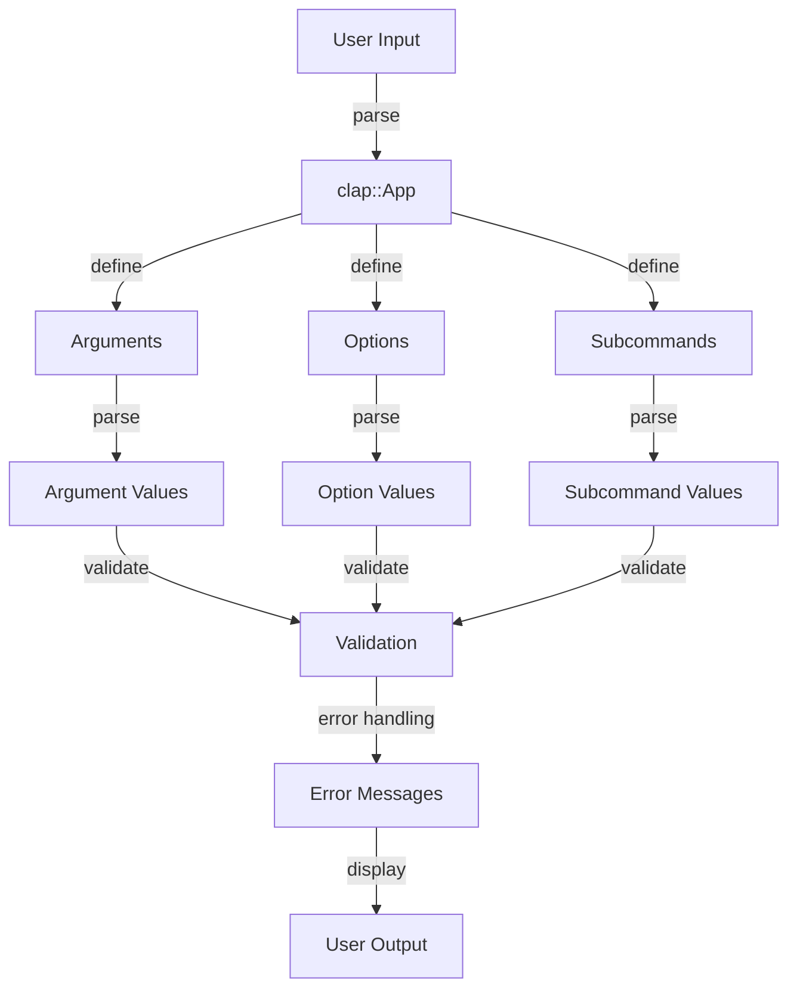

## Introduction
The **Command-Line Argument Parser (clap)** is a popular Rust library used for building command-line interfaces (CLI). It provides a simple and efficient way to parse command-line arguments, making it easier to create user-friendly and flexible CLI tools. With clap, developers can define a set of arguments, options, and subcommands, and the library will handle the parsing and validation of the input. This library is widely used in the Rust ecosystem and is considered one of the most popular and well-maintained CLI parsing libraries available.

> **Note:** clap is not just limited to parsing command-line arguments; it also provides features like automatic help message generation, error handling, and customization options.

In real-world scenarios, clap is used by companies like **Microsoft**, **Google**, and **Amazon** to build CLI tools for their products and services. For example, the **Azure CLI** uses clap to parse command-line arguments and provide a user-friendly interface for managing Azure resources.

## Core Concepts
Before diving into the details of clap, it's essential to understand some core concepts:

* **Arguments**: These are the values passed to a command-line application, separated by spaces. For example, in the command `my_app -o output.txt input.txt`, `input.txt` and `output.txt` are arguments.
* **Options**: These are flags or switches that modify the behavior of a command-line application. Options can have values or be boolean flags. For example, in the command `my_app -v -o output.txt input.txt`, `-v` is a boolean flag, and `-o output.txt` is an option with a value.
* **Subcommands**: These are nested commands that provide additional functionality to a command-line application. For example, in the command `git commit -m "My commit message"`, `commit` is a subcommand of the `git` command.

> **Warning:** When using clap, it's essential to define the arguments, options, and subcommands correctly to avoid parsing errors and unexpected behavior.

## How It Works Internally
clap works internally by using a combination of the following steps:

1. **Definition**: The developer defines the arguments, options, and subcommands using clap's API.
2. **Parsing**: clap parses the command-line input and matches it against the defined arguments, options, and subcommands.
3. **Validation**: clap validates the parsed input to ensure that it conforms to the defined rules and constraints.
4. **Error Handling**: clap handles any errors that occur during parsing and validation, providing informative error messages to the user.

> **Tip:** clap provides a `try!` macro that can be used to simplify error handling and make the code more readable.

## Code Examples
Here are three complete and runnable code examples that demonstrate the usage of clap:

### Example 1: Basic Usage
```rust
use clap::{App, Arg};

fn main() {
    let matches = App::new("my_app")
        .version("1.0")
        .author("My Name")
        .about("My App")
        .arg(
            Arg::new("input")
                .help("Input file")
                .required(true),
        )
        .get_matches();

    let input_file = matches.value_of("input").unwrap();
    println!("Input file: {}", input_file);
}
```

### Example 2: Real-World Pattern
```rust
use clap::{App, Arg};
use std::fs::File;
use std::io::Read;

fn main() {
    let matches = App::new("my_app")
        .version("1.0")
        .author("My Name")
        .about("My App")
        .arg(
            Arg::new("input")
                .help("Input file")
                .required(true),
        )
        .arg(
            Arg::new("output")
                .help("Output file")
                .required(true),
        )
        .get_matches();

    let input_file = matches.value_of("input").unwrap();
    let output_file = matches.value_of("output").unwrap();

    let mut input = File::open(input_file).unwrap();
    let mut contents = String::new();
    input.read_to_string(&mut contents).unwrap();

    let mut output = File::create(output_file).unwrap();
    output.write_all(contents.as_bytes()).unwrap();
}
```

### Example 3: Advanced Usage
```rust
use clap::{App, Arg, SubCommand};
use std::fs::File;
use std::io::Read;

fn main() {
    let matches = App::new("my_app")
        .version("1.0")
        .author("My Name")
        .about("My App")
        .subcommand(
            SubCommand::new("init")
                .about("Initialize the app")
                .arg(
                    Arg::new("config")
                        .help("Config file")
                        .required(true),
                ),
        )
        .subcommand(
            SubCommand::new("run")
                .about("Run the app")
                .arg(
                    Arg::new("input")
                        .help("Input file")
                        .required(true),
                )
                .arg(
                    Arg::new("output")
                        .help("Output file")
                        .required(true),
                ),
        )
        .get_matches();

    match matches.subcommand_name() {
        Some("init") => {
            let config_file = matches.value_of("config").unwrap();
            println!("Config file: {}", config_file);
        }
        Some("run") => {
            let input_file = matches.value_of("input").unwrap();
            let output_file = matches.value_of("output").unwrap();
            println!("Input file: {}", input_file);
            println!("Output file: {}", output_file);
        }
        _ => {}
    }
}
```

## Visual Diagram


This diagram illustrates the flow of how clap works internally, from parsing the user input to displaying the error messages.

## Comparison
| Library | Time Complexity | Space Complexity | Pros | Cons | Best For |
| --- | --- | --- | --- | --- | --- |
| clap | O(n) | O(n) | Easy to use, flexible, and customizable | Steep learning curve | CLI tools with complex argument parsing |
| getopts | O(n) | O(1) | Simple and lightweight | Limited features and customization options | Simple CLI tools with basic argument parsing |
| docopt | O(n) | O(n) | Easy to use and customizable | Limited support for subcommands and complex argument parsing | CLI tools with simple argument parsing and documentation generation |
| structopt | O(n) | O(n) | Easy to use and customizable | Limited support for complex argument parsing and subcommands | CLI tools with simple argument parsing and struct-based configuration |

## Real-world Use Cases
Here are three real-world use cases of clap:

1. **Azure CLI**: The Azure CLI uses clap to parse command-line arguments and provide a user-friendly interface for managing Azure resources.
2. **Google Cloud SDK**: The Google Cloud SDK uses clap to parse command-line arguments and provide a user-friendly interface for managing Google Cloud resources.
3. **Rustup**: Rustup, the Rust toolchain installer, uses clap to parse command-line arguments and provide a user-friendly interface for managing Rust toolchains.

## Common Pitfalls
Here are four common pitfalls to watch out for when using clap:

1. **Incorrect argument ordering**: clap is sensitive to the order of arguments, so it's essential to define them in the correct order to avoid parsing errors.
2. **Insufficient error handling**: clap provides informative error messages, but it's essential to handle errors correctly to avoid unexpected behavior.
3. **Overly complex argument parsing**: clap provides a lot of features and customization options, but overly complex argument parsing can lead to maintenance issues and bugs.
4. **Inconsistent argument naming**: clap uses a consistent naming convention for arguments, so it's essential to follow this convention to avoid confusion and errors.

> **Interview:** When interviewing for a Rust developer position, be prepared to answer questions about clap, such as how to define arguments, options, and subcommands, and how to handle errors and edge cases.

## Interview Tips
Here are three common interview questions related to clap:

1. **How do you define arguments and options in clap?**: The correct answer should include a description of how to use the `Arg` and `Option` APIs to define arguments and options.
2. **How do you handle errors in clap?**: The correct answer should include a description of how to use the `try!` macro and error handling mechanisms to handle errors and edge cases.
3. **How do you customize the help message in clap?**: The correct answer should include a description of how to use the `about` and `version` APIs to customize the help message.

## Key Takeaways
Here are ten key takeaways to remember when using clap:

* **Define arguments and options correctly**: Use the `Arg` and `Option` APIs to define arguments and options.
* **Use the `try!` macro for error handling**: Use the `try!` macro to simplify error handling and make the code more readable.
* **Customize the help message**: Use the `about` and `version` APIs to customize the help message.
* **Use subcommands for complex CLI tools**: Use subcommands to define complex CLI tools with multiple commands and options.
* **Handle errors and edge cases**: Use error handling mechanisms to handle errors and edge cases.
* **Use the `clap::App` API to define the CLI tool**: Use the `clap::App` API to define the CLI tool and its arguments, options, and subcommands.
* **Use the `clap::Arg` API to define arguments**: Use the `clap::Arg` API to define arguments and their properties.
* **Use the `clap::Option` API to define options**: Use the `clap::Option` API to define options and their properties.
* **Use the `clap::SubCommand` API to define subcommands**: Use the `clap::SubCommand` API to define subcommands and their properties.
* **Test the CLI tool thoroughly**: Test the CLI tool thoroughly to ensure that it works correctly and handles errors and edge cases correctly.