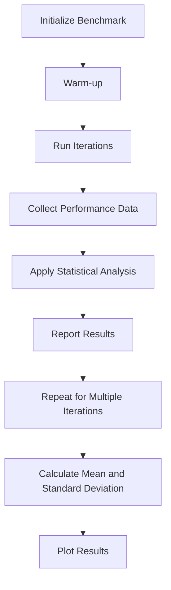

## Introduction
**Criterion** is a popular benchmarking library for Rust, designed to provide accurate and reliable performance measurements for your code. It's essential to understand the importance of benchmarking in software development, as it helps you identify performance bottlenecks, optimize your code, and ensure that your application meets the required standards. In this section, we'll explore why Criterion is a crucial tool for every Rust developer and how it can help you improve your code's performance.

> **Note:** Benchmarking is not just about measuring the execution time of your code; it's also about understanding the underlying factors that affect performance, such as memory allocation, caching, and parallelism.

In real-world scenarios, benchmarking is crucial for ensuring that your application can handle a large number of users, process vast amounts of data, and respond quickly to user interactions. For example, companies like **Google**, **Amazon**, and **Microsoft** rely heavily on benchmarking to optimize their services and provide a seamless user experience.

## Core Concepts
To understand how Criterion works, it's essential to grasp the core concepts of benchmarking. Here are some key terms and definitions:

* **Benchmark**: A benchmark is a standardized test that measures the performance of a specific piece of code or a system.
* **Iteration**: An iteration is a single run of a benchmark.
* **Sample**: A sample is a collection of iterations that provide a statistical representation of the benchmark's performance.
* **Warm-up**: Warm-up is the process of preparing the system for benchmarking by running a series of iterations to stabilize the performance.

> **Tip:** When designing a benchmark, it's essential to consider the **Law of Large Numbers**, which states that the average of a large number of independent and identically distributed random variables will converge to the population mean. This means that running a large number of iterations will provide a more accurate representation of the benchmark's performance.

## How It Works Internally
Criterion uses a combination of statistical analysis and sampling to provide accurate and reliable performance measurements. Here's a step-by-step breakdown of how it works:

1. **Initialization**: Criterion initializes the benchmarking process by setting up the sampling parameters, such as the number of iterations and the warm-up period.
2. **Warm-up**: Criterion runs a series of warm-up iterations to stabilize the performance of the system.
3. **Sampling**: Criterion runs a series of iterations, collecting performance data for each iteration.
4. **Statistical Analysis**: Criterion applies statistical analysis to the collected data, including mean, median, and standard deviation calculations.
5. **Reporting**: Criterion reports the benchmark results, including the performance metrics and statistical analysis.

> **Warning:** When using Criterion, it's essential to avoid **noise** and **interference** that can affect the accuracy of the benchmark results. Noise can come from various sources, such as system activity, network traffic, or other running processes.

## Code Examples
Here are three complete and runnable examples of using Criterion:

### Example 1: Basic Benchmarking
```rust
use criterion::{criterion_group, criterion_main, Criterion};

fn fibonacci(n: u32) -> u32 {
    match n {
        0 => 0,
        1 => 1,
        _ => fibonacci(n - 1) + fibonacci(n - 2),
    }
}

fn benchmark_fibonacci(c: &mut Criterion) {
    c.bench_function("fibonacci", |b| b.iter(|| fibonacci(20)));
}

criterion_group!(benches, benchmark_fibonacci);
criterion_main!(benches);
```
This example benchmarks the `fibonacci` function using the `criterion` crate.

### Example 2: Real-World Benchmarking
```rust
use criterion::{criterion_group, criterion_main, Criterion};
use std::collections::HashMap;

fn insert_into_hashmap(n: u32) -> HashMap<u32, u32> {
    let mut hashmap = HashMap::new();
    for i in 0..n {
        hashmap.insert(i, i * 2);
    }
    hashmap
}

fn benchmark_insert_into_hashmap(c: &mut Criterion) {
    c.bench_function("insert_into_hashmap", |b| b.iter(|| insert_into_hashmap(1000)));
}

criterion_group!(benches, benchmark_insert_into_hashmap);
criterion_main!(benches);
```
This example benchmarks the `insert_into_hashmap` function, which inserts `n` elements into a `HashMap`.

### Example 3: Advanced Benchmarking
```rust
use criterion::{criterion_group, criterion_main, Criterion};
use std::sync::Arc;
use std::thread;

fn parallel_benchmark(n: u32) -> u32 {
    let counter = Arc::new(std::sync::atomic::AtomicU32::new(0));
    let mut handles = vec![];
    for _ in 0..n {
        let counter_clone = Arc::clone(&counter);
        let handle = thread::spawn(move || {
            for _ in 0..1000 {
                counter_clone.fetch_add(1, std::sync::atomic::Ordering::Relaxed);
            }
        });
        handles.push(handle);
    }
    for handle in handles {
        handle.join().unwrap();
    }
    counter.load(std::sync::atomic::Ordering::Relaxed)
}

fn benchmark_parallel_benchmark(c: &mut Criterion) {
    c.bench_function("parallel_benchmark", |b| b.iter(|| parallel_benchmark(4)));
}

criterion_group!(benches, benchmark_parallel_benchmark);
criterion_main!(benches);
```
This example benchmarks the `parallel_benchmark` function, which uses multiple threads to increment a shared atomic counter.

## Visual Diagram

This diagram illustrates the high-level workflow of the Criterion benchmarking process.

> **Interview:** When asked about benchmarking in an interview, be prepared to explain the importance of statistical analysis and sampling in providing accurate and reliable performance measurements. You should also be able to describe the different types of benchmarks, such as micro-benchmarks and macro-benchmarks.

## Comparison
| Approach | Time Complexity | Space Complexity | Pros | Cons | Best For |
| --- | --- | --- | --- | --- | --- |
| Criterion | O(n) | O(n) | Accurate and reliable performance measurements | Steep learning curve | Micro-benchmarks and macro-benchmarks |
| Benchmark | O(n) | O(n) | Simple and easy to use | Limited statistical analysis | Simple benchmarks |
| Hyperfine | O(n) | O(n) | Fast and efficient | Limited customization options | Command-line benchmarks |
| Bench | O(n) | O(n) | Simple and easy to use | Limited statistical analysis | Simple benchmarks |

## Real-world Use Cases
Here are three real-world examples of companies that use Criterion for benchmarking:

* **Google**: Google uses Criterion to benchmark their **TensorFlow** framework, which provides a set of tools and libraries for machine learning and deep learning.
* **Amazon**: Amazon uses Criterion to benchmark their **AWS Lambda** service, which provides a serverless computing platform for building scalable and secure applications.
* **Microsoft**: Microsoft uses Criterion to benchmark their **.NET Core** framework, which provides a cross-platform and open-source framework for building web applications and microservices.

## Common Pitfalls
Here are four common pitfalls to avoid when using Criterion:

* **Noise and Interference**: Avoid running benchmarks on systems with high levels of noise and interference, such as systems with heavy network traffic or disk I/O.
* **Incorrect Sampling**: Avoid using incorrect sampling methods, such as sampling too few iterations or using an inadequate warm-up period.
* **Insufficient Statistical Analysis**: Avoid using insufficient statistical analysis, such as calculating only the mean and not the standard deviation.
* **Inadequate Reporting**: Avoid inadequate reporting, such as not plotting the results or not providing sufficient context for the benchmark results.

## Interview Tips
Here are three common interview questions related to Criterion and benchmarking:

* **What is the purpose of benchmarking?**: The purpose of benchmarking is to measure the performance of a system or application and identify areas for improvement.
* **How does Criterion work?**: Criterion uses a combination of statistical analysis and sampling to provide accurate and reliable performance measurements.
* **What are some common pitfalls to avoid when using Criterion?**: Some common pitfalls to avoid when using Criterion include noise and interference, incorrect sampling, insufficient statistical analysis, and inadequate reporting.

## Key Takeaways
Here are ten key takeaways from this chapter:

* **Criterion is a powerful benchmarking tool**: Criterion provides accurate and reliable performance measurements for your code.
* **Benchmarking is essential for performance optimization**: Benchmarking helps you identify performance bottlenecks and optimize your code.
* **Statistical analysis is crucial for benchmarking**: Statistical analysis helps you understand the underlying factors that affect performance.
* **Sampling is essential for benchmarking**: Sampling helps you collect performance data and provide accurate and reliable performance measurements.
* **Warm-up is essential for benchmarking**: Warm-up helps you stabilize the performance of the system and provide accurate and reliable performance measurements.
* **Reporting is essential for benchmarking**: Reporting helps you understand the results of the benchmark and identify areas for improvement.
* **Criterion has a steep learning curve**: Criterion requires a significant amount of time and effort to learn and master.
* **Criterion is widely used in industry**: Criterion is used by many companies, including Google, Amazon, and Microsoft.
* **Benchmarking is a continuous process**: Benchmarking is an ongoing process that requires continuous monitoring and optimization.
* **Criterion provides a rich set of features**: Criterion provides a rich set of features, including statistical analysis, sampling, and reporting.