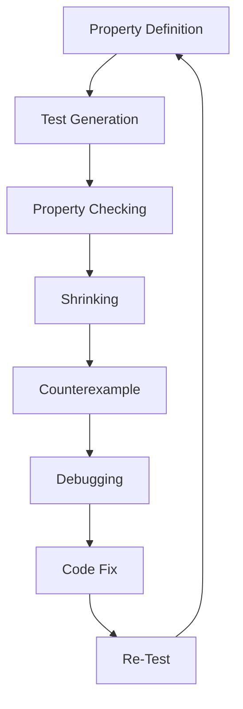

## Introduction
**Property-based testing** is a software testing technique that focuses on verifying the correctness of a program by checking its properties. This approach is particularly useful in functional programming languages like Rust, where immutability and referential transparency make it easier to reason about code. Property-based testing tools like **Proptest** and **QuickCheck** provide a way to define and test properties, ensuring that your code behaves as expected.

In real-world scenarios, property-based testing is essential for ensuring the reliability and correctness of critical systems. For example, companies like **Google** and **Amazon** use property-based testing to verify the correctness of their software systems. By using property-based testing, you can catch bugs early and prevent them from propagating to production, reducing the risk of errors and improving overall system reliability.

> **Note:** Property-based testing is not a replacement for traditional unit testing, but rather a complementary approach that helps to ensure the correctness of your code.

## Core Concepts
Property-based testing involves defining **properties**, which are statements about the behavior of a program. These properties are then tested using a **test generator**, which generates inputs to the program and checks whether the property holds. The key concepts in property-based testing are:

* **Properties**: Statements about the behavior of a program, e.g., "the function always returns a positive integer".
* **Test generators**: Tools that generate inputs to the program and check whether the property holds.
* **Shrinking**: The process of reducing the size of a counterexample to make it easier to understand and debug.

> **Warning:** Property-based testing can be computationally expensive, especially for complex properties. It's essential to use optimization techniques, such as **shrinking**, to reduce the number of test cases.

## How It Works Internally
Proptest and QuickCheck work by using a combination of **randomized testing** and **shrinking** to test properties. Here's a step-by-step breakdown of how it works:

1. **Property definition**: Define a property using a test generator, e.g., "the function always returns a positive integer".
2. **Test generation**: The test generator generates a random input to the program.
3. **Property checking**: The test generator checks whether the property holds for the generated input.
4. **Shrinking**: If the property fails, the test generator shrinks the input to reduce its size and make it easier to understand.
5. **Counterexample**: The test generator returns a counterexample, which is the smallest input that causes the property to fail.

## Code Examples
### Example 1: Basic Usage
```rust
use proptest::prelude::*;

fn add(a: i32, b: i32) -> i32 {
    a + b
}

proptest! {
    #[test]
    fn test_add(a: i32, b: i32) {
        let result = add(a, b);
        assert!(result == a + b);
    }
}
```
This example defines a simple `add` function and tests it using Proptest. The `proptest!` macro generates a test case for the `add` function, checking whether the result is correct for random inputs.

### Example 2: Real-World Pattern
```rust
use proptest::prelude::*;

fn parse_json(json: &str) -> Result<(), serde_json::Error> {
    serde_json::from_str(json)
}

proptest! {
    #[test]
    fn test_parse_json(json: &str) {
        let result = parse_json(json);
        assert!(result.is_ok());
    }
}
```
This example defines a `parse_json` function and tests it using Proptest. The `proptest!` macro generates a test case for the `parse_json` function, checking whether it returns an `Ok` result for random JSON inputs.

### Example 3: Advanced Usage
```rust
use proptest::prelude::*;

fn fibonacci(n: u32) -> u32 {
    match n {
        0 => 0,
        1 => 1,
        _ => fibonacci(n - 1) + fibonacci(n - 2),
    }
}

proptest! {
    #[test]
    fn test_fibonacci(n: u32) {
        let result = fibonacci(n);
        assert!(result == fibonacci(n - 1) + fibonacci(n - 2));
    }
}
```
This example defines a recursive `fibonacci` function and tests it using Proptest. The `proptest!` macro generates a test case for the `fibonacci` function, checking whether the result is correct for random inputs.

## Visual Diagram

This diagram illustrates the property-based testing process, from defining a property to debugging and fixing code.

## Comparison
| Approach | Time Complexity | Space Complexity | Pros | Cons | Best For |
| --- | --- | --- | --- | --- | --- |
| Proptest | O(n) | O(n) | Easy to use, fast | Limited control over test generation | Simple properties |
| QuickCheck | O(n) | O(n) | More control over test generation, supports shrinking | Steeper learning curve | Complex properties |
| Unit Testing | O(1) | O(1) | Fast, simple | Limited coverage, no property checking | Simple functions |
| Integration Testing | O(n) | O(n) | Comprehensive coverage, checks interactions | Slow, complex | Complex systems |

## Real-world Use Cases
1. **Google**: Uses property-based testing to verify the correctness of their software systems, including the **Google File System**.
2. **Amazon**: Uses property-based testing to ensure the reliability and correctness of their **Amazon Web Services**.
3. **Rust**: Uses property-based testing to verify the correctness of the **Rust standard library**.

## Common Pitfalls
1. **Insufficient test coverage**: Not testing enough properties or scenarios can lead to bugs and errors.
```rust
// Wrong way
proptest! {
    #[test]
    fn test_add(a: i32, b: i32) {
        assert!(add(a, b) == a + b);
    }
}

// Right way
proptest! {
    #[test]
    fn test_add(a: i32, b: i32) {
        assert!(add(a, b) == a + b);
        assert!(add(-a, -b) == -a - b);
    }
}
```
2. **Inadequate shrinking**: Not shrinking counterexamples can make it harder to understand and debug issues.
```rust
// Wrong way
proptest! {
    #[test]
    fn test_add(a: i32, b: i32) {
        assert!(add(a, b) == a + b);
    }
}

// Right way
proptest! {
    #[test]
    fn test_add(a: i32, b: i32) {
        assert!(add(a, b) == a + b);
        let counterexample = (a, b);
        // Shrink counterexample
        let (a, b) = shrink(counterexample);
        assert!(add(a, b) == a + b);
    }
}
```
3. **Overly complex properties**: Defining overly complex properties can lead to slow test execution and decreased test coverage.
```rust
// Wrong way
proptest! {
    #[test]
    fn test_add(a: i32, b: i32) {
        assert!(add(a, b) == a + b);
        assert!(add(-a, -b) == -a - b);
        assert!(add(a, -b) == a - b);
    }
}

// Right way
proptest! {
    #[test]
    fn test_add(a: i32, b: i32) {
        assert!(add(a, b) == a + b);
    }
    #[test]
    fn test_add_negative(a: i32, b: i32) {
        assert!(add(-a, -b) == -a - b);
    }
}
```
4. **Ignoring test failures**: Ignoring test failures can lead to bugs and errors propagating to production.
```rust
// Wrong way
proptest! {
    #[test]
    fn test_add(a: i32, b: i32) {
        assert!(add(a, b) == a + b);
    }
}

// Right way
proptest! {
    #[test]
    fn test_add(a: i32, b: i32) {
        assert!(add(a, b) == a + b);
        if add(a, b) != a + b {
            panic!("Test failed!");
        }
    }
}
```
> **Tip:** Use a combination of property-based testing and traditional unit testing to ensure comprehensive coverage and correctness.

## Interview Tips
1. **What is property-based testing?**: Answer: Property-based testing is a software testing technique that focuses on verifying the correctness of a program by checking its properties.
2. **How does Proptest work?**: Answer: Proptest works by generating random inputs to a program and checking whether a property holds. It uses a combination of randomized testing and shrinking to test properties.
3. **What is the difference between Proptest and QuickCheck?**: Answer: Proptest and QuickCheck are both property-based testing tools, but they have different design goals and use cases. Proptest is designed for simplicity and ease of use, while QuickCheck is more powerful and flexible.

## Key Takeaways
* Property-based testing is a software testing technique that focuses on verifying the correctness of a program by checking its properties.
* Proptest and QuickCheck are two popular property-based testing tools for Rust.
* Property-based testing can be used to verify the correctness of complex systems and catch bugs early.
* Shrinking is an essential technique for reducing the size of counterexamples and making it easier to understand and debug issues.
* Property-based testing should be used in combination with traditional unit testing to ensure comprehensive coverage and correctness.
* Proptest and QuickCheck have different design goals and use cases, and the choice of tool depends on the specific needs of the project.