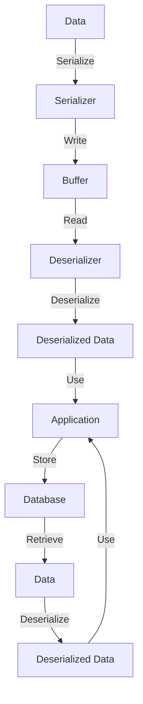

## Introduction
**Serde** is a popular **Rust** library for **serialization** and **deserialization** of data. It provides a simple and efficient way to convert data between different formats, such as **JSON**, **XML**, and **bincode**. Serde is widely used in the Rust ecosystem and is a crucial component of many production systems. In this section, we will explore what serde is, why it matters, and its real-world relevance.

> **Note:** Serialization and deserialization are fundamental concepts in software development, and serde provides a robust and flexible solution for these tasks.

Serde is designed to be highly customizable and extensible, allowing developers to easily add support for new data formats and types. Its **framework**-based approach makes it easy to integrate with existing systems and libraries. With serde, developers can focus on writing their application logic without worrying about the complexities of data serialization and deserialization.

## Core Concepts
To understand serde, we need to grasp some key concepts:

* **Serialization**: The process of converting data into a format that can be written to a file, sent over a network, or stored in a database.
* **Deserialization**: The process of converting data from a serialized format back into its original form.
* **Serializer**: An object that performs serialization.
* **Deserializer**: An object that performs deserialization.
* **Data format**: A specific way of representing data, such as JSON or bincode.

> **Tip:** When working with serde, it's essential to understand the differences between **owned** and **borrowed** data. Owned data is stored on the heap, while borrowed data is stored on the stack.

## How It Works Internally
Serde uses a **trait**-based approach to provide a common interface for serialization and deserialization. The **Serialize** and **Deserialize** traits define the methods that must be implemented for a type to be serializable and deserializable, respectively.

Here's a high-level overview of the serde serialization process:

1. The **Serializer** object is created and configured with the desired data format and options.
2. The **Serialize** trait is implemented for the data type being serialized.
3. The **Serializer** object calls the **serialize** method on the data type, which writes the serialized data to a buffer.
4. The buffer is then written to the desired output, such as a file or network socket.

Deserialization works similarly, but in reverse:

1. The **Deserializer** object is created and configured with the desired data format and options.
2. The **Deserialize** trait is implemented for the data type being deserialized.
3. The **Deserializer** object calls the **deserialize** method on the data type, which reads the deserialized data from a buffer.
4. The buffer is then read from the desired input, such as a file or network socket.

> **Warning:** When working with serde, be careful not to mix **owned** and **borrowed** data, as this can lead to unexpected behavior and errors.

## Code Examples
Here are three complete and runnable examples of using serde:

### Example 1: Basic Serialization and Deserialization
```rust
use serde::{Serialize, Deserialize};

#[derive(Serialize, Deserialize, Debug)]
struct Person {
    name: String,
    age: u32,
}

fn main() {
    let person = Person {
        name: "John Doe".to_string(),
        age: 30,
    };

    let serialized = serde_json::to_string(&person).unwrap();
    println!("Serialized: {}", serialized);

    let deserialized: Person = serde_json::from_str(&serialized).unwrap();
    println!("Deserialized: {:?}", deserialized);
}
```

### Example 2: Custom Serialization and Deserialization
```rust
use serde::{Serialize, Deserialize};

#[derive(Serialize, Deserialize, Debug)]
struct CustomPerson {
    #[serde(rename = "full_name")]
    name: String,
    #[serde(rename = "years_old")]
    age: u32,
}

fn main() {
    let person = CustomPerson {
        name: "John Doe".to_string(),
        age: 30,
    };

    let serialized = serde_json::to_string(&person).unwrap();
    println!("Serialized: {}", serialized);

    let deserialized: CustomPerson = serde_json::from_str(&serialized).unwrap();
    println!("Deserialized: {:?}", deserialized);
}
```

### Example 3: Advanced Serialization and Deserialization
```rust
use serde::{Serialize, Deserialize};

#[derive(Serialize, Deserialize, Debug)]
struct AdvancedPerson {
    name: String,
    age: u32,
    address: Address,
}

#[derive(Serialize, Deserialize, Debug)]
struct Address {
    street: String,
    city: String,
    state: String,
    zip: String,
}

fn main() {
    let person = AdvancedPerson {
        name: "John Doe".to_string(),
        age: 30,
        address: Address {
            street: "123 Main St".to_string(),
            city: "Anytown".to_string(),
            state: "CA".to_string(),
            zip: "12345".to_string(),
        },
    };

    let serialized = serde_json::to_string(&person).unwrap();
    println!("Serialized: {}", serialized);

    let deserialized: AdvancedPerson = serde_json::from_str(&serialized).unwrap();
    println!("Deserialized: {:?}", deserialized);
}
```

## Visual Diagram

This diagram illustrates the serialization and deserialization process, from the original data to the deserialized data, and how it's used in the application.

## Comparison
| Approach | Time Complexity | Space Complexity | Pros | Cons | Best For |
| --- | --- | --- | --- | --- | --- |
| Serde | O(n) | O(n) | Flexible, customizable, and extensible | Steep learning curve | Complex data serialization and deserialization |
| JSON | O(n) | O(n) | Simple, widely supported, and human-readable | Limited data types, slow performance | Simple data exchange and storage |
| Bincode | O(n) | O(n) | Fast, compact, and efficient | Limited platform support, not human-readable | High-performance data storage and exchange |
| XML | O(n) | O(n) | Self-describing, widely supported, and human-readable | Verbose, slow performance | Complex data exchange and storage, especially in legacy systems |

## Real-world Use Cases
1. **Dropbox**: Dropbox uses serde to serialize and deserialize data for its cloud storage services.
2. **Amazon Web Services (AWS)**: AWS uses serde to serialize and deserialize data for its cloud-based services, such as S3 and DynamoDB.
3. **Google Cloud**: Google Cloud uses serde to serialize and deserialize data for its cloud-based services, such as Cloud Storage and Cloud Datastore.

## Common Pitfalls
1. **Incorrectly implementing Serialize and Deserialize traits**: Make sure to implement the traits correctly, or you'll encounter errors during serialization and deserialization.
2. **Not handling errors properly**: Always handle errors during serialization and deserialization, or you'll encounter unexpected behavior.
3. **Using the wrong data format**: Choose the correct data format for your use case, or you'll encounter performance issues or data corruption.
4. **Not validating data**: Always validate data during deserialization, or you'll encounter security vulnerabilities.

## Interview Tips
1. **What is serde, and how does it work?**: Explain the basics of serde, including its trait-based approach and how it provides a common interface for serialization and deserialization.
2. **How do you implement Serialize and Deserialize traits?**: Show examples of implementing the traits for a custom data type.
3. **What are some common pitfalls when using serde?**: Discuss common mistakes, such as incorrectly implementing the traits, not handling errors, and using the wrong data format.

## Key Takeaways
* Serde provides a flexible and customizable way to serialize and deserialize data in Rust.
* Implementing the Serialize and Deserialize traits is crucial for using serde.
* Always handle errors during serialization and deserialization.
* Choose the correct data format for your use case.
* Validate data during deserialization to ensure security and correctness.
* Serde is widely used in the Rust ecosystem and is a crucial component of many production systems.
* The time complexity of serde is O(n), and the space complexity is O(n).
* Serde supports various data formats, including JSON, bincode, and XML.