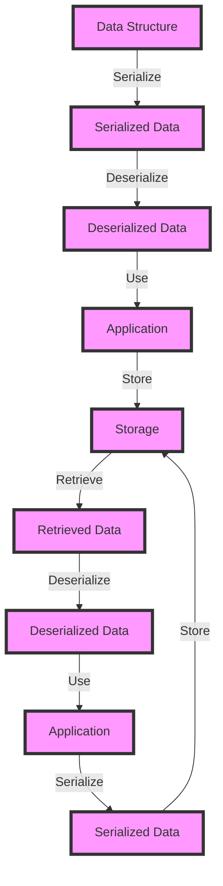

## Introduction
**Serialization** and **deserialization** are essential concepts in software development, allowing data to be converted into a format that can be stored or transmitted, and then reconstructed into its original form. In the Rust ecosystem, three popular libraries for serialization and deserialization are **serde_json**, **serde_yaml**, and **bincode**. These libraries provide a convenient way to work with different data formats, making it easy to integrate with various systems and applications. In this section, we will explore the importance of serialization and deserialization, and why **serde_json**, **serde_yaml**, and **bincode** are must-know libraries for any Rust developer.

> **Note:** Serialization and deserialization are critical components of many systems, including web applications, microservices, and distributed systems.

## Core Concepts
To understand **serde_json**, **serde_yaml**, and **bincode**, it's essential to grasp the core concepts of serialization and deserialization. **Serialization** is the process of converting data into a format that can be written to a file or transmitted over a network. **Deserialization** is the reverse process, where the serialized data is reconstructed into its original form. The key terminology includes:

* **Serializer**: a library or component that converts data into a serialized format.
* **Deserializer**: a library or component that converts serialized data back into its original form.
* **Data format**: the format in which the serialized data is stored or transmitted, such as JSON, YAML, or binary.

> **Warning:** When working with serialization and deserialization, it's crucial to consider the security implications of deserializing data from untrusted sources.

## How It Works Internally
Let's dive into the internal mechanics of **serde_json**, **serde_yaml**, and **bincode**. These libraries use a combination of Rust's **trait** system and **macro** expansions to provide a convenient and efficient way to serialize and deserialize data.

1. **serde_json**: uses the **serde** framework to provide JSON serialization and deserialization. It uses a **Serializer** trait to convert Rust data structures into JSON, and a **Deserializer** trait to convert JSON back into Rust data structures.
2. **serde_yaml**: similar to **serde_json**, but provides YAML serialization and deserialization.
3. **bincode**: uses a **Serializer** trait to convert Rust data structures into a binary format, and a **Deserializer** trait to convert the binary format back into Rust data structures.

> **Tip:** When working with **serde_json** and **serde_yaml**, it's essential to use the **serde** derive macros to automatically generate the serialization and deserialization code for your data structures.

## Code Examples
Here are three complete and runnable examples of using **serde_json**, **serde_yaml**, and **bincode**:

### Example 1: Basic **serde_json** usage
```rust
use serde::{Serialize, Deserialize};
use serde_json;

#[derive(Serialize, Deserialize)]
struct Person {
    name: String,
    age: u32,
}

fn main() {
    let person = Person {
        name: "John Doe".to_string(),
        age: 30,
    };

    let json = serde_json::to_string(&person).unwrap();
    println!("{}", json);

    let deserialized_person: Person = serde_json::from_str(&json).unwrap();
    println!("{:?}", deserialized_person);
}
```

### Example 2: Real-world **serde_yaml** usage
```rust
use serde::{Serialize, Deserialize};
use serde_yaml;

#[derive(Serialize, Deserialize)]
struct Config {
    hostname: String,
    port: u16,
}

fn main() {
    let config = Config {
        hostname: "example.com".to_string(),
        port: 8080,
    };

    let yaml = serde_yaml::to_string(&config).unwrap();
    println!("{}", yaml);

    let deserialized_config: Config = serde_yaml::from_str(&yaml).unwrap();
    println!("{:?}", deserialized_config);
}
```

### Example 3: Advanced **bincode** usage
```rust
use serde::{Serialize, Deserialize};
use bincode;

#[derive(Serialize, Deserialize)]
struct ComplexData {
    numbers: Vec<i32>,
    strings: Vec<String>,
}

fn main() {
    let complex_data = ComplexData {
        numbers: vec![1, 2, 3],
        strings: vec!["hello".to_string(), "world".to_string()],
    };

    let binary_data = bincode::serialize(&complex_data).unwrap();
    println!("Binary data: {:?}", binary_data);

    let deserialized_complex_data: ComplexData = bincode::deserialize(&binary_data).unwrap();
    println!("{:?}", deserialized_complex_data);
}
```

## Visual Diagram

This diagram illustrates the process of serialization and deserialization, from data structure to storage and retrieval.

> **Interview:** When asked about serialization and deserialization, be sure to explain the process and the trade-offs between different data formats.

## Comparison
| Data Format | Time Complexity | Space Complexity | Pros | Cons | Best For |
| --- | --- | --- | --- | --- | --- |
| JSON | O(n) | O(n) | Human-readable, easy to parse | Verbose, slow | Web applications, configuration files |
| YAML | O(n) | O(n) | Human-readable, easy to parse | Verbose, slow | Configuration files, data exchange |
| Binary | O(1) | O(1) | Fast, efficient | Not human-readable | Performance-critical applications, games |

## Real-world Use Cases
1. **Web applications**: use **serde_json** to serialize and deserialize data between the client and server.
2. **Configuration files**: use **serde_yaml** to store and retrieve configuration data in a human-readable format.
3. **Games**: use **bincode** to serialize and deserialize game data, such as player positions and scores, for efficient storage and retrieval.

## Common Pitfalls
1. **Inconsistent serialization**: using different serialization formats for the same data can lead to inconsistencies and errors.
2. **Lack of error handling**: failing to handle errors during serialization and deserialization can result in crashes or data corruption.
3. **Insecure deserialization**: deserializing data from untrusted sources can lead to security vulnerabilities.
4. **Performance issues**: using inefficient serialization and deserialization methods can impact application performance.

> **Tip:** When working with serialization and deserialization, use the **serde** derive macros to automatically generate the serialization and deserialization code for your data structures.

## Interview Tips
1. **What is serialization and deserialization?**: explain the process and the trade-offs between different data formats.
2. **How do you choose a data format?**: discuss the pros and cons of different data formats, such as JSON, YAML, and binary.
3. **What are some common pitfalls when working with serialization and deserialization?**: discuss the importance of consistent serialization, error handling, and security.

## Key Takeaways
* **Serialization** and **deserialization** are essential concepts in software development.
* **serde_json**, **serde_yaml**, and **bincode** are popular libraries for serialization and deserialization in Rust.
* **Data format** choice depends on the specific use case and requirements.
* **Error handling** and **security** are critical when working with serialization and deserialization.
* **Performance** considerations are essential when choosing a serialization and deserialization method.
* **Consistent serialization** is crucial for ensuring data integrity and avoiding errors.
* **Automating serialization and deserialization** using **serde** derive macros can improve development efficiency and reduce errors.