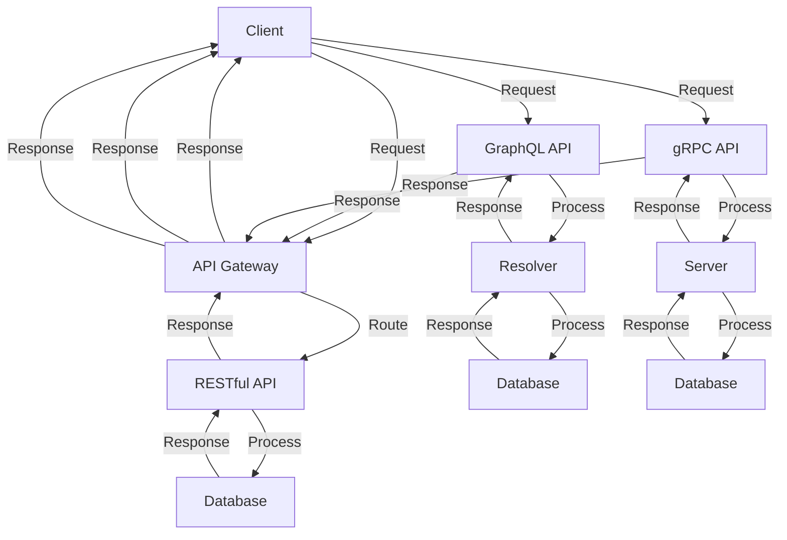

## Introduction
API design is a critical aspect of software engineering, as it enables different systems to communicate with each other seamlessly. **REST (Representational State of Resource)**, **GraphQL**, and **gRPC** are three popular API design patterns used in the industry. Each has its strengths and weaknesses, and understanding the trade-offs is essential for designing efficient and scalable APIs. In this section, we will delve into the world of API design, exploring the concepts, mechanics, and best practices for building robust APIs.

> **Note:** A well-designed API can make a significant difference in the performance, maintainability, and scalability of a system. It's essential to choose the right API design pattern based on the specific requirements of your project.

## Core Concepts
Let's start with the core concepts of API design:

* **REST (Representational State of Resource)**: An architectural style for designing networked applications. It's based on the idea of resources, which are identified by URIs, and can be manipulated using a fixed set of operations.
* **GraphQL**: A query language for APIs that allows clients to specify exactly what data they need, reducing the amount of data transferred over the network.
* **gRPC**: A high-performance RPC framework that uses protocol buffers as the interface definition language (IDL) and HTTP/2 as the transport mechanism.

> **Tip:** When designing an API, it's essential to consider the trade-offs between different design patterns. For example, REST is suitable for simple, resource-based APIs, while GraphQL is better suited for complex, data-driven APIs.

## How It Works Internally
Let's dive into the internal mechanics of each API design pattern:

* **REST**: When a client sends a request to a RESTful API, the server processes the request and returns a response in a standardized format, such as JSON or XML. The client can then use this response to update its local state.
* **GraphQL**: When a client sends a query to a GraphQL API, the server executes the query and returns the requested data in a JSON response. The client can then use this data to update its local state.
* **gRPC**: When a client sends a request to a gRPC API, the server processes the request and returns a response in a protocol buffer format. The client can then use this response to update its local state.

> **Warning:** One common mistake when designing APIs is to overlook the importance of error handling. Make sure to implement robust error handling mechanisms to ensure that your API is reliable and maintainable.

## Code Examples
Here are three complete and runnable code examples, each demonstrating a different aspect of API design:

### Example 1: Simple RESTful API (Node.js)
```javascript
const express = require('express');
const app = express();

app.get('/users', (req, res) => {
  // Return a list of users
  res.json([
    { id: 1, name: 'John Doe' },
    { id: 2, name: 'Jane Doe' }
  ]);
});

app.listen(3000, () => {
  console.log('Server listening on port 3000');
});
```

### Example 2: GraphQL API (Python)
```python
import graphene

class User(graphene.ObjectType):
  id = graphene.ID()
  name = graphene.String()

class Query(graphene.ObjectType):
  users = graphene.List(User)

  def resolve_users(self, info):
    # Return a list of users
    return [
      User(id=1, name='John Doe'),
      User(id=2, name='Jane Doe')
    ]

schema = graphene.Schema(query=Query)

query = '''
  query {
    users {
      id
      name
    }
  }
'''

result = schema.execute(query)
print(result.data)
```

### Example 3: gRPC API (Go)
```go
package main

import (
  "context"
  "fmt"
  "log"

  "google.golang.org/grpc"

  pb "example/proto"
)

type server struct{}

func (s *server) GetUsers(ctx context.Context, req *pb.GetUsersRequest) (*pb.GetUsersResponse, error) {
  // Return a list of users
  users := []*pb.User{
    &pb.User{Id: 1, Name: "John Doe"},
    &pb.User{Id: 2, Name: "Jane Doe"},
  }
  return &pb.GetUsersResponse{Users: users}, nil
}

func main() {
  lis, err := net.Listen("tcp", ":50051")
  if err != nil {
    log.Fatalf("failed to listen: %v", err)
  }
  s := grpc.NewServer()
  pb.RegisterUserServiceServer(s, &server{})
  log.Printf("server listening at %v", lis.Addr())
  if err := s.Serve(lis); err != nil {
    log.Fatalf("failed to serve: %v", err)
  }
}
```

## Visual Diagram

This diagram illustrates the high-level architecture of a system with multiple APIs, including RESTful, GraphQL, and gRPC.

> **Note:** The choice of API design pattern depends on the specific requirements of your project. Consider factors such as performance, scalability, and maintainability when making your decision.

## Comparison
| Approach | Time Complexity | Space Complexity | Pros | Cons | Best For |
| --- | --- | --- | --- | --- | --- |
| REST | O(1) | O(n) | Simple, widely adopted | Limited flexibility, verbose | Simple, resource-based APIs |
| GraphQL | O(n) | O(n) | Flexible, efficient | Steep learning curve, complex | Complex, data-driven APIs |
| gRPC | O(1) | O(n) | High-performance, efficient | Limited browser support, complex | High-performance, real-time APIs |

## Real-world Use Cases
Here are three real-world examples of API design in production:

* **Twitter**: Uses a combination of REST and GraphQL APIs to power its web and mobile applications.
* **Facebook**: Uses a custom API design pattern, known as **FB API**, which is based on REST and GraphQL principles.
* **Google**: Uses gRPC APIs to power its cloud services, such as Google Cloud Storage and Google Cloud Datastore.

> **Tip:** When designing an API, consider the trade-offs between different design patterns and choose the one that best fits your project's requirements.

## Common Pitfalls
Here are four common mistakes to avoid when designing APIs:

* **Inconsistent API naming conventions**: Use a consistent naming convention throughout your API to avoid confusion and errors.
* **Insufficient error handling**: Implement robust error handling mechanisms to ensure that your API is reliable and maintainable.
* **Inadequate security measures**: Implement security measures, such as authentication and authorization, to protect your API from unauthorized access.
* **Poor API documentation**: Provide clear and concise API documentation to help developers understand and use your API effectively.

## Interview Tips
Here are three common interview questions related to API design, along with sample answers:

* **What is the difference between REST and GraphQL?**: A weak answer might focus on the surface-level differences, such as the use of URIs vs queries. A strong answer would delve into the underlying principles and trade-offs between the two design patterns.
* **How would you design an API for a complex, data-driven application?**: A weak answer might propose a simple, RESTful API. A strong answer would consider the trade-offs between different design patterns and propose a more suitable approach, such as GraphQL or gRPC.
* **What are some common mistakes to avoid when designing APIs?**: A weak answer might focus on obvious mistakes, such as inconsistent naming conventions. A strong answer would provide more nuanced insights, such as the importance of error handling, security, and documentation.

> **Interview:** When answering API design questions, be sure to demonstrate a deep understanding of the underlying principles and trade-offs between different design patterns.

## Key Takeaways
Here are ten key takeaways to remember when designing APIs:

* **Choose the right API design pattern** based on your project's requirements.
* **Use consistent naming conventions** throughout your API.
* **Implement robust error handling mechanisms** to ensure reliability and maintainability.
* **Implement security measures**, such as authentication and authorization, to protect your API.
* **Provide clear and concise API documentation** to help developers understand and use your API effectively.
* **Consider the trade-offs between different design patterns**, such as REST, GraphQL, and gRPC.
* **Use APIs to enable communication between different systems** and services.
* **Design APIs with scalability and performance in mind**.
* **Use APIs to provide a flexible and efficient way to access data** and services.
* **Continuously monitor and improve your API** to ensure it meets the evolving needs of your project.

> **Note:** API design is a critical aspect of software engineering, and understanding the trade-offs between different design patterns is essential for building efficient and scalable APIs.