## Introduction
**Test-Driven Development (TDD)** is a software development process that relies on the repetitive cycle of writing automated tests before writing the actual code. This process has been widely adopted in the software industry due to its numerous benefits, including improved code quality, reduced debugging time, and better design. In this section, we will explore the importance of TDD, its real-world relevance, and why every engineer should know about it.

TDD is essential in today's fast-paced software development landscape, where teams need to deliver high-quality software quickly and efficiently. By writing tests before code, developers can ensure that their code is correct, stable, and easy to maintain. Moreover, TDD helps developers to think critically about the requirements and design of the software, leading to better architecture and design decisions.

> **Note:** TDD is not just about writing tests; it's about writing better code. By writing tests first, developers can ensure that their code is testable, modular, and easy to understand.

## Core Concepts
To understand TDD, it's essential to grasp some core concepts:

* **Test**: A piece of code that verifies the behavior of another piece of code.
* **Test Case**: A specific scenario that a test is designed to cover.
* **Test Suite**: A collection of tests that are related to a particular piece of functionality.
* **Red-Green-Refactor**: The cycle of writing a test (red), making it pass (green), and refactoring the code to make it more maintainable and efficient.

A key mental model for TDD is the concept of **feedback loops**. In TDD, the feedback loop is tight, meaning that developers get immediate feedback on whether their code is correct or not. This tight feedback loop enables developers to make quick decisions and adjustments, leading to faster development and higher quality code.

## How It Works Internally
The TDD workflow can be broken down into the following steps:

1. **Write a test**: Developers write a test that covers a specific piece of functionality.
2. **Run the test and see it fail**: The test fails because the code doesn't exist yet.
3. **Write the code**: Developers write the minimum amount of code necessary to make the test pass.
4. **Run the test and see it pass**: The test passes, and developers can be confident that the code works as expected.
5. **Refactor the code**: Developers refactor the code to make it more maintainable, efficient, and easy to understand.

This process is repeated continuously, with each iteration building on the previous one. The TDD workflow is designed to be iterative and incremental, allowing developers to make progress in small, manageable chunks.

> **Tip:** To make the most out of TDD, it's essential to keep the tests simple, focused, and independent. This will help developers to write better tests and avoid test duplication.

## Code Examples
Here are three complete and runnable code examples to illustrate the TDD workflow:

### Example 1: Basic TDD Example
```python
import unittest

def add(x, y):
    return x + y

class TestAddFunction(unittest.TestCase):
    def test_add(self):
        self.assertEqual(add(2, 3), 5)

if __name__ == '__main__':
    unittest.main()
```
This example demonstrates a simple TDD workflow for a basic `add` function. The test is written first, and then the code is written to make the test pass.

### Example 2: TDD for a Calculator Class
```python
import unittest

class Calculator:
    def add(self, x, y):
        return x + y

    def subtract(self, x, y):
        return x - y

class TestCalculator(unittest.TestCase):
    def setUp(self):
        self.calculator = Calculator()

    def test_add(self):
        self.assertEqual(self.calculator.add(2, 3), 5)

    def test_subtract(self):
        self.assertEqual(self.calculator.subtract(5, 3), 2)

if __name__ == '__main__':
    unittest.main()
```
This example demonstrates a more complex TDD workflow for a `Calculator` class. The tests are written first, and then the code is written to make the tests pass.

### Example 3: TDD for a Complex Algorithm
```python
import unittest
import time

def fibonacci(n):
    if n <= 1:
        return n
    else:
        return fibonacci(n-1) + fibonacci(n-2)

class TestFibonacciFunction(unittest.TestCase):
    def test_fibonacci(self):
        self.assertEqual(fibonacci(10), 55)

if __name__ == '__main__':
    start_time = time.time()
    unittest.main()
    end_time = time.time()
    print(f"Test took {end_time - start_time} seconds")
```
This example demonstrates a TDD workflow for a complex algorithm like the Fibonacci sequence. The test is written first, and then the code is written to make the test pass.

> **Warning:** The Fibonacci example has a time complexity of O(2^n), which can be optimized using memoization or dynamic programming techniques.

## Visual Diagram

```mermaid
flowchart TD
    A[Write a test] --> B[Run the test and see it fail]
    B --> C[Write the code]
    C --> D[Run the test and see it pass]
    D --> E[Refactor the code]
    E --> A
    subgraph TDD Workflow
        A
        B
        C
        D
        E
    end
    subgraph Test-Driven Development
        F[Test] --> G[Test Case]
        G --> H[Test Suite]
        H --> I["Red-Green-Refactor"]
        I --> F
    end
    subgraph Core Concepts
        J[Test] --> K[Test Case]
        K --> L[Test Suite]
        L --> M["Red-Green-Refactor"]
        M --> J
    end
    subgraph Benefits
        N[Improved code quality] --> O[Reduced debugging time]
        O --> P[Better design]
        P --> N
    end
```

This diagram illustrates the TDD workflow and its core concepts. The TDD workflow is a continuous cycle of writing tests, running tests, and refactoring code.

## Comparison
| Approach | Time Complexity | Space Complexity | Pros | Cons | Best For |
| --- | --- | --- | --- | --- | --- |
| TDD | O(1) | O(1) | Improved code quality, reduced debugging time, better design | Steeper learning curve, requires discipline | Complex algorithms, critical systems |
| BDD (Behavior-Driven Development) | O(1) | O(1) | Improved communication between developers and stakeholders, easier testing | Requires more planning and coordination | Agile development, user-centric design |
| ATDD (Acceptance Test-Driven Development) | O(1) | O(1) | Improved test coverage, faster development | Requires more testing infrastructure | Large-scale systems, mission-critical applications |
| Unit Testing | O(1) | O(1) | Improved test coverage, faster development | Limited scope, may not cover integration testing | Small-scale systems, rapid prototyping |

## Real-world Use Cases
Here are three real-world examples of TDD in action:

1. **Google**: Google uses TDD extensively in its development process. The company has a strong culture of testing and verification, which has contributed to its success.
2. **Microsoft**: Microsoft has adopted TDD as a key part of its development process. The company has seen significant improvements in code quality and reduced debugging time.
3. **Amazon**: Amazon uses TDD to develop its e-commerce platform. The company has a large team of developers who write tests before writing code, which has helped to ensure the reliability and scalability of its platform.

> **Interview:** Can you explain the difference between TDD and BDD? How do you decide which approach to use in a project?

## Common Pitfalls
Here are four common mistakes that developers make when using TDD:

1. **Not writing tests first**: This is the most common mistake that developers make when using TDD. Writing tests first helps to ensure that the code is testable and meets the requirements.
2. **Not keeping tests simple**: Tests should be simple and focused on a specific piece of functionality. Complex tests can be difficult to maintain and understand.
3. **Not using a testing framework**: A testing framework can help to simplify the testing process and provide a lot of functionality out of the box.
4. **Not refactoring code**: Refactoring code is an essential part of the TDD workflow. It helps to make the code more maintainable, efficient, and easy to understand.

> **Tip:** To avoid these pitfalls, it's essential to follow the TDD workflow closely and to keep the tests simple and focused.

## Interview Tips
Here are three common interview questions related to TDD:

1. **What is TDD, and how does it work?**: This question is designed to test the candidate's understanding of the TDD workflow and its core concepts.
2. **How do you decide which approach to use in a project?**: This question is designed to test the candidate's ability to think critically about the project requirements and to choose the best approach.
3. **Can you explain the difference between TDD and BDD?**: This question is designed to test the candidate's understanding of the differences between TDD and BDD and to evaluate their ability to think critically about the testing process.

> **Note:** To answer these questions successfully, it's essential to have a deep understanding of the TDD workflow and its core concepts.

## Key Takeaways
Here are ten key takeaways from this article:

* TDD is a software development process that relies on the repetitive cycle of writing automated tests before writing the actual code.
* TDD helps to improve code quality, reduce debugging time, and make the code more maintainable and efficient.
* The TDD workflow consists of writing a test, running the test and seeing it fail, writing the code, running the test and seeing it pass, and refactoring the code.
* TDD requires discipline and a strong culture of testing and verification.
* TDD can be used in conjunction with other testing approaches, such as BDD and ATDD.
* TDD is suitable for complex algorithms and critical systems.
* TDD requires a testing framework to simplify the testing process.
* Refactoring code is an essential part of the TDD workflow.
* TDD helps to improve communication between developers and stakeholders.
* TDD can help to reduce the overall cost of software development by reducing debugging time and improving code quality.