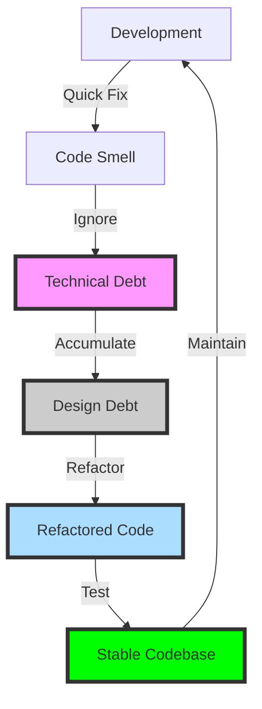

## Introduction
**Technical debt** refers to the cost of implementing quick fixes or workarounds in software development, which can lead to additional maintenance and refactoring efforts in the long run. It is a concept that was first introduced by Ward Cunningham, a renowned software developer, in 1992. Technical debt can arise from various sources, such as incomplete or inadequate testing, poorly designed code, or the use of outdated technologies. Every software engineer needs to understand technical debt because it can significantly impact the maintainability, scalability, and overall quality of software systems. In this study guide, we will delve into the core concepts of technical debt, explore how it works internally, and provide practical advice on managing it.

> **Note:** Technical debt is not inherently bad, as it can be a necessary trade-off to meet project deadlines or deliver a minimum viable product (MVP). However, it is essential to acknowledge and manage technical debt to prevent it from accumulating and becoming a significant burden.

## Core Concepts
To understand technical debt, it is crucial to grasp the following key concepts:

* **Technical debt**: The cost of implementing quick fixes or workarounds in software development, which can lead to additional maintenance and refactoring efforts in the long run.
* **Code smell**: A term used to describe code that may not be causing immediate problems but can lead to technical debt if left unaddressed.
* **Refactoring**: The process of restructuring code to improve its maintainability, readability, and performance without changing its external behavior.
* **Design debt**: A type of technical debt that arises from design flaws or inadequate architecture.

> **Tip:** Identifying code smells and addressing them early on can help prevent technical debt from accumulating. Regular refactoring and code reviews can also help maintain a healthy codebase.

## How It Works Internally
Technical debt can arise from various sources, including:

1. **Rushed development**: Implementing quick fixes or workarounds to meet project deadlines can lead to technical debt.
2. **Inadequate testing**: Insufficient testing can result in bugs and errors that require additional maintenance efforts.
3. **Poor design**: Design flaws or inadequate architecture can lead to technical debt.
4. **Outdated technologies**: Using outdated technologies or frameworks can make it challenging to maintain and update software systems.

> **Warning:** Ignoring technical debt can lead to a snowball effect, where the debt accumulates over time, making it more challenging and expensive to address.

## Code Examples
Here are three complete and runnable code examples that illustrate technical debt:

### Example 1: Basic Usage (Python)
```python
# This example demonstrates a simple calculator function with a code smell
def calculate_area(width, height):
    # Using a magic number (3.14) instead of a named constant
    return width * height * 3.14

# Usage
width = 10
height = 5
area = calculate_area(width, height)
print(f"The area is {area}")
```
This example demonstrates a code smell, as the magic number 3.14 is used instead of a named constant.

### Example 2: Real-world Pattern (Java)
```java
// This example demonstrates a design debt in a simple banking system
public class BankAccount {
    private double balance;

    public BankAccount(double balance) {
        this.balance = balance;
    }

    public void withdraw(double amount) {
        // Using a primitive type (double) instead of a decimal type
        balance -= amount;
    }

    public void deposit(double amount) {
        // Using a primitive type (double) instead of a decimal type
        balance += amount;
    }
}

// Usage
BankAccount account = new BankAccount(1000.0);
account.withdraw(500.0);
account.deposit(200.0);
System.out.println("The balance is " + account.getBalance());
```
This example demonstrates a design debt, as the `BankAccount` class uses primitive types (double) instead of decimal types, which can lead to precision issues.

### Example 3: Advanced Usage (JavaScript)
```javascript
// This example demonstrates a refactored version of the calculator function
class Calculator {
    constructor() {
        this.pi = 3.14159;
    }

    calculateArea(width, height) {
        // Using a named constant (this.pi) instead of a magic number
        return width * height * this.pi;
    }
}

// Usage
const calculator = new Calculator();
const width = 10;
const height = 5;
const area = calculator.calculateArea(width, height);
console.log(`The area is ${area}`);
```
This example demonstrates a refactored version of the calculator function, using a named constant (`this.pi`) instead of a magic number.

## Visual Diagram

This diagram illustrates the concept of technical debt and how it can arise from quick fixes and code smells. It also shows how refactoring and testing can help maintain a stable codebase.

> **Note:** The diagram highlights the importance of addressing technical debt early on to prevent it from accumulating and becoming a significant burden.

## Comparison
The following table compares different approaches to managing technical debt:

| Approach | Time Complexity | Space Complexity | Pros | Cons | Best For |
| --- | --- | --- | --- | --- | --- |
| Quick Fix | O(1) | O(1) | Fast, meets deadlines | Accumulates technical debt | Emergency situations |
| Refactoring | O(n) | O(n) | Improves maintainability, reduces debt | Time-consuming, may introduce new bugs | Regular maintenance |
| Design Debt | O(n^2) | O(n^2) | Improves architecture, reduces debt | Time-consuming, may require significant changes | Large-scale refactoring |
| Test-Driven Development (TDD) | O(n) | O(n) | Ensures stability, reduces debt | Time-consuming, may require significant changes | New projects, critical components |

> **Tip:** Using a combination of approaches, such as refactoring and TDD, can help manage technical debt effectively.

## Real-world Use Cases
The following companies have successfully managed technical debt:

1. **Microsoft**: Microsoft has implemented a robust technical debt management process, which involves regular code reviews, refactoring, and testing.
2. **Google**: Google uses a combination of approaches, including refactoring, TDD, and design debt, to manage technical debt.
3. **Amazon**: Amazon has implemented a culture of continuous improvement, which involves regular code reviews, refactoring, and testing to manage technical debt.

> **Interview:** When asked about technical debt, be prepared to discuss your experience with managing it, including the approaches you have used and the benefits you have seen.

## Common Pitfalls
The following are common mistakes that engineers make when managing technical debt:

1. **Ignoring technical debt**: Failing to acknowledge and address technical debt can lead to a snowball effect, making it more challenging and expensive to address.
2. **Using quick fixes**: Implementing quick fixes without considering the long-term consequences can lead to technical debt.
3. **Not testing thoroughly**: Insufficient testing can result in bugs and errors that require additional maintenance efforts.
4. **Not refactoring regularly**: Failing to refactor regularly can lead to design debt and technical debt.

> **Warning:** Ignoring technical debt can have severe consequences, including decreased productivity, increased maintenance costs, and reduced system reliability.

## Interview Tips
The following are common interview questions related to technical debt:

1. **What is technical debt, and how do you manage it?**: Be prepared to discuss your experience with managing technical debt, including the approaches you have used and the benefits you have seen.
2. **How do you prioritize technical debt?**: Discuss your approach to prioritizing technical debt, including the factors you consider and the tools you use.
3. **What is your experience with refactoring?**: Share your experience with refactoring, including the benefits you have seen and the challenges you have faced.

> **Tip:** When discussing technical debt, be sure to emphasize the importance of addressing it early on and using a combination of approaches to manage it effectively.

## Key Takeaways
The following are the key takeaways from this study guide:

* Technical debt refers to the cost of implementing quick fixes or workarounds in software development, which can lead to additional maintenance and refactoring efforts in the long run.
* Code smells, design debt, and refactoring are essential concepts in managing technical debt.
* Using a combination of approaches, such as refactoring, TDD, and design debt, can help manage technical debt effectively.
* Ignoring technical debt can have severe consequences, including decreased productivity, increased maintenance costs, and reduced system reliability.
* Prioritizing technical debt is crucial, and factors such as business value, risk, and complexity should be considered.
* Regular code reviews, testing, and refactoring can help maintain a stable codebase and reduce technical debt.
* Technical debt management is an ongoing process that requires continuous effort and attention to detail.
* Using tools such as technical debt metrics and tracking systems can help monitor and manage technical debt.
* Communication and collaboration are essential in managing technical debt, and all stakeholders should be involved in the process.