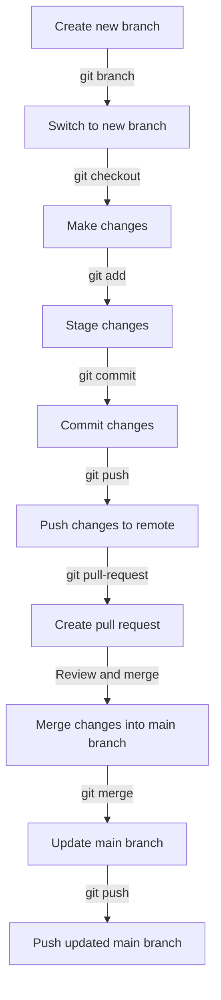

## Introduction
**Version control** is a crucial aspect of software engineering that enables developers to manage changes to their codebase over time. It provides a way to track changes, collaborate with others, and maintain a record of all modifications made to the code. In today's fast-paced software development landscape, version control is essential for ensuring the integrity and reliability of software systems. **Git**, a popular version control system, has become the de facto standard in the industry. In this section, we will explore the best practices for branching, commits, and pull requests (PRs) in version control.

## Core Concepts
To understand version control best practices, it's essential to grasp the following core concepts:
* **Repository (repo)**: The central location where all the files and history of a project are stored.
* **Branch**: A separate line of development in a repository, allowing multiple versions of the code to coexist.
* **Commit**: A snapshot of changes made to the code, including a description of the changes and the author.
* **Merge**: The process of integrating changes from one branch into another.
* **Pull Request (PR)**: A request to merge changes from one branch into another, typically reviewed by others before merging.

> **Note:** Understanding these core concepts is vital for effective version control and collaboration.

## How It Works Internally
When you create a new repository, Git initializes a hidden `.git` folder that stores all the version control metadata. The `.git` folder contains the following key components:
1. **Object database**: A storage area for all the commits, trees, and blobs (files) in the repository.
2. **Index**: A cache of the current state of the repository, used to optimize performance.
3. **HEAD**: A reference to the current branch and commit.

Here's a step-by-step overview of the Git workflow:
1. **Create a new branch**: `git branch feature/new-feature`
2. **Switch to the new branch**: `git checkout feature/new-feature`
3. **Make changes**: Edit files, add new files, or delete files.
4. **Stage changes**: `git add .`
5. **Commit changes**: `git commit -m "Added new feature"`
6. **Push changes to remote**: `git push origin feature/new-feature`
7. **Create a pull request**: Request a review of the changes before merging into the main branch.

## Code Examples
### Example 1: Basic Git Workflow
```bash
# Initialize a new repository
git init

# Create a new branch
git branch feature/new-feature

# Switch to the new branch
git checkout feature/new-feature

# Make changes
echo "Hello World!" > hello.txt

# Stage changes
git add .

# Commit changes
git commit -m "Added new file"

# Push changes to remote
git push origin feature/new-feature
```

### Example 2: Merging Changes
```bash
# Switch to the main branch
git checkout main

# Pull changes from remote
git pull origin main

# Merge changes from feature branch
git merge feature/new-feature

# Resolve conflicts (if any)
git status
git add .
git commit -m "Merged changes from feature branch"
```

### Example 3: Using Git Hooks
```python
# .git/hooks/pre-commit
import os
import sys

# Check for trailing whitespace
for root, dirs, files in os.walk("."):
    for file in files:
        if file.endswith(".py"):
            file_path = os.path.join(root, file)
            with open(file_path, "r") as f:
                lines = f.readlines()
                for line in lines:
                    if line.rstrip() != line:
                        print("Trailing whitespace found in", file_path)
                        sys.exit(1)
```

> **Tip:** Use Git hooks to automate tasks, such as checking for coding standards or running tests, before committing changes.

## Visual Diagram

This diagram illustrates the basic Git workflow, from creating a new branch to merging changes into the main branch.

## Comparison
| Approach | Time Complexity | Space Complexity | Pros | Cons | Best For |
| --- | --- | --- | --- | --- | --- |
| Git | O(1) | O(n) | Fast, flexible, widely adopted | Steep learning curve | Large-scale projects |
| SVN | O(n) | O(n) | Easy to use, centralized | Slow, limited scalability | Small-scale projects |
| Mercurial | O(1) | O(n) | Fast, lightweight, easy to use | Limited adoption | Small-scale projects |
| Perforce | O(n) | O(n) | Fast, scalable, widely adopted | Expensive, complex | Large-scale projects |

> **Warning:** Choosing the wrong version control system can lead to performance issues and scalability problems.

## Real-world Use Cases
1. **GitHub**: GitHub uses Git as its version control system, allowing developers to collaborate on open-source projects.
2. **Google**: Google uses a customized version of Git for its internal version control system, allowing thousands of developers to collaborate on large-scale projects.
3. **Microsoft**: Microsoft uses Git for its Azure DevOps platform, providing a comprehensive set of tools for version control, continuous integration, and continuous deployment.

## Common Pitfalls
1. **Not committing regularly**: Failing to commit changes regularly can lead to lost work and difficulties in tracking changes.
```bash
# Wrong way: not committing regularly
git add .
git commit -m "Added new feature" # after hours of work
```
```bash
# Right way: committing regularly
git add .
git commit -m "Added new file"
git add .
git commit -m "Implemented new feature"
```
2. **Not using meaningful commit messages**: Using unclear or generic commit messages can make it difficult to track changes and understand the purpose of each commit.
```bash
# Wrong way: using generic commit messages
git commit -m "Fixed bug"
```
```bash
# Right way: using meaningful commit messages
git commit -m "Fixed bug in login functionality"
```
3. **Not using branches**: Failing to use branches can lead to conflicts and difficulties in managing different versions of the code.
```bash
# Wrong way: not using branches
git add .
git commit -m "Added new feature" # in main branch
```
```bash
# Right way: using branches
git branch feature/new-feature
git checkout feature/new-feature
git add .
git commit -m "Added new feature"
```
4. **Not reviewing code**: Failing to review code can lead to bugs, security vulnerabilities, and performance issues.
```bash
# Wrong way: not reviewing code
git merge feature/new-feature
```
```bash
# Right way: reviewing code
git pull-request feature/new-feature
# Review code, test, and approve
git merge feature/new-feature
```

## Interview Tips
1. **What is version control, and why is it important?**
	* Weak answer: "Version control is a way to manage changes to code."
	* Strong answer: "Version control is a crucial aspect of software engineering that enables developers to manage changes to their codebase over time, ensuring the integrity and reliability of software systems."
2. **How do you handle conflicts in Git?**
	* Weak answer: "I use `git merge` to resolve conflicts."
	* Strong answer: "I use `git status` to identify conflicts, `git add` to stage changes, and `git commit` to commit resolved conflicts. I also use `git merge --no-commit` to review changes before committing."
3. **What is the difference between `git fetch` and `git pull`?**
	* Weak answer: "They are the same thing."
	* Strong answer: " `git fetch` retrieves changes from the remote repository, while `git pull` retrieves changes and merges them into the current branch. I use `git fetch` to review changes before merging, and `git pull` to update my local repository with the latest changes."

## Key Takeaways
* **Use meaningful commit messages**: Clearly describe the purpose of each commit to facilitate tracking changes and understanding the codebase.
* **Commit regularly**: Commit changes frequently to avoid lost work and difficulties in tracking changes.
* **Use branches**: Use branches to manage different versions of the code and avoid conflicts.
* **Review code**: Review code thoroughly to ensure quality, security, and performance.
* **Understand Git**: Understand the basics of Git, including `git add`, `git commit`, `git push`, and `git pull`.
* **Use Git hooks**: Use Git hooks to automate tasks, such as checking for coding standards or running tests, before committing changes.
* **Use version control best practices**: Follow best practices, such as using meaningful commit messages, committing regularly, and reviewing code, to ensure the integrity and reliability of software systems.
* **Stay up-to-date with Git**: Stay current with the latest Git features and best practices to improve productivity and collaboration.
* **Use tools and integrations**: Use tools and integrations, such as GitHub, GitLab, or Bitbucket, to streamline version control and collaboration workflows.
* **Document changes**: Document changes thoroughly, including commit messages, to facilitate tracking changes and understanding the codebase.