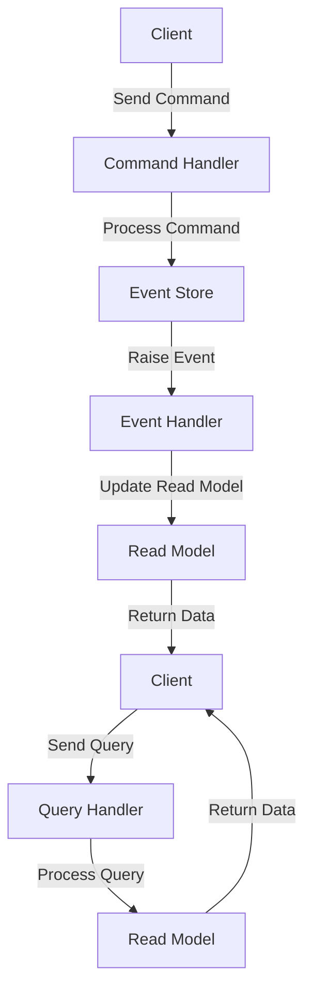

## Introduction
The **Command Query Responsibility Segregation (CQRS)** pattern is a design pattern that separates an application's responsibilities into two main parts: **Command** and **Query**. This separation allows for a more scalable, maintainable, and flexible system. In traditional architectures, the same model is used for both reading and writing data, which can lead to performance issues and complexity. The CQRS pattern solves this problem by introducing two separate models: one for **Commands** (writes) and one for **Queries** (reads). This pattern is particularly useful in high-traffic systems, real-time data processing, and event-driven architectures.

> **Note:** The CQRS pattern is often used in conjunction with **Event Sourcing**, which stores the history of an application's state as a sequence of events.

Real-world relevance: The CQRS pattern is used in various production systems, such as:
* Microsoft's **Azure** architecture
* Amazon's **DynamoDB** database
* The **GitHub** platform

Every engineer needs to know this pattern because it provides a scalable and maintainable way to design complex systems.

## Core Concepts
The CQRS pattern consists of the following key components:
* **Command**: A command is an object that encapsulates a request to perform an action. Commands are used to update the system's state.
* **Command Handler**: A command handler is responsible for processing a command and updating the system's state accordingly.
* **Query**: A query is an object that encapsulates a request to retrieve data. Queries are used to read the system's state.
* **Query Handler**: A query handler is responsible for processing a query and returning the requested data.
* **Repository**: A repository is an abstraction layer that encapsulates the data storage and retrieval logic.
* **Event Store**: An event store is a database that stores the history of an application's state as a sequence of events.

> **Warning:** A common mistake is to use the same model for both commands and queries, which can lead to performance issues and complexity.

Key terminology:
* **Command Query Responsibility Segregation**: The separation of an application's responsibilities into two main parts: Command and Query.
* **Event Sourcing**: The storage of an application's state as a sequence of events.

## How It Works Internally
The CQRS pattern works as follows:
1. The client sends a **Command** to the **Command Handler**.
2. The **Command Handler** processes the command and updates the system's state.
3. The **Command Handler** raises an **Event** to notify the system of the state change.
4. The **Event Store** stores the event.
5. The client sends a **Query** to the **Query Handler**.
6. The **Query Handler** processes the query and returns the requested data.

> **Tip:** Use a **Repository** abstraction layer to encapsulate the data storage and retrieval logic.

The CQRS pattern has a time complexity of O(1) for command processing and a space complexity of O(n) for event storage, where n is the number of events.

## Code Examples
### Example 1: Basic CQRS Implementation
```java
// Command
public class CreateUserCommand {
    private String username;
    private String password;

    public CreateUserCommand(String username, String password) {
        this.username = username;
        this.password = password;
    }

    public String getUsername() {
        return username;
    }

    public String getPassword() {
        return password;
    }
}

// Command Handler
public class CreateUserCommandHandler {
    private UserRepository userRepository;

    public CreateUserCommandHandler(UserRepository userRepository) {
        this.userRepository = userRepository;
    }

    public void handle(CreateUserCommand command) {
        User user = new User(command.getUsername(), command.getPassword());
        userRepository.save(user);
    }
}

// Query
public class GetUserQuery {
    private String username;

    public GetUserQuery(String username) {
        this.username = username;
    }

    public String getUsername() {
        return username;
    }
}

// Query Handler
public class GetUserQueryHandler {
    private UserRepository userRepository;

    public GetUserQueryHandler(UserRepository userRepository) {
        this.userRepository = userRepository;
    }

    public User handle(GetUserQuery query) {
        return userRepository.findByUsername(query.getUsername());
    }
}
```

### Example 2: CQRS with Event Sourcing
```python
# Event
class UserCreatedEvent:
    def __init__(self, username, password):
        self.username = username
        self.password = password

# Command Handler
class CreateUserCommandHandler:
    def __init__(self, event_store):
        self.event_store = event_store

    def handle(self, command):
        event = UserCreatedEvent(command.username, command.password)
        self.event_store.save(event)

# Query Handler
class GetUserQueryHandler:
    def __init__(self, event_store):
        self.event_store = event_store

    def handle(self, query):
        events = self.event_store.get_events(query.username)
        user = None
        for event in events:
            if isinstance(event, UserCreatedEvent):
                user = User(event.username, event.password)
        return user
```

### Example 3: CQRS with Repository Abstraction
```typescript
// Repository
interface UserRepository {
    save(user: User): void;
    findByUsername(username: string): User;
}

// Command Handler
class CreateUserCommandHandler {
    private userRepository: UserRepository;

    constructor(userRepository: UserRepository) {
        this.userRepository = userRepository;
    }

    handle(command: CreateUserCommand): void {
        const user = new User(command.username, command.password);
        this.userRepository.save(user);
    }
}

// Query Handler
class GetUserQueryHandler {
    private userRepository: UserRepository;

    constructor(userRepository: UserRepository) {
        this.userRepository = userRepository;
    }

    handle(query: GetUserQuery): User {
        return this.userRepository.findByUsername(query.username);
    }
}
```

## Visual Diagram

This diagram illustrates the CQRS pattern with event sourcing and a repository abstraction.

> **Interview:** Can you explain the difference between a command and a query in the CQRS pattern?

## Comparison
| Approach | Time Complexity | Space Complexity | Pros | Cons | Best For |
| --- | --- | --- | --- | --- | --- |
| CQRS with Event Sourcing | O(1) | O(n) | Scalable, flexible, and maintainable | Complex, requires additional infrastructure | High-traffic systems, real-time data processing |
| CQRS without Event Sourcing | O(1) | O(1) | Simple, easy to implement | Limited scalability, less flexible | Small-scale systems, simple data processing |
| Traditional Architecture | O(n) | O(n) | Simple, easy to implement | Limited scalability, less flexible | Small-scale systems, simple data processing |
| Microservices Architecture | O(1) | O(n) | Scalable, flexible, and maintainable | Complex, requires additional infrastructure | High-traffic systems, real-time data processing |

## Real-world Use Cases
1. **Microsoft Azure**: Azure uses the CQRS pattern to provide a scalable and flexible architecture for its cloud services.
2. **Amazon DynamoDB**: DynamoDB uses the CQRS pattern to provide a fast and scalable NoSQL database service.
3. **GitHub**: GitHub uses the CQRS pattern to provide a scalable and flexible architecture for its web application.

## Common Pitfalls
1. **Using the same model for commands and queries**: This can lead to performance issues and complexity.
2. **Not implementing event sourcing**: This can limit the scalability and flexibility of the system.
3. **Not using a repository abstraction**: This can make the system less maintainable and flexible.
4. **Not handling errors properly**: This can lead to data inconsistencies and system crashes.

> **Warning:** Not handling errors properly can lead to data inconsistencies and system crashes.

## Interview Tips
1. **What is the difference between a command and a query in the CQRS pattern?**: A command is an object that encapsulates a request to perform an action, while a query is an object that encapsulates a request to retrieve data.
2. **How does the CQRS pattern provide scalability and flexibility?**: The CQRS pattern provides scalability and flexibility by separating the responsibilities of the system into two main parts: Command and Query.
3. **What is event sourcing, and how is it used in the CQRS pattern?**: Event sourcing is the storage of an application's state as a sequence of events. It is used in the CQRS pattern to provide a scalable and flexible way to store and retrieve data.

> **Tip:** Use a repository abstraction to encapsulate the data storage and retrieval logic.

## Key Takeaways
* The CQRS pattern separates an application's responsibilities into two main parts: Command and Query.
* The CQRS pattern provides scalability and flexibility by separating the responsibilities of the system.
* Event sourcing is used in the CQRS pattern to provide a scalable and flexible way to store and retrieve data.
* A repository abstraction is used to encapsulate the data storage and retrieval logic.
* The CQRS pattern has a time complexity of O(1) for command processing and a space complexity of O(n) for event storage.
* The CQRS pattern is suitable for high-traffic systems, real-time data processing, and event-driven architectures.
* The CQRS pattern is not suitable for small-scale systems, simple data processing, and traditional architectures.
* The CQRS pattern requires additional infrastructure and can be complex to implement.
* The CQRS pattern provides a maintainable and flexible way to design complex systems.