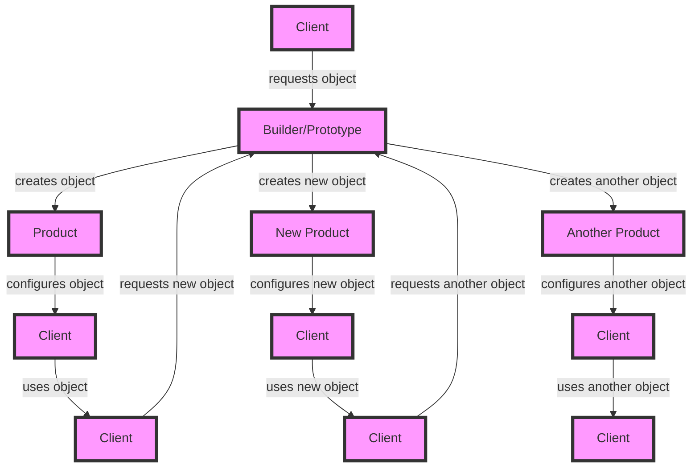

## Introduction
Creational patterns are a category of design patterns that deal with object creation mechanisms. They provide solutions to common problems that arise during the creation of objects, such as reducing complexity, improving flexibility, and enhancing maintainability. Two of the most widely used creational patterns are the **Builder Pattern** and the **Prototype Pattern**. In this section, we will explore what these patterns are, why they exist, and their real-world relevance.

The Builder Pattern is a design pattern that allows for the step-by-step creation of complex objects using a flexible and reusable approach. It separates the construction of an object from its representation, allowing the same construction process to create different representations. This pattern is particularly useful when dealing with complex objects that have multiple dependencies or require a specific configuration.

The Prototype Pattern, on the other hand, is a design pattern that allows for the creation of new objects by copying existing ones. It provides a way to create new objects without having to go through the expensive process of creating a new object from scratch. This pattern is particularly useful when dealing with objects that are expensive to create or have a complex creation process.

> **Tip:** Both the Builder and Prototype patterns can be used to improve the performance and efficiency of object creation in large-scale systems.

## Core Concepts
To understand the Builder and Prototype patterns, it's essential to grasp some key concepts:

* **Separation of Concerns**: The Builder pattern separates the construction of an object from its representation, allowing for a more flexible and reusable approach.
* **Delegation**: The Builder pattern uses delegation to construct complex objects, allowing for a step-by-step approach to object creation.
* **Prototyping**: The Prototype pattern uses prototyping to create new objects by copying existing ones, providing a way to create new objects without having to go through the expensive process of creating a new object from scratch.
* **Deep Copying**: The Prototype pattern uses deep copying to create a new object that is a copy of an existing one, ensuring that the new object is independent of the original.

**Key Terminology:**

* **Builder**: An object that is responsible for constructing a complex object step-by-step.
* **Prototype**: An object that is used as a template to create new objects.
* **Product**: The complex object being constructed by the Builder pattern.
* **Client**: The object that uses the Builder or Prototype pattern to create new objects.

## How It Works Internally
To understand how the Builder and Prototype patterns work internally, let's take a closer look at their under-the-hood mechanics:

* **Builder Pattern:**
	1. The client requests a new object from the Builder.
	2. The Builder creates a new object and initializes its properties.
	3. The client configures the object by calling methods on the Builder.
	4. The Builder constructs the object step-by-step, using the configuration provided by the client.
	5. The client retrieves the completed object from the Builder.
* **Prototype Pattern:**
	1. The client requests a new object from the Prototype.
	2. The Prototype creates a new object by copying an existing one.
	3. The client configures the new object by calling methods on it.
	4. The client uses the new object, which is a copy of the original.

> **Warning:** When using the Prototype pattern, it's essential to ensure that the new object is a deep copy of the original, to avoid unintended side effects.

## Code Examples
Here are three complete and runnable code examples that demonstrate the Builder and Prototype patterns:

### Example 1: Basic Builder Pattern
```java
public class BuilderPattern {
    public static class Builder {
        private String name;
        private int age;

        public Builder withName(String name) {
            this.name = name;
            return this;
        }

        public Builder withAge(int age) {
            this.age = age;
            return this;
        }

        public Person build() {
            return new Person(name, age);
        }
    }

    public static class Person {
        private String name;
        private int age;

        public Person(String name, int age) {
            this.name = name;
            this.age = age;
        }

        @Override
        public String toString() {
            return "Person{" +
                    "name='" + name + '\'' +
                    ", age=" + age +
                    '}';
        }
    }

    public static void main(String[] args) {
        Person person = new Builder()
                .withName("John Doe")
                .withAge(30)
                .build();
        System.out.println(person);
    }
}
```

### Example 2: Real-World Prototype Pattern
```javascript
class Car {
    constructor(make, model, year) {
        this.make = make;
        this.model = model;
        this.year = year;
    }

    clone() {
        return new Car(this.make, this.model, this.year);
    }
}

class CarFactory {
    constructor() {
        this.cars = [];
    }

    createCar(make, model, year) {
        const car = new Car(make, model, year);
        this.cars.push(car);
        return car;
    }

    getCar(make, model, year) {
        for (const car of this.cars) {
            if (car.make === make && car.model === model && car.year === year) {
                return car.clone();
            }
        }
        return this.createCar(make, model, year);
    }
}

const carFactory = new CarFactory();
const car = carFactory.getCar("Toyota", "Camry", 2020);
console.log(car);
```

### Example 3: Advanced Prototype Pattern
```python
import copy

class Employee:
    def __init__(self, name, age, department):
        self.name = name
        self.age = age
        self.department = department

    def clone(self):
        return copy.deepcopy(self)

class EmployeeFactory:
    def __init__(self):
        self.employees = {}

    def create_employee(self, name, age, department):
        employee = Employee(name, age, department)
        self.employees[(name, age, department)] = employee
        return employee

    def get_employee(self, name, age, department):
        if (name, age, department) in self.employees:
            return self.employees[(name, age, department)].clone()
        return self.create_employee(name, age, department)

factory = EmployeeFactory()
employee = factory.get_employee("John Doe", 30, "Sales")
print(employee.name, employee.age, employee.department)
```

## Visual Diagram


This diagram illustrates the Builder and Prototype patterns, showing how the client requests objects from the Builder or Prototype, and how the Builder or Prototype creates and configures the objects.

## Comparison
| Pattern | Time Complexity | Space Complexity | Pros | Cons | Best For |
| --- | --- | --- | --- | --- | --- |
| Builder | O(1) | O(n) | Flexible, reusable, and efficient | Can be complex to implement | Creating complex objects with multiple dependencies |
| Prototype | O(1) | O(n) | Fast and efficient, reduces object creation overhead | Can be difficult to implement deep copying | Creating objects that are expensive to create or have a complex creation process |
| Factory Method | O(1) | O(1) | Provides a way to create objects without specifying the exact class | Can be limited in its flexibility | Creating objects that have a simple creation process |
| Abstract Factory | O(1) | O(1) | Provides a way to create families of related objects | Can be complex to implement | Creating families of related objects |

## Real-world Use Cases
Here are three real-world use cases for the Builder and Prototype patterns:

* **Toyota Manufacturing**: Toyota uses the Builder pattern to create custom cars with various options and features. The builder pattern allows Toyota to create a wide range of cars with different configurations, while maintaining a high level of efficiency and quality.
* **Google Docs**: Google Docs uses the Prototype pattern to create new documents by copying existing ones. This allows users to create new documents quickly and efficiently, without having to start from scratch.
* **Amazon Product Catalog**: Amazon uses the Builder pattern to create product catalogs with various options and features. The builder pattern allows Amazon to create a wide range of product catalogs with different configurations, while maintaining a high level of efficiency and quality.

## Common Pitfalls
Here are four common pitfalls to watch out for when using the Builder and Prototype patterns:

* **Overusing the Builder pattern**: The Builder pattern can be overused, leading to complex and hard-to-maintain code. It's essential to use the Builder pattern only when necessary and to keep the builder classes simple and easy to understand.
* **Not implementing deep copying**: When using the Prototype pattern, it's essential to implement deep copying to ensure that the new object is a complete copy of the original. Failure to do so can lead to unexpected behavior and bugs.
* **Not handling dependencies correctly**: When using the Builder pattern, it's essential to handle dependencies correctly to ensure that the object is created with the correct dependencies. Failure to do so can lead to unexpected behavior and bugs.
* **Not testing the code thoroughly**: It's essential to test the code thoroughly to ensure that it works as expected. Failure to do so can lead to unexpected behavior and bugs.

> **Interview:** Be prepared to answer questions about the Builder and Prototype patterns, such as "What is the difference between the Builder and Prototype patterns?" or "How do you implement deep copying in the Prototype pattern?"

## Key Takeaways
Here are ten key takeaways to remember:

* The Builder pattern separates the construction of an object from its representation.
* The Prototype pattern creates new objects by copying existing ones.
* The Builder pattern is useful for creating complex objects with multiple dependencies.
* The Prototype pattern is useful for creating objects that are expensive to create or have a complex creation process.
* The Builder pattern can be overused, leading to complex and hard-to-maintain code.
* The Prototype pattern requires deep copying to ensure that the new object is a complete copy of the original.
* The Builder pattern handles dependencies correctly to ensure that the object is created with the correct dependencies.
* The Prototype pattern can be used to reduce object creation overhead.
* The Builder pattern can be used to improve the flexibility and reusability of object creation.
* The Prototype pattern can be used to improve the efficiency and performance of object creation.