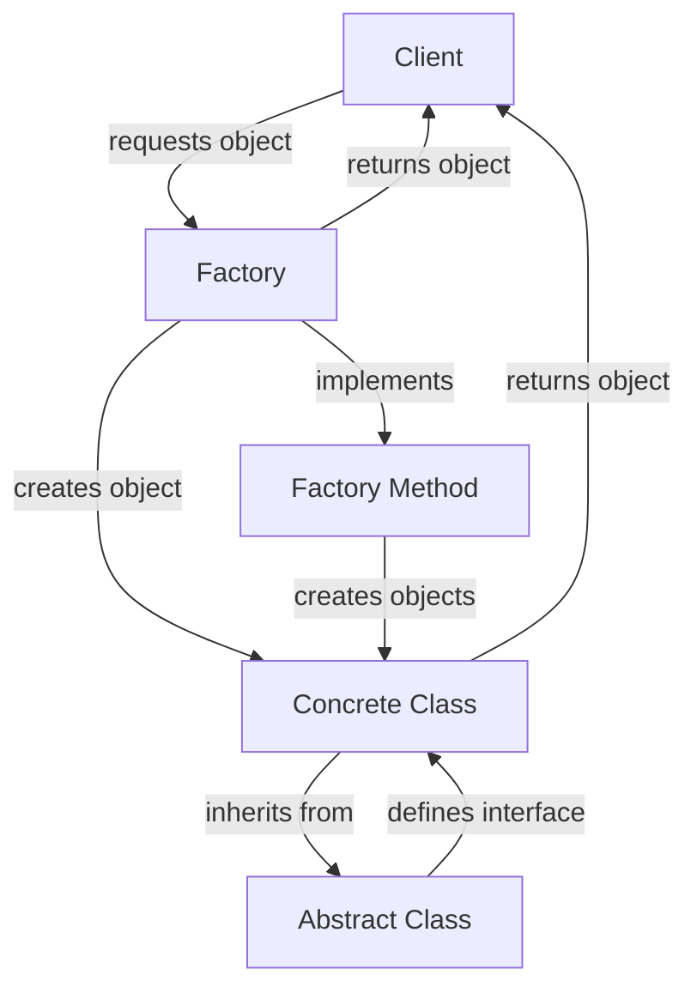

## Introduction
Creational patterns are a set of design patterns that deal with the creation of objects in a system. They provide a way to create objects in a flexible and reusable manner, allowing for more maintainable and scalable code. The three creational patterns we will be covering in this section are the Singleton pattern, the Factory Method pattern, and the Abstract Factory pattern. These patterns are essential in software engineering as they help to reduce coupling, increase cohesion, and improve the overall structure of a system.

> **Note:** Creational patterns are used to create objects in a system, and they provide a way to decouple the creation of objects from their usage.

## Core Concepts
The Singleton pattern is a creational pattern that ensures a class has only one instance and provides a global point of access to it. The Factory Method pattern is a creational pattern that provides a way to create objects without specifying the exact class of object that will be created. The Abstract Factory pattern is a creational pattern that provides a way to create families of related objects without specifying their concrete classes.

*   **Singleton Pattern:** A class that can only be instantiated once, and provides a global point of access to its instance.
*   **Factory Method Pattern:** A method that creates objects without specifying the exact class of object that will be created.
*   **Abstract Factory Pattern:** A class that provides a way to create families of related objects without specifying their concrete classes.

> **Warning:** Overuse of the Singleton pattern can lead to tight coupling and make code harder to test.

## How It Works Internally
The Singleton pattern works by creating a class that has a private constructor and a static method that returns the instance of the class. The Factory Method pattern works by defining an interface for creating objects, and then implementing that interface in concrete classes. The Abstract Factory pattern works by defining an interface for creating families of related objects, and then implementing that interface in concrete classes.

Here is a step-by-step breakdown of how the Singleton pattern works:

1.  The Singleton class has a private constructor to prevent instantiation from outside the class.
2.  The Singleton class has a static method that returns the instance of the class.
3.  The static method checks if the instance is null, and if so, creates a new instance.
4.  The static method returns the instance.

## Code Examples
### Example 1: Singleton Pattern
```java
public class Singleton {
    private static Singleton instance;
    private Singleton() {}
    public static Singleton getInstance() {
        if (instance == null) {
            instance = new Singleton();
        }
        return instance;
    }
}
```
This example shows a basic implementation of the Singleton pattern in Java. The `getInstance` method returns the instance of the class, creating a new instance if it does not already exist.

### Example 2: Factory Method Pattern
```java
public abstract class Vehicle {
    public abstract void drive();
}
public class Car extends Vehicle {
    @Override
    public void drive() {
        System.out.println("Driving a car");
    }
}
public class Truck extends Vehicle {
    @Override
    public void drive() {
        System.out.println("Driving a truck");
    }
}
public class VehicleFactory {
    public static Vehicle createVehicle(String type) {
        if (type.equals("car")) {
            return new Car();
        } else if (type.equals("truck")) {
            return new Truck();
        } else {
            return null;
        }
    }
}
```
This example shows a basic implementation of the Factory Method pattern in Java. The `VehicleFactory` class has a `createVehicle` method that returns a `Vehicle` object based on the type of vehicle requested.

### Example 3: Abstract Factory Pattern
```java
public abstract class Button {
    public abstract void click();
}
public class WindowsButton extends Button {
    @Override
    public void click() {
        System.out.println("Clicking a Windows button");
    }
}
public class MacButton extends Button {
    @Override
    public void click() {
        System.out.println("Clicking a Mac button");
    }
}
public abstract class GUIFactory {
    public abstract Button createButton();
}
public class WindowsFactory extends GUIFactory {
    @Override
    public Button createButton() {
        return new WindowsButton();
    }
}
public class MacFactory extends GUIFactory {
    @Override
    public Button createButton() {
        return new MacButton();
    }
}
```
This example shows a basic implementation of the Abstract Factory pattern in Java. The `GUIFactory` class has a `createButton` method that returns a `Button` object, and the `WindowsFactory` and `MacFactory` classes implement this method to return `WindowsButton` and `MacButton` objects, respectively.

> **Tip:** The Abstract Factory pattern is useful when you need to create families of related objects without specifying their concrete classes.

## Visual Diagram

This diagram shows the basic structure of the Factory Method pattern. The client requests an object from the factory, which creates the object using the concrete class and returns it to the client. The concrete class inherits from the abstract class, which defines the interface for the objects.

## Comparison
| Pattern | Time Complexity | Space Complexity | Pros | Cons | Best For |
| --- | --- | --- | --- | --- | --- |
| Singleton | O(1) | O(1) | Provides a global point of access to a single instance of a class | Can lead to tight coupling and make code harder to test | When you need to ensure a class has only one instance and provide a global point of access to it |
| Factory Method | O(1) | O(1) | Provides a way to create objects without specifying the exact class of object that will be created | Can lead to over-engineering and make code harder to understand | When you need to create objects without specifying the exact class of object that will be created |
| Abstract Factory | O(1) | O(1) | Provides a way to create families of related objects without specifying their concrete classes | Can lead to over-engineering and make code harder to understand | When you need to create families of related objects without specifying their concrete classes |

## Real-world Use Cases
1.  **Database Connections:** The Singleton pattern is often used to manage database connections, ensuring that only one connection is created and providing a global point of access to it.
2.  **Logging:** The Singleton pattern is often used to manage logging, ensuring that only one logger is created and providing a global point of access to it.
3.  **GUI Components:** The Abstract Factory pattern is often used to create GUI components, such as buttons and text fields, without specifying their concrete classes.

> **Interview:** Can you explain the difference between the Singleton pattern and the Factory Method pattern?

## Common Pitfalls
1.  **Overuse of the Singleton Pattern:** Overusing the Singleton pattern can lead to tight coupling and make code harder to test.
2.  **Incorrect Implementation of the Factory Method Pattern:** Incorrectly implementing the Factory Method pattern can lead to over-engineering and make code harder to understand.
3.  **Incorrect Implementation of the Abstract Factory Pattern:** Incorrectly implementing the Abstract Factory pattern can lead to over-engineering and make code harder to understand.

> **Warning:** Over-engineering can lead to code that is harder to understand and maintain.

## Interview Tips
1.  **Be Prepared to Explain the Differences Between Creational Patterns:** Be prepared to explain the differences between the Singleton pattern, the Factory Method pattern, and the Abstract Factory pattern.
2.  **Be Prepared to Provide Examples:** Be prepared to provide examples of how creational patterns are used in real-world applications.
3.  **Be Prepared to Discuss the Trade-offs:** Be prepared to discuss the trade-offs between using creational patterns and not using them.

> **Tip:** Practice explaining the differences between creational patterns and providing examples of how they are used in real-world applications.

## Key Takeaways
*   The Singleton pattern ensures a class has only one instance and provides a global point of access to it.
*   The Factory Method pattern provides a way to create objects without specifying the exact class of object that will be created.
*   The Abstract Factory pattern provides a way to create families of related objects without specifying their concrete classes.
*   Creational patterns can help reduce coupling and improve the overall structure of a system.
*   Overuse of creational patterns can lead to tight coupling and make code harder to test.
*   Incorrect implementation of creational patterns can lead to over-engineering and make code harder to understand.
*   Creational patterns are useful when you need to create objects without specifying the exact class of object that will be created.
*   The time complexity of creational patterns is typically O(1), and the space complexity is typically O(1).
*   Creational patterns are often used in real-world applications, such as database connections and GUI components.