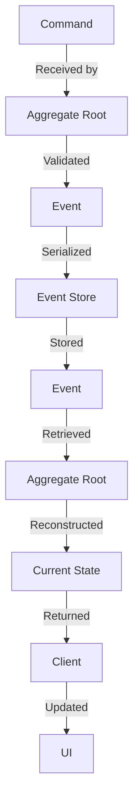

## Introduction
The **Event Sourcing Pattern** is a design pattern that involves storing the history of an application's state as a sequence of events. This allows for the reconstruction of the application's state at any point in time, making it easier to debug, test, and maintain the system. The Event Sourcing Pattern is particularly useful in systems that require high levels of auditing, logging, and compliance, such as financial transactions, healthcare records, and e-commerce platforms. Every engineer needs to know this pattern because it provides a robust and scalable way to manage complex business logic and ensure data consistency.

> **Note:** The Event Sourcing Pattern is often used in conjunction with other design patterns, such as **Command Query Responsibility Segregation (CQRS)** and **Domain-Driven Design (DDD)**.

## Core Concepts
The core concepts of the Event Sourcing Pattern include:
* **Events**: These are the individual changes that occur to the system's state. Events are typically represented as immutable objects that contain the relevant data and metadata.
* **Event Store**: This is the central repository that stores all the events that have occurred in the system. The Event Store is responsible for providing a consistent and reliable way to store and retrieve events.
* **Aggregate Root**: This is the entity that owns the events and is responsible for ensuring that the events are valid and consistent.
* **Command**: This is the request to perform an action that results in an event being generated.

> **Tip:** When implementing the Event Sourcing Pattern, it's essential to define a clear and consistent set of events that can occur in the system. This will help to ensure that the system's state can be accurately reconstructed from the event history.

## How It Works Internally
The Event Sourcing Pattern works internally by storing each event that occurs in the system as a separate entry in the Event Store. When an event is generated, it is serialized and stored in the Event Store. The Event Store provides a way to retrieve the events for a particular aggregate root, allowing the system to reconstruct the current state of the aggregate root.

Here is a high-level overview of the steps involved:
1. An **aggregate root** receives a **command** to perform an action.
2. The **aggregate root** validates the **command** and generates an **event** if the command is valid.
3. The **event** is serialized and stored in the **Event Store**.
4. The **Event Store** provides a way to retrieve the **events** for a particular **aggregate root**.
5. The **aggregate root** can reconstruct its current state by replaying the **events** from the **Event Store**.

> **Warning:** One of the common pitfalls of the Event Sourcing Pattern is that it can be difficult to implement correctly, especially in systems with high levels of concurrency. It's essential to ensure that the Event Store is properly synchronized and that the aggregate roots are correctly handling concurrent events.

## Code Examples
### Example 1: Basic Event Sourcing
```java
// Event.java
public class Event {
    private String id;
    private String data;

    public Event(String id, String data) {
        this.id = id;
        this.data = data;
    }

    public String getId() {
        return id;
    }

    public String getData() {
        return data;
    }
}

// EventStore.java
import java.util.List;
import java.util.ArrayList;

public class EventStore {
    private List<Event> events;

    public EventStore() {
        this.events = new ArrayList<>();
    }

    public void addEvent(Event event) {
        events.add(event);
    }

    public List<Event> getEvents() {
        return events;
    }
}

// AggregateRoot.java
public class AggregateRoot {
    private EventStore eventStore;

    public AggregateRoot(EventStore eventStore) {
        this.eventStore = eventStore;
    }

    public void handleCommand(String command) {
        // Generate an event based on the command
        Event event = new Event("1", command);
        eventStore.addEvent(event);
    }

    public void reconstructState() {
        // Reconstruct the state by replaying the events
        List<Event> events = eventStore.getEvents();
        for (Event event : events) {
            System.out.println("Event: " + event.getId() + " - " + event.getData());
        }
    }
}
```

### Example 2: Real-World Event Sourcing
```javascript
// events.js
class Event {
    constructor(id, data) {
        this.id = id;
        this.data = data;
    }
}

class EventStore {
    constructor() {
        this.events = [];
    }

    addEvent(event) {
        this.events.push(event);
    }

    getEvents() {
        return this.events;
    }
}

class User {
    constructor(eventStore) {
        this.eventStore = eventStore;
    }

    createUser(name) {
        // Generate an event based on the command
        const event = new Event("1", `User created: ${name}`);
        this.eventStore.addEvent(event);
    }

    reconstructState() {
        // Reconstruct the state by replaying the events
        const events = this.eventStore.getEvents();
        for (const event of events) {
            console.log(`Event: ${event.id} - ${event.data}`);
        }
    }
}

const eventStore = new EventStore();
const user = new User(eventStore);
user.createUser("John Doe");
user.reconstructState();
```

### Example 3: Advanced Event Sourcing
```python
# events.py
import uuid

class Event:
    def __init__(self, id, data):
        self.id = id
        self.data = data

class EventStore:
    def __init__(self):
        self.events = []

    def add_event(self, event):
        self.events.append(event)

    def get_events(self):
        return self.events

class AggregateRoot:
    def __init__(self, event_store):
        self.event_store = event_store
        self.state = {}

    def handle_command(self, command):
        # Generate an event based on the command
        event_id = str(uuid.uuid4())
        event = Event(event_id, command)
        self.event_store.add_event(event)

    def reconstruct_state(self):
        # Reconstruct the state by replaying the events
        events = self.event_store.get_events()
        for event in events:
            self.state[event.id] = event.data
        return self.state

# Usage
event_store = EventStore()
aggregate_root = AggregateRoot(event_store)
aggregate_root.handle_command("Create user")
aggregate_root.handle_command("Update user")
state = aggregate_root.reconstruct_state()
print(state)
```

## Visual Diagram

The diagram illustrates the basic flow of the Event Sourcing Pattern. The **Command** is received by the **Aggregate Root**, which generates an **Event** if the command is valid. The **Event** is then serialized and stored in the **Event Store**. The **Event Store** provides a way to retrieve the **Events**, which are used by the **Aggregate Root** to reconstruct its current state.

> **Interview:** When asked to describe the Event Sourcing Pattern, be sure to mention the key concepts of events, event store, and aggregate root. Also, explain how the pattern works internally and provide examples of how it can be used in real-world scenarios.

## Comparison
| Approach | Time Complexity | Space Complexity | Pros | Cons | Best For |
| --- | --- | --- | --- | --- | --- |
| Event Sourcing | O(1) | O(n) | Provides a complete audit trail, allows for easy debugging and testing | Can be complex to implement, requires a lot of storage | Systems that require high levels of auditing and compliance |
| Command Query Responsibility Segregation (CQRS) | O(1) | O(n) | Provides a clear separation of concerns, allows for easy scalability | Can be complex to implement, requires a lot of infrastructure | Systems that require high levels of scalability and performance |
| Domain-Driven Design (DDD) | O(1) | O(n) | Provides a clear understanding of the business domain, allows for easy maintenance | Can be complex to implement, requires a lot of expertise | Systems that require a deep understanding of the business domain |

## Real-world Use Cases
1. **Financial Transactions**: The Event Sourcing Pattern is often used in financial transactions to provide a complete audit trail of all transactions. This allows for easy debugging and testing, and provides a high level of auditing and compliance.
2. **Healthcare Records**: The Event Sourcing Pattern is often used in healthcare records to provide a complete history of all changes made to a patient's record. This allows for easy auditing and compliance, and provides a high level of patient care.
3. **E-commerce Platforms**: The Event Sourcing Pattern is often used in e-commerce platforms to provide a complete history of all orders and transactions. This allows for easy debugging and testing, and provides a high level of customer satisfaction.

> **Tip:** When implementing the Event Sourcing Pattern in a real-world system, be sure to consider the trade-offs between complexity, scalability, and performance. It's essential to choose the right approach based on the specific requirements of the system.

## Common Pitfalls
1. **Inconsistent Event Handling**: One of the common pitfalls of the Event Sourcing Pattern is inconsistent event handling. This can occur when the aggregate root is not properly handling concurrent events, resulting in an inconsistent state.
2. **Event Store Synchronization**: Another common pitfall is event store synchronization. This can occur when the event store is not properly synchronized, resulting in lost or duplicate events.
3. **Aggregate Root Complexity**: The Event Sourcing Pattern can also lead to aggregate root complexity. This can occur when the aggregate root is not properly designed, resulting in a complex and difficult-to-maintain system.
4. **Event Versioning**: The Event Sourcing Pattern can also lead to event versioning issues. This can occur when the events are not properly versioned, resulting in compatibility issues between different versions of the system.

> **Warning:** When implementing the Event Sourcing Pattern, be sure to avoid these common pitfalls by properly designing the aggregate root, event store, and event handling mechanisms.

## Interview Tips
1. **Define the Event Sourcing Pattern**: Be sure to define the Event Sourcing Pattern and explain its key concepts, such as events, event store, and aggregate root.
2. **Explain the Benefits**: Explain the benefits of the Event Sourcing Pattern, such as providing a complete audit trail, allowing for easy debugging and testing, and providing a high level of auditing and compliance.
3. **Describe the Challenges**: Describe the challenges of implementing the Event Sourcing Pattern, such as inconsistent event handling, event store synchronization, and aggregate root complexity.
4. **Provide Examples**: Provide examples of how the Event Sourcing Pattern can be used in real-world scenarios, such as financial transactions, healthcare records, and e-commerce platforms.

> **Interview:** When asked to describe the Event Sourcing Pattern, be sure to provide a clear and concise definition, explain the benefits and challenges, and provide examples of how it can be used in real-world scenarios.

## Key Takeaways
* The Event Sourcing Pattern provides a complete audit trail of all events that occur in a system.
* The pattern consists of events, event store, and aggregate root.
* The Event Sourcing Pattern can be used in real-world scenarios, such as financial transactions, healthcare records, and e-commerce platforms.
* The pattern requires a deep understanding of the business domain and can be complex to implement.
* The Event Sourcing Pattern provides a high level of auditing and compliance, and allows for easy debugging and testing.
* The pattern can lead to aggregate root complexity and event versioning issues if not properly designed.
* The Event Sourcing Pattern requires a proper design of the event store and event handling mechanisms to avoid common pitfalls.