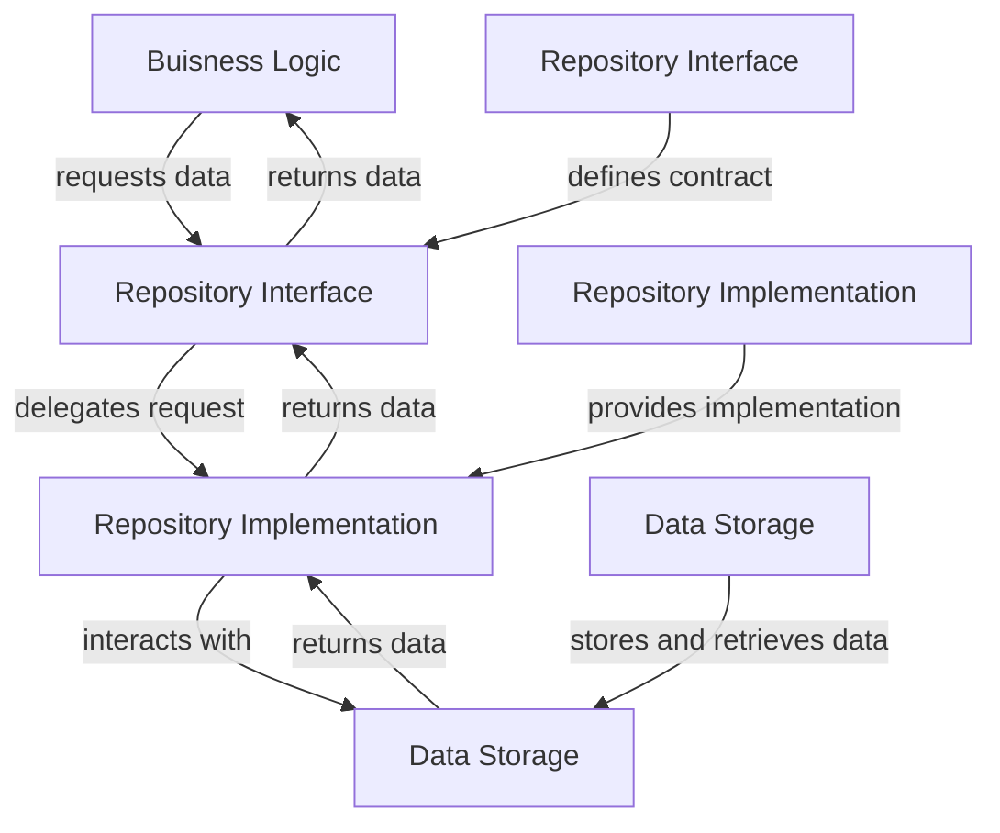

## Introduction
The **Repository Pattern** is a design pattern that abstracts the data storage and retrieval logic, providing a layer of separation between the business logic and the data storage. This pattern is crucial in software development as it allows for loose coupling, testability, and scalability. In real-world scenarios, the Repository Pattern is widely used in applications that require data persistence, such as e-commerce platforms, social media, and banking systems. Every engineer should be familiar with this pattern, as it is a fundamental concept in software engineering.

> **Note:** The Repository Pattern is often used in conjunction with other design patterns, such as the **Domain-Driven Design** and **Model-View-Controller** patterns.

## Core Concepts
The Repository Pattern consists of three main components:

*   **Repository Interface**: defines the contract for data access and manipulation.
*   **Repository Implementation**: provides the concrete implementation of the repository interface.
*   **Data Storage**: represents the underlying data storage, such as a database or file system.

> **Tip:** When implementing the Repository Pattern, it's essential to define a clear and consistent interface for data access to ensure loose coupling and testability.

Key terminology includes:

*   **Data Access Object (DAO)**: an object that provides access to data storage.
*   **Data Mapping**: the process of mapping data between the data storage and the business logic.
*   **Repository**: the abstraction layer that encapsulates data access and manipulation logic.

## How It Works Internally
The Repository Pattern works by providing a layer of abstraction between the business logic and the data storage. Here's a step-by-step breakdown of the process:

1.  The **business logic** requests data from the **repository interface**.
2.  The **repository implementation** receives the request and performs the necessary data access and manipulation.
3.  The **repository implementation** interacts with the **data storage** to retrieve or store data.
4.  The **repository implementation** returns the data to the **business logic**.

> **Warning:** A common mistake is to couple the business logic directly to the data storage, which can lead to tight coupling and make the system harder to maintain.

## Code Examples
### Example 1: Basic Repository Pattern
```java
// Repository interface
public interface UserRepository {
    List<User> findAll();
    User findById(int id);
    void save(User user);
}

// Repository implementation
public class UserRepositoryImpl implements UserRepository {
    private final EntityManager entityManager;

    public UserRepositoryImpl(EntityManager entityManager) {
        this.entityManager = entityManager;
    }

    @Override
    public List<User> findAll() {
        return entityManager.createQuery("SELECT u FROM User u", User.class).getResultList();
    }

    @Override
    public User findById(int id) {
        return entityManager.find(User.class, id);
    }

    @Override
    public void save(User user) {
        entityManager.persist(user);
    }
}

// Business logic
public class UserService {
    private final UserRepository userRepository;

    public UserService(UserRepository userRepository) {
        this.userRepository = userRepository;
    }

    public List<User> getAllUsers() {
        return userRepository.findAll();
    }

    public User getUserById(int id) {
        return userRepository.findById(id);
    }

    public void saveUser(User user) {
        userRepository.save(user);
    }
}
```
### Example 2: Real-World Repository Pattern
```python
# repository.py
from sqlalchemy import create_engine
from sqlalchemy.orm import sessionmaker
from sqlalchemy.ext.declarative import declarative_base
from sqlalchemy import Column, Integer, String

Base = declarative_base()

class User(Base):
    __tablename__ = 'users'
    id = Column(Integer, primary_key=True)
    name = Column(String)
    email = Column(String)

class UserRepository:
    def __init__(self, db_url):
        self.engine = create_engine(db_url)
        self.Session = sessionmaker(bind=self.engine)

    def get_all_users(self):
        session = self.Session()
        return session.query(User).all()

    def get_user_by_id(self, id):
        session = self.Session()
        return session.query(User).get(id)

    def save_user(self, user):
        session = self.Session()
        session.add(user)
        session.commit()

# service.py
from repository import UserRepository

class UserService:
    def __init__(self, repository):
        self.repository = repository

    def get_all_users(self):
        return self.repository.get_all_users()

    def get_user_by_id(self, id):
        return self.repository.get_user_by_id(id)

    def save_user(self, user):
        self.repository.save_user(user)
```
### Example 3: Advanced Repository Pattern
```typescript
// user.entity.ts
import { Entity, Column, PrimaryGeneratedColumn } from 'typeorm';

@Entity()
export class User {
    @PrimaryGeneratedColumn()
    id: number;

    @Column()
    name: string;

    @Column()
    email: string;
}

// user.repository.ts
import { EntityRepository, Repository } from 'typeorm';
import { User } from './user.entity';

@EntityRepository(User)
export class UserRepository extends Repository<User> {
    async getAllUsers(): Promise<User[]> {
        return this.find();
    }

    async getUserById(id: number): Promise<User | undefined> {
        return this.findOne(id);
    }

    async saveUser(user: User): Promise<void> {
        await this.save(user);
    }
}

// user.service.ts
import { Injectable } from '@nestjs/common';
import { UserRepository } from './user.repository';

@Injectable()
export class UserService {
    constructor(private readonly userRepository: UserRepository) {}

    async getAllUsers(): Promise<User[]> {
        return this.userRepository.getAllUsers();
    }

    async getUserById(id: number): Promise<User | undefined> {
        return this.userRepository.getUserById(id);
    }

    async saveUser(user: User): Promise<void> {
        await this.userRepository.saveUser(user);
    }
}
```
## Visual Diagram

The diagram illustrates the flow of data between the business logic, repository interface, repository implementation, and data storage.

## Comparison
| Approach | Time Complexity | Space Complexity | Pros | Cons | Best For |
| --- | --- | --- | --- | --- | --- |
| **Repository Pattern** | O(1) | O(n) | Loose coupling, testability, scalability | Additional complexity | Large-scale applications |
| **DAO Pattern** | O(1) | O(n) | Simplifies data access | Limited flexibility | Small-scale applications |
| **Active Record Pattern** | O(1) | O(n) | Simple to implement | Tight coupling | Small-scale applications |
| **Data Access Layer** | O(1) | O(n) | Centralized data access | Limited flexibility | Legacy systems |

> **Interview:** What is the main difference between the Repository Pattern and the DAO Pattern?

## Real-world Use Cases
1.  **E-commerce platforms**: The Repository Pattern is used to manage product catalogs, customer data, and order information.
2.  **Social media**: The Repository Pattern is used to store and retrieve user data, posts, and comments.
3.  **Banking systems**: The Repository Pattern is used to manage account information, transactions, and customer data.

## Common Pitfalls
1.  **Tight coupling**: Coupling the business logic directly to the data storage can lead to tight coupling and make the system harder to maintain.
2.  **Over-engineering**: Over-engineering the repository implementation can lead to unnecessary complexity and make the system harder to understand.
3.  **Under-engineering**: Under-engineering the repository implementation can lead to limited flexibility and make the system harder to maintain.
4.  **Not using interfaces**: Not using interfaces for the repository can lead to tight coupling and make the system harder to test.

> **Warning:** Not using interfaces for the repository can lead to tight coupling and make the system harder to test.

## Interview Tips
1.  **What is the Repository Pattern?**: The Repository Pattern is a design pattern that abstracts the data storage and retrieval logic, providing a layer of separation between the business logic and the data storage.
2.  **What is the difference between the Repository Pattern and the DAO Pattern?**: The Repository Pattern provides a layer of abstraction between the business logic and the data storage, while the DAO Pattern simplifies data access.
3.  **How do you implement the Repository Pattern?**: Implementing the Repository Pattern involves defining a clear and consistent interface for data access, providing a concrete implementation of the repository interface, and using the repository to interact with the data storage.

> **Tip:** When implementing the Repository Pattern, it's essential to define a clear and consistent interface for data access to ensure loose coupling and testability.

## Key Takeaways
*   The Repository Pattern provides a layer of abstraction between the business logic and the data storage.
*   The Repository Pattern consists of three main components: repository interface, repository implementation, and data storage.
*   The Repository Pattern is used to manage data persistence, scalability, and testability.
*   The Repository Pattern is widely used in large-scale applications, such as e-commerce platforms, social media, and banking systems.
*   The Repository Pattern can be implemented using various programming languages and frameworks, such as Java, Python, and TypeScript.
*   The Repository Pattern has several benefits, including loose coupling, testability, and scalability.
*   The Repository Pattern has several drawbacks, including additional complexity and over-engineering.
*   The Repository Pattern is often used in conjunction with other design patterns, such as the **Domain-Driven Design** and **Model-View-Controller** patterns.

> **Note:** The Repository Pattern is a fundamental concept in software engineering, and every engineer should be familiar with this pattern to design and develop large-scale applications.