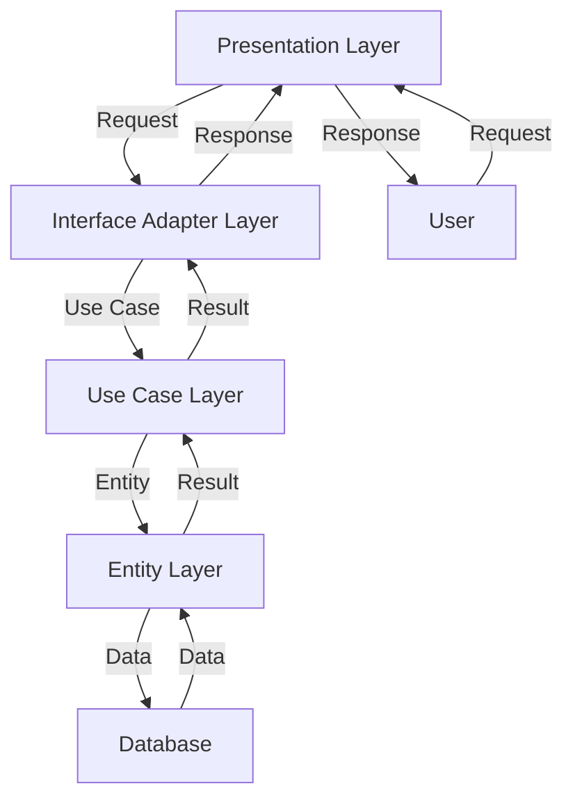

## Introduction
**Clean Architecture** is a software design pattern that separates the application's business logic from its infrastructure and presentation layers. It was introduced by Robert C. Martin, also known as "Uncle Bob," in 2012. The main goal of Clean Architecture is to create a system that is independent of frameworks, databases, and user interfaces, making it easier to test, maintain, and extend. This architecture pattern is essential for building scalable, maintainable, and testable software systems. Every engineer should understand Clean Architecture because it provides a solid foundation for designing and implementing complex software systems.

## Core Concepts
Clean Architecture is based on several core concepts:
* **Entities**: These are the business domain objects that represent the data and behavior of the system.
* **Use Cases**: These represent the actions that can be performed on the system, such as creating, reading, updating, or deleting data.
* **Interface Adapters**: These define how the system interacts with the outside world, such as databases, file systems, or user interfaces.
* **Frameworks and Drivers**: These are the external libraries and frameworks that the system uses, such as databases, web frameworks, or logging libraries.
* **Presentation**: This is the layer that handles user input and output, such as web pages, mobile apps, or command-line interfaces.

> **Note:** The key idea behind Clean Architecture is to keep the business logic (entities and use cases) separate from the infrastructure and presentation layers.

## How It Works Internally
Here's a step-by-step breakdown of how Clean Architecture works internally:
1. The user interacts with the system through the presentation layer.
2. The presentation layer sends a request to the interface adapter layer.
3. The interface adapter layer translates the request into a use case.
4. The use case interacts with the entity layer to perform the desired action.
5. The entity layer updates its state and notifies the use case.
6. The use case returns the result to the interface adapter layer.
7. The interface adapter layer translates the result back into a format that the presentation layer can understand.
8. The presentation layer displays the result to the user.

> **Tip:** To ensure that the system is testable, it's essential to keep the business logic (entities and use cases) separate from the infrastructure and presentation layers.

## Code Examples
### Example 1: Basic Entity and Use Case
```java
// Entity
public class User {
    private String id;
    private String name;

    public User(String id, String name) {
        this.id = id;
        this.name = name;
    }

    public String getId() {
        return id;
    }

    public String getName() {
        return name;
    }
}

// Use Case
public class GetUserUseCase {
    private UserRepository userRepository;

    public GetUserUseCase(UserRepository userRepository) {
        this.userRepository = userRepository;
    }

    public User getUser(String id) {
        return userRepository.getUser(id);
    }
}
```
### Example 2: Real-World Interface Adapter
```python
# Interface Adapter
class UserRepositoryInterfaceAdapter:
    def __init__(self, db_connection):
        self.db_connection = db_connection

    def get_user(self, id):
        cursor = self.db_connection.cursor()
        cursor.execute("SELECT * FROM users WHERE id = ?", (id,))
        user_data = cursor.fetchone()
        if user_data:
            return User(user_data[0], user_data[1])
        else:
            return None
```
### Example 3: Advanced Use Case with Validation
```typescript
// Use Case with Validation
class CreateUserUseCase {
    private userRepository: UserRepository;
    private validator: Validator;

    constructor(userRepository: UserRepository, validator: Validator) {
        this.userRepository = userRepository;
        this.validator = validator;
    }

    public async createUser(user: User): Promise<User | null> {
        if (!this.validator.validateUser(user)) {
            throw new Error("Invalid user data");
        }
        return this.userRepository.createUser(user);
    }
}
```
## Visual Diagram

The diagram illustrates the flow of data and control between the different layers of the Clean Architecture pattern.

## Comparison
| Approach | Time Complexity | Space Complexity | Pros | Cons | Best For |
| --- | --- | --- | --- | --- | --- |
| Clean Architecture | O(1) | O(n) | Separation of Concerns, Testability, Maintainability | Complexity, Steep Learning Curve | Complex, Scalable Systems |
| MVC | O(n) | O(1) | Simple, Easy to Implement | Tight Coupling, Limited Scalability | Small, Simple Systems |
| Microservices | O(n) | O(n) | Scalability, Flexibility | Complexity, Communication Overhead | Large, Distributed Systems |
| Monolithic | O(1) | O(1) | Simple, Easy to Implement | Limited Scalability, Tight Coupling | Small, Simple Systems |

> **Warning:** While Clean Architecture provides many benefits, it can also introduce additional complexity and overhead. It's essential to weigh the pros and cons before adopting this pattern.

## Real-world Use Cases
1. **Amazon**: Amazon's e-commerce platform is built using a variant of the Clean Architecture pattern. The platform is highly scalable, maintainable, and testable, thanks to the separation of concerns and the use of interface adapters.
2. **Netflix**: Netflix's video streaming platform is built using a microservices architecture, which is similar to the Clean Architecture pattern. The platform is highly scalable, flexible, and fault-tolerant, thanks to the use of separate services and interface adapters.
3. **Airbnb**: Airbnb's accommodation booking platform is built using a variant of the Clean Architecture pattern. The platform is highly scalable, maintainable, and testable, thanks to the separation of concerns and the use of interface adapters.

## Common Pitfalls
1. **Tight Coupling**: One of the most common pitfalls of Clean Architecture is tight coupling between the layers. This can occur when the presentation layer is tightly coupled to the business logic layer, making it difficult to change or replace either layer without affecting the other.
2. **Over-Engineering**: Another common pitfall is over-engineering the system. This can occur when the system is designed to be too flexible or scalable, leading to unnecessary complexity and overhead.
3. **Under-Testing**: Clean Architecture emphasizes the importance of testing, but it's easy to underestimate the amount of testing required. Under-testing can lead to bugs and defects that are difficult to detect and fix.
4. **Inadequate Documentation**: Finally, inadequate documentation is a common pitfall of Clean Architecture. The system's complexity and abstraction can make it difficult to understand and maintain without proper documentation.

> **Tip:** To avoid these pitfalls, it's essential to follow best practices, such as separating concerns, using interface adapters, and writing comprehensive tests and documentation.

## Interview Tips
1. **What is Clean Architecture?**: The interviewer wants to assess your understanding of the Clean Architecture pattern and its benefits.
	* Weak answer: "Clean Architecture is a design pattern that separates the business logic from the presentation layer."
	* Strong answer: "Clean Architecture is a software design pattern that separates the application's business logic from its infrastructure and presentation layers, making it easier to test, maintain, and extend the system."
2. **How does Clean Architecture improve testability?**: The interviewer wants to assess your understanding of how Clean Architecture improves testability.
	* Weak answer: "Clean Architecture makes the system more testable by separating the business logic from the presentation layer."
	* Strong answer: "Clean Architecture improves testability by separating the business logic from the infrastructure and presentation layers, making it easier to write unit tests and integration tests that cover the entire system."
3. **What are some common pitfalls of Clean Architecture?**: The interviewer wants to assess your understanding of the common pitfalls of Clean Architecture.
	* Weak answer: "One common pitfall is tight coupling between the layers."
	* Strong answer: "Some common pitfalls of Clean Architecture include tight coupling between the layers, over-engineering the system, under-testing, and inadequate documentation. To avoid these pitfalls, it's essential to follow best practices, such as separating concerns, using interface adapters, and writing comprehensive tests and documentation."

## Key Takeaways
* Clean Architecture is a software design pattern that separates the application's business logic from its infrastructure and presentation layers.
* The pattern consists of entities, use cases, interface adapters, frameworks and drivers, and presentation layers.
* Clean Architecture improves testability, maintainability, and scalability by separating concerns and using interface adapters.
* The pattern is suitable for complex, scalable systems, but can introduce additional complexity and overhead.
* Common pitfalls include tight coupling, over-engineering, under-testing, and inadequate documentation.
* Best practices include separating concerns, using interface adapters, writing comprehensive tests and documentation, and following a consistent architecture pattern.
* Clean Architecture is used in real-world systems, such as Amazon, Netflix, and Airbnb.
* The pattern has a time complexity of O(1) and a space complexity of O(n), making it suitable for large, distributed systems.