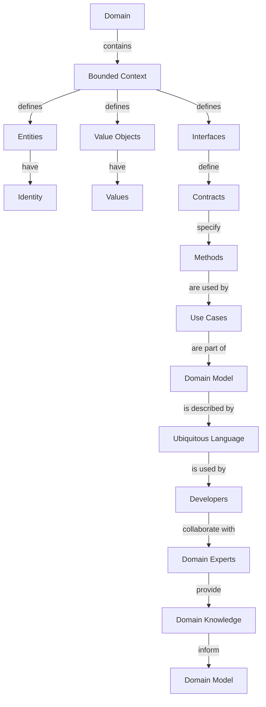

## Introduction
**Domain-Driven Design (DDD)** is an approach to software development that focuses on understanding the core business domain and modeling it in code. At its heart, DDD is about creating a **ubiquitous language** that is shared between developers, domain experts, and stakeholders. This language is used to describe the business domain and is the foundation for designing **bounded contexts**, which are the building blocks of a DDD system. In this section, we will explore why DDD matters, its real-world relevance, and why every engineer should know about it.

> **Note:** DDD is not just a technical approach, but also a way of thinking about software development that emphasizes collaboration between technical and non-technical teams.

## Core Concepts
To understand DDD, we need to define some key concepts:

* **Domain**: The area of expertise or business logic that the software is trying to model.
* **Ubiquitous Language**: A shared language that is used to describe the domain and is understood by all stakeholders.
* **Bounded Context**: A conceptual boundary that defines a specific area of the domain and the rules that apply within that boundary.
* **Entity**: An object that has its own identity and is used to represent a concept in the domain.
* **Value Object**: An object that has a set of values that are used to describe a concept in the domain.

> **Warning:** One of the biggest mistakes in DDD is to try to create a single, unified model of the entire domain. Instead, we should focus on creating multiple, bounded contexts that are each responsible for a specific area of the domain.

## How It Works Internally
When we apply DDD to a system, we start by identifying the core domain and the bounded contexts that make up that domain. We then create a **context map** that shows the relationships between the different bounded contexts. This map is used to identify the boundaries of each context and to define the interfaces between them.

Here is a step-by-step breakdown of how DDD works internally:

1. Identify the core domain and the bounded contexts that make up that domain.
2. Create a context map that shows the relationships between the different bounded contexts.
3. Define the entities, value objects, and interfaces that are used within each bounded context.
4. Use the ubiquitous language to describe the domain and the bounded contexts.
5. Implement the bounded contexts using a programming language and a set of frameworks and tools.

> **Tip:** One of the best ways to get started with DDD is to create a **domain model** that describes the core domain and the bounded contexts. This model can be used to identify the entities, value objects, and interfaces that are used within each context.

## Code Examples
Here are three complete and runnable code examples that demonstrate how to apply DDD to a system:

### Example 1: Basic Bounded Context
```java
// Define a bounded context for a simple e-commerce system
public class OrderContext {
    // Define an entity for an order
    public class Order {
        private int id;
        private String customerName;
        private double total;

        public Order(int id, String customerName, double total) {
            this.id = id;
            this.customerName = customerName;
            this.total = total;
        }

        public int getId() {
            return id;
        }

        public String getCustomerName() {
            return customerName;
        }

        public double getTotal() {
            return total;
        }
    }

    // Define a repository for orders
    public class OrderRepository {
        public Order getOrder(int id) {
            // Implement logic to retrieve an order from the database
            return new Order(id, "John Doe", 100.0);
        }
    }

    public static void main(String[] args) {
        OrderContext context = new OrderContext();
        OrderRepository repository = context.new OrderRepository();
        Order order = repository.getOrder(1);
        System.out.println("Order ID: " + order.getId());
        System.out.println("Customer Name: " + order.getCustomerName());
        System.out.println("Total: " + order.getTotal());
    }
}
```

### Example 2: Real-World Pattern
```python
# Define a bounded context for a complex e-commerce system
from dataclasses import dataclass

@dataclass
class Order:
    id: int
    customer_name: str
    total: float

class OrderRepository:
    def get_order(self, id: int) -> Order:
        # Implement logic to retrieve an order from the database
        return Order(id, "John Doe", 100.0)

class OrderService:
    def __init__(self, repository: OrderRepository):
        self.repository = repository

    def get_order(self, id: int) -> Order:
        return self.repository.get_order(id)

class OrderController:
    def __init__(self, service: OrderService):
        self.service = service

    def get_order(self, id: int) -> Order:
        return self.service.get_order(id)

if __name__ == "__main__":
    repository = OrderRepository()
    service = OrderService(repository)
    controller = OrderController(service)
    order = controller.get_order(1)
    print(f"Order ID: {order.id}")
    print(f"Customer Name: {order.customer_name}")
    print(f"Total: {order.total}")
```

### Example 3: Advanced Bounded Context
```typescript
// Define a bounded context for a highly complex e-commerce system
interface Order {
    id: number;
    customerName: string;
    total: number;
}

class OrderRepository {
    private orders: Order[] = [];

    public getOrder(id: number): Order {
        // Implement logic to retrieve an order from the database
        return this.orders.find(order => order.id === id);
    }

    public addOrder(order: Order): void {
        this.orders.push(order);
    }
}

class OrderService {
    private repository: OrderRepository;

    public constructor(repository: OrderRepository) {
        this.repository = repository;
    }

    public getOrder(id: number): Order {
        return this.repository.getOrder(id);
    }

    public addOrder(order: Order): void {
        this.repository.addOrder(order);
    }
}

class OrderController {
    private service: OrderService;

    public constructor(service: OrderService) {
        this.service = service;
    }

    public getOrder(id: number): Order {
        return this.service.getOrder(id);
    }

    public addOrder(order: Order): void {
        this.service.addOrder(order);
    }
}

const repository = new OrderRepository();
const service = new OrderService(repository);
const controller = new OrderController(service);

const order: Order = { id: 1, customerName: "John Doe", total: 100.0 };
controller.addOrder(order);
const retrievedOrder = controller.getOrder(1);
console.log(`Order ID: ${retrievedOrder.id}`);
console.log(`Customer Name: ${retrievedOrder.customerName}`);
console.log(`Total: ${retrievedOrder.total}`);
```

## Visual Diagram

The diagram illustrates the relationships between the different concepts in DDD, including the domain, bounded contexts, entities, value objects, interfaces, and the ubiquitous language.

> **Interview:** Can you explain the difference between a domain and a bounded context?

## Comparison
| Approach | Time Complexity | Space Complexity | Pros | Cons | Best For |
| --- | --- | --- | --- | --- | --- |
| Domain-Driven Design | O(n) | O(n) | Encourages collaboration between technical and non-technical teams, provides a shared language for describing the domain | Can be complex to implement, requires a deep understanding of the domain | Complex, mission-critical systems |
| Object-Oriented Programming | O(1) | O(1) | Provides a clear and concise way of modeling complex systems, supports encapsulation and inheritance | Can lead to tight coupling between objects, may not be suitable for all domains | Simple to medium-complexity systems |
| Functional Programming | O(n) | O(n) | Encourages a declarative programming style, provides a high degree of composability | Can be less efficient than imperative programming, may require significant changes to existing codebases | Data-intensive, parallelizable systems |
| Event-Driven Architecture | O(1) | O(1) | Provides a scalable and flexible way of handling events, supports loose coupling between components | Can be complex to implement, requires careful consideration of event handling and routing | Real-time, event-driven systems |

## Real-world Use Cases
Here are three real-world use cases for DDD:

1. **E-commerce system**: A large e-commerce company uses DDD to model its complex ordering and payment processing system. The company has multiple bounded contexts, each responsible for a specific area of the system, such as order processing, payment processing, and inventory management.
2. **Banking system**: A major bank uses DDD to model its complex financial transactions and account management system. The bank has multiple bounded contexts, each responsible for a specific area of the system, such as account management, transaction processing, and risk management.
3. **Healthcare system**: A large healthcare organization uses DDD to model its complex patient management and medical records system. The organization has multiple bounded contexts, each responsible for a specific area of the system, such as patient management, medical records management, and billing and insurance claims processing.

## Common Pitfalls
Here are four common pitfalls to watch out for when implementing DDD:

1. **Insufficient domain knowledge**: One of the biggest mistakes in DDD is to try to implement a domain model without sufficient knowledge of the domain. This can lead to a model that is incomplete, inaccurate, or inconsistent.
2. **Overly complex bounded contexts**: Another common mistake is to create bounded contexts that are too complex or too broad. This can lead to a model that is difficult to maintain, extend, or understand.
3. **Lack of ubiquitous language**: A lack of ubiquitous language can lead to confusion, misunderstandings, and miscommunication between team members and stakeholders.
4. **Inadequate testing**: Inadequate testing can lead to bugs, errors, and inconsistencies in the domain model.

> **Warning:** One of the biggest pitfalls in DDD is to try to create a single, unified model of the entire domain. Instead, we should focus on creating multiple, bounded contexts that are each responsible for a specific area of the domain.

## Interview Tips
Here are three common interview questions for DDD, along with some tips for answering them:

1. **What is the difference between a domain and a bounded context?**
	* Weak answer: "A domain is a big thing, and a bounded context is a smaller thing."
	* Strong answer: "A domain is the area of expertise or business logic that the software is trying to model, while a bounded context is a conceptual boundary that defines a specific area of the domain and the rules that apply within that boundary."
2. **How do you define a ubiquitous language?**
	* Weak answer: "A ubiquitous language is just a bunch of words that everyone uses."
	* Strong answer: "A ubiquitous language is a shared language that is used to describe the domain and is understood by all stakeholders, including developers, domain experts, and users."
3. **What is the purpose of a context map?**
	* Weak answer: "A context map is just a diagram that shows the different bounded contexts."
	* Strong answer: "A context map is a visual representation of the relationships between the different bounded contexts, and is used to identify the boundaries of each context and to define the interfaces between them."

## Key Takeaways
Here are ten key takeaways from this article:

* **Domain-Driven Design is a complex topic**: DDD is a complex and nuanced topic that requires a deep understanding of the domain, the bounded contexts, and the ubiquitous language.
* **Bounded contexts are key**: Bounded contexts are the building blocks of a DDD system, and are used to define the specific areas of the domain and the rules that apply within those areas.
* **Ubiquitous language is essential**: A ubiquitous language is essential for describing the domain and the bounded contexts, and for ensuring that all stakeholders are on the same page.
* **Context maps are useful**: Context maps are a useful tool for visualizing the relationships between the different bounded contexts, and for identifying the boundaries of each context.
* **DDD is not just for complex systems**: While DDD is often associated with complex systems, it can be applied to systems of all sizes and complexities.
* **DDD requires a deep understanding of the domain**: A deep understanding of the domain is essential for implementing DDD effectively.
* **DDD is a collaborative process**: DDD is a collaborative process that requires input and feedback from all stakeholders, including developers, domain experts, and users.
* **DDD is not a silver bullet**: DDD is not a silver bullet, and should be used in conjunction with other design patterns and principles to create a robust and maintainable system.
* **DDD requires continuous learning**: DDD requires continuous learning and refinement, as the domain and the bounded contexts evolve over time.
* **DDD is worth the investment**: While DDD can be complex and time-consuming to implement, it is worth the investment for systems that require a high degree of complexity, scalability, and maintainability.