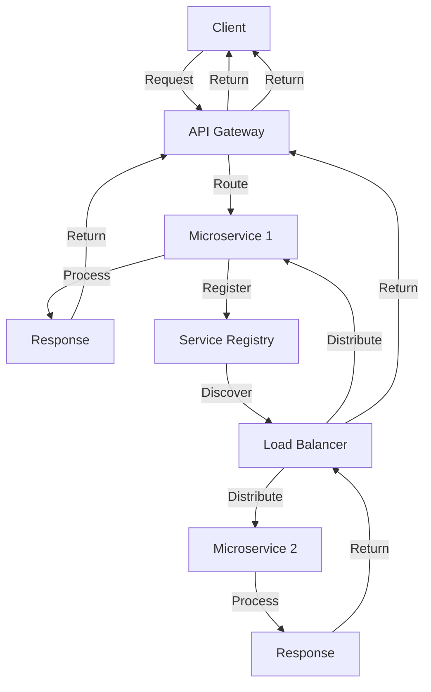

## Introduction
**Microservices Architecture** is an architectural style that structures an application as a collection of small, independent services. Each service is designed to perform a specific business capability and can be developed, tested, and deployed independently. This approach allows for greater flexibility, scalability, and resilience compared to traditional monolithic architectures. In real-world scenarios, microservices architecture is used by companies like Netflix, Amazon, and Uber to build complex, scalable systems.

> **Note:** Microservices architecture is not a silver bullet and requires careful consideration of the trade-offs involved. It's essential to weigh the benefits against the added complexity and potential challenges.

## Core Concepts
- **Service**: A self-contained unit of functionality that provides a specific business capability.
- **API Gateway**: An entry point for clients to access the microservices, responsible for routing requests to the appropriate service.
- **Service Registry**: A registry that keeps track of the available services and their instances.
- **Load Balancer**: A component that distributes incoming traffic across multiple instances of a service.

> **Warning:** Microservices architecture can lead to increased complexity, and it's crucial to have a well-designed service registry and load balancing strategy to ensure scalability and availability.

## How It Works Internally
Here's a step-by-step overview of how microservices architecture works internally:
1. A client sends a request to the API Gateway.
2. The API Gateway routes the request to the appropriate service.
3. The service processes the request and returns a response to the API Gateway.
4. The API Gateway sends the response back to the client.
5. The service registry keeps track of the available services and their instances.
6. The load balancer distributes incoming traffic across multiple instances of a service.

> **Tip:** Use a **Service Mesh** like Istio or Linkerd to manage service discovery, load balancing, and traffic management in a microservices architecture.

## Code Examples
### Example 1: Basic Microservice using Node.js and Express
```javascript
// microservice.js
const express = require('express');
const app = express();

app.get('/users', (req, res) => {
  // Simulate a database query
  const users = [
    { id: 1, name: 'John Doe' },
    { id: 2, name: 'Jane Doe' },
  ];
  res.json(users);
});

app.listen(3000, () => {
  console.log('Microservice listening on port 3000');
});
```
This example demonstrates a basic microservice using Node.js and Express. The service listens on port 3000 and responds to GET requests to the `/users` endpoint.

### Example 2: Real-world Microservice using Spring Boot and Java
```java
// UserService.java
@RestController
@RequestMapping("/users")
public class UserService {
  @GetMapping
  public List<User> getUsers() {
    // Simulate a database query
    List<User> users = new ArrayList<>();
    users.add(new User(1, "John Doe"));
    users.add(new User(2, "Jane Doe"));
    return users;
  }
}

// User.java
public class User {
  private int id;
  private String name;

  public User(int id, String name) {
    this.id = id;
    this.name = name;
  }

  public int getId() {
    return id;
  }

  public String getName() {
    return name;
  }
}
```
This example demonstrates a real-world microservice using Spring Boot and Java. The service listens on port 8080 and responds to GET requests to the `/users` endpoint.

### Example 3: Advanced Microservice using Docker and Kubernetes
```bash
# Dockerfile
FROM node:14

WORKDIR /app

COPY package*.json ./

RUN npm install

COPY . .

RUN npm run build

EXPOSE 3000

CMD [ "node", "index.js" ]
```
This example demonstrates an advanced microservice using Docker and Kubernetes. The service is packaged in a Docker container and deployed to a Kubernetes cluster.

## Visual Diagram

This diagram illustrates the flow of a request through a microservices architecture. The client sends a request to the API Gateway, which routes the request to the appropriate microservice. The microservice processes the request and returns a response to the API Gateway, which returns the response to the client. The service registry and load balancer are also involved in the process.

> **Interview:** Can you describe the role of an API Gateway in a microservices architecture? How does it handle requests and responses?

## Comparison
| Approach | Time Complexity | Space Complexity | Pros | Cons | Best For |
| --- | --- | --- | --- | --- | --- |
| Monolithic Architecture | O(1) | O(1) | Simple, easy to develop and deploy | Limited scalability, tight coupling | Small, simple applications |
| Microservices Architecture | O(n) | O(n) | Scalable, flexible, loose coupling | Complex, difficult to manage | Large, complex applications |
| Service-Oriented Architecture (SOA) | O(n) | O(n) | Scalable, flexible, loose coupling | Complex, difficult to manage | Large, complex applications |
| Event-Driven Architecture (EDA) | O(n) | O(n) | Scalable, flexible, loose coupling | Complex, difficult to manage | Real-time, event-driven applications |

## Real-world Use Cases
1. **Netflix**: Netflix uses a microservices architecture to provide a scalable and flexible platform for its users. Each microservice is responsible for a specific functionality, such as user authentication, content recommendation, and video streaming.
2. **Amazon**: Amazon uses a microservices architecture to provide a scalable and flexible platform for its e-commerce platform. Each microservice is responsible for a specific functionality, such as product search, order processing, and payment processing.
3. **Uber**: Uber uses a microservices architecture to provide a scalable and flexible platform for its ride-hailing service. Each microservice is responsible for a specific functionality, such as user authentication, ride matching, and payment processing.

## Common Pitfalls
1. **Tight Coupling**: Microservices should be designed to be loosely coupled, but tight coupling can occur if the services are not designed correctly.
2. **Complexity**: Microservices architecture can be complex, and it's essential to manage the complexity by using tools and techniques such as service discovery, load balancing, and monitoring.
3. **Scalability**: Microservices architecture can be scalable, but it's essential to design the services to scale correctly by using techniques such as load balancing and auto-scaling.
4. **Security**: Microservices architecture can be secure, but it's essential to design the services to be secure by using techniques such as encryption, authentication, and authorization.

> **Warning:** Microservices architecture can lead to increased complexity, and it's crucial to have a well-designed architecture to avoid common pitfalls.

## Interview Tips
1. **What is the role of an API Gateway in a microservices architecture?**: The API Gateway is responsible for routing requests to the appropriate microservice and handling responses.
2. **How do you manage complexity in a microservices architecture?**: Complexity can be managed by using tools and techniques such as service discovery, load balancing, and monitoring.
3. **What is the difference between a monolithic architecture and a microservices architecture?**: A monolithic architecture is a single, self-contained unit, while a microservices architecture is a collection of small, independent services.

> **Tip:** Use a **Service Mesh** like Istio or Linkerd to manage service discovery, load balancing, and traffic management in a microservices architecture.

## Key Takeaways
* Microservices architecture is a collection of small, independent services that provide a specific business capability.
* Each microservice should be designed to be loosely coupled and scalable.
* The API Gateway is responsible for routing requests to the appropriate microservice and handling responses.
* Service discovery, load balancing, and monitoring are essential tools for managing complexity in a microservices architecture.
* Microservices architecture can be secure, but it's essential to design the services to be secure by using techniques such as encryption, authentication, and authorization.
* The time complexity of a microservices architecture is O(n), and the space complexity is O(n).
* Microservices architecture is best for large, complex applications that require scalability and flexibility.