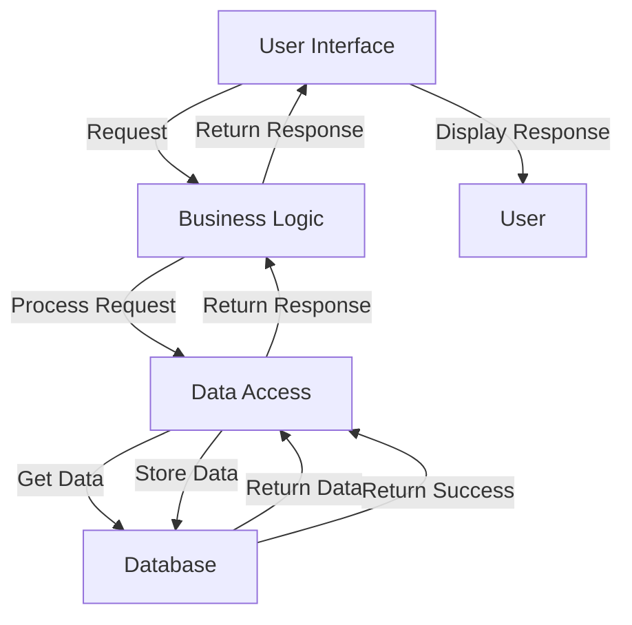

## Introduction
A **monolithic architecture** is a software design pattern where all components of an application are built into a single, self-contained unit. This means that the entire application, including the user interface, business logic, and data storage, is contained within a single codebase. Monolithic architectures are often used in small to medium-sized applications, where the complexity of the system is relatively low. However, as the system grows, a monolithic architecture can become increasingly difficult to maintain and scale. In this section, we will explore the concept of monolithic architecture, its benefits and drawbacks, and why it is still widely used in many industries.

## Core Concepts
A monolithic architecture typically consists of three main components:
- **Presentation Layer**: This is the user interface of the application, responsible for handling user input and displaying data to the user.
- **Business Logic Layer**: This layer contains the core logic of the application, including the rules and processes that govern how the application operates.
- **Data Access Layer**: This layer is responsible for interacting with the database, retrieving and storing data as needed.

> **Note:** In a monolithic architecture, these components are tightly coupled, meaning that changes to one component can have a ripple effect throughout the entire system.

## How It Works Internally
When a user interacts with a monolithic application, the following steps occur:
1. The user's request is received by the presentation layer, which then passes the request to the business logic layer.
2. The business logic layer processes the request, using data from the data access layer as needed.
3. The business logic layer then sends the response back to the presentation layer, which formats the response and returns it to the user.
4. The data access layer interacts with the database, retrieving and storing data as needed.

```java
// Example of a simple monolithic architecture in Java
public class MonolithicApp {
    public static void main(String[] args) {
        // Presentation Layer
        UserInterface ui = new UserInterface();
        ui.displayMenu();

        // Business Logic Layer
        BusinessLogic bl = new BusinessLogic();
        bl.processRequest(ui.getUserInput());

        // Data Access Layer
        DataAccess da = new DataAccess();
        da.storeData(bl.getData());
    }
}

class UserInterface {
    public void displayMenu() {
        // Display menu to user
    }

    public String getUserInput() {
        // Get user input
        return "";
    }
}

class BusinessLogic {
    public void processRequest(String input) {
        // Process user input
    }

    public String getData() {
        // Get data from data access layer
        return "";
    }
}

class DataAccess {
    public void storeData(String data) {
        // Store data in database
    }
}
```

## Code Examples
Here are three examples of monolithic architectures in different programming languages:
### Example 1: Basic Monolithic Architecture in Python
```python
# monolithic_app.py
class MonolithicApp:
    def __init__(self):
        self.ui = UserInterface()
        self.bl = BusinessLogic()
        self.da = DataAccess()

    def run(self):
        self.ui.display_menu()
        user_input = self.ui.get_user_input()
        self.bl.process_request(user_input)
        self.da.store_data(self.bl.get_data())

class UserInterface:
    def display_menu(self):
        print("Menu:")
        print("1. Option 1")
        print("2. Option 2")

    def get_user_input(self):
        return input("Enter your choice: ")

class BusinessLogic:
    def process_request(self, input):
        # Process user input
        pass

    def get_data(self):
        # Get data from data access layer
        return ""

class DataAccess:
    def store_data(self, data):
        # Store data in database
        pass

app = MonolithicApp()
app.run()
```

### Example 2: Real-World Monolithic Architecture in JavaScript
```javascript
// monolithic_app.js
class MonolithicApp {
    constructor() {
        this.ui = new UserInterface();
        this.bl = new BusinessLogic();
        this.da = new DataAccess();
    }

    run() {
        this.ui.displayMenu();
        const userInput = this.ui.getUserInput();
        this.bl.processRequest(userInput);
        this.da.storeData(this.bl.getData());
    }
}

class UserInterface {
    displayMenu() {
        console.log("Menu:");
        console.log("1. Option 1");
        console.log("2. Option 2");
    }

    getUserInput() {
        return prompt("Enter your choice: ");
    }
}

class BusinessLogic {
    processRequest(input) {
        // Process user input
    }

    getData() {
        // Get data from data access layer
        return "";
    }
}

class DataAccess {
    storeData(data) {
        // Store data in database
    }
}

const app = new MonolithicApp();
app.run();
```

### Example 3: Advanced Monolithic Architecture in C++
```cpp
// monolithic_app.cpp
#include <iostream>

class MonolithicApp {
public:
    MonolithicApp() : ui(new UserInterface()), bl(new BusinessLogic()), da(new DataAccess()) {}

    void run() {
        ui->displayMenu();
        std::string userInput = ui->getUserInput();
        bl->processRequest(userInput);
        da->storeData(bl->getData());
    }

private:
    UserInterface* ui;
    BusinessLogic* bl;
    DataAccess* da;
};

class UserInterface {
public:
    void displayMenu() {
        std::cout << "Menu:" << std::endl;
        std::cout << "1. Option 1" << std::endl;
        std::cout << "2. Option 2" << std::endl;
    }

    std::string getUserInput() {
        std::string input;
        std::cout << "Enter your choice: ";
        std::cin >> input;
        return input;
    }
};

class BusinessLogic {
public:
    void processRequest(std::string input) {
        // Process user input
    }

    std::string getData() {
        // Get data from data access layer
        return "";
    }
};

class DataAccess {
public:
    void storeData(std::string data) {
        // Store data in database
    }
};

int main() {
    MonolithicApp app;
    app.run();
    return 0;
}
```

## Visual Diagram

> **Note:** This diagram illustrates the flow of a monolithic architecture, from the user interface to the database and back.

## Comparison
| Approach | Time Complexity | Space Complexity | Pros | Cons | Best For |
|----------|----------------|-----------------|------|------|----------|
| Monolithic | O(1) | O(1) | Simple, easy to develop and maintain | Limited scalability, tight coupling | Small to medium-sized applications |
| Microservices | O(n) | O(n) | Highly scalable, loose coupling | Complex, difficult to develop and maintain | Large-scale applications, enterprise systems |
| Service-Oriented | O(n) | O(n) | Highly scalable, loose coupling | Complex, difficult to develop and maintain | Large-scale applications, enterprise systems |
| Event-Driven | O(n) | O(n) | Highly scalable, loose coupling | Complex, difficult to develop and maintain | Real-time systems, event-driven applications |

> **Tip:** When choosing an architecture, consider the size and complexity of the application, as well as the scalability and maintainability requirements.

## Real-world Use Cases
1. **Facebook**: Facebook's early architecture was monolithic, with a single codebase for the entire application. However, as the company grew, they switched to a microservices architecture to improve scalability.
2. **Amazon**: Amazon's early architecture was also monolithic, but they later switched to a service-oriented architecture to improve scalability and reliability.
3. **Netflix**: Netflix's architecture is a combination of monolithic and microservices, with a core monolithic application and several microservices for specific features.

> **Warning:** A monolithic architecture can become increasingly difficult to maintain and scale as the system grows, leading to technical debt and decreased productivity.

## Common Pitfalls
1. **Tight Coupling**: Monolithic architectures can lead to tight coupling between components, making it difficult to change one component without affecting others.
2. **Limited Scalability**: Monolithic architectures can be difficult to scale, as the entire application must be scaled together.
3. **Technical Debt**: Monolithic architectures can lead to technical debt, as the codebase becomes increasingly complex and difficult to maintain.
4. **Inflexibility**: Monolithic architectures can be inflexible, making it difficult to adopt new technologies or change the application's architecture.

> **Interview:** When asked about monolithic architectures, be sure to discuss the pros and cons, as well as the potential pitfalls and limitations.

## Interview Tips
1. **Define Monolithic Architecture**: Be able to define a monolithic architecture and explain its characteristics.
2. **Discuss Pros and Cons**: Be able to discuss the pros and cons of a monolithic architecture, including its limitations and potential pitfalls.
3. **Explain Scalability**: Be able to explain how a monolithic architecture can be scaled, and the potential challenges and limitations.
4. **Compare to Other Architectures**: Be able to compare a monolithic architecture to other architectures, such as microservices or service-oriented architectures.

> **Tip:** When discussing monolithic architectures, be sure to emphasize the importance of scalability, maintainability, and flexibility.

## Key Takeaways
* A monolithic architecture is a software design pattern where all components of an application are built into a single, self-contained unit.
* Monolithic architectures are simple and easy to develop and maintain, but can be limited in scalability and flexibility.
* Monolithic architectures can lead to tight coupling, technical debt, and inflexibility.
* Microservices and service-oriented architectures can offer improved scalability and flexibility, but can be more complex and difficult to develop and maintain.
* When choosing an architecture, consider the size and complexity of the application, as well as the scalability and maintainability requirements.
* Monolithic architectures can be suitable for small to medium-sized applications, but may not be suitable for large-scale applications or enterprise systems.
* A monolithic architecture can be scaled, but it can be challenging and may require significant changes to the application's codebase.
* It is essential to consider the trade-offs between different architectures and choose the one that best fits the needs of the application and the organization.