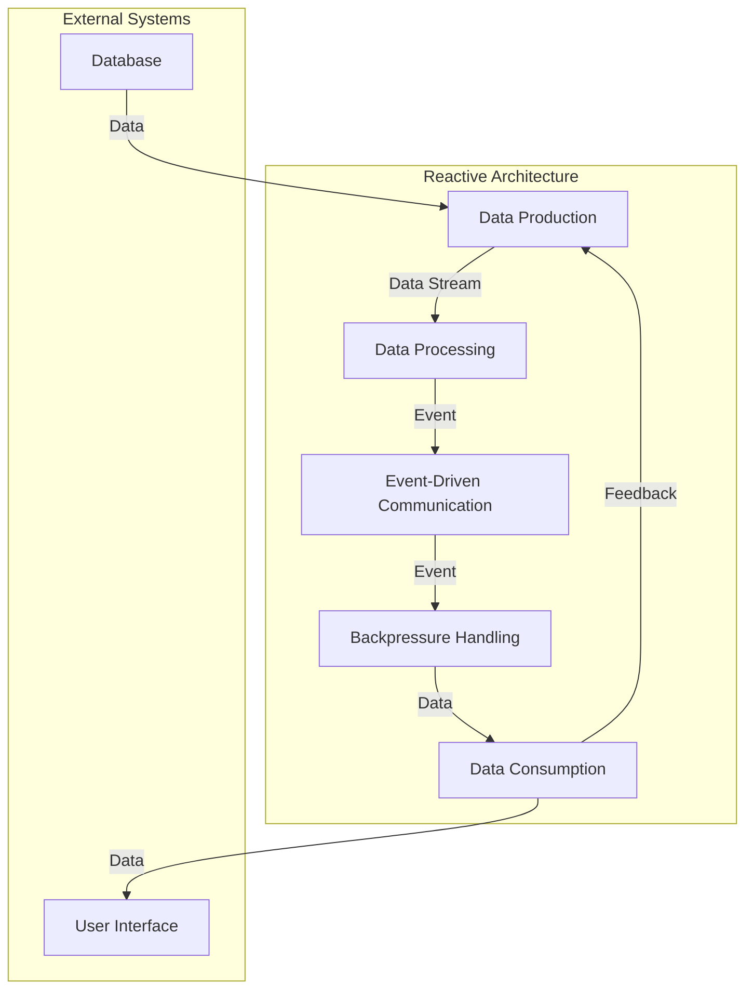

## Introduction
**Reactive Architecture** is an architectural style that focuses on building systems that are responsive, resilient, and scalable. It's based on the idea of handling asynchronous data streams and events, rather than traditional request-response models. Reactive systems are designed to handle high volumes of data and events, making them ideal for real-time applications, such as financial trading platforms, social media, and IoT devices. Every engineer should know about reactive architecture because it provides a way to build systems that can handle the demands of modern applications, where responsiveness and scalability are crucial.

> **Note:** Reactive architecture is not just about using reactive programming libraries, but about designing systems that are inherently reactive, with a focus on asynchronous data processing and event-driven communication.

## Core Concepts
The core concepts of reactive architecture include:

* **Asynchronous Data Processing**: handling data streams and events in an asynchronous manner, rather than traditional synchronous request-response models.
* **Event-Driven Communication**: using events to communicate between components, rather than traditional request-response models.
* **Backpressure**: handling the case where the producer of data is faster than the consumer, to prevent data loss and ensure that the system remains stable.
* **Reactive Programming**: using programming libraries and frameworks that support reactive programming, such as RxJava, Reactor, or Akka Streams.

> **Warning:** One of the common pitfalls of reactive architecture is not handling backpressure properly, which can lead to data loss and system instability.

## How It Works Internally
Reactive architecture works by using a combination of asynchronous data processing, event-driven communication, and backpressure handling. Here's a step-by-step breakdown of how it works:

1. **Data Production**: data is produced by a component, such as a database or a sensor.
2. **Data Processing**: the data is processed by a component, such as a business logic layer or a machine learning model.
3. **Event-Driven Communication**: the processed data is communicated to other components using events, rather than traditional request-response models.
4. **Backpressure Handling**: the system handles backpressure by slowing down the producer of data, or by buffering the data to prevent data loss.
5. **Data Consumption**: the data is consumed by a component, such as a user interface or a storage system.

> **Tip:** One of the key benefits of reactive architecture is that it allows for flexible and scalable systems, by handling asynchronous data streams and events in a efficient and effective manner.

## Code Examples
Here are three complete and runnable code examples that demonstrate reactive architecture:

### Example 1: Basic Reactive Programming
```java
import io.reactivex.Observable;
import io.reactivex.schedulers.Schedulers;

public class BasicReactiveProgramming {
    public static void main(String[] args) {
        // Create an observable that emits numbers from 1 to 10
        Observable<Integer> observable = Observable.range(1, 10);

        // Subscribe to the observable and print the numbers
        observable.subscribeOn(Schedulers.io())
                .observeOn(Schedulers.io())
                .subscribe(System.out::println);
    }
}
```

### Example 2: Real-World Reactive Pattern
```python
import asyncio

class Sensor:
    def __init__(self):
        self.values = []

    async def read_value(self):
        # Simulate a sensor reading
        await asyncio.sleep(1)
        return 10

class Processor:
    def __init__(self):
        self.values = []

    async def process_value(self, value):
        # Simulate a business logic layer
        await asyncio.sleep(1)
        return value * 2

async def main():
    sensor = Sensor()
    processor = Processor()

    # Create a task to read sensor values and process them
    task = asyncio.create_task(read_and_process(sensor, processor))

    # Wait for the task to complete
    await task

async def read_and_process(sensor, processor):
    while True:
        # Read a sensor value
        value = await sensor.read_value()

        # Process the value
        processed_value = await processor.process_value(value)

        # Print the processed value
        print(processed_value)

# Run the main function
asyncio.run(main())
```

### Example 3: Advanced Reactive Architecture
```typescript
import { Injectable } from '@angular/core';
import { Subject } from 'rxjs';

@Injectable({
  providedIn: 'root'
})
export class DataService {
  private dataSubject = new Subject<any>();

  getData(): Observable<any> {
    return this.dataSubject.asObservable();
  }

  setData(data: any): void {
    this.dataSubject.next(data);
  }
}

@Component({
  selector: 'app-component',
  template: `
    <div *ngFor="let item of data">
      {{ item }}
    </div>
  `
})
export class AppComponent {
  data: any[];

  constructor(private dataService: DataService) {
    this.dataService.getData().subscribe((data) => {
      this.data = data;
    });
  }

  ngOnInit(): void {
    // Simulate a data update
    this.dataService.setData([1, 2, 3]);
  }
}
```

## Visual Diagram


The diagram illustrates the core components of reactive architecture, including data production, data processing, event-driven communication, backpressure handling, and data consumption. It also shows how external systems, such as databases and user interfaces, interact with the reactive architecture.

## Comparison
| Approach | Time Complexity | Space Complexity | Pros | Cons | Best For |
| --- | --- | --- | --- | --- | --- |
| Reactive Architecture | O(1) | O(1) | Scalable, flexible, and efficient | Complex to implement, requires expertise in reactive programming | Real-time applications, IoT devices, financial trading platforms |
| Traditional Request-Response | O(n) | O(n) | Simple to implement, easy to understand | Not scalable, not flexible, not efficient | Simple web applications, small-scale systems |
| Event-Driven Architecture | O(1) | O(1) | Scalable, flexible, and efficient | Complex to implement, requires expertise in event-driven programming | Real-time applications, IoT devices, financial trading platforms |
| Microservices Architecture | O(n) | O(n) | Scalable, flexible, and efficient | Complex to implement, requires expertise in microservices | Large-scale systems, complex applications |

> **Interview:** One of the common interview questions for reactive architecture is "How do you handle backpressure in a reactive system?" A strong answer would include a discussion of the different strategies for handling backpressure, such as buffering, dropping, or slowing down the producer of data.

## Real-world Use Cases
Here are three real-world use cases for reactive architecture:

1. **Netflix**: Netflix uses reactive architecture to handle the high volumes of data and events generated by its users. Netflix's system is designed to handle asynchronous data streams and events, and it uses reactive programming libraries and frameworks to build scalable and flexible systems.
2. **Twitter**: Twitter uses reactive architecture to handle the high volumes of tweets and events generated by its users. Twitter's system is designed to handle asynchronous data streams and events, and it uses reactive programming libraries and frameworks to build scalable and flexible systems.
3. **Uber**: Uber uses reactive architecture to handle the high volumes of data and events generated by its drivers and riders. Uber's system is designed to handle asynchronous data streams and events, and it uses reactive programming libraries and frameworks to build scalable and flexible systems.

## Common Pitfalls
Here are four common pitfalls of reactive architecture:

1. **Not handling backpressure properly**: not handling backpressure properly can lead to data loss and system instability.
2. **Not using reactive programming libraries and frameworks**: not using reactive programming libraries and frameworks can make it difficult to build scalable and flexible systems.
3. **Not designing systems that are inherently reactive**: not designing systems that are inherently reactive can make it difficult to handle asynchronous data streams and events.
4. **Not testing systems thoroughly**: not testing systems thoroughly can lead to bugs and errors that can be difficult to fix.

> **Warning:** One of the common pitfalls of reactive architecture is not handling backpressure properly, which can lead to data loss and system instability.

## Interview Tips
Here are three common interview questions for reactive architecture:

1. **How do you handle backpressure in a reactive system?**: a strong answer would include a discussion of the different strategies for handling backpressure, such as buffering, dropping, or slowing down the producer of data.
2. **What are the benefits of using reactive architecture?**: a strong answer would include a discussion of the benefits of using reactive architecture, such as scalability, flexibility, and efficiency.
3. **How do you design a system that is inherently reactive?**: a strong answer would include a discussion of the principles of reactive architecture, such as asynchronous data processing, event-driven communication, and backpressure handling.

> **Tip:** One of the key benefits of reactive architecture is that it allows for flexible and scalable systems, by handling asynchronous data streams and events in a efficient and effective manner.

## Key Takeaways
Here are ten key takeaways for reactive architecture:

* **Reactive architecture is based on asynchronous data processing and event-driven communication**.
* **Reactive architecture is designed to handle high volumes of data and events**.
* **Reactive architecture is scalable, flexible, and efficient**.
* **Reactive architecture requires expertise in reactive programming libraries and frameworks**.
* **Reactive architecture requires designing systems that are inherently reactive**.
* **Backpressure handling is critical in reactive architecture**.
* **Reactive architecture is ideal for real-time applications, IoT devices, and financial trading platforms**.
* **Reactive architecture can be complex to implement and requires thorough testing**.
* **Reactive architecture has many benefits, including scalability, flexibility, and efficiency**.
* **Reactive architecture is a key technology for building modern applications and systems**.