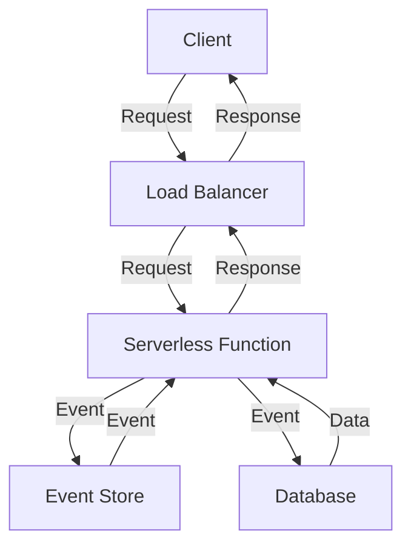

## Introduction
**Serverless architecture** is a software design pattern that allows developers to build and deploy applications without managing servers. This approach has gained popularity in recent years due to its ability to reduce costs, increase scalability, and improve developer productivity. In a serverless architecture, the cloud provider manages the infrastructure, including servers, storage, and networking, while the developer focuses on writing code and deploying it to the cloud. This approach is particularly useful for applications with variable or unpredictable traffic, as it allows for automatic scaling and cost optimization.

> **Note:** Serverless architecture is not a replacement for traditional server-based architectures, but rather a complementary approach that can be used in conjunction with other design patterns to achieve specific goals.

## Core Concepts
To understand serverless architecture, it's essential to grasp the following core concepts:
* **Functions as a Service (FaaS):** A cloud computing service that provides a platform for running small, stateless code snippets, known as functions, in response to specific events.
* **Event-driven programming:** A programming paradigm that focuses on handling events, such as changes to data or user interactions, rather than writing sequential code.
* **Stateless computing:** A design approach that ensures each function or component has no memory of previous interactions, making it easier to scale and manage.
* **Cloud provider:** A company that offers cloud computing services, such as Amazon Web Services (AWS), Microsoft Azure, or Google Cloud Platform (GCP).

## How It Works Internally
When a developer deploys a serverless application, the cloud provider creates a container or sandbox environment for each function. The container includes the necessary dependencies, libraries, and runtime environment for the function to execute. When an event occurs, the cloud provider triggers the corresponding function, which executes and returns a response. The cloud provider then handles the scaling, monitoring, and logging of the function, ensuring that it meets the required performance and security standards.

Here's a step-by-step breakdown of the process:
1. **Event trigger:** An event occurs, such as a user request or a change to a database.
2. **Function invocation:** The cloud provider triggers the corresponding function, passing any necessary parameters or data.
3. **Function execution:** The function executes, performing the required computations and returning a response.
4. **Response handling:** The cloud provider handles the response, which may involve returning data to the user, updating a database, or triggering additional events.
5. **Scaling and monitoring:** The cloud provider monitors the function's performance and scales it as needed to ensure optimal execution.

## Code Examples
Here are three complete, runnable code examples that demonstrate serverless architecture:
### Example 1: Basic AWS Lambda Function (Node.js)
```javascript
// Import the AWS SDK
const AWS = require('aws-sdk');

// Define the Lambda function handler
exports.handler = async (event) => {
  // Log the event data
  console.log(event);

  // Return a response
  return {
    statusCode: 200,
    body: JSON.stringify({ message: 'Hello, World!' }),
  };
};
```
This example demonstrates a basic AWS Lambda function written in Node.js, which logs the event data and returns a simple response.

### Example 2: Real-World AWS Lambda Function (Python)
```python
# Import the required libraries
import boto3
import json

# Define the Lambda function handler
def lambda_handler(event, context):
  # Extract the event data
  bucket_name = event['Records'][0]['s3']['bucket']['name']
  object_key = event['Records'][0]['s3']['object']['key']

  # Create an S3 client
  s3 = boto3.client('s3')

  # Download the object from S3
  response = s3.get_object(Bucket=bucket_name, Key=object_key)

  # Process the object data
  data = response['Body'].read().decode('utf-8')
  print(data)

  # Return a response
  return {
    'statusCode': 200,
    'body': json.dumps({'message': 'Object processed successfully!'})
  }
```
This example demonstrates a real-world AWS Lambda function written in Python, which processes an object uploaded to an S3 bucket and returns a response.

### Example 3: Advanced Azure Functions (C#)
```csharp
using Microsoft.AspNetCore.Http;
using Microsoft.AspNetCore.Mvc;
using Microsoft.Azure.WebJobs;
using Microsoft.Azure.WebJobs.Extensions.Http;
using Microsoft.Extensions.Logging;
using System.Threading.Tasks;

// Define the Azure Function handler
public static class HttpExample
{
  [FunctionName("HttpExample")]
  public static async Task<IActionResult> Run(
    [HttpTrigger(AuthorizationLevel.Function, "get", Route = null)] HttpRequestData req,
    ILogger logger)
  {
    // Log the request data
    logger.LogInformation($"Request received: {req.Method} {req.Url}");

    // Return a response
    return new OkObjectResult(new { message = "Hello, World!" });
  }
}
```
This example demonstrates an advanced Azure Function written in C#, which handles an HTTP request and returns a response.

## Visual Diagram

This diagram illustrates the core concept of serverless architecture, including the client, load balancer, serverless function, event store, and database.

## Comparison
Here's a comparison of different serverless architecture approaches:
| Approach | Time Complexity | Space Complexity | Pros | Cons | Best For |
| --- | --- | --- | --- | --- | --- |
| AWS Lambda | O(1) | O(1) | Scalable, cost-effective, easy to deploy | Limited control over underlying infrastructure | Real-time data processing, event-driven applications |
| Azure Functions | O(1) | O(1) | Scalable, cost-effective, easy to deploy | Limited control over underlying infrastructure | Real-time data processing, event-driven applications |
| Google Cloud Functions | O(1) | O(1) | Scalable, cost-effective, easy to deploy | Limited control over underlying infrastructure | Real-time data processing, event-driven applications |
| Serverless Framework | O(n) | O(n) | Provides a layer of abstraction, easy to deploy | Can be complex to manage, may introduce additional latency | Complex, distributed systems |

## Real-world Use Cases
Here are three real-world examples of serverless architecture in production:
1. **Netflix:** Netflix uses AWS Lambda to process user requests, such as video playback and recommendation. This allows them to scale their infrastructure dynamically and reduce costs.
2. **Uber:** Uber uses AWS Lambda to process requests, such as ride hailing and payment processing. This allows them to scale their infrastructure dynamically and reduce costs.
3. **Dropbox:** Dropbox uses AWS Lambda to process file uploads and downloads. This allows them to scale their infrastructure dynamically and reduce costs.

## Common Pitfalls
Here are four common pitfalls to avoid when implementing serverless architecture:
1. **Over-reliance on cloud provider:** Avoid relying too heavily on a single cloud provider, as this can limit flexibility and introduce vendor lock-in.
2. **Insufficient monitoring and logging:** Ensure that you have adequate monitoring and logging in place to troubleshoot issues and optimize performance.
3. **Inadequate security:** Ensure that you have adequate security measures in place to protect your serverless application, such as encryption and access controls.
4. **Inefficient function design:** Avoid designing functions that are too complex or too simple, as this can impact performance and scalability.

## Interview Tips
Here are three common interview questions related to serverless architecture, along with weak and strong answers:
1. **What is serverless architecture?**
	* Weak answer: "It's a type of cloud computing that doesn't require servers."
	* Strong answer: "Serverless architecture is a design pattern that allows developers to build and deploy applications without managing servers. It provides a scalable, cost-effective, and flexible way to develop applications, but also introduces new challenges, such as managing state and handling events."
2. **How do you optimize serverless function performance?**
	* Weak answer: "I use caching and memoization to improve performance."
	* Strong answer: "To optimize serverless function performance, I use a combination of techniques, such as caching, memoization, and parallel processing. I also ensure that my functions are designed to handle events efficiently and that I have adequate monitoring and logging in place to troubleshoot issues."
3. **What are some common use cases for serverless architecture?**
	* Weak answer: "It's used for real-time data processing and event-driven applications."
	* Strong answer: "Serverless architecture is commonly used for real-time data processing, event-driven applications, and IoT applications. It's also used for machine learning, natural language processing, and computer vision applications, as well as for building scalable and cost-effective APIs and web applications."

## Key Takeaways
Here are ten key takeaways to remember when working with serverless architecture:
* **Serverless architecture is a design pattern:** It's a way of building and deploying applications without managing servers.
* **Functions are the core unit of serverless architecture:** They are the smallest unit of code that can be executed in a serverless environment.
* **Events drive serverless architecture:** Events trigger functions, which then execute and return responses.
* **Serverless architecture is scalable and cost-effective:** It provides a flexible and cost-effective way to develop applications.
* **Serverless architecture introduces new challenges:** It requires managing state, handling events, and ensuring adequate security and monitoring.
* **AWS Lambda, Azure Functions, and Google Cloud Functions are popular serverless platforms:** They provide a range of services and features for building and deploying serverless applications.
* **Serverless architecture is not a replacement for traditional server-based architectures:** It's a complementary approach that can be used in conjunction with other design patterns to achieve specific goals.
* **Monitoring and logging are critical:** They are essential for troubleshooting issues and optimizing performance in serverless applications.
* **Security is a top priority:** It's essential to ensure that serverless applications are secure and protected against threats.
* **Serverless architecture requires a different mindset:** It requires thinking about applications in terms of events, functions, and scalability, rather than servers and infrastructure.