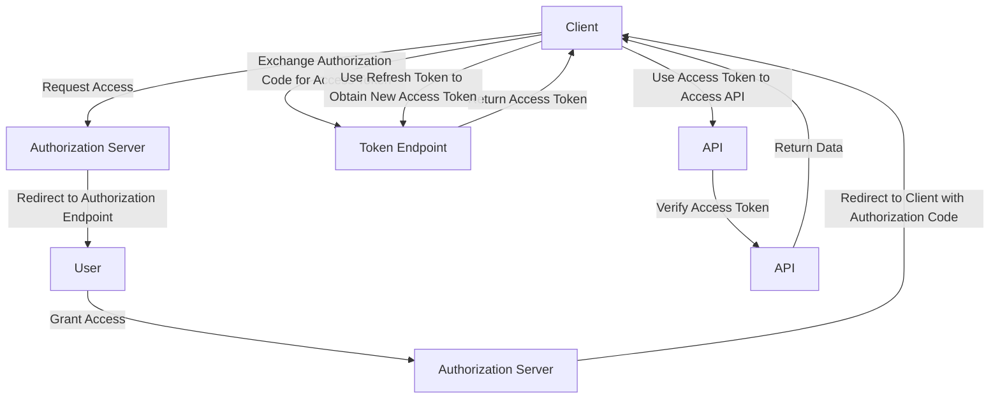

## Introduction
API authentication is a crucial aspect of **software engineering**, particularly when designing **APIs**. It ensures that only authorized clients can access and manipulate data, preventing unauthorized access and potential security breaches. In this section, we will delve into the world of API authentication, exploring the different methods, including **API Keys**, **OAuth**, and **JWT**. We will also discuss the importance of API authentication, its real-world relevance, and why every engineer needs to understand this concept.

API authentication is essential in today's digital landscape, where APIs are used to communicate between different services, systems, and applications. Without proper authentication, APIs are vulnerable to attacks, data breaches, and other security threats. As a result, understanding API authentication is crucial for any software engineer working with APIs.

> **Note:** API authentication is not a one-size-fits-all solution. Different methods are suitable for different use cases, and understanding the pros and cons of each method is essential for making informed decisions.

## Core Concepts
In this section, we will define the core concepts related to API authentication, including **API Keys**, **OAuth**, and **JWT**.

* **API Keys**: An API key is a unique identifier used to authenticate and authorize clients. It is usually a long, random string that is generated and assigned to a client.
* **OAuth**: OAuth is an authorization framework that allows clients to access resources on behalf of a user. It provides a secure way for clients to access resources without sharing passwords or other sensitive information.
* **JWT** (JSON Web Tokens): JWT is a compact, URL-safe means of representing claims to be transferred between two parties. It is digitally signed and contains a payload that can be verified and trusted.

> **Tip:** When choosing an API authentication method, consider the trade-offs between security, complexity, and performance.

## How It Works Internally
In this section, we will delve into the under-the-hood mechanics of API authentication, exploring how each method works internally.

* **API Keys**: When a client requests access to an API, it includes its API key in the request header. The server then verifies the API key by checking it against a database of valid keys. If the key is valid, the server grants access to the API.
* **OAuth**: The OAuth flow involves several steps, including registration, authorization, and token exchange. The client registers with the authorization server, which provides a client ID and client secret. The client then redirects the user to the authorization server, which prompts the user to grant access. If the user grants access, the authorization server redirects the user back to the client, which exchanges the authorization code for an access token.
* **JWT**: When a client requests access to an API, it includes its JWT in the request header. The server then verifies the JWT by checking its digital signature and payload. If the JWT is valid, the server grants access to the API.

> **Warning:** API keys and OAuth client secrets should never be hardcoded or shared publicly, as they can be used to gain unauthorized access to the API.

## Code Examples
In this section, we will provide three complete and runnable code examples, demonstrating basic, real-world, and advanced usage of API authentication.

### Example 1: Basic API Key Authentication
```python
import requests

# Set API key
api_key = "your_api_key_here"

# Set API endpoint
endpoint = "https://api.example.com/endpoint"

# Set headers
headers = {
    "Authorization": f"Bearer {api_key}"
}

# Make request
response = requests.get(endpoint, headers=headers)

# Print response
print(response.json())
```

### Example 2: OAuth Authorization Flow
```javascript
const express = require("express");
const axios = require("axios");

// Set client ID and client secret
const clientId = "your_client_id_here";
const clientSecret = "your_client_secret_here";

// Set authorization endpoint
const authorizationEndpoint = "https://authorization.example.com/authorize";

// Set token endpoint
const tokenEndpoint = "https://authorization.example.com/token";

// Set redirect URI
const redirectUri = "http://localhost:3000/callback";

// Create Express app
const app = express();

// Define authorization route
app.get("/authorize", (req, res) => {
  // Redirect user to authorization endpoint
  res.redirect(`${authorizationEndpoint}?client_id=${clientId}&redirect_uri=${redirectUri}&response_type=code`);
});

// Define callback route
app.get("/callback", (req, res) => {
  // Exchange authorization code for access token
  axios.post(tokenEndpoint, {
    grant_type: "authorization_code",
    code: req.query.code,
    redirect_uri: redirectUri,
    client_id: clientId,
    client_secret: clientSecret
  })
  .then((response) => {
    // Use access token to access API
    const accessToken = response.data.access_token;
    axios.get("https://api.example.com/endpoint", {
      headers: {
        Authorization: `Bearer ${accessToken}`
      }
    })
    .then((response) => {
      // Print response
      console.log(response.data);
    })
    .catch((error) => {
      // Handle error
      console.error(error);
    });
  })
  .catch((error) => {
    // Handle error
    console.error(error);
  });
});

// Start server
app.listen(3000, () => {
  console.log("Server started on port 3000");
});
```

### Example 3: Advanced JWT Authentication with Refresh Tokens
```java
import io.jsonwebtoken.JwtBuilder;
import io.jsonwebtoken.Jwts;
import io.jsonwebtoken.SignatureAlgorithm;

// Set secret key
String secretKey = "your_secret_key_here";

// Set token expiration time
int expirationTime = 3600; // 1 hour

// Create JWT builder
JwtBuilder builder = Jwts.builder()
  .setSubject("user")
  .setIssuedAt(new Date())
  .setExpiration(new Date(System.currentTimeMillis() + expirationTime * 1000))
  .signWith(SignatureAlgorithm.HS256, secretKey);

// Build JWT
String jwt = builder.compact();

// Set refresh token expiration time
int refreshExpirationTime = 86400; // 1 day

// Create refresh token
String refreshToken = Jwts.builder()
  .setSubject("user")
  .setIssuedAt(new Date())
  .setExpiration(new Date(System.currentTimeMillis() + refreshExpirationTime * 1000))
  .signWith(SignatureAlgorithm.HS256, secretKey)
  .compact();

// Use JWT to access API
// ...

// Use refresh token to obtain new JWT
// ...
```

## Visual Diagram

This diagram illustrates the OAuth authorization flow, including the client, authorization server, user, and API.

> **Interview:** Can you explain the difference between an API key and an OAuth access token?

## Comparison
| Approach | Time Complexity | Space Complexity | Pros | Cons | Best For |
| --- | --- | --- | --- | --- | --- |
| API Keys | O(1) | O(1) | Simple to implement, easy to use | Limited security, vulnerable to attacks | Small-scale APIs, internal services |
| OAuth | O(n) | O(n) | High security, flexible, scalable | Complex to implement, requires additional infrastructure | Large-scale APIs, external services |
| JWT | O(1) | O(1) | Compact, secure, easy to use | Limited security, vulnerable to attacks if not implemented correctly | Small-scale APIs, internal services |

## Real-world Use Cases
API authentication is used in many real-world scenarios, including:

* **Google APIs**: Google uses OAuth to authenticate and authorize clients accessing its APIs.
* **Facebook APIs**: Facebook uses OAuth to authenticate and authorize clients accessing its APIs.
* **AWS APIs**: AWS uses API keys and OAuth to authenticate and authorize clients accessing its APIs.

> **Tip:** When implementing API authentication, consider using a combination of methods to provide an additional layer of security.

## Common Pitfalls
When implementing API authentication, there are several common pitfalls to avoid:

* **Hardcoding API keys or client secrets**: This can lead to unauthorized access to the API.
* **Not validating access tokens**: This can lead to unauthorized access to the API.
* **Not using secure communication protocols**: This can lead to eavesdropping and tampering with data.
* **Not implementing rate limiting**: This can lead to denial-of-service attacks.

> **Warning:** API authentication is not a one-time task. It requires ongoing maintenance and monitoring to ensure security and prevent vulnerabilities.

## Interview Tips
When interviewing for a software engineering position, be prepared to answer questions related to API authentication, including:

* **What is the difference between an API key and an OAuth access token?**
* **How does OAuth work?**
* **What is JWT, and how does it work?**
* **What are some common pitfalls when implementing API authentication?**

> **Note:** Be prepared to provide examples of how you have implemented API authentication in previous projects or roles.

## Key Takeaways
Here are the key takeaways from this section on API authentication:

* **API authentication is crucial for securing APIs**: API authentication ensures that only authorized clients can access and manipulate data.
* **There are different methods for API authentication**: API keys, OAuth, and JWT are common methods used for API authentication.
* **Each method has its pros and cons**: Understanding the pros and cons of each method is essential for making informed decisions.
* **Implementation is critical**: Implementation is critical for ensuring security and preventing vulnerabilities.
* **Ongoing maintenance and monitoring are necessary**: API authentication is not a one-time task. It requires ongoing maintenance and monitoring to ensure security and prevent vulnerabilities.
* **Be prepared to answer interview questions**: Be prepared to answer questions related to API authentication, including the differences between API keys and OAuth access tokens, how OAuth works, and what JWT is.