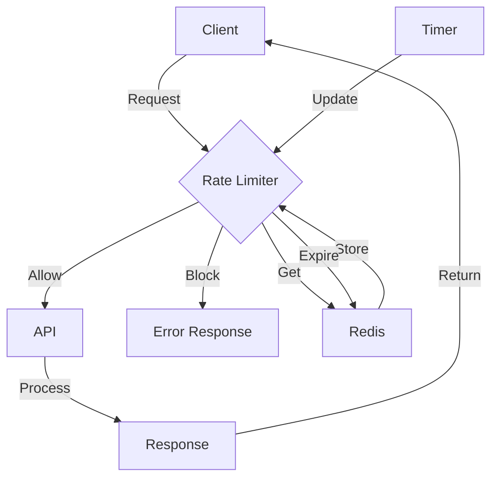

## Introduction
API rate limiting and throttling are techniques used to control the amount of traffic that an API receives. This is crucial in preventing abuse, ensuring fair usage, and maintaining the overall performance of the API. **API rate limiting** refers to the process of limiting the number of requests that can be made to an API within a certain time frame. On the other hand, **API throttling** refers to the process of intentionally slowing down or limiting the response time of an API to prevent it from being overwhelmed. In this study guide, we will delve into the world of API rate limiting and throttling, exploring the core concepts, internal mechanics, code examples, and real-world use cases.

> **Note:** API rate limiting and throttling are essential for preventing denial-of-service (DoS) attacks, which can bring down an API by flooding it with requests.

## Core Concepts
To understand API rate limiting and throttling, it's essential to grasp the following core concepts:
* **Request**: A request is a message sent from a client to a server to perform a specific action.
* **Rate limiting**: Rate limiting is the process of limiting the number of requests that can be made to an API within a certain time frame.
* **Throttling**: Throttling is the process of intentionally slowing down or limiting the response time of an API to prevent it from being overwhelmed.
* **Token bucket algorithm**: The token bucket algorithm is a widely used algorithm for rate limiting. It works by allocating a certain number of tokens to a bucket, which are then consumed by each request. If the bucket is empty, requests are blocked until more tokens are added.
* **Leaky bucket algorithm**: The leaky bucket algorithm is another popular algorithm for rate limiting. It works by allocating a certain amount of capacity to a bucket, which is then filled by each request. If the bucket is full, requests are blocked until some capacity is freed up.

> **Warning:** Implementing rate limiting and throttling incorrectly can lead to performance issues, errors, and even security vulnerabilities.

## How It Works Internally
API rate limiting and throttling work by using algorithms to track the number of requests made to an API within a certain time frame. The token bucket algorithm and leaky bucket algorithm are two popular algorithms used for rate limiting. Here's a step-by-step breakdown of how they work:
1. Initialize the token bucket or leaky bucket with a certain number of tokens or capacity.
2. For each request, check if there are enough tokens or capacity available.
3. If there are enough tokens or capacity, consume the tokens or fill the bucket and process the request.
4. If there are not enough tokens or capacity, block the request until more tokens are added or some capacity is freed up.
5. Periodically add tokens to the token bucket or free up capacity in the leaky bucket.

> **Tip:** The token bucket algorithm is more flexible than the leaky bucket algorithm, as it allows for bursts of traffic. However, it can be more complex to implement.

## Code Examples
Here are three complete and runnable code examples that demonstrate API rate limiting and throttling:
### Example 1: Basic Token Bucket Algorithm
```python
import time

class TokenBucket:
    def __init__(self, rate, capacity):
        self.rate = rate
        self.capacity = capacity
        self.tokens = capacity
        self.last_update = time.time()

    def consume(self, amount=1):
        now = time.time()
        elapsed = now - self.last_update
        self.tokens = min(self.capacity, self.tokens + elapsed * self.rate)
        self.last_update = now

        if self.tokens < amount:
            return False
        self.tokens -= amount
        return True

# Create a token bucket with a rate of 5 requests per second and a capacity of 10 requests
bucket = TokenBucket(5, 10)

# Make 20 requests to the API
for i in range(20):
    if bucket.consume():
        print(f"Request {i+1} allowed")
    else:
        print(f"Request {i+1} blocked")
    time.sleep(0.1)
```
### Example 2: Leaky Bucket Algorithm
```javascript
class LeakyBucket {
    constructor(rate, capacity) {
        this.rate = rate;
        this.capacity = capacity;
        this.current = 0;
        this.lastUpdate = Date.now();
    }

    add(amount = 1) {
        const now = Date.now();
        const elapsed = (now - this.lastUpdate) / 1000;
        this.current = Math.max(0, this.current - elapsed * this.rate);
        this.lastUpdate = now;

        if (this.current + amount > this.capacity) {
            return false;
        }
        this.current += amount;
        return true;
    }
}

// Create a leaky bucket with a rate of 5 requests per second and a capacity of 10 requests
const bucket = new LeakyBucket(5, 10);

// Make 20 requests to the API
for (let i = 0; i < 20; i++) {
    if (bucket.add()) {
        console.log(`Request ${i+1} allowed`);
    } else {
        console.log(`Request ${i+1} blocked`);
    }
    await new Promise(resolve => setTimeout(resolve, 100));
}
```
### Example 3: Advanced Rate Limiting with Redis
```go
package main

import (
    "context"
    "fmt"
    "log"
    "time"

    "github.com/go-redis/redis/v9"
)

func main() {
    ctx := context.Background()
    client := redis.NewClient(&redis.Options{
        Addr:     "localhost:6379",
        Password: "", // no password set
        DB:       0, // use default DB
    })

    // Create a Redis rate limiter with a rate of 5 requests per second and a capacity of 10 requests
    limiter := NewRedisRateLimiter(client, "my_rate_limiter", 5, 10)

    // Make 20 requests to the API
    for i := 0; i < 20; i++ {
        if limiter.Allow(ctx) {
            fmt.Printf("Request %d allowed\n", i+1)
        } else {
            fmt.Printf("Request %d blocked\n", i+1)
        }
        time.Sleep(100 * time.Millisecond)
    }
}

type RedisRateLimiter struct {
    client  *redis.Client
    key     string
    rate    int
    capacity int
}

func NewRedisRateLimiter(client *redis.Client, key string, rate int, capacity int) *RedisRateLimiter {
    return &RedisRateLimiter{
        client:  client,
        key:     key,
        rate:    rate,
        capacity: capacity,
    }
}

func (l *RedisRateLimiter) Allow(ctx context.Context) bool {
    now := time.Now().UnixNano() / 1e9
    pipeline := l.client.Pipeline()
    pipeline.Get(ctx, l.key)
    pipeline.IncrBy(ctx, l.key, 1)
    pipeline.Expire(ctx, l.key, 60) // expire in 1 minute
    cmd := pipeline.Exec(ctx)
    count, err := cmd[0].(*redis.IntCmd).Result()
    if err != nil {
        log.Fatal(err)
    }
    if count > l.capacity {
        return false
    }
    return true
}
```
## Visual Diagram

The diagram illustrates the flow of requests through the rate limiter and API. The client sends a request to the rate limiter, which checks if the request is allowed or blocked. If allowed, the request is passed to the API for processing. If blocked, an error response is returned to the client. The rate limiter uses Redis to store and retrieve the current count of requests. The timer updates the rate limiter periodically to ensure that the count is accurate.

> **Interview:** Can you explain the difference between a token bucket algorithm and a leaky bucket algorithm? How would you implement a rate limiter using Redis?

## Comparison
| Approach | Time Complexity | Space Complexity | Pros | Cons | Best For |
| --- | --- | --- | --- | --- | --- |
| Token Bucket Algorithm | O(1) | O(1) | Flexible, allows for bursts of traffic | Complex to implement | High-traffic APIs |
| Leaky Bucket Algorithm | O(1) | O(1) | Simple to implement, efficient | Does not allow for bursts of traffic | Low-traffic APIs |
| Redis Rate Limiter | O(1) | O(1) | Scalable, distributed | Requires Redis setup and maintenance | Distributed systems |
| IP Blocking | O(1) | O(1) | Simple to implement, effective | Can block legitimate traffic | Security-critical systems |

## Real-world Use Cases
API rate limiting and throttling are used in many real-world systems, including:
* **Twitter**: Twitter uses rate limiting to prevent abuse and ensure fair usage of its API.
* **Amazon Web Services (AWS)**: AWS uses rate limiting and throttling to prevent abuse and ensure fair usage of its services.
* **Google Cloud Platform (GCP)**: GCP uses rate limiting and throttling to prevent abuse and ensure fair usage of its services.
* **Dropbox**: Dropbox uses rate limiting and throttling to prevent abuse and ensure fair usage of its API.

> **Tip:** When implementing rate limiting and throttling, it's essential to consider the trade-off between security and usability.

## Common Pitfalls
Here are some common pitfalls to avoid when implementing API rate limiting and throttling:
* **Incorrect implementation**: Implementing rate limiting and throttling incorrectly can lead to performance issues, errors, and security vulnerabilities.
* **Insufficient testing**: Insufficient testing can lead to unexpected behavior and errors.
* **Inadequate monitoring**: Inadequate monitoring can lead to undetected issues and security vulnerabilities.
* **Inconsistent configuration**: Inconsistent configuration can lead to inconsistent behavior and errors.

> **Warning:** Failing to implement rate limiting and throttling can lead to security vulnerabilities and performance issues.

## Interview Tips
Here are some common interview questions and tips for API rate limiting and throttling:
* **What is the difference between rate limiting and throttling?**: Rate limiting refers to the process of limiting the number of requests that can be made to an API within a certain time frame. Throttling refers to the process of intentionally slowing down or limiting the response time of an API to prevent it from being overwhelmed.
* **How would you implement a rate limiter using Redis?**: You can implement a rate limiter using Redis by storing the current count of requests in a Redis key and incrementing the count for each request. You can then use the Redis `EXPIRE` command to set a timeout for the key to ensure that the count is reset periodically.
* **What are some common pitfalls to avoid when implementing rate limiting and throttling?**: Some common pitfalls to avoid include incorrect implementation, insufficient testing, inadequate monitoring, and inconsistent configuration.

> **Interview:** Can you explain the trade-off between security and usability when implementing rate limiting and throttling?

## Key Takeaways
Here are some key takeaways to remember when implementing API rate limiting and throttling:
* **Rate limiting and throttling are essential for security and performance**: Rate limiting and throttling can help prevent abuse, ensure fair usage, and maintain the overall performance of an API.
* **Token bucket algorithm and leaky bucket algorithm are popular algorithms for rate limiting**: The token bucket algorithm and leaky bucket algorithm are widely used algorithms for rate limiting.
* **Redis can be used to implement a distributed rate limiter**: Redis can be used to implement a distributed rate limiter that can handle high traffic and scale horizontally.
* **Monitoring and testing are essential for ensuring correct implementation**: Monitoring and testing are essential for ensuring that rate limiting and throttling are implemented correctly and functioning as expected.
* **Inconsistent configuration can lead to inconsistent behavior and errors**: Inconsistent configuration can lead to inconsistent behavior and errors, so it's essential to ensure that configuration is consistent across all instances.
* **Rate limiting and throttling can have a trade-off between security and usability**: Rate limiting and throttling can have a trade-off between security and usability, so it's essential to consider this trade-off when implementing these techniques.