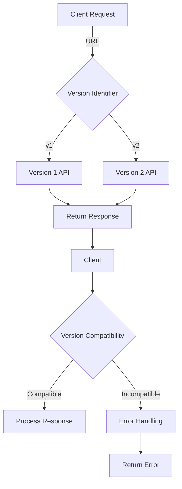

## Introduction
API versioning is a crucial aspect of software engineering, as it allows developers to manage changes to their APIs over time. **API versioning** refers to the process of assigning a unique identifier to each version of an API, enabling clients to request a specific version of the API and ensuring backwards compatibility. This is essential in real-world applications, as it prevents breaking changes from affecting existing clients. For instance, when a company like **Twitter** updates its API, it must ensure that the new version does not break existing integrations with third-party applications.

## Core Concepts
**API versioning** involves several key concepts:
- **Version identifier**: a unique string or number that identifies a specific version of the API.
- **Versioning strategy**: the approach used to manage different versions of the API, such as using URL paths, headers, or query parameters.
- **Backwards compatibility**: the ability of a new API version to support existing clients without requiring changes to their code.
- **Deprecation**: the process of marking an old API version as obsolete and scheduling its removal.

## How It Works Internally
When a client requests an API, the server must determine which version of the API to return. This is typically done using one of the following strategies:
1. **URL-based versioning**: the version identifier is included in the URL path, e.g., `/v1/users`.
2. **Header-based versioning**: the version identifier is included in a custom HTTP header, e.g., `Accept: application/vnd.example.v1+json`.
3. **Query parameter-based versioning**: the version identifier is included as a query parameter, e.g., `?version=1`.

> **Note:** The choice of versioning strategy depends on the specific use case and the requirements of the API.

## Code Examples
### Example 1: Basic URL-based Versioning (Node.js)
```javascript
const express = require('express');
const app = express();

// Define routes for version 1
app.get('/v1/users', (req, res) => {
  res.json([{ id: 1, name: 'John Doe' }]);
});

// Define routes for version 2
app.get('/v2/users', (req, res) => {
  res.json([{ id: 1, name: 'John Doe', email: 'john@example.com' }]);
});

app.listen(3000, () => {
  console.log('Server listening on port 3000');
});
```
### Example 2: Header-based Versioning (Python)
```python
from flask import Flask, request, jsonify
app = Flask(__name__)

# Define routes for version 1
@app.route('/users', methods=['GET'])
def get_users_v1():
  if request.accept_mimetypes.best_match(['application/vnd.example.v1+json', 'application/json']) == 'application/vnd.example.v1+json':
    return jsonify([{ 'id': 1, 'name': 'John Doe' }])

# Define routes for version 2
@app.route('/users', methods=['GET'])
def get_users_v2():
  if request.accept_mimetypes.best_match(['application/vnd.example.v2+json', 'application/json']) == 'application/vnd.example.v2+json':
    return jsonify([{ 'id': 1, 'name': 'John Doe', 'email': 'john@example.com' }])

if __name__ == '__main__':
  app.run(port=3000)
```
### Example 3: Query Parameter-based Versioning (Go)
```go
package main

import (
  "encoding/json"
  "fmt"
  "net/http"
)

func getUsers(w http.ResponseWriter, r *http.Request) {
  version := r.URL.Query().Get("version")
  if version == "1" {
    json.NewEncoder(w).Encode([]map[string]interface{}{{"id": 1, "name": "John Doe"}})
  } else if version == "2" {
    json.NewEncoder(w).Encode([]map[string]interface{}{{"id": 1, "name": "John Doe", "email": "john@example.com"}})
  } else {
    http.Error(w, "Invalid version", http.StatusBadRequest)
  }
}

func main() {
  http.HandleFunc("/users", getUsers)
  fmt.Println("Server listening on port 3000")
  http.ListenAndServe(":3000", nil)
}
```
> **Tip:** When implementing API versioning, it's essential to consider the trade-offs between different strategies, such as the complexity of implementation and the impact on clients.

## Visual Diagram

The diagram illustrates the process of API versioning, from the client request to the server's response. The version identifier is extracted from the URL, and the corresponding API version is returned to the client.

## Comparison
| Approach | Time Complexity | Space Complexity | Pros | Cons | Best For |
| --- | --- | --- | --- | --- | --- |
| URL-based Versioning | O(1) | O(1) | Simple to implement, easy to use | Can lead to long URLs, may not be suitable for complex APIs | Simple APIs with few versions |
| Header-based Versioning | O(1) | O(1) | Flexible, allows for custom versioning strategies | Can be complex to implement, may require additional infrastructure | Complex APIs with multiple versions |
| Query Parameter-based Versioning | O(1) | O(1) | Easy to implement, allows for flexible versioning | Can lead to query parameter pollution, may not be suitable for security-sensitive APIs | Simple APIs with few versions, non-security-sensitive use cases |

> **Warning:** When using query parameter-based versioning, be aware of the potential for query parameter pollution, where an attacker manipulates the query parameters to exploit vulnerabilities in the API.

## Real-world Use Cases
1. **Twitter API**: Twitter uses a combination of URL-based and header-based versioning to manage different versions of its API.
2. **GitHub API**: GitHub uses a header-based versioning strategy, allowing clients to specify the desired version of the API using a custom HTTP header.
3. **Amazon Web Services (AWS) API**: AWS uses a query parameter-based versioning strategy, allowing clients to specify the desired version of the API using a query parameter.

## Common Pitfalls
1. **Inconsistent versioning**: Failing to consistently apply versioning across all API endpoints can lead to confusion and errors.
2. **Insufficient backwards compatibility**: Failing to ensure backwards compatibility can break existing clients and lead to downtime.
3. **Inadequate documentation**: Failing to document API versions and changes can lead to confusion and errors among clients.
4. **Insecure versioning**: Failing to secure API versions can lead to security vulnerabilities and exploits.

> **Interview:** When asked about API versioning in an interview, be prepared to discuss the different strategies, their trade-offs, and best practices for implementation.

## Interview Tips
1. **What is API versioning, and why is it important?**: Be prepared to explain the concept of API versioning, its importance, and its benefits.
2. **How do you implement API versioning?**: Be prepared to discuss the different strategies for implementing API versioning, including URL-based, header-based, and query parameter-based versioning.
3. **What are the trade-offs between different API versioning strategies?**: Be prepared to discuss the pros and cons of each strategy, including complexity, security, and scalability.

## Key Takeaways
* API versioning is essential for managing changes to APIs over time.
* Different versioning strategies have trade-offs, including complexity, security, and scalability.
* URL-based versioning is simple to implement but can lead to long URLs.
* Header-based versioning is flexible but can be complex to implement.
* Query parameter-based versioning is easy to implement but can lead to query parameter pollution.
* Backwards compatibility is crucial for ensuring existing clients are not broken.
* Documentation is essential for ensuring clients understand API versions and changes.
* Security is critical for preventing vulnerabilities and exploits.
* Consistency is key for applying versioning across all API endpoints.