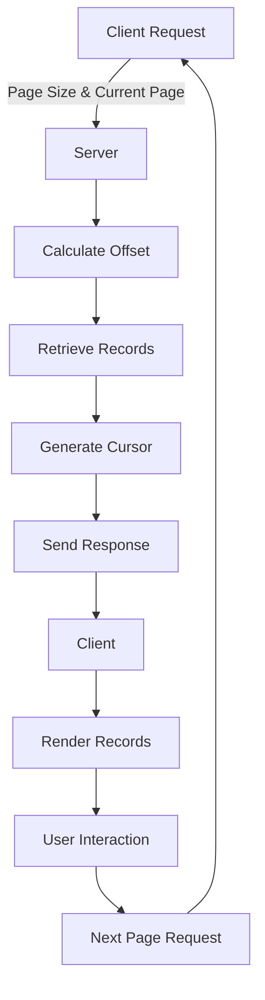

## Introduction
Pagination is a crucial concept in API design, allowing for the efficient retrieval of large datasets by dividing them into smaller, manageable chunks. This technique is essential in software engineering, particularly when dealing with vast amounts of data, as it helps reduce the load on servers, improves response times, and enhances the overall user experience. In this section, we will delve into the world of pagination, exploring its significance, real-world relevance, and the different approaches used to implement it.

> **Note:** Pagination is not limited to API design; it is also used in various other areas, such as database query optimization and web application development.

In real-world scenarios, pagination is encountered in numerous applications, including social media platforms, e-commerce websites, and search engines. For instance, when scrolling through a social media feed, the data is typically retrieved in chunks, with each chunk representing a page of content. This approach enables the efficient handling of large datasets and provides a seamless user experience.

## Core Concepts
To understand pagination, it is essential to grasp the core concepts involved. These include:

* **Offset-based pagination**: This approach involves retrieving a specific number of records from a dataset, starting from a specified offset. The offset represents the number of records to skip before retrieving the desired records.
* **Cursor-based pagination**: This method uses a cursor, which is a unique identifier for the last record retrieved in the previous page. The cursor is used to retrieve the next page of records, starting from the last record of the previous page.
* **Keyset-based pagination**: This approach involves retrieving records based on a specific key or identifier. The key is used to retrieve the next page of records, starting from the last record of the previous page.

> **Warning:** Offset-based pagination can be inefficient when dealing with large datasets, as it requires the database to skip a significant number of records before retrieving the desired data.

Mental models and analogies can help make these concepts more accessible. For example, offset-based pagination can be thought of as flipping through a book, where each page represents a chunk of data. Cursor-based pagination is similar to using a bookmark, where the bookmark represents the last record retrieved in the previous page. Keyset-based pagination can be likened to using an index in a book, where the index is used to retrieve specific records.

## How It Works Internally
To understand how pagination works internally, let's take a step-by-step look at the process:

1. **Data retrieval**: The client requests a page of data from the server.
2. **Offset calculation**: The server calculates the offset based on the page size and the current page number.
3. **Record retrieval**: The server retrieves the records from the dataset, starting from the calculated offset.
4. **Cursor generation**: The server generates a cursor for the last record retrieved in the current page.
5. **Response**: The server sends the retrieved records, along with the cursor, to the client.

> **Tip:** Using a combination of offset-based and cursor-based pagination can provide a more efficient and scalable solution.

The under-the-hood mechanics of pagination involve a deep understanding of database query optimization, indexing, and caching. For instance, using efficient indexing strategies can significantly improve the performance of pagination queries. Additionally, implementing caching mechanisms can reduce the load on the database and improve response times.

## Code Examples
Here are three complete and runnable code examples, demonstrating the different pagination approaches:

### Example 1: Offset-based pagination (basic)
```python
import mysql.connector

# Establish a database connection
cnx = mysql.connector.connect(
    user='username',
    password='password',
    host='127.0.0.1',
    database='database'
)

# Define the page size and current page number
page_size = 10
current_page = 1

# Calculate the offset
offset = (current_page - 1) * page_size

# Retrieve the records
cursor = cnx.cursor()
query = "SELECT * FROM records LIMIT %s OFFSET %s"
cursor.execute(query, (page_size, offset))

# Fetch the records
records = cursor.fetchall()

# Print the records
for record in records:
    print(record)

# Close the cursor and connection
cursor.close()
cnx.close()
```

### Example 2: Cursor-based pagination (real-world pattern)
```javascript
const express = require('express');
const app = express();
const mysql = require('mysql');

// Establish a database connection
const db = mysql.createConnection({
    host: '127.0.0.1',
    user: 'username',
    password: 'password',
    database: 'database'
});

// Define the page size and current page number
const page_size = 10;
let current_page = 1;
let cursor = null;

// Retrieve the records
app.get('/records', (req, res) => {
    // Calculate the offset
    const offset = (current_page - 1) * page_size;

    // Retrieve the records
    const query = "SELECT * FROM records WHERE id > ? LIMIT ?";
    db.query(query, [cursor, page_size], (err, results) => {
        if (err) {
            console.error(err);
            res.status(500).send({ message: 'Error retrieving records' });
        } else {
            // Fetch the records
            const records = results;

            // Update the cursor
            cursor = records[records.length - 1].id;

            // Send the response
            res.send(records);
        }
    });
});

// Start the server
app.listen(3000, () => {
    console.log('Server started on port 3000');
});
```

### Example 3: Keyset-based pagination (advanced)
```java
import java.sql.*;

public class KeysetPagination {
    public static void main(String[] args) {
        // Establish a database connection
        Connection conn = null;
        try {
            conn = DriverManager.getConnection("jdbc:mysql://127.0.0.1:3306/database", "username", "password");
        } catch (SQLException e) {
            System.err.println(e.getMessage());
        }

        // Define the page size and current page number
        int page_size = 10;
        int current_page = 1;

        // Retrieve the records
        Statement stmt = null;
        try {
            stmt = conn.createStatement();
            String query = "SELECT * FROM records WHERE id > ? ORDER BY id LIMIT ?";
            PreparedStatement pstmt = conn.prepareStatement(query);
            pstmt.setInt(1, current_page);
            pstmt.setInt(2, page_size);
            ResultSet results = pstmt.executeQuery();

            // Fetch the records
            while (results.next()) {
                System.out.println(results.getString("id"));
            }

            // Update the current page number
            current_page++;
        } catch (SQLException e) {
            System.err.println(e.getMessage());
        } finally {
            try {
                if (stmt != null) {
                    stmt.close();
                }
                if (conn != null) {
                    conn.close();
                }
            } catch (SQLException e) {
                System.err.println(e.getMessage());
            }
        }
    }
}
```

## Visual Diagram

The diagram illustrates the pagination process, from the client request to the server response. It highlights the key steps involved, including calculating the offset, retrieving records, generating a cursor, and sending the response.

## Comparison
| Approach | Time Complexity | Space Complexity | Pros | Cons | Best For |
| --- | --- | --- | --- | --- | --- |
| Offset-based | O(n) | O(1) | Simple to implement, efficient for small datasets | Inefficient for large datasets, may require additional indexing | Small to medium-sized datasets |
| Cursor-based | O(1) | O(1) | Efficient for large datasets, reduces database load | More complex to implement, requires additional cursor management | Large datasets, high-traffic applications |
| Keyset-based | O(log n) | O(1) | Efficient for large datasets, reduces database load | More complex to implement, requires additional key management | Large datasets, high-traffic applications |

> **Interview:** What are the trade-offs between offset-based, cursor-based, and keyset-based pagination? How would you choose the best approach for a given use case?

## Real-world Use Cases
1. **Instagram**: Instagram uses a combination of offset-based and cursor-based pagination to retrieve user feeds. The platform uses a cursor to retrieve the next page of posts, starting from the last post of the previous page.
2. **Google Search**: Google Search uses keyset-based pagination to retrieve search results. The search engine uses a key to retrieve the next page of results, starting from the last result of the previous page.
3. **Twitter**: Twitter uses cursor-based pagination to retrieve user timelines. The platform uses a cursor to retrieve the next page of tweets, starting from the last tweet of the previous page.

## Common Pitfalls
1. **Inefficient offset calculation**: Failing to optimize offset calculation can lead to inefficient database queries and poor performance.
2. **Incorrect cursor management**: Failing to properly manage cursors can lead to incorrect pagination and poor user experience.
3. **Insufficient indexing**: Failing to implement efficient indexing strategies can lead to poor database performance and slow pagination.
4. **Inadequate caching**: Failing to implement caching mechanisms can lead to poor performance and slow pagination.

> **Warning:** Inefficient pagination can lead to poor user experience, slow performance, and increased database load.

## Interview Tips
1. **What are the differences between offset-based, cursor-based, and keyset-based pagination?**: Be prepared to explain the trade-offs between each approach and how to choose the best one for a given use case.
2. **How would you optimize pagination for a large dataset?**: Be prepared to discuss strategies for optimizing pagination, including efficient indexing, caching, and cursor management.
3. **What are some common pitfalls to avoid when implementing pagination?**: Be prepared to discuss common mistakes, including inefficient offset calculation, incorrect cursor management, and insufficient indexing.

## Key Takeaways
* **Pagination is essential for efficient data retrieval**: Pagination helps reduce database load, improve response times, and enhance user experience.
* **Offset-based pagination is simple but inefficient**: Offset-based pagination is easy to implement but can be inefficient for large datasets.
* **Cursor-based pagination is efficient but complex**: Cursor-based pagination is efficient for large datasets but requires additional cursor management.
* **Keyset-based pagination is efficient and scalable**: Keyset-based pagination is efficient and scalable but requires additional key management.
* **Efficient indexing is crucial for pagination**: Implementing efficient indexing strategies can significantly improve pagination performance.
* **Caching mechanisms can improve pagination performance**: Implementing caching mechanisms can reduce database load and improve response times.
* **Pagination requires careful consideration of trade-offs**: Choosing the best pagination approach requires careful consideration of trade-offs, including efficiency, complexity, and scalability.