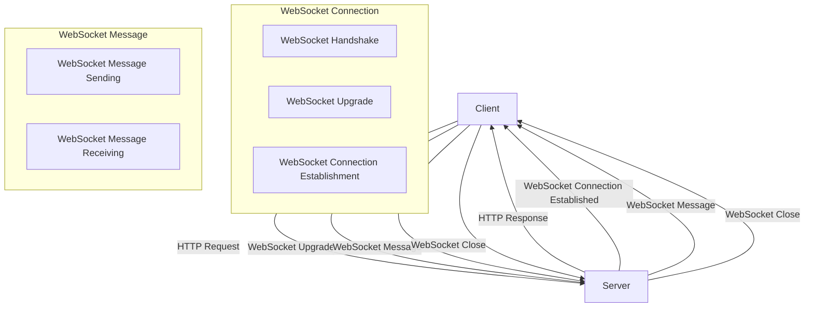

## Introduction
The **WebSocket API** is a bi-directional, real-time communication protocol that enables web browsers and servers to establish a persistent, low-latency connection. This allows for efficient, real-time communication between the client and server, making it ideal for applications such as live updates, gaming, and collaborative editing. The WebSocket API is a crucial component of modern web development, and understanding its design and implementation is essential for building scalable, real-time web applications.

> **Note:** The WebSocket API is designed to work over the web, using standard HTTP ports (80 and 443) and protocols (TCP and SSL/TLS), making it easier to deploy and maintain web applications.

In real-world scenarios, WebSocket API design is crucial for building applications that require real-time updates, such as:

* Live score updates for sports events
* Real-time collaboration tools for document editing
* Gaming platforms that require low-latency communication

Every engineer should understand the WebSocket API design principles, as it is a fundamental component of modern web development.

## Core Concepts
The WebSocket API is built on top of the following core concepts:

* **WebSocket connection**: A bi-directional, persistent connection between a client (web browser) and a server.
* **WebSocket protocol**: A protocol that defines the format and structure of WebSocket messages.
* **WebSocket endpoint**: A URL that identifies a WebSocket connection.
* **WebSocket message**: A message sent over a WebSocket connection, which can be either a text or binary message.

> **Tip:** When designing a WebSocket API, it's essential to consider the trade-offs between latency, throughput, and reliability.

Key terminology includes:

* **Handshake**: The process of establishing a WebSocket connection.
* **Upgrade**: The process of upgrading an HTTP connection to a WebSocket connection.
* **Downgrade**: The process of downgrading a WebSocket connection to an HTTP connection.

## How It Works Internally
The WebSocket API works internally as follows:

1. **Handshake**: The client sends an HTTP request to the server to establish a WebSocket connection.
2. **Upgrade**: The server responds with an HTTP response that includes a WebSocket upgrade header.
3. **Connection establishment**: The client and server establish a persistent, bi-directional connection.
4. **Message sending**: The client and server can send messages to each other over the established connection.

> **Warning:** WebSocket connections can be vulnerable to attacks such as cross-site scripting (XSS) and cross-site request forgery (CSRF). It's essential to implement proper security measures, such as authentication and authorization, to protect against these attacks.

The WebSocket protocol defines the format and structure of WebSocket messages, including:

* **OPCODE**: A 4-bit field that indicates the type of message (text, binary, ping, pong, etc.).
* **MASK**: A 1-bit field that indicates whether the message is masked or not.
* **PAYLOAD LEN**: A 7-bit, 16-bit, or 64-bit field that indicates the length of the message payload.

## Code Examples
### Example 1: Basic WebSocket Connection
```javascript
// Client-side code
const socket = new WebSocket('ws://example.com/ws');

socket.onmessage = (event) => {
  console.log(`Received message: ${event.data}`);
};

socket.onopen = () => {
  console.log('Connected to the WebSocket server');
  socket.send('Hello, server!');
};

socket.onclose = () => {
  console.log('Disconnected from the WebSocket server');
};

socket.onerror = (error) => {
  console.log(`Error occurred: ${error}`);
};
```

### Example 2: Real-world WebSocket Chat Application
```javascript
// Server-side code (using Node.js and WebSocket library)
const WebSocket = require('ws');
const wss = new WebSocket.Server({ port: 8080 });

wss.on('connection', (ws) => {
  console.log('Client connected');

  ws.on('message', (message) => {
    console.log(`Received message: ${message}`);
    ws.send(`Server response: ${message}`);
  });

  ws.on('close', () => {
    console.log('Client disconnected');
  });
});
```

### Example 3: Advanced WebSocket Connection with Authentication
```javascript
// Client-side code
const socket = new WebSocket('ws://example.com/ws', {
  headers: {
    'Authorization': 'Bearer your_token_here',
  },
});

socket.onmessage = (event) => {
  console.log(`Received message: ${event.data}`);
};

socket.onopen = () => {
  console.log('Connected to the WebSocket server');
  socket.send('Hello, server!');
};

socket.onclose = () => {
  console.log('Disconnected from the WebSocket server');
};

socket.onerror = (error) => {
  console.log(`Error occurred: ${error}`);
};
```

## Visual Diagram

The diagram illustrates the WebSocket connection establishment and message sending process.

## Comparison
| Approach | Time Complexity | Space Complexity | Pros | Cons | Best For |
| --- | --- | --- | --- | --- | --- |
| WebSocket | O(1) | O(1) | Bi-directional, real-time communication | Limited browser support, security concerns | Real-time web applications, gaming, live updates |
| HTTP Polling | O(n) | O(n) | Easy to implement, wide browser support | High latency, resource-intensive | Simple web applications, low-traffic websites |
| HTTP Long Polling | O(n) | O(n) | Low latency, easy to implement | Resource-intensive, limited browser support | Real-time web applications, low-traffic websites |
| Server-Sent Events (SSE) | O(1) | O(1) | Unidirectional, real-time communication | Limited browser support, security concerns | Real-time web applications, live updates |

## Real-world Use Cases
1. **Facebook**: Facebook uses WebSockets to provide real-time updates to its users, such as live notifications and chat messages.
2. **Google**: Google uses WebSockets to provide real-time search results and suggestions to its users.
3. **Slack**: Slack uses WebSockets to provide real-time communication and collaboration tools to its users.

## Common Pitfalls
1. **Insecure WebSocket connections**: Failing to use secure WebSocket connections (wss://) can expose sensitive data to attackers.
2. **Insufficient error handling**: Failing to handle errors properly can lead to unexpected behavior and crashes.
3. **Inadequate authentication and authorization**: Failing to implement proper authentication and authorization can lead to unauthorized access to sensitive data.
4. **Inefficient message handling**: Failing to handle messages efficiently can lead to performance issues and crashes.

> **Interview:** Can you explain the difference between WebSocket and HTTP Polling? How would you implement a secure WebSocket connection?

## Interview Tips
1. **Understand the WebSocket protocol**: Be familiar with the WebSocket protocol, including the handshake, upgrade, and connection establishment process.
2. **Know the differences between WebSocket and other technologies**: Understand the differences between WebSocket, HTTP Polling, and Server-Sent Events (SSE).
3. **Be prepared to discuss security concerns**: Be prepared to discuss security concerns, such as authentication and authorization, and how to implement secure WebSocket connections.

## Key Takeaways
* **WebSocket API**: A bi-directional, real-time communication protocol that enables web browsers and servers to establish a persistent, low-latency connection.
* **WebSocket connection**: A persistent, bi-directional connection between a client (web browser) and a server.
* **WebSocket protocol**: A protocol that defines the format and structure of WebSocket messages.
* **WebSocket endpoint**: A URL that identifies a WebSocket connection.
* **WebSocket message**: A message sent over a WebSocket connection, which can be either a text or binary message.
* **Time complexity**: O(1) for WebSocket connections, O(n) for HTTP Polling and HTTP Long Polling.
* **Space complexity**: O(1) for WebSocket connections, O(n) for HTTP Polling and HTTP Long Polling.