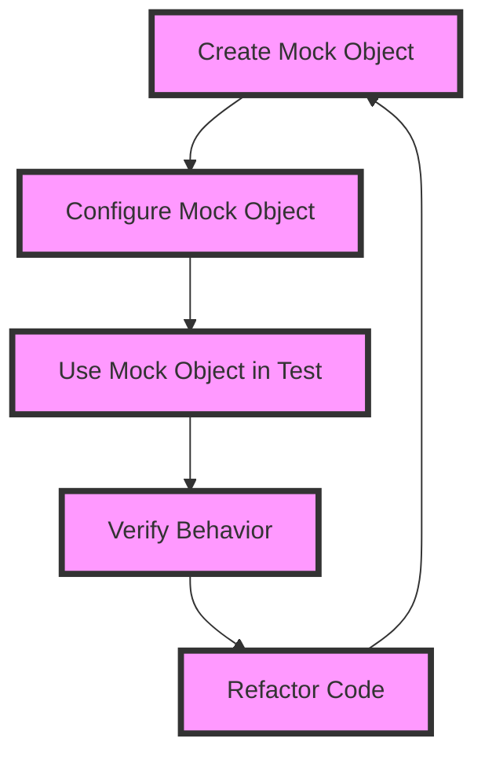

## Introduction
Mocking, stubbing, and spying are essential testing strategies used in software development to isolate dependencies and ensure that individual components of a system work as expected. These techniques enable developers to write unit tests that are fast, reliable, and independent of external systems. In this section, we will explore the importance of mocking, stubbing, and spying, their real-world relevance, and why every engineer needs to understand these concepts.

## Core Concepts
- **Mocking**: Creating a mock object that mimics the behavior of a real object, allowing you to test how your code interacts with that object.
- **Stubbing**: Creating a stub object that returns a predefined value when called, enabling you to test how your code handles different scenarios.
- **Spying**: Creating a spy object that tracks the interactions with a real object, allowing you to verify that your code is calling the object correctly.

> **Note:** Understanding the differences between mocking, stubbing, and spying is crucial to writing effective unit tests. Mocking is used to isolate dependencies, stubbing is used to control the behavior of dependencies, and spying is used to verify interactions with dependencies.

## How It Works Internally
When you create a mock object, you are essentially creating a new object that has the same interface as the real object. This mock object can be configured to behave in a specific way, such as returning a certain value or throwing an exception. When you use a mock object in your test, you are isolating the dependency on the real object, allowing you to test your code in isolation.

Here is a step-by-step breakdown of how mocking works internally:

1. **Create a mock object**: You create a new object that has the same interface as the real object.
2. **Configure the mock object**: You configure the mock object to behave in a specific way, such as returning a certain value or throwing an exception.
3. **Use the mock object in your test**: You use the mock object in your test, replacing the real object with the mock object.
4. **Verify the behavior**: You verify that your code behaves as expected, using the mock object to isolate the dependency on the real object.

> **Warning:** Overusing mocking can lead to brittle tests that break when the underlying implementation changes. It's essential to strike a balance between mocking and testing the real implementation.

## Code Examples
### Example 1: Basic Mocking
```java
// Import the necessary libraries
import org.junit.Test;
import org.junit.runner.RunWith;
import org.mockito.InjectMocks;
import org.mockito.Mock;
import org.mockito.junit.MockitoJUnitRunner;

// Define the class under test
public class UserService {
    private final UserRepository userRepository;

    public UserService(UserRepository userRepository) {
        this.userRepository = userRepository;
    }

    public boolean isValidUser(String username) {
        return userRepository.isValidUser(username);
    }
}

// Define the test class
@RunWith(MockitoJUnitRunner.class)
public class UserServiceTest {
    @Mock
    private UserRepository userRepository;

    @InjectMocks
    private UserService userService;

    @Test
    public void testIsValidUser() {
        // Configure the mock object
        when(userRepository.isValidUser("johnDoe")).thenReturn(true);

        // Use the mock object in the test
        boolean isValid = userService.isValidUser("johnDoe");

        // Verify the behavior
        assertTrue(isValid);
    }
}
```
### Example 2: Stubbing
```python
# Import the necessary libraries
import unittest
from unittest.mock import MagicMock

# Define the class under test
class PaymentGateway:
    def __init__(self, payment_processor):
        self.payment_processor = payment_processor

    def process_payment(self, amount):
        return self.payment_processor.process_payment(amount)

# Define the test class
class TestPaymentGateway(unittest.TestCase):
    def test_process_payment(self):
        # Create a stub object
        payment_processor = MagicMock()
        payment_processor.process_payment.return_value = True

        # Use the stub object in the test
        payment_gateway = PaymentGateway(payment_processor)
        result = payment_gateway.process_payment(100)

        # Verify the behavior
        self.assertTrue(result)
```
### Example 3: Spying
```javascript
// Import the necessary libraries
const sinon = require('sinon');
const assert = require('assert');

// Define the class under test
class Logger {
    log(message) {
        console.log(message);
    }
}

// Define the test class
describe('Logger', () => {
    it('should log the message', () => {
        // Create a spy object
        const logSpy = sinon.spy(console, 'log');

        // Use the spy object in the test
        const logger = new Logger();
        logger.log('Hello, World!');

        // Verify the behavior
        assert(logSpy.calledWith('Hello, World!'));
    });
});
```
## Visual Diagram

The diagram illustrates the process of creating a mock object, configuring it, using it in a test, verifying the behavior, and refactoring the code.

## Comparison
| Approach | Time Complexity | Space Complexity | Pros | Cons | Best For |
| --- | --- | --- | --- | --- | --- |
| Mocking | O(1) | O(1) | Isolates dependencies, fast tests | Can be overused, brittle tests | Unit tests, integration tests |
| Stubbing | O(1) | O(1) | Controls behavior, fast tests | Can be overused, brittle tests | Unit tests, integration tests |
| Spying | O(1) | O(1) | Verifies interactions, fast tests | Can be overused, brittle tests | Unit tests, integration tests |
| Real Implementation | O(n) | O(n) | Tests the real implementation | Slow tests, external dependencies | End-to-end tests, system tests |

> **Tip:** Choose the right approach based on the testing scenario. Mocking and stubbing are suitable for unit tests and integration tests, while spying is suitable for verifying interactions. Real implementation testing is suitable for end-to-end tests and system tests.

## Real-world Use Cases
1. **Netflix**: Uses mocking and stubbing to test their microservices architecture, ensuring that each service works independently and correctly.
2. **Amazon**: Uses spying to verify interactions between their services, ensuring that the correct data is being passed between them.
3. **Google**: Uses a combination of mocking, stubbing, and spying to test their complex systems, ensuring that they work correctly and efficiently.

## Common Pitfalls
1. **Overusing Mocking**: Mocking can lead to brittle tests that break when the underlying implementation changes. Use mocking judiciously and only when necessary.
2. **Not Verifying Behavior**: Failing to verify the behavior of the mock object can lead to false positives. Always verify that the mock object is behaving as expected.
3. **Not Refactoring Code**: Failing to refactor code after testing can lead to technical debt. Refactor code regularly to ensure that it remains maintainable and efficient.
4. **Not Using Spying Correctly**: Spying can be used incorrectly, leading to false positives or negatives. Use spying correctly to verify interactions between objects.

> **Interview:** Can you explain the difference between mocking, stubbing, and spying? How would you use each approach in a testing scenario?

## Interview Tips
1. **Mocking**: Be prepared to explain how mocking works and how it can be used to isolate dependencies.
2. **Stubbing**: Be prepared to explain how stubbing works and how it can be used to control behavior.
3. **Spying**: Be prepared to explain how spying works and how it can be used to verify interactions.

> **Warning:** Be careful not to confuse mocking, stubbing, and spying. Each approach has its own strengths and weaknesses, and using them correctly is crucial to writing effective tests.

## Key Takeaways
* Mocking, stubbing, and spying are essential testing strategies used in software development.
* Mocking isolates dependencies, stubbing controls behavior, and spying verifies interactions.
* Use mocking and stubbing for unit tests and integration tests, and spying for verifying interactions.
* Refactor code regularly to ensure that it remains maintainable and efficient.
* Use the right approach based on the testing scenario.
* Be prepared to explain the differences between mocking, stubbing, and spying in an interview.
* Use mocking, stubbing, and spying correctly to write effective tests.