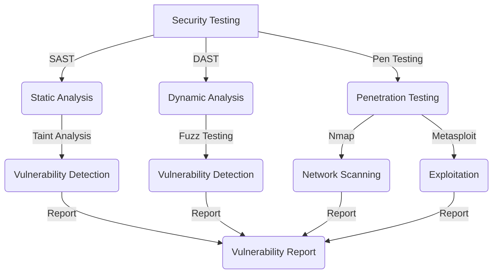

## Introduction
Security testing is a critical aspect of software development, ensuring that applications and systems are secure and protected against various threats. With the increasing number of cyberattacks and data breaches, security testing has become a top priority for organizations. In this section, we will delve into the world of security testing, exploring its importance, types, and methodologies. **Security testing** is a process of identifying vulnerabilities and weaknesses in a system, and it is essential for every engineer to understand its significance. > **Note:** Security testing is not just about finding bugs, but also about identifying potential entry points for attackers.

## Core Concepts
To understand security testing, it's essential to grasp the core concepts and terminology. **SAST (Static Application Security Testing)** is a type of security testing that analyzes source code to identify vulnerabilities. **DAST (Dynamic Application Security Testing)**, on the other hand, tests a running application to identify vulnerabilities. **Penetration testing**, also known as **pen testing**, is a type of security testing that simulates a real-world attack on a system to identify vulnerabilities. > **Tip:** SAST is typically faster and more cost-effective than DAST, but DAST provides more accurate results.

## How It Works Internally
Let's dive deeper into the internal mechanics of security testing. SAST tools analyze source code, using techniques such as **taint analysis** and **control flow analysis**, to identify potential vulnerabilities. DAST tools, on the other hand, use **fuzz testing** and **input validation** to identify vulnerabilities in a running application. Penetration testing involves a combination of automated and manual testing, using tools such as **Nmap** and **Metasploit**, to simulate a real-world attack. > **Warning:** Penetration testing can be invasive, and it's essential to obtain permission before conducting such tests.

## Code Examples
Here are three complete and runnable code examples to demonstrate security testing:
### Example 1: Basic SAST using Java
```java
// Import necessary libraries
import java.io.File;
import java.io.FileNotFoundException;
import java.util.Scanner;

public class SASTExample {
    public static void main(String[] args) {
        // Read source code from a file
        File file = new File("source_code.java");
        try {
            Scanner scanner = new Scanner(file);
            // Analyze source code using taint analysis
            while (scanner.hasNextLine()) {
                String line = scanner.nextLine();
                // Check for potential vulnerabilities
                if (line.contains("System.out.println")) {
                    System.out.println("Potential vulnerability found!");
                }
            }
            scanner.close();
        } catch (FileNotFoundException e) {
            System.out.println("File not found!");
        }
    }
}
```
### Example 2: DAST using Python
```python
# Import necessary libraries
import requests

def dast_example(url):
    # Send a GET request to the URL
    response = requests.get(url)
    # Check for potential vulnerabilities
    if response.status_code == 200:
        print("Potential vulnerability found!")
    else:
        print("No vulnerability found!")

# Test the function
dast_example("http://example.com")
```
### Example 3: Penetration Testing using Python
```python
# Import necessary libraries
import nmap

def pen_testing_example(ip_address):
    # Create an Nmap object
    nm = nmap.PortScanner()
    # Scan the IP address for open ports
    nm.scan(ip_address, '1-1024')
    # Check for potential vulnerabilities
    for host in nm.all_hosts():
        print("Host: %s" % host)
        for proto in nm[host].all_protocols():
            print("Protocol: %s" % proto)
            lport = nm[host][proto].keys()
            sorted(lport)
            for port in lport:
                print("Port: %s State: %s" % (port, nm[host][proto][port]['state']))

# Test the function
pen_testing_example("192.168.1.1")
```
> **Interview:** Can you explain the difference between SAST and DAST? A strong answer would discuss the advantages and disadvantages of each approach, including the trade-offs between speed, cost, and accuracy.

## Visual Diagram

This diagram illustrates the different types of security testing, including SAST, DAST, and penetration testing. It also shows the various techniques used in each approach, such as taint analysis, fuzz testing, and network scanning.

## Comparison
| Approach | Time Complexity | Space Complexity | Pros | Cons | Best For |
| --- | --- | --- | --- | --- | --- |
| SAST | O(n) | O(n) | Fast, cost-effective | May not detect all vulnerabilities | Small to medium-sized projects |
| DAST | O(n^2) | O(n^2) | Accurate, detects runtime vulnerabilities | Slow, expensive | Large, complex projects |
| Penetration Testing | O(n^3) | O(n^3) | Simulates real-world attacks, detects complex vulnerabilities | Invasive, time-consuming | Critical infrastructure, high-security projects |
> **Note:** The time and space complexities listed are approximate and may vary depending on the specific implementation.

## Real-world Use Cases
1. **Google**: Uses SAST and DAST to secure its cloud infrastructure and applications.
2. **Microsoft**: Employs penetration testing to identify vulnerabilities in its products and services.
3. **Amazon**: Utilizes a combination of SAST, DAST, and penetration testing to secure its e-commerce platform and cloud services.
> **Tip:** Real-world use cases can provide valuable insights into the effectiveness of different security testing approaches.

## Common Pitfalls
1. **Insufficient testing**: Failing to test for all possible vulnerabilities can lead to security breaches.
2. **Inadequate reporting**: Not providing detailed reports of vulnerabilities and weaknesses can hinder remediation efforts.
3. **Lack of automation**: Not automating security testing can lead to human error and decreased efficiency.
4. **Inadequate training**: Not providing adequate training to security testers can result in ineffective testing and missed vulnerabilities.
> **Warning:** Common pitfalls can have significant consequences, and it's essential to be aware of them to avoid security breaches.

## Interview Tips
1. **What is the difference between SAST and DAST?**: A weak answer might focus on the tools used, while a strong answer would discuss the approaches, advantages, and disadvantages.
2. **How do you prioritize vulnerabilities?**: A weak answer might focus on severity alone, while a strong answer would consider factors such as impact, likelihood, and business criticality.
3. **What is penetration testing, and how does it differ from SAST and DAST?**: A weak answer might confuse penetration testing with SAST or DAST, while a strong answer would explain the differences and similarities.
> **Interview:** Can you explain the concept of **taint analysis** in SAST? A strong answer would discuss the techniques used to identify potential vulnerabilities.

## Key Takeaways
* Security testing is essential for identifying vulnerabilities and weaknesses in systems and applications.
* SAST, DAST, and penetration testing are different approaches to security testing, each with its advantages and disadvantages.
* Automation is crucial for efficient and effective security testing.
* Reporting and remediation are critical steps in the security testing process.
* Training and awareness are essential for security testers to stay up-to-date with the latest threats and techniques.
* **Time complexity**: O(n) for SAST, O(n^2) for DAST, and O(n^3) for penetration testing.
* **Space complexity**: O(n) for SAST, O(n^2) for DAST, and O(n^3) for penetration testing.
> **Tip:** Remembering these key takeaways can help you stay focused on the essential aspects of security testing.