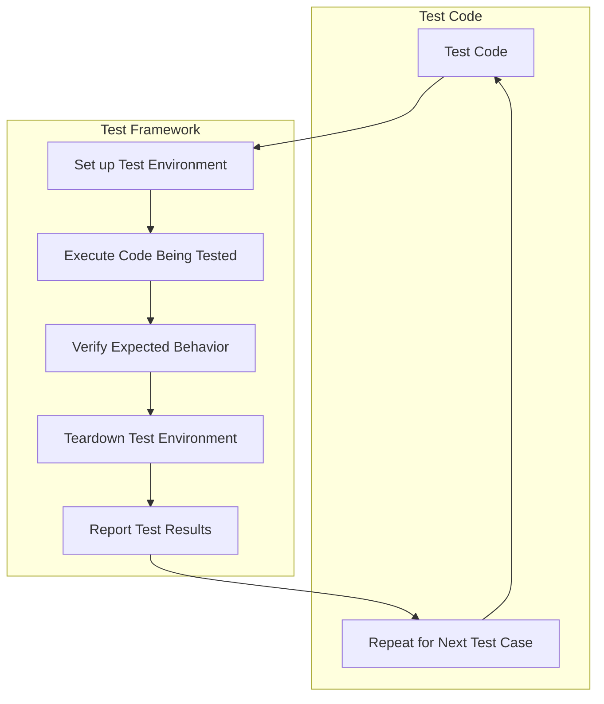

## Introduction
Unit testing is a crucial aspect of software development that ensures individual components of a system function as expected. It involves writing test code to verify the behavior of a specific unit of code, such as a function or method. **Unit testing** is essential because it allows developers to catch bugs and errors early in the development process, reducing the overall cost and time required to fix them. In real-world scenarios, unit testing is used by companies like Google, Amazon, and Microsoft to ensure the reliability and stability of their systems. For instance, Google's testing framework, Google Test, is widely used in the industry.

> **Note:** Unit testing is not the same as integration testing, which involves testing how multiple components interact with each other. Unit testing focuses on individual components, while integration testing focuses on the interactions between them.

## Core Concepts
To understand unit testing, it's essential to grasp some key concepts:
* **Unit**: A unit is a small piece of code that can be tested independently, such as a function or method.
* **Test case**: A test case is a specific scenario that is used to test a unit of code.
* **Test suite**: A test suite is a collection of test cases that are used to test a particular unit of code.
* **Assertion**: An assertion is a statement that verifies the expected behavior of a unit of code.
* **Mocking**: Mocking involves creating fake objects or dependencies to isolate the unit of code being tested.

> **Tip:** When writing unit tests, it's essential to follow the **Arrange-Act-Assert** pattern, which involves setting up the test environment, executing the code being tested, and verifying the expected behavior.

## How It Works Internally
Unit testing frameworks, such as JUnit or PyUnit, provide a set of tools and APIs that make it easy to write and run unit tests. Here's a step-by-step breakdown of how unit testing works internally:
1. **Test discovery**: The testing framework discovers the test cases and test suites that need to be executed.
2. **Test setup**: The testing framework sets up the test environment, including any necessary dependencies or mock objects.
3. **Test execution**: The testing framework executes the test code, which includes the unit of code being tested and the assertions that verify its behavior.
4. **Test teardown**: The testing framework cleans up the test environment, including any temporary files or objects that were created during the test.

> **Warning:** Unit testing can be time-consuming and labor-intensive, especially for large and complex systems. However, the benefits of unit testing far outweigh the costs, as it helps to catch bugs and errors early in the development process.

## Code Examples
Here are three complete and runnable code examples that demonstrate unit testing best practices:
### Example 1: Basic Unit Test
```python
import unittest

def add(x, y):
    return x + y

class TestAddFunction(unittest.TestCase):
    def test_add(self):
        self.assertEqual(add(1, 2), 3)
        self.assertEqual(add(-1, 1), 0)
        self.assertEqual(add(-1, -1), -2)

if __name__ == '__main__':
    unittest.main()
```
This example demonstrates a basic unit test for a simple `add` function.
### Example 2: Unit Test with Mocking
```python
import unittest
from unittest.mock import Mock

class Calculator:
    def __init__(self, dependency):
        self.dependency = dependency

    def calculate(self):
        return self.dependency.calculate()

class TestCalculator(unittest.TestCase):
    def test_calculate(self):
        dependency = Mock()
        dependency.calculate.return_value = 10
        calculator = Calculator(dependency)
        self.assertEqual(calculator.calculate(), 10)

if __name__ == '__main__':
    unittest.main()
```
This example demonstrates how to use mocking to isolate the unit of code being tested.
### Example 3: Unit Test with Error Handling
```python
import unittest

def divide(x, y):
    if y == 0:
        raise ZeroDivisionError("Cannot divide by zero")
    return x / y

class TestDivideFunction(unittest.TestCase):
    def test_divide(self):
        self.assertEqual(divide(10, 2), 5)
        self.assertEqual(divide(-10, 2), -5)
        with self.assertRaises(ZeroDivisionError):
            divide(10, 0)

if __name__ == '__main__':
    unittest.main()
```
This example demonstrates how to test error handling in a unit test.

## Visual Diagram

This diagram illustrates the workflow of a unit testing framework.

> **Note:** The time complexity of unit testing is typically O(n), where n is the number of test cases. The space complexity is typically O(1), since the test environment is set up and torn down for each test case.

## Comparison
Here is a comparison of different unit testing frameworks:
| Framework | Language | Time Complexity | Space Complexity | Pros | Cons |
| --- | --- | --- | --- | --- | --- |
| JUnit | Java | O(n) | O(1) | Easy to use, widely adopted | Limited support for concurrency |
| PyUnit | Python | O(n) | O(1) | Easy to use, flexible | Limited support for parallel testing |
| NUnit | .NET | O(n) | O(1) | Easy to use, widely adopted | Limited support for concurrent testing |
| TestNG | Java | O(n) | O(1) | Supports concurrency, flexible | Steeper learning curve |

> **Tip:** When choosing a unit testing framework, consider the language and ecosystem you are working in, as well as the specific features and support you need.

## Real-world Use Cases
Here are three real-world examples of companies that use unit testing:
* **Google**: Google uses a combination of unit testing and integration testing to ensure the reliability and stability of its systems.
* **Amazon**: Amazon uses unit testing to ensure the quality and reliability of its e-commerce platform.
* **Microsoft**: Microsoft uses unit testing to ensure the quality and reliability of its software products, including Windows and Office.

> **Interview:** Can you describe a time when you used unit testing to catch a bug or error in your code? What was the bug, and how did you use unit testing to identify and fix it?

## Common Pitfalls
Here are four common pitfalls to avoid when writing unit tests:
* **Insufficient test coverage**: Failing to test all possible scenarios and edge cases can lead to bugs and errors that are not caught by the tests.
* **Overly complex test code**: Writing test code that is too complex or convoluted can make it difficult to maintain and understand.
* **Ignoring error handling**: Failing to test error handling and edge cases can lead to bugs and errors that are not caught by the tests.
* **Not using mocking**: Failing to use mocking to isolate the unit of code being tested can lead to tests that are brittle and prone to failure.

> **Warning:** Unit testing is not a substitute for other forms of testing, such as integration testing and user acceptance testing. A comprehensive testing strategy should include multiple types of testing to ensure the quality and reliability of the system.

## Interview Tips
Here are three common interview questions related to unit testing, along with sample answers:
* **What is the difference between unit testing and integration testing?**: Unit testing focuses on individual components, while integration testing focuses on the interactions between them.
* **How do you write a good unit test?**: A good unit test should be independent, self-contained, and repeatable, and should test a specific scenario or edge case.
* **Can you describe a time when you used unit testing to catch a bug or error in your code?**: This question is an opportunity to showcase your experience and skills with unit testing, and to demonstrate how you use it to ensure the quality and reliability of your code.

> **Tip:** When answering interview questions related to unit testing, be sure to emphasize your experience and skills with unit testing, and to provide specific examples and scenarios to illustrate your points.

## Key Takeaways
Here are ten key takeaways related to unit testing:
* **Unit testing is essential for ensuring the quality and reliability of software systems**.
* **Unit testing should be done early and often, as part of the development process**.
* **Unit tests should be independent, self-contained, and repeatable**.
* **Unit tests should test specific scenarios and edge cases**.
* **Mocking can be used to isolate the unit of code being tested**.
* **Error handling should be tested thoroughly**.
* **Unit testing is not a substitute for other forms of testing**.
* **A comprehensive testing strategy should include multiple types of testing**.
* **Unit testing can help catch bugs and errors early in the development process**.
* **Unit testing can improve the overall quality and reliability of software systems**.