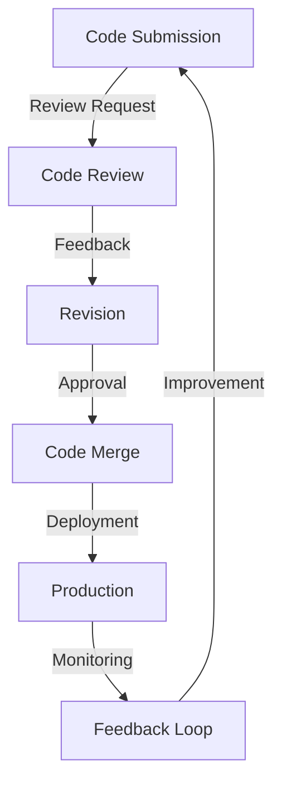

## Introduction
Code review is a crucial aspect of software development that ensures the quality, maintainability, and scalability of code. It is a process where a team of developers reviews and critiques each other's code to identify bugs, improve performance, and enforce coding standards. Code review is essential in today's fast-paced software development environment, where teams are constantly pushing out new features and updates. In this section, we will explore the importance of code review, its benefits, and why every engineer needs to know about it.
> **Note:** Code review is not just about finding bugs, but also about improving the overall quality and maintainability of the codebase.

## Core Concepts
To understand code review best practices, it's essential to grasp some core concepts:
* **Code readability**: The ease with which someone can understand the code.
* **Code maintainability**: The ease with which someone can modify or extend the code.
* **Code scalability**: The ability of the code to handle increased load or traffic.
* **Code testability**: The ease with which someone can write tests for the code.
> **Warning:** Ignoring code review best practices can lead to technical debt, which can slow down development and increase maintenance costs.

## How It Works Internally
The code review process typically involves the following steps:
1. **Code submission**: A developer submits their code for review.
2. **Code review**: A team of reviewers examines the code, looking for bugs, performance issues, and coding standard violations.
3. **Feedback**: The reviewers provide feedback to the developer, suggesting improvements and fixes.
4. **Revision**: The developer addresses the feedback and revises the code.
5. **Approval**: The revised code is approved and merged into the codebase.
> **Tip:** Use tools like GitHub, GitLab, or Bitbucket to streamline the code review process and improve collaboration.

## Code Examples
### Example 1: Basic Code Review
```python
def add_numbers(a, b):
    # This function adds two numbers
    return a + b
```
In this example, the code is simple and easy to understand. However, a reviewer might suggest adding error handling to handle cases where the inputs are not numbers.
```python
def add_numbers(a, b):
    # This function adds two numbers
    if not isinstance(a, (int, float)) or not isinstance(b, (int, float)):
        raise ValueError("Both inputs must be numbers")
    return a + b
```
### Example 2: Real-world Code Review
```java
public class User {
    private String name;
    private String email;

    public User(String name, String email) {
        this.name = name;
        this.email = email;
    }

    public String getName() {
        return name;
    }

    public String getEmail() {
        return email;
    }
}
```
In this example, the code is more complex and involves object-oriented programming. A reviewer might suggest adding validation to ensure that the name and email are not empty.
```java
public class User {
    private String name;
    private String email;

    public User(String name, String email) {
        if (name == null || name.isEmpty() || email == null || email.isEmpty()) {
            throw new IllegalArgumentException("Name and email cannot be empty");
        }
        this.name = name;
        this.email = email;
    }

    public String getName() {
        return name;
    }

    public String getEmail() {
        return email;
    }
}
```
### Example 3: Advanced Code Review
```typescript
class Calculator {
    private operations: { [key: string]: (a: number, b: number) => number };

    constructor() {
        this.operations = {
            '+': (a, b) => a + b,
            '-': (a, b) => a - b,
            '*': (a, b) => a * b,
            '/': (a, b) => a / b
        };
    }

    public calculate(a: number, b: number, operation: string): number {
        if (!this.operations[operation]) {
            throw new Error(`Unsupported operation: ${operation}`);
        }
        return this.operations[operation](a, b);
    }
}
```
In this example, the code involves a more complex data structure and error handling. A reviewer might suggest adding a test suite to ensure that the calculator works correctly for different inputs and operations.
```typescript
describe('Calculator', () => {
    it('should add two numbers', () => {
        const calculator = new Calculator();
        expect(calculator.calculate(2, 3, '+')).toBe(5);
    });

    it('should subtract two numbers', () => {
        const calculator = new Calculator();
        expect(calculator.calculate(5, 3, '-')).toBe(2);
    });

    it('should multiply two numbers', () => {
        const calculator = new Calculator();
        expect(calculator.calculate(4, 5, '*')).toBe(20);
    });

    it('should divide two numbers', () => {
        const calculator = new Calculator();
        expect(calculator.calculate(10, 2, '/')).toBe(5);
    });
});
```
> **Interview:** What are some best practices for code review? How do you ensure that the code is readable, maintainable, and scalable?

## Visual Diagram

This diagram illustrates the code review process and how it fits into the overall software development lifecycle.

## Comparison
| Approach | Time Complexity | Space Complexity | Pros | Cons | Best For |
| --- | --- | --- | --- | --- | --- |
| Manual Code Review | O(n) | O(1) | Human insight, catches complex issues | Time-consuming, prone to human error | Small to medium-sized projects |
| Automated Code Review | O(1) | O(n) | Fast, consistent, catches simple issues | Limited insight, may miss complex issues | Large-scale projects, continuous integration |
| Pair Programming | O(1) | O(1) | Real-time feedback, improved collaboration | Time-consuming, may slow down development | Agile development, team collaboration |
| Code Analysis Tools | O(n) | O(n) | Fast, consistent, catches complex issues | Limited insight, may produce false positives | Large-scale projects, code quality assurance |

## Real-world Use Cases
* **Google**: Google uses a combination of manual and automated code review to ensure the quality and security of its codebase.
* **Amazon**: Amazon uses a peer review process to ensure that its code is readable, maintainable, and scalable.
* **Microsoft**: Microsoft uses a combination of code analysis tools and manual review to ensure the quality and security of its codebase.

## Common Pitfalls
* **Insufficient testing**: Not writing enough tests to cover all scenarios and edge cases.
* **Poor code organization**: Not following a consistent coding standard or organization.
* **Inadequate error handling**: Not handling errors and exceptions properly.
* **Insecure coding practices**: Not following secure coding practices, such as validating user input.

## Interview Tips
* **What is your approach to code review?**: A good answer should include a combination of manual and automated review, as well as a focus on code quality, security, and scalability.
* **How do you ensure that your code is readable and maintainable?**: A good answer should include following a consistent coding standard, using clear and concise variable names, and writing comments and documentation.
* **What are some common pitfalls in code review?**: A good answer should include insufficient testing, poor code organization, inadequate error handling, and insecure coding practices.

## Key Takeaways
* **Code review is essential for ensuring code quality and security**.
* **A combination of manual and automated review is best**.
* **Code organization, testing, and error handling are critical**.
* **Secure coding practices are essential**.
* **Continuous integration and deployment are key to ensuring code quality and scalability**.
* **Code review should be a collaborative process that involves the entire team**.
* **Code review should be a continuous process that is integrated into the development lifecycle**.
* **Code review should focus on code quality, security, and scalability**.
* **Code review should include a combination of human insight and automated tools**.