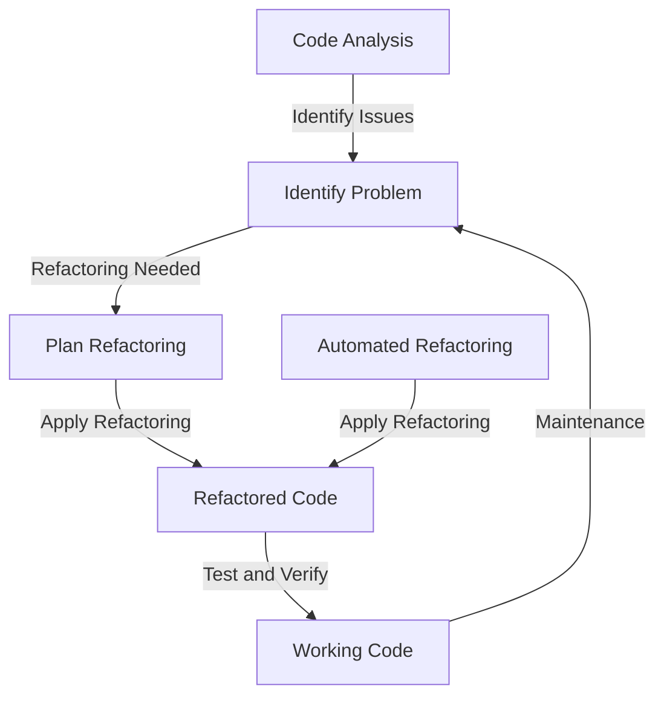

## Introduction
Refactoring techniques are essential tools for software engineers to improve the design, structure, and maintainability of their codebase. **Refactoring** is the process of modifying existing code without changing its external behavior, making it more efficient, readable, and easier to maintain. This technique is crucial in software development as it helps reduce technical debt, improves code quality, and increases developer productivity. In real-world scenarios, refactoring techniques are used to optimize code performance, simplify complex logic, and prepare the codebase for new features or requirements. Every engineer needs to know refactoring techniques to ensure their code is maintainable, scalable, and efficient.

## Core Concepts
Refactoring techniques involve a set of principles, patterns, and best practices that help software engineers improve their code. Some key concepts include:
* **Separation of Concerns (SoC)**: dividing code into separate modules or functions, each responsible for a specific task or functionality.
* **Don't Repeat Yourself (DRY)**: avoiding duplicated code by extracting common logic into reusable functions or modules.
* **Single Responsibility Principle (SRP)**: ensuring each module or function has a single, well-defined responsibility.
* **KISS (Keep it Simple, Stupid)**: favoring simple, straightforward solutions over complex ones.
> **Tip:** When refactoring code, it's essential to follow the **boy scout rule**: leave the code in a better state than you found it.

## How It Works Internally
Refactoring techniques work by applying a set of predefined steps to modify the existing code. These steps include:
1. **Identify the problem**: recognizing the need for refactoring, such as duplicated code, complex logic, or performance issues.
2. **Plan the refactoring**: deciding on the best approach, including the specific techniques and tools to use.
3. **Apply the refactoring**: modifying the code, following the planned approach and using the chosen techniques and tools.
4. **Test and verify**: ensuring the refactored code works as expected, without introducing new bugs or issues.
> **Note:** Refactoring techniques can be applied manually or using automated tools, such as IDE plugins or code analysis software.

## Code Examples
### Example 1: Basic Refactoring
```python
# Before refactoring
def calculate_total_price(prices):
    total = 0
    for price in prices:
        total += price
    return total

# After refactoring
def calculate_total_price(prices):
    return sum(prices)
```
In this example, we simplified the `calculate_total_price` function by using the built-in `sum` function, making the code more concise and efficient.

### Example 2: Extracting Common Logic
```javascript
// Before refactoring
function calculateArea(width, height) {
    return width * height;
}

function calculatePerimeter(width, height) {
    return 2 * (width + height);
}

// After refactoring
function calculateRectangleProperty(width, height, property) {
    if (property === 'area') {
        return width * height;
    } else if (property === 'perimeter') {
        return 2 * (width + height);
    }
}

function calculateArea(width, height) {
    return calculateRectangleProperty(width, height, 'area');
}

function calculatePerimeter(width, height) {
    return calculateRectangleProperty(width, height, 'perimeter');
}
```
In this example, we extracted the common logic for calculating rectangle properties into a separate function, `calculateRectangleProperty`, and then modified the `calculateArea` and `calculatePerimeter` functions to use this new function.

### Example 3: Simplifying Complex Logic
```java
// Before refactoring
public boolean isValidDate(String date) {
    String[] parts = date.split("-");
    if (parts.length !== 3) {
        return false;
    }
    int year = Integer.parseInt(parts[0]);
    int month = Integer.parseInt(parts[1]);
    int day = Integer.parseInt(parts[2]);
    if (year < 1 || year > 9999) {
        return false;
    }
    if (month < 1 || month > 12) {
        return false;
    }
    if (day < 1 || day > 31) {
        return false;
    }
    return true;
}

// After refactoring
public boolean isValidDate(String date) {
    String[] parts = date.split("-");
    if (parts.length !== 3) {
        return false;
    }
    int year = Integer.parseInt(parts[0]);
    int month = Integer.parseInt(parts[1]);
    int day = Integer.parseInt(parts[2]);
    return year >= 1 && year <= 9999 &&
           month >= 1 && month <= 12 &&
           day >= 1 && day <= 31;
}
```
In this example, we simplified the `isValidDate` function by combining the multiple `if` statements into a single, more concise conditional statement.

## Visual Diagram

This diagram illustrates the refactoring process, from identifying the problem to applying the refactoring and testing the resulting code.

## Comparison
| Approach | Time Complexity | Space Complexity | Pros | Cons | Best For |
| --- | --- | --- | --- | --- | --- |
| Manual Refactoring | O(n) | O(1) | High control, customizability | Time-consuming, error-prone | Small-scale, critical code |
| Automated Refactoring | O(n) | O(1) | Fast, efficient, consistent | Limited control, potential errors | Large-scale, routine code |
| Code Review | O(n) | O(1) | Improves code quality, catches errors | Time-consuming, subjective | Critical code, team development |
| Code Analysis | O(n) | O(1) | Identifies issues, provides insights | Limited control, potential false positives | Large-scale, complex code |

## Real-world Use Cases
* **Google**: uses automated refactoring tools to improve code quality and consistency across their massive codebase.
* **Microsoft**: employs code review and analysis to ensure high-quality code and catch errors before deployment.
* **Amazon**: utilizes manual refactoring techniques to optimize critical code paths and improve performance.
> **Interview:** When asked about refactoring techniques, be prepared to discuss your experience with different approaches, such as manual refactoring, automated refactoring, code review, and code analysis.

## Common Pitfalls
* **Over-refactoring**: refactoring code too aggressively, leading to unnecessary complexity and potential errors.
* **Under-refactoring**: not refactoring code enough, leaving it prone to issues and maintenance problems.
* **Incorrect refactoring**: applying refactoring techniques incorrectly, introducing new bugs or issues.
* **Insufficient testing**: not thoroughly testing refactored code, leading to unexpected behavior or errors.
> **Warning:** Refactoring code without proper testing and verification can lead to catastrophic consequences, such as data loss or system crashes.

## Interview Tips
* **Question 1:** What is your experience with refactoring techniques? Be prepared to discuss your experience with different approaches and provide examples.
* **Question 2:** How do you approach refactoring a large, complex codebase? Emphasize the importance of planning, testing, and verification.
* **Question 3:** What are some common pitfalls to avoid when refactoring code? Discuss over-refactoring, under-refactoring, incorrect refactoring, and insufficient testing.

## Key Takeaways
* Refactoring techniques are essential for improving code quality, maintainability, and performance.
* **Separation of Concerns**, **Don't Repeat Yourself**, and **Single Responsibility Principle** are key principles to follow when refactoring code.
* **KISS** and **boy scout rule** are important guidelines to keep in mind when refactoring code.
* Automated refactoring tools and code analysis software can aid in the refactoring process, but manual refactoring techniques are still essential for critical code.
* Time complexity and space complexity are important considerations when evaluating refactoring approaches.
* Refactoring code without proper testing and verification can lead to catastrophic consequences.
* Code review and analysis are crucial steps in the refactoring process, helping to catch errors and improve code quality.