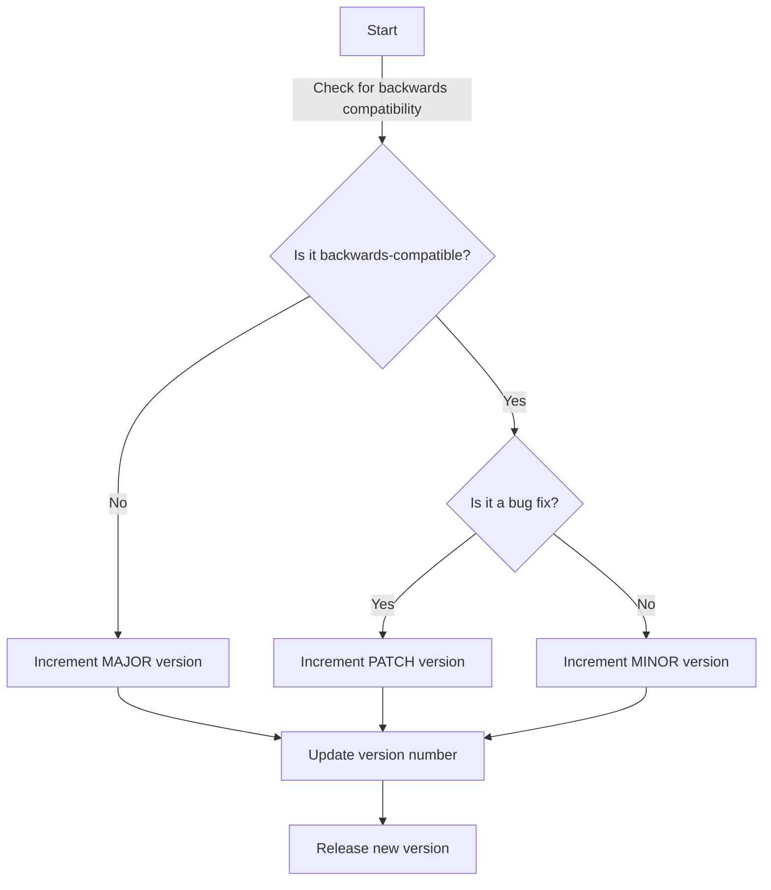

## Introduction
**Semantic Versioning (SemVer)** is a versioning scheme that helps developers manage changes to their software projects in a predictable and maintainable way. It provides a set of rules and guidelines for assigning version numbers to software releases, making it easier for developers to understand the nature of changes and dependencies between different versions. In this study guide, we will delve into the world of SemVer, exploring its core concepts, internal mechanics, and best practices for implementation.

> **Note:** SemVer is not just a versioning scheme, but a way of communicating changes and dependencies between different components of a software system. It helps developers to manage complexity and ensure that their software is maintainable, scalable, and reliable.

## Core Concepts
At its core, SemVer is based on a simple yet powerful idea: that a version number should convey meaningful information about the nature of changes made to a software project. A SemVer version number consists of three parts: **MAJOR**, **MINOR**, and **PATCH**, separated by dots (e.g., `1.2.3`). Each part has a specific meaning:

* **MAJOR**: Incremented when there are incompatible changes, such as changes to the API or breaking changes.
* **MINOR**: Incremented when new functionality is added in a backwards-compatible manner.
* **PATCH**: Incremented when backwards-compatible bug fixes are made.

> **Tip:** When in doubt, ask yourself: "Is this change backwards-compatible?" If the answer is no, it's a **MAJOR** change. If the answer is yes, but it adds new functionality, it's a **MINOR** change. If it's just a bug fix, it's a **PATCH** change.

## How It Works Internally
When a developer makes changes to a software project, they must decide which part of the version number to increment. This decision is based on the nature of the changes made. Here's a step-by-step breakdown of the process:

1. **Check for backwards compatibility**: If the changes are not backwards-compatible, increment the **MAJOR** version.
2. **Check for new functionality**: If the changes add new functionality in a backwards-compatible manner, increment the **MINOR** version.
3. **Check for bug fixes**: If the changes are backwards-compatible bug fixes, increment the **PATCH** version.

> **Warning:** Failing to follow these rules can lead to versioning chaos, making it difficult for developers to manage dependencies and understand the nature of changes.

## Code Examples
Here are three complete and runnable code examples that demonstrate the use of SemVer:

### Example 1: Basic Usage
```python
import packaging.version

# Define a version number
version = packaging.version.Version("1.2.3")

# Check if the version is compatible with another version
compatible_version = packaging.version.Version("1.2.4")
print(version < compatible_version)  # Output: True

# Increment the PATCH version
new_version = version._replace(micro=version.micro + 1)
print(new_version)  # Output: 1.2.4
```

### Example 2: Real-World Pattern
```javascript
const semver = require("semver");

// Define a version number
const version = "1.2.3";

// Check if the version is compatible with another version
const compatibleVersion = "1.2.4";
console.log(semver.lt(version, compatibleVersion));  // Output: true

// Increment the MINOR version
const newVersion = semver.inc(version, "minor");
console.log(newVersion);  // Output: 1.3.0
```

### Example 3: Advanced Usage
```java
import io.github.artsok.SemVer;

public class SemVerExample {
    public static void main(String[] args) {
        // Define a version number
        SemVer version = new SemVer("1.2.3");

        // Check if the version is compatible with another version
        SemVer compatibleVersion = new SemVer("1.2.4");
        System.out.println(version.isLessThan(compatibleVersion));  // Output: true

        // Increment the MAJOR version
        SemVer newVersion = version.nextMajor();
        System.out.println(newVersion);  // Output: 2.0.0
    }
}
```

## Visual Diagram

This diagram illustrates the decision-making process for incrementing the version number. It shows how the developer checks for backwards compatibility, new functionality, and bug fixes to determine which part of the version number to increment.

## Comparison
| Approach | Time Complexity | Space Complexity | Pros | Cons | Best For |
| --- | --- | --- | --- | --- | --- |
| SemVer | O(1) | O(1) | Easy to understand, predictable versioning | Can be rigid, may not fit all use cases | Most software projects |
| CalVer | O(1) | O(1) | Flexible, easy to implement | Can be confusing, not widely adopted | Small projects or prototypes |
| Date-based versioning | O(1) | O(1) | Simple, easy to understand | Not meaningful, can be confusing | Legacy systems or internal projects |
| Custom versioning | O(n) | O(n) | Flexible, can be tailored to specific needs | Can be complex, difficult to maintain | Complex systems or large enterprises |

## Real-world Use Cases
Here are three real-world examples of companies that use SemVer:

* **npm**: The Node.js package manager uses SemVer to manage dependencies between packages.
* **RubyGems**: The Ruby package manager uses SemVer to manage dependencies between gems.
* **GitHub**: GitHub uses SemVer to manage versions of its API and other software projects.

## Common Pitfalls
Here are four common mistakes that developers make when using SemVer:

* **Not following the rules**: Failing to increment the correct part of the version number can lead to versioning chaos.
* **Using incorrect version numbers**: Using version numbers that are not valid SemVer can cause confusion and errors.
* **Not documenting changes**: Failing to document changes made to the software can make it difficult for other developers to understand the nature of changes.
* **Not testing for backwards compatibility**: Failing to test for backwards compatibility can lead to breaking changes that affect other developers.

> **Warning:** These pitfalls can be avoided by following the rules and best practices outlined in this guide.

## Interview Tips
Here are three common interview questions related to SemVer, along with weak and strong answers:

* **What is SemVer, and how does it work?**
	+ Weak answer: "It's a versioning scheme that uses numbers to track changes."
	+ Strong answer: "SemVer is a versioning scheme that uses a combination of MAJOR, MINOR, and PATCH numbers to track changes. It provides a predictable and maintainable way to manage dependencies between software components."
* **How do you determine which part of the version number to increment?**
	+ Weak answer: "I just use my best judgment."
	+ Strong answer: "I follow the rules outlined in the SemVer specification. If the changes are not backwards-compatible, I increment the MAJOR version. If the changes add new functionality in a backwards-compatible manner, I increment the MINOR version. If the changes are backwards-compatible bug fixes, I increment the PATCH version."
* **Can you give an example of how SemVer is used in a real-world project?**
	+ Weak answer: "I'm not sure."
	+ Strong answer: "Yes, for example, the npm package manager uses SemVer to manage dependencies between packages. When a developer makes changes to a package, they must follow the SemVer rules to ensure that the version number is incremented correctly."

## Key Takeaways
Here are ten key takeaways from this guide:

* SemVer is a versioning scheme that provides a predictable and maintainable way to manage dependencies between software components.
* The version number consists of three parts: MAJOR, MINOR, and PATCH.
* The MAJOR version is incremented when there are incompatible changes.
* The MINOR version is incremented when new functionality is added in a backwards-compatible manner.
* The PATCH version is incremented when backwards-compatible bug fixes are made.
* SemVer is widely adopted and used by many companies and projects.
* Following the SemVer rules is important to avoid versioning chaos and ensure that software is maintainable and scalable.
* SemVer is not just a versioning scheme, but a way of communicating changes and dependencies between different components of a software system.
* The time complexity of SemVer is O(1), and the space complexity is O(1).
* SemVer is suitable for most software projects, but may not fit all use cases.