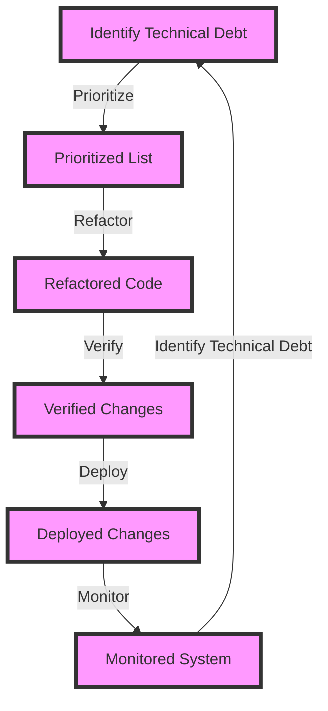

## Introduction
**Technical Debt Management** is a crucial aspect of software development that involves identifying, prioritizing, and addressing the technical issues that arise during the development process. Technical debt refers to the costs associated with implementing quick fixes or workarounds that need to be revisited later. It can include issues such as code smells, bugs, performance problems, and design flaws. Every engineer needs to understand technical debt management because it directly impacts the maintainability, scalability, and reliability of the software system. In real-world scenarios, technical debt can lead to significant delays, increased maintenance costs, and even system failures.

## Core Concepts
- **Technical Debt**: The cost of implementing quick fixes or workarounds that need to be revisited later.
- **Code Smells**: Structures in the code that, while not causing errors, can make the code harder to understand and maintain.
- **Refactoring**: The process of restructuring existing computer code without changing its external behavior.
- **Design Flaws**: Fundamental issues with the system's architecture or design that can lead to technical debt.

> **Note:** Technical debt is not inherently bad, but rather a natural consequence of the development process. The key is to manage it effectively to minimize its impact on the system.

## How It Works Internally
Technical debt management involves several steps:
1. **Identification**: Recognizing the technical debt in the system, which can be done through code reviews, testing, and monitoring.
2. **Prioritization**: Determining the severity and impact of each technical debt issue, and prioritizing them based on business value and risk.
3. **Refactoring**: Implementing changes to address the technical debt issues, which can involve refactoring code, redesigning architecture, or optimizing performance.
4. **Verification**: Verifying that the changes have addressed the technical debt issues and have not introduced new problems.

## Code Examples
### Example 1: Basic Refactoring
```python
# Before refactoring
def calculate_area(width, height):
    if width > 0 and height > 0:
        return width * height
    else:
        return 0

# After refactoring
def calculate_area(width, height):
    """Calculates the area of a rectangle."""
    if not (width > 0 and height > 0):
        raise ValueError("Width and height must be positive")
    return width * height
```
### Example 2: Real-world Pattern
```java
// Before refactoring
public class User {
    private String name;
    private String email;
    private String phoneNumber;

    public User(String name, String email, String phoneNumber) {
        this.name = name;
        this.email = email;
        this.phoneNumber = phoneNumber;
    }

    public void save() {
        // Save user data to database
    }
}

// After refactoring
public class User {
    private String name;
    private String email;
    private String phoneNumber;

    public User(String name, String email, String phoneNumber) {
        this.name = name;
        this.email = email;
        this.phoneNumber = phoneNumber;
    }

    public void save(UserRepository repository) {
        repository.save(this);
    }
}
```
### Example 3: Advanced Refactoring
```typescript
// Before refactoring
function calculateTotalPrice(products: Product[]): number {
    let totalPrice = 0;
    for (const product of products) {
        totalPrice += product.price * product.quantity;
    }
    return totalPrice;
}

// After refactoring
function calculateTotalPrice(products: Product[]): number {
    """Calculates the total price of a list of products."""
    return products.reduce((total, product) => total + product.price * product.quantity, 0);
}
```
> **Tip:** When refactoring, it's essential to follow the **Single Responsibility Principle** (SRP) and **Don't Repeat Yourself** (DRY) principle to ensure that the code is maintainable and efficient.

## Visual Diagram

The diagram illustrates the technical debt management process, from identifying technical debt to deploying and monitoring the changes.

## Comparison
| Approach | Time Complexity | Space Complexity | Pros | Cons | Best For |
| --- | --- | --- | --- | --- | --- |
| Refactoring | O(n) | O(1) | Improves code quality, reduces maintenance costs | Can be time-consuming, may introduce new bugs | Small to medium-sized projects |
| Redesign | O(n^2) | O(n) | Improves system architecture, reduces technical debt | Can be costly, may require significant changes | Large-scale projects or systems with significant technical debt |
| Code Smell Detection | O(n) | O(1) | Identifies potential issues, improves code quality | May not detect all issues, can be time-consuming | All projects, especially those with complex codebases |
| Technical Debt Management Tools | O(n) | O(1) | Automates the process, improves efficiency | May require significant investment, can be complex to use | Large-scale projects or systems with significant technical debt |

> **Warning:** Ignoring technical debt can lead to significant consequences, including system crashes, data loss, and increased maintenance costs.

## Real-world Use Cases
1. **Netflix**: Netflix has a strong focus on technical debt management, with a dedicated team that works on refactoring and improving the codebase. This has enabled the company to maintain a high level of quality and scalability in its systems.
2. **Amazon**: Amazon has a culture of continuous improvement, with teams constantly working on refactoring and optimizing their codebases. This has enabled the company to maintain a high level of innovation and efficiency in its systems.
3. **Google**: Google has a strong focus on technical debt management, with a dedicated team that works on refactoring and improving the codebase. This has enabled the company to maintain a high level of quality and scalability in its systems.

## Common Pitfalls
1. **Ignoring Technical Debt**: Ignoring technical debt can lead to significant consequences, including system crashes, data loss, and increased maintenance costs.
2. **Not Prioritizing Technical Debt**: Not prioritizing technical debt can lead to a lack of focus on the most critical issues, resulting in a lack of progress in addressing technical debt.
3. **Not Refactoring**: Not refactoring code can lead to a lack of improvement in code quality, resulting in a lack of maintainability and scalability in the system.
4. **Not Verifying Changes**: Not verifying changes can lead to the introduction of new bugs or issues, resulting in a lack of trust in the system.

> **Interview:** When asked about technical debt management, be prepared to discuss your experience with refactoring, code smell detection, and technical debt management tools. Emphasize the importance of prioritizing technical debt and verifying changes to ensure that the system remains maintainable and scalable.

## Interview Tips
1. **Be prepared to discuss your experience with technical debt management**: Be prepared to discuss your experience with refactoring, code smell detection, and technical debt management tools.
2. **Emphasize the importance of prioritizing technical debt**: Emphasize the importance of prioritizing technical debt to ensure that the most critical issues are addressed first.
3. **Discuss the benefits of technical debt management**: Discuss the benefits of technical debt management, including improved code quality, reduced maintenance costs, and increased scalability.

## Key Takeaways
* Technical debt management is essential for maintaining the quality and scalability of software systems.
* Prioritizing technical debt is crucial to ensuring that the most critical issues are addressed first.
* Refactoring and code smell detection are essential techniques for improving code quality and reducing technical debt.
* Technical debt management tools can automate the process and improve efficiency.
* Ignoring technical debt can lead to significant consequences, including system crashes, data loss, and increased maintenance costs.
* Verifying changes is essential to ensure that the system remains maintainable and scalable.
* Continuous improvement is key to maintaining a high level of quality and scalability in software systems.
* Technical debt management should be a continuous process, with regular checks and refactoring to ensure that the system remains maintainable and scalable.