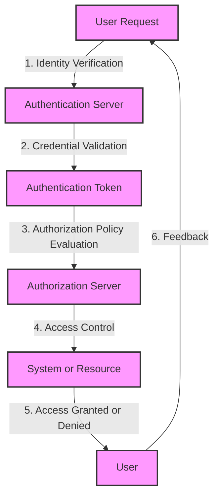

## Introduction
Authentication and Authorization are two fundamental concepts in software security engineering that often get confused or used interchangeably. However, they serve distinct purposes and are crucial for ensuring the security and integrity of a system. **Authentication** refers to the process of verifying the identity of a user, system, or entity, while **Authorization** determines what actions an authenticated entity can perform on a system or resource. In this study guide, we will delve into the core concepts, internal mechanics, and code examples to help you master the differences between Authentication and Authorization.

> **Note:** Understanding the distinction between Authentication and Authorization is essential for designing and implementing secure systems, as it directly impacts the confidentiality, integrity, and availability of data and resources.

## Core Concepts
To grasp the concepts of Authentication and Authorization, it's essential to understand the following key terms:
* **Identity**: A unique identifier for a user, system, or entity, such as a username, email, or ID number.
* **Credentials**: Information used to verify an identity, such as a password, token, or biometric data.
* **Authentication Protocol**: A set of rules and procedures for verifying an identity, such as OAuth, OpenID Connect, or Kerberos.
* **Authorization Policy**: A set of rules that define what actions an authenticated entity can perform on a system or resource, such as Role-Based Access Control (RBAC) or Attribute-Based Access Control (ABAC).

> **Tip:** When designing an authentication system, it's essential to consider the trade-off between security and usability. A more secure system may require more complex credentials or authentication protocols, but this can also lead to a poorer user experience.

## How It Works Internally
The internal mechanics of Authentication and Authorization involve a series of steps:
1. **Identity Verification**: The system verifies the identity of the user or entity through a authentication protocol.
2. **Credential Validation**: The system checks the credentials provided by the user or entity against a stored set of credentials.
3. **Authentication Token**: If the credentials are valid, the system generates an authentication token, which is used to verify the identity of the user or entity.
4. **Authorization Policy Evaluation**: The system evaluates the authorization policy to determine what actions the authenticated entity can perform on a system or resource.
5. **Access Control**: The system enforces the authorization policy by granting or denying access to the system or resource based on the evaluated policy.

> **Warning:** A common mistake in authentication systems is to store passwords in plaintext or use weak password hashing algorithms. This can lead to password compromisation and unauthorized access to the system.

## Code Examples
Here are three complete and runnable code examples to illustrate the concepts of Authentication and Authorization:
### Example 1: Basic Authentication using Python
```python
import hashlib

# Define a simple authentication function
def authenticate(username, password):
    # Define a stored set of credentials
    credentials = {
        "user1": hashlib.sha256("password1".encode()).hexdigest(),
        "user2": hashlib.sha256("password2".encode()).hexdigest()
    }
    
    # Check if the username exists
    if username in credentials:
        # Check if the password is valid
        if hashlib.sha256(password.encode()).hexdigest() == credentials[username]:
            return True
    return False

# Test the authentication function
username = "user1"
password = "password1"
if authenticate(username, password):
    print("Authentication successful")
else:
    print("Authentication failed")
```
### Example 2: Authorization using Role-Based Access Control (RBAC) in Java
```java
import java.util.*;

// Define a role-based access control system
class RBAC {
    private Map<String, List<String>> roles;

    public RBAC() {
        roles = new HashMap<>();
        roles.put("admin", Arrays.asList("create", "read", "update", "delete"));
        roles.put("user", Arrays.asList("read"));
    }

    public boolean authorize(String role, String action) {
        // Check if the role exists
        if (roles.containsKey(role)) {
            // Check if the action is allowed for the role
            if (roles.get(role).contains(action)) {
                return true;
            }
        }
        return false;
    }

    public static void main(String[] args) {
        RBAC rbac = new RBAC();
        String role = "admin";
        String action = "create";
        if (rbac.authorize(role, action)) {
            System.out.println("Authorization successful");
        } else {
            System.out.println("Authorization failed");
        }
    }
}
```
### Example 3: Advanced Authentication using OAuth 2.0 in Node.js
```javascript
const express = require("express");
const axios = require("axios");

// Define an OAuth 2.0 authentication server
const app = express();

// Define a client ID and client secret
const clientId = "client-id";
const clientSecret = "client-secret";

// Define an authorization endpoint
app.get("/authorize", (req, res) => {
    // Redirect the user to the authorization endpoint
    res.redirect(`https://example.com/authorize?client_id=${clientId}&response_type=code&redirect_uri=http://localhost:3000/callback`);
});

// Define a callback endpoint
app.get("/callback", (req, res) => {
    // Exchange the authorization code for an access token
    axios.post(`https://example.com/token`, {
        grant_type: "authorization_code",
        code: req.query.code,
        redirect_uri: "http://localhost:3000/callback",
        client_id: clientId,
        client_secret: clientSecret
    })
    .then((response) => {
        // Use the access token to authenticate the user
        const accessToken = response.data.access_token;
        // ...
    })
    .catch((error) => {
        // Handle the error
    });
});

app.listen(3000, () => {
    console.log("Server listening on port 3000");
});
```
> **Interview:** When asked about authentication and authorization in an interview, be prepared to explain the differences between the two concepts, as well as the internal mechanics and code examples.

## Visual Diagram

The diagram illustrates the internal mechanics of Authentication and Authorization, including the steps involved in verifying an identity, validating credentials, generating an authentication token, evaluating an authorization policy, and enforcing access control.

## Comparison
| Approach | Time Complexity | Space Complexity | Pros | Cons | Best For |
| --- | --- | --- | --- | --- | --- |
| Basic Authentication | O(1) | O(1) | Simple to implement, easy to use | Vulnerable to password compromisation, lacks scalability | Small-scale applications |
| Role-Based Access Control (RBAC) | O(n) | O(n) | Flexible, scalable, and easy to manage | Can be complex to implement, requires significant overhead | Large-scale applications |
| OAuth 2.0 | O(n) | O(n) | Secure, flexible, and widely adopted | Can be complex to implement, requires significant overhead | Web applications, APIs |
| OpenID Connect | O(n) | O(n) | Secure, flexible, and widely adopted | Can be complex to implement, requires significant overhead | Web applications, APIs |

> **Tip:** When choosing an authentication and authorization approach, consider the trade-off between security, scalability, and complexity.

## Real-world Use Cases
1. **Google**: Google uses a combination of Basic Authentication and OAuth 2.0 to authenticate and authorize users for its various services, such as Gmail and Google Drive.
2. **Amazon**: Amazon uses a combination of Role-Based Access Control (RBAC) and Attribute-Based Access Control (ABAC) to authorize users for its various services, such as Amazon Web Services (AWS) and Amazon Elastic Compute Cloud (EC2).
3. **Microsoft**: Microsoft uses a combination of Basic Authentication and OpenID Connect to authenticate and authorize users for its various services, such as Microsoft Azure and Microsoft Office 365.

## Common Pitfalls
1. **Password compromisation**: Storing passwords in plaintext or using weak password hashing algorithms can lead to password compromisation and unauthorized access to the system.
2. **Insufficient authorization**: Failing to evaluate an authorization policy or enforce access control can lead to unauthorized access to sensitive data or resources.
3. **Complexity**: Implementing complex authentication and authorization systems can lead to significant overhead and maintenance costs.
4. **Lack of scalability**: Failing to consider scalability when designing an authentication and authorization system can lead to performance issues and downtime.

> **Warning:** A common mistake in authentication systems is to use weak password hashing algorithms or store passwords in plaintext. This can lead to password compromisation and unauthorized access to the system.

## Interview Tips
1. **Be prepared to explain the differences between authentication and authorization**: Be able to clearly define the two concepts and explain how they work together to ensure the security and integrity of a system.
2. **Know the internal mechanics of authentication and authorization**: Be able to describe the steps involved in verifying an identity, validating credentials, generating an authentication token, evaluating an authorization policy, and enforcing access control.
3. **Be familiar with common authentication and authorization protocols**: Be able to describe the pros and cons of common protocols, such as Basic Authentication, OAuth 2.0, and OpenID Connect.

> **Interview:** When asked about authentication and authorization in an interview, be prepared to explain the differences between the two concepts, as well as the internal mechanics and code examples.

## Key Takeaways
* **Authentication** refers to the process of verifying an identity, while **Authorization** determines what actions an authenticated entity can perform on a system or resource.
* **Basic Authentication** is a simple and widely adopted authentication protocol, but it lacks scalability and is vulnerable to password compromisation.
* **Role-Based Access Control (RBAC)** is a flexible and scalable authorization approach, but it can be complex to implement and requires significant overhead.
* **OAuth 2.0** is a secure and widely adopted authentication protocol, but it can be complex to implement and requires significant overhead.
* **OpenID Connect** is a secure and widely adopted authentication protocol, but it can be complex to implement and requires significant overhead.
* **Password compromisation** is a common mistake in authentication systems, and can lead to unauthorized access to the system.
* **Insufficient authorization** is a common mistake in authorization systems, and can lead to unauthorized access to sensitive data or resources.
* **Complexity** is a common issue in authentication and authorization systems, and can lead to significant overhead and maintenance costs.
* **Lack of scalability** is a common issue in authentication and authorization systems, and can lead to performance issues and downtime.