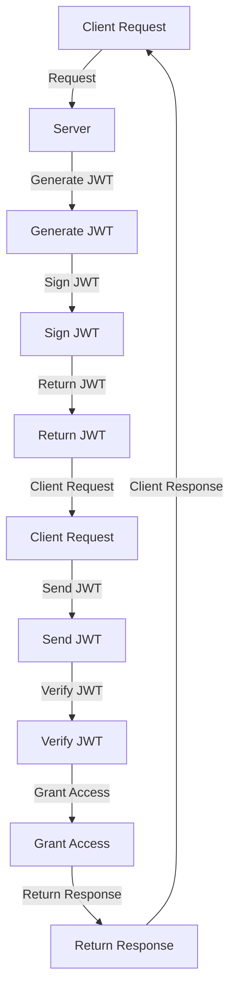

## Introduction
JSON Web Tokens (JWT) are a widely-used authentication and authorization mechanism for securing web applications. They provide a compact, URL-safe means of representing claims to be transferred between two parties. The primary purpose of JWT is to verify the identity of users and ensure that they have the necessary permissions to access protected resources. In this article, we will delve into the structure, signing algorithms, and best practices for using JWT.

> **Note:** JWT is not an encryption mechanism; it is a token-based authentication system that relies on digital signatures to verify the authenticity of the token.

## Core Concepts
To understand how JWT works, it is essential to grasp the following core concepts:
- **Header:** The header is the first part of the JWT, and it contains the algorithm used for signing the token, such as **HS256** (HMAC SHA-256) or **RS256** (RSA Signature with SHA-256).
- **Payload:** The payload is the second part of the JWT, and it contains the claims or data that the token asserts. This can include user IDs, usernames, email addresses, and other relevant information.
- **Signature:** The signature is the third part of the JWT, and it is generated by signing the header and payload with a secret key.

> **Warning:** Using a weak secret key or an insecure signing algorithm can compromise the security of your JWT-based authentication system.

## How It Works Internally
The process of generating and verifying a JWT involves the following steps:
1. The server generates a header and payload for the JWT.
2. The server signs the header and payload with a secret key using the chosen signing algorithm.
3. The server returns the JWT to the client.
4. The client sends the JWT with each request to the server.
5. The server verifies the signature of the JWT by calculating the expected signature and comparing it to the actual signature.
6. If the signatures match, the server grants access to the protected resource.

> **Tip:** Using a secure signing algorithm like **RS256** can provide better security than **HS256**, but it requires a public-private key pair and may have performance implications.

## Code Examples
### Example 1: Generating a JWT with HS256
```javascript
const jwt = require('jsonwebtoken');

// Set the secret key
const secretKey = 'my-secret-key';

// Set the payload
const payload = {
  userId: 1,
  username: 'johnDoe',
  email: 'john@example.com',
};

// Generate the JWT
const token = jwt.sign(payload, secretKey, { algorithm: 'HS256' });

console.log(token);
```

### Example 2: Verifying a JWT with RS256
```javascript
const jwt = require('jsonwebtoken');

// Set the public key
const publicKey = '-----BEGIN PUBLIC KEY-----\n' +
  'MIIBIjANBgkqhkiG9w0BAQEFAAOCAQ8AMIIBCgKCAQEAy8Dbv8prpJ/0kKhlGeJY\n' +
  'ozo2t60EG8L0561g13R29LvMR5hyvGZlGJpmn65+A4xHXInJYiPuKzrKfDNSH6h\n' +
  'jgTku4K9Gd5+L4hFdk6YdDFLjM+Z3X//Odz4JMPHxg5Lc3X7xKQVz4K3FVZp2\n' +
  '-----END PUBLIC KEY-----';

// Set the token
const token = 'your-jwt-token';

// Verify the JWT
jwt.verify(token, publicKey, { algorithms: ['RS256'] }, (err, decoded) => {
  if (err) {
    console.log(err);
  } else {
    console.log(decoded);
  }
});
```

### Example 3: Handling JWT Expiration
```javascript
const jwt = require('jsonwebtoken');

// Set the secret key
const secretKey = 'my-secret-key';

// Set the payload
const payload = {
  userId: 1,
  username: 'johnDoe',
  email: 'john@example.com',
  exp: Math.floor(Date.now() / 1000) + 60, // expires in 1 minute
};

// Generate the JWT
const token = jwt.sign(payload, secretKey, { algorithm: 'HS256' });

// Verify the JWT
jwt.verify(token, secretKey, { algorithms: ['HS256'] }, (err, decoded) => {
  if (err) {
    console.log(err);
  } else {
    console.log(decoded);
  }
});
```

## Visual Diagram

The diagram illustrates the process of generating and verifying a JWT. The client requests a protected resource, and the server generates a JWT and signs it with a secret key. The server returns the JWT to the client, which sends it with each subsequent request. The server verifies the JWT and grants access to the protected resource if the signature is valid.

## Comparison
| Algorithm | Time Complexity | Space Complexity | Pros | Cons | Best For |
| --- | --- | --- | --- | --- | --- |
| HS256 | O(1) | O(1) | Fast and efficient, widely supported | Limited security, vulnerable to brute-force attacks | Development, testing, and low-security applications |
| RS256 | O(n) | O(n) | Highly secure, resistant to brute-force attacks | Slower and more computationally intensive, requires public-private key pair | Production, high-security applications |
| ES256 | O(n) | O(n) | Highly secure, resistant to brute-force attacks | Slower and more computationally intensive, requires public-private key pair | Production, high-security applications |
| Ed25519 | O(n) | O(n) | Highly secure, resistant to brute-force attacks | Slower and more computationally intensive, requires public-private key pair | Production, high-security applications |

## Real-world Use Cases
1. **Authentication:** Google uses JWT to authenticate users and authorize access to protected resources.
2. **Authorization:** GitHub uses JWT to authorize access to protected resources, such as repositories and issues.
3. **Microservices:** Netflix uses JWT to authenticate and authorize access to microservices, ensuring secure communication between services.

## Common Pitfalls
1. **Insecure Secret Key:** Using a weak or insecure secret key can compromise the security of your JWT-based authentication system.
2. **Insecure Signing Algorithm:** Using an insecure signing algorithm, such as **HS256**, can make your JWT-based authentication system vulnerable to brute-force attacks.
3. **Insufficient Error Handling:** Failing to handle errors properly can lead to security vulnerabilities and unexpected behavior.
4. **Inadequate Token Expiration:** Failing to set an expiration time for the JWT can lead to security vulnerabilities and unexpected behavior.

> **Interview:** When asked about JWT, be sure to mention the importance of using a secure signing algorithm, such as **RS256**, and handling errors properly.

## Interview Tips
1. **What is JWT?** A weak answer might say that JWT is a type of encryption, while a strong answer would explain that JWT is a token-based authentication system that relies on digital signatures to verify the authenticity of the token.
2. **How does JWT work?** A weak answer might say that JWT works by encrypting the payload, while a strong answer would explain the process of generating and verifying a JWT, including the use of a secret key and signing algorithm.
3. **What are the benefits and drawbacks of using JWT?** A weak answer might say that JWT is always secure, while a strong answer would discuss the benefits of using JWT, such as compactness and ease of use, as well as the drawbacks, such as the potential for insecure secret keys and signing algorithms.

## Key Takeaways
* **Use a secure signing algorithm:** Choose a secure signing algorithm, such as **RS256**, to ensure the security of your JWT-based authentication system.
* **Handle errors properly:** Handle errors properly to prevent security vulnerabilities and unexpected behavior.
* **Set an expiration time:** Set an expiration time for the JWT to prevent security vulnerabilities and unexpected behavior.
* **Use a secure secret key:** Use a secure secret key to prevent brute-force attacks and ensure the security of your JWT-based authentication system.
* **Use JWT for authentication and authorization:** Use JWT for authentication and authorization to ensure secure communication between services.
* **Monitor and analyze JWT usage:** Monitor and analyze JWT usage to detect potential security vulnerabilities and improve the overall security of your system.