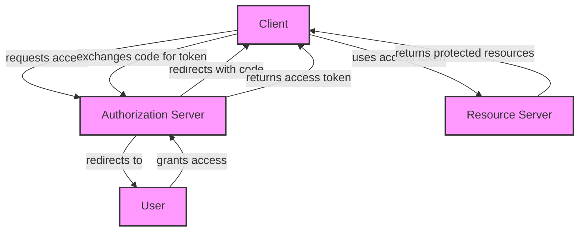

## Introduction
OAuth 2.0 is an **authorization framework** that allows applications to obtain limited access to user resources on another service provider's website, without sharing their login credentials. It's a widely adopted standard for **secure delegated access** to protected resources. OAuth 2.0 is used by many popular services, including Google, Facebook, and GitHub, to enable users to grant third-party applications access to their data. Every engineer needs to understand OAuth 2.0 because it's a crucial component of modern web and mobile applications, and **security is a top priority**.

> **Note:** OAuth 2.0 is not an authentication protocol, but rather an authorization protocol. It's designed to grant access to specific resources, not to verify the identity of the user.

## Core Concepts
OAuth 2.0 consists of several key components:
* **Resource Server**: The server that protects the resources that the client wants to access.
* **Authorization Server**: The server that authenticates the user and issues access tokens to the client.
* **Client**: The application that requests access to the protected resources.
* **Access Token**: A token that the client uses to access the protected resources.
* **Refresh Token**: A token that the client uses to obtain a new access token when the current one expires.

> **Tip:** When implementing OAuth 2.0, it's essential to understand the roles of each component and how they interact with each other.

## How It Works Internally
The OAuth 2.0 flow involves several steps:
1. The client requests access to the protected resources by redirecting the user to the authorization server.
2. The authorization server authenticates the user and prompts them to grant or deny access to the client.
3. If the user grants access, the authorization server redirects the user back to the client with an authorization code.
4. The client exchanges the authorization code for an access token by sending a request to the authorization server.
5. The client uses the access token to access the protected resources on the resource server.

> **Warning:** If the client stores the access token insecurely, an attacker may be able to obtain it and gain unauthorized access to the protected resources.

## Code Examples
### Example 1: Basic Authorization Code Flow
```python
import requests
import urllib.parse

# Client ID and secret
client_id = "your_client_id"
client_secret = "your_client_secret"

# Authorization server URL
auth_url = "https://example.com/authorize"

# Redirect URI
redirect_uri = "https://example.com/callback"

# Scope
scope = "read_write"

# State
state = "your_state"

# Authorization code flow
params = {
    "client_id": client_id,
    "redirect_uri": redirect_uri,
    "scope": scope,
    "state": state,
    "response_type": "code"
}

response = requests.get(auth_url, params=params)

# Get the authorization code from the redirect URI
code = urllib.parse.parse_qs(urllib.parse.urlparse(response.url).query)["code"][0]

# Exchange the authorization code for an access token
token_url = "https://example.com/token"
token_params = {
    "grant_type": "authorization_code",
    "code": code,
    "redirect_uri": redirect_uri,
    "client_id": client_id,
    "client_secret": client_secret
}

token_response = requests.post(token_url, params=token_params)

# Get the access token
access_token = token_response.json()["access_token"]

# Use the access token to access the protected resources
resource_url = "https://example.com/protected"
resource_response = requests.get(resource_url, headers={"Authorization": f"Bearer {access_token}"})

print(resource_response.json())
```

### Example 2: PKCE Flow
```javascript
const express = require("express");
const axios = require("axios");

const app = express();

// Client ID and secret
const clientId = "your_client_id";
const clientSecret = "your_client_secret";

// Authorization server URL
const authUrl = "https://example.com/authorize";

// Redirect URI
const redirectUri = "https://example.com/callback";

// Scope
const scope = "read_write";

// State
const state = "your_state";

// Code verifier
const codeVerifier = "your_code_verifier";

// Code challenge
const codeChallenge = "your_code_challenge";

// PKCE flow
app.get("/login", (req, res) => {
  const params = {
    client_id: clientId,
    redirect_uri: redirectUri,
    scope: scope,
    state: state,
    response_type: "code",
    code_challenge: codeChallenge,
    code_challenge_method: "S256"
  };

  res.redirect(`${authUrl}?${new URLSearchParams(params).toString()}`);
});

app.get("/callback", (req, res) => {
  const code = req.query.code;

  // Exchange the authorization code for an access token
  const tokenUrl = "https://example.com/token";
  const tokenParams = {
    grant_type: "authorization_code",
    code: code,
    redirect_uri: redirectUri,
    client_id: clientId,
    client_secret: clientSecret,
    code_verifier: codeVerifier
  };

  axios.post(tokenUrl, new URLSearchParams(tokenParams).toString())
    .then((response) => {
      const accessToken = response.data.access_token;

      // Use the access token to access the protected resources
      const resourceUrl = "https://example.com/protected";
      axios.get(resourceUrl, { headers: { Authorization: `Bearer ${accessToken}` } })
        .then((resourceResponse) => {
          res.json(resourceResponse.data);
        })
        .catch((error) => {
          console.error(error);
        });
    })
    .catch((error) => {
      console.error(error);
    });
});

app.listen(3000, () => {
  console.log("Server listening on port 3000");
});
```

### Example 3: Client Credentials Flow
```java
import java.io.IOException;
import java.net.URI;
import java.net.http.HttpClient;
import java.net.http.HttpRequest;
import java.net.http.HttpResponse;
import java.util.Base64;

public class ClientCredentialsFlow {
  public static void main(String[] args) throws IOException, InterruptedException {
    // Client ID and secret
    String clientId = "your_client_id";
    String clientSecret = "your_client_secret";

    // Authorization server URL
    String authUrl = "https://example.com/token";

    // Client credentials flow
    String credentials = clientId + ":" + clientSecret;
    String basicAuth = "Basic " + Base64.getEncoder().encodeToString(credentials.getBytes());

    HttpRequest request = HttpRequest.newBuilder()
      .uri(URI.create(authUrl))
      .header("Authorization", basicAuth)
      .header("Content-Type", "application/x-www-form-urlencoded")
      .POST(HttpRequest.BodyPublishers.ofString("grant_type=client_credentials"))
      .build();

    HttpResponse<String> response = HttpClient.newHttpClient().send(request, HttpResponse.BodyHandlers.ofString());

    // Get the access token
    String accessToken = response.body().split("\"access_token\":\"")[1].split("\",")[0];

    // Use the access token to access the protected resources
    String resourceUrl = "https://example.com/protected";
    HttpRequest resourceRequest = HttpRequest.newBuilder()
      .uri(URI.create(resourceUrl))
      .header("Authorization", "Bearer " + accessToken)
      .GET()
      .build();

    HttpResponse<String> resourceResponse = HttpClient.newHttpClient().send(resourceRequest, HttpResponse.BodyHandlers.ofString());

    System.out.println(resourceResponse.body());
  }
}
```

## Visual Diagram

The diagram illustrates the OAuth 2.0 authorization code flow, where the client requests access to the protected resources, the user grants access, and the client exchanges the authorization code for an access token.

> **Interview:** Can you explain the difference between the authorization code flow and the client credentials flow?

## Comparison
| Approach | Time Complexity | Space Complexity | Pros | Cons | Best For |
| --- | --- | --- | --- | --- | --- |
| Authorization Code Flow | O(1) | O(1) | Secure, flexible | Complex, requires user interaction | Web applications, mobile applications |
| PKCE Flow | O(1) | O(1) | Secure, prevents CSRF attacks | Complex, requires code verifier and code challenge | Public clients, such as mobile applications and web applications |
| Client Credentials Flow | O(1) | O(1) | Simple, efficient | Less secure, only suitable for trusted clients | Server-to-server communication, trusted clients |
| Implicit Flow | O(1) | O(1) | Simple, efficient | Less secure, only suitable for public clients | Public clients, such as web applications and mobile applications |
| Resource Owner Password Credentials Flow | O(1) | O(1) | Simple, efficient | Less secure, only suitable for trusted clients | Legacy applications, trusted clients |

> **Tip:** When choosing an OAuth 2.0 flow, consider the security requirements, the type of client, and the use case.

## Real-world Use Cases
1. **Google OAuth 2.0**: Google uses OAuth 2.0 to enable users to grant third-party applications access to their Google data, such as their Google Drive files or their Google Calendar events.
2. **Facebook OAuth 2.0**: Facebook uses OAuth 2.0 to enable users to grant third-party applications access to their Facebook data, such as their Facebook profile information or their Facebook friends list.
3. **GitHub OAuth 2.0**: GitHub uses OAuth 2.0 to enable users to grant third-party applications access to their GitHub data, such as their GitHub repositories or their GitHub issues.

> **Warning:** When implementing OAuth 2.0, make sure to handle errors and exceptions properly to prevent security vulnerabilities.

## Common Pitfalls
1. **Insecure storage of access tokens**: Access tokens should be stored securely, such as in a secure token store or encrypted in a database.
2. **Insufficient validation of authorization codes**: Authorization codes should be validated properly to prevent CSRF attacks.
3. **Inadequate handling of token expiration**: Access tokens should be refreshed or re-obtained when they expire to prevent access token expiration.
4. **Insecure communication between client and server**: Communication between the client and server should be encrypted using TLS or SSL to prevent eavesdropping and tampering.

> **Note:** When implementing OAuth 2.0, make sure to follow best practices and guidelines to ensure security and compliance.

## Interview Tips
1. **What is the difference between OAuth 2.0 and OpenID Connect?**: OAuth 2.0 is an authorization framework, while OpenID Connect is an authentication protocol.
2. **Can you explain the authorization code flow?**: The authorization code flow involves the client requesting access to the protected resources, the user granting access, and the client exchanging the authorization code for an access token.
3. **What is the purpose of the PKCE flow?**: The PKCE flow is used to prevent CSRF attacks and to ensure that the client can obtain an access token securely.

> **Tip:** When answering OAuth 2.0 interview questions, make sure to emphasize security, best practices, and compliance.

## Key Takeaways
* OAuth 2.0 is an authorization framework that enables secure delegated access to protected resources.
* The authorization code flow is the most commonly used OAuth 2.0 flow.
* PKCE is used to prevent CSRF attacks and to ensure secure access token issuance.
* Client credentials flow is used for server-to-server communication and trusted clients.
* Implicit flow is used for public clients, such as web applications and mobile applications.
* Resource owner password credentials flow is used for legacy applications and trusted clients.
* Access tokens should be stored securely and handled properly to prevent security vulnerabilities.
* OAuth 2.0 implementation should follow best practices and guidelines to ensure security and compliance.