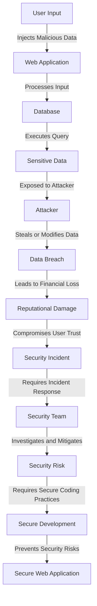

## Introduction
The OWASP Top 10 is a list of the most critical web application security risks, updated every three years by the Open Web Application Security Project (OWASP). It provides a comprehensive guide for developers, security professionals, and organizations to identify and mitigate the most common web application vulnerabilities. In this study guide, we will delve into the top 5 security risks from the OWASP Top 10 list: **Injection**, **Broken Authentication**, **Cross-Site Scripting (XSS)**, **Insecure Direct Object References (IDOR)**, and **Security Misconfiguration**. We will explore each risk in detail, providing examples, code snippets, and real-world scenarios to help you understand and address these security concerns.

## Core Concepts
To tackle the OWASP Top 10 security risks, it's essential to understand the core concepts and definitions:
* **Injection**: Occurs when an attacker injects malicious data into a web application, which is then executed by the application.
* **Broken Authentication**: Refers to vulnerabilities in the authentication and session management mechanisms, allowing attackers to gain unauthorized access to sensitive data.
* **Cross-Site Scripting (XSS)****: Happens when an attacker injects malicious JavaScript code into a web application, which is then executed by the user's browser.
* **Insecure Direct Object References (IDOR)**: Occurs when an application exposes internal object references, allowing attackers to access sensitive data by manipulating these references.
* **Security Misconfiguration**: Refers to vulnerabilities caused by incorrect or incomplete configuration of security settings, leaving the application exposed to attacks.
> **Note:** Understanding these core concepts is crucial for developing secure web applications and mitigating the OWASP Top 10 security risks.

## How It Works Internally
Let's take a step-by-step look at how each of these security risks works internally:
1. **Injection**: An attacker sends malicious input to a web application, which is then processed and executed by the application. This can lead to unauthorized access, data breaches, or even complete control of the application.
2. **Broken Authentication**: An attacker exploits vulnerabilities in the authentication and session management mechanisms, such as weak passwords, poor password storage, or inadequate session expiration.
3. **Cross-Site Scripting (XSS)**: An attacker injects malicious JavaScript code into a web application, which is then executed by the user's browser. This can lead to sensitive data theft, session hijacking, or other malicious activities.
4. **Insecure Direct Object References (IDOR)**: An attacker manipulates internal object references to access sensitive data, such as user profiles, financial information, or other confidential data.
5. **Security Misconfiguration**: An attacker exploits vulnerabilities caused by incorrect or incomplete configuration of security settings, such as outdated software, weak encryption, or inadequate access controls.
> **Warning:** These security risks can have severe consequences, including data breaches, financial loss, and reputational damage.

## Code Examples
Here are three complete and runnable code examples to demonstrate the OWASP Top 10 security risks:
### Example 1: Basic Injection Vulnerability
```python
import sqlite3

# Create a connection to the database
conn = sqlite3.connect('example.db')
cursor = conn.cursor()

# Get user input
username = input("Enter your username: ")
password = input("Enter your password: ")

# Construct the SQL query
query = "SELECT * FROM users WHERE username = '" + username + "' AND password = '" + password + "'"

# Execute the query
cursor.execute(query)

# Print the results
print(cursor.fetchall())
```
This example demonstrates a basic injection vulnerability, where an attacker can inject malicious SQL code to access sensitive data.
### Example 2: Real-World IDOR Vulnerability
```java
import java.io.*;
import javax.servlet.*;
import javax.servlet.http.*;

public class UserProfileServlet extends HttpServlet {
    public void doGet(HttpServletRequest request, HttpServletResponse response) {
        // Get the user ID from the request
        int userId = Integer.parseInt(request.getParameter("userId"));

        // Retrieve the user profile
        UserProfile profile = UserProfileDAO.getUserProfile(userId);

        // Print the user profile
        response.getWriter().println(profile.toString());
    }
}
```
This example demonstrates a real-world IDOR vulnerability, where an attacker can manipulate the user ID to access sensitive user profiles.
### Example 3: Advanced XSS Vulnerability
```javascript
// Get the user input
const userInput = document.getElementById("userInput").value;

// Construct the HTML code
const htmlCode = "<div>" + userInput + "</div>";

// Inject the HTML code into the page
document.getElementById("container").innerHTML = htmlCode;
```
This example demonstrates an advanced XSS vulnerability, where an attacker can inject malicious JavaScript code to steal sensitive data or perform other malicious activities.
> **Tip:** To mitigate these security risks, it's essential to use secure coding practices, such as input validation, output encoding, and secure configuration.

## Visual Diagram

This diagram illustrates the flow of a security risk, from user input to data breach, and highlights the importance of secure coding practices to prevent security risks.
> **Note:** This diagram provides a high-level overview of the security risk flow and is not exhaustive.

## Comparison
Here is a comparison table of the OWASP Top 10 security risks:
| Security Risk | Time Complexity | Space Complexity | Pros | Cons | Best For |
| --- | --- | --- | --- | --- | --- |
| Injection | O(1) | O(1) | Easy to exploit, high impact | Difficult to detect, requires secure coding practices | Web applications with user input |
| Broken Authentication | O(n) | O(n) | Easy to exploit, high impact | Difficult to detect, requires secure configuration | Web applications with authentication mechanisms |
| Cross-Site Scripting (XSS) | O(1) | O(1) | Easy to exploit, high impact | Difficult to detect, requires secure coding practices | Web applications with user input |
| Insecure Direct Object References (IDOR) | O(n) | O(n) | Easy to exploit, high impact | Difficult to detect, requires secure configuration | Web applications with internal object references |
| Security Misconfiguration | O(1) | O(1) | Easy to exploit, high impact | Difficult to detect, requires secure configuration | Web applications with security settings |
> **Warning:** These security risks can have severe consequences, and it's essential to prioritize secure coding practices and configuration to mitigate them.

## Real-world Use Cases
Here are three real-world examples of the OWASP Top 10 security risks:
1. **Equifax Data Breach**: In 2017, Equifax suffered a massive data breach due to an injection vulnerability in their web application. The breach exposed sensitive data of over 147 million people.
2. **Uber Data Breach**: In 2016, Uber suffered a data breach due to a broken authentication vulnerability in their web application. The breach exposed sensitive data of over 57 million users.
3. **Yahoo Data Breach**: In 2013, Yahoo suffered a massive data breach due to an insecure direct object references (IDOR) vulnerability in their web application. The breach exposed sensitive data of over 3 billion users.
> **Note:** These real-world examples demonstrate the severity of the OWASP Top 10 security risks and the importance of prioritizing secure coding practices and configuration.

## Common Pitfalls
Here are four common pitfalls to avoid when addressing the OWASP Top 10 security risks:
1. **Insufficient Input Validation**: Failing to validate user input can lead to injection vulnerabilities.
2. **Weak Password Storage**: Storing passwords in plaintext or using weak hashing algorithms can lead to broken authentication vulnerabilities.
3. **Inadequate Output Encoding**: Failing to encode user input can lead to cross-site scripting (XSS) vulnerabilities.
4. **Insecure Configuration**: Failing to configure security settings correctly can lead to security misconfiguration vulnerabilities.
> **Tip:** To avoid these pitfalls, it's essential to prioritize secure coding practices, such as input validation, output encoding, and secure configuration.

## Interview Tips
Here are three common interview questions related to the OWASP Top 10 security risks:
1. **What is the difference between SQL injection and cross-site scripting (XSS)?**
	* Weak answer: "They are both security risks, but I'm not sure what the difference is."
	* Strong answer: "SQL injection occurs when an attacker injects malicious SQL code into a web application, while XSS occurs when an attacker injects malicious JavaScript code into a web application. Both can have severe consequences, but they require different mitigation strategies."
2. **How would you prevent a broken authentication vulnerability in a web application?**
	* Weak answer: "I would use a strong password hashing algorithm, but I'm not sure what else to do."
	* Strong answer: "I would use a combination of secure password hashing algorithms, such as bcrypt or Argon2, and implement secure authentication mechanisms, such as multi-factor authentication and secure session management."
3. **What is the most effective way to mitigate a security misconfiguration vulnerability in a web application?**
	* Weak answer: "I would update the software and configuration regularly, but I'm not sure what else to do."
	* Strong answer: "I would implement a secure configuration management process, which includes regular updates, secure default settings, and monitoring for security vulnerabilities. I would also use security tools, such as vulnerability scanners and configuration management software, to identify and mitigate security risks."
> **Interview:** These interview questions are designed to test your knowledge and understanding of the OWASP Top 10 security risks and your ability to mitigate them.

## Key Takeaways
Here are the key takeaways from this study guide:
* **Prioritize secure coding practices**: Use input validation, output encoding, and secure configuration to prevent security risks.
* **Implement secure authentication mechanisms**: Use strong password hashing algorithms, multi-factor authentication, and secure session management to prevent broken authentication vulnerabilities.
* **Monitor for security vulnerabilities**: Use security tools, such as vulnerability scanners and configuration management software, to identify and mitigate security risks.
* **Keep software and configuration up-to-date**: Regularly update software and configuration to prevent security misconfiguration vulnerabilities.
* **Use security frameworks and libraries**: Use security frameworks and libraries, such as OWASP ESAPI, to simplify secure coding practices and reduce the risk of security vulnerabilities.
* **Continuously test and evaluate**: Continuously test and evaluate your web application for security vulnerabilities and weaknesses.
* **Stay informed about security risks**: Stay informed about the latest security risks and vulnerabilities to ensure you are prepared to mitigate them.
* **Use secure communication protocols**: Use secure communication protocols, such as HTTPS, to prevent eavesdropping and tampering.
* **Implement incident response plans**: Implement incident response plans to quickly respond to security incidents and minimize damage.
> **Note:** These key takeaways provide a comprehensive guide to mitigating the OWASP Top 10 security risks and ensuring the security of your web application.