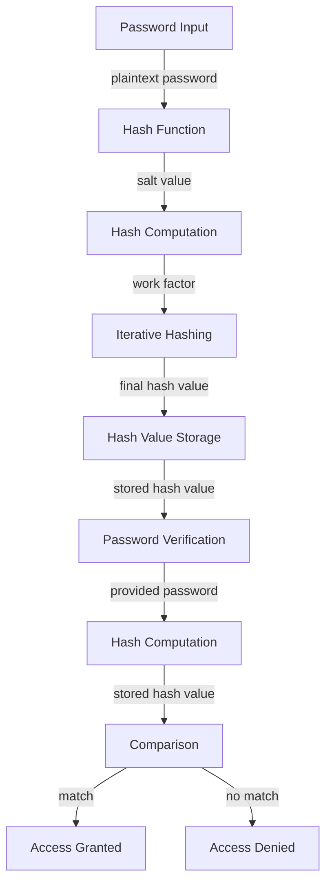

## Introduction
Password hashing is a crucial aspect of security engineering, as it enables the secure storage of user passwords in a way that protects them from unauthorized access. **Password hashing** refers to the process of transforming a plaintext password into a fixed-length string of characters, known as a **hash value** or **digest**, that cannot be reversed or inverted to obtain the original password. This is essential because storing plaintext passwords in a database or file system is a significant security risk, as an attacker who gains access to the stored passwords can use them to compromise user accounts. In this section, we will explore the importance of password hashing, its real-world relevance, and why every engineer should understand the basics of password hashing.

> **Note:** Password hashing is not the same as encryption, although both are used to protect sensitive data. Encryption is a reversible process, whereas password hashing is a one-way process that is designed to be irreversible.

## Core Concepts
To understand password hashing, it is essential to grasp the following core concepts:

* **Hash function**: A hash function is a mathematical function that takes input data of any size and produces a fixed-size output, known as a hash value or digest. A good hash function should have the following properties:
	+ **Deterministic**: Given a particular input, the hash function should always produce the same output.
	+ **Non-invertible**: It should be computationally infeasible to determine the original input from the output hash value.
	+ **Fixed output size**: The output hash value should always be of a fixed size, regardless of the input size.
* **Salt**: A salt is a random value that is added to the plaintext password before hashing. The purpose of a salt is to prevent **rainbow table attacks**, which involve precomputing hash values for common passwords and storing them in a table.
* **Work factor**: A work factor is a parameter that controls the computational cost of the hash function. A higher work factor makes the hash function more computationally expensive, which slows down the hashing process but makes it more resistant to brute-force attacks.

> **Tip:** When implementing password hashing, it is essential to use a sufficient work factor to slow down the hashing process, making it more resistant to brute-force attacks.

## How It Works Internally
Let's take a closer look at how password hashing works internally. The process involves the following steps:

1. **Password input**: The user enters a plaintext password.
2. **Salt generation**: A random salt value is generated.
3. **Hash function**: The plaintext password and salt value are passed through a hash function, which produces a fixed-size output hash value.
4. **Work factor application**: The hash function is applied multiple times, with the output of each iteration being used as the input to the next iteration. The number of iterations is controlled by the work factor.
5. **Hash value storage**: The final output hash value is stored in a database or file system.

> **Warning:** Using a weak hash function or a low work factor can compromise the security of the password hashing process.

## Code Examples
Here are three complete and runnable code examples that demonstrate password hashing using different algorithms:

### Example 1: Basic bcrypt usage in Python
```python
import bcrypt

def hash_password(password):
    # Generate a salt value
    salt = bcrypt.gensalt()
    # Hash the password using bcrypt
    hashed_password = bcrypt.hashpw(password.encode('utf-8'), salt)
    return hashed_password

def verify_password(stored_password, provided_password):
    # Compare the stored hash value with the hash value of the provided password
    return bcrypt.checkpw(provided_password.encode('utf-8'), stored_password)

# Example usage
password = "mysecretpassword"
hashed_password = hash_password(password)
print(hashed_password)

# Verify the password
is_valid = verify_password(hashed_password, password)
print(is_valid)
```

### Example 2: Using Argon2 in Node.js
```javascript
const argon2 = require('argon2');

async function hashPassword(password) {
    // Generate a salt value
    const salt = await argon2.generateSalt();
    // Hash the password using Argon2
    const hashedPassword = await argon2.hash(password, { salt });
    return hashedPassword;
}

async function verifyPassword(storedPassword, providedPassword) {
    // Compare the stored hash value with the hash value of the provided password
    return await argon2.verify(storedPassword, providedPassword);
}

// Example usage
const password = "mysecretpassword";
hashPassword(password).then((hashedPassword) => {
    console.log(hashedPassword);
    // Verify the password
    verifyPassword(hashedPassword, password).then((isValid) => {
        console.log(isValid);
    });
});
```

### Example 3: Advanced scrypt usage in Java
```java
import java.security.NoSuchAlgorithmException;
import java.security.spec.InvalidKeySpecException;
import java.security.spec.KeySpec;
import javax.crypto.SecretKeyFactory;
import javax.crypto.spec.PBEKeySpec;

public class ScryptExample {
    public static void main(String[] args) throws NoSuchAlgorithmException, InvalidKeySpecException {
        // Define the password and salt
        String password = "mysecretpassword";
        byte[] salt = "mysaltvalue".getBytes();

        // Define the scrypt parameters
        int N = 16384;
        int r = 8;
        int p = 1;

        // Hash the password using scrypt
        byte[] hashedPassword = scrypt(password, salt, N, r, p);

        // Verify the password
        boolean isValid = verifyScrypt(hashedPassword, password, salt, N, r, p);
        System.out.println(isValid);
    }

    public static byte[] scrypt(String password, byte[] salt, int N, int r, int p) throws NoSuchAlgorithmException, InvalidKeySpecException {
        // Create a PBEKeySpec instance
        KeySpec spec = new PBEKeySpec(password.toCharArray(), salt, N, r, p);
        // Create a SecretKeyFactory instance
        SecretKeyFactory factory = SecretKeyFactory.getInstance("PBKDF2WithHmacSHA1");
        // Derive the key
        byte[] key = factory.generateSecret(spec).getEncoded();
        return key;
    }

    public static boolean verifyScrypt(byte[] storedHash, String providedPassword, byte[] salt, int N, int r, int p) throws NoSuchAlgorithmException, InvalidKeySpecException {
        // Hash the provided password using scrypt
        byte[] providedHash = scrypt(providedPassword, salt, N, r, p);
        // Compare the stored hash value with the hash value of the provided password
        return java.util.Arrays.equals(storedHash, providedHash);
    }
}
```

## Visual Diagram

This diagram illustrates the password hashing process, from password input to hash value storage, and the subsequent password verification process.

> **Interview:** When asked about password hashing, be prepared to explain the differences between various algorithms, such as bcrypt, Argon2, and scrypt, and discuss the importance of using a sufficient work factor and salt value.

## Comparison
The following table compares the three password hashing algorithms discussed in this section:

| Algorithm | Time Complexity | Space Complexity | Pros | Cons | Best For |
| --- | --- | --- | --- | --- | --- |
| bcrypt | O(2^log2(n)) | O(1) | Strong password hashing, resistant to brute-force attacks | Slow, computationally expensive | Web applications, authentication systems |
| Argon2 | O(n) | O(n) | Memory-hard, resistant to GPU attacks | Slow, computationally expensive | Password-based authentication, cryptocurrency wallets |
| scrypt | O(n) | O(n) | Memory-hard, resistant to GPU attacks | Slow, computationally expensive | Password-based authentication, cryptocurrency wallets |

> **Tip:** When choosing a password hashing algorithm, consider the trade-offs between security, performance, and ease of implementation.

## Real-world Use Cases
Here are three real-world use cases for password hashing:

1. **Web applications**: Many web applications, such as GitHub and Dropbox, use password hashing to secure user passwords.
2. **Cryptocurrency wallets**: Cryptocurrency wallets, such as Bitcoin and Ethereum, use password hashing to secure user wallets and prevent unauthorized access.
3. **Authentication systems**: Authentication systems, such as Okta and Auth0, use password hashing to secure user passwords and provide single sign-on functionality.

> **Warning:** Using a weak password hashing algorithm or a low work factor can compromise the security of your application or system.

## Common Pitfalls
Here are four common pitfalls to avoid when implementing password hashing:

1. **Using a weak hash function**: Using a weak hash function, such as MD5 or SHA-1, can compromise the security of your password hashing process.
2. **Not using a sufficient work factor**: Not using a sufficient work factor can make your password hashing process vulnerable to brute-force attacks.
3. **Not using a salt value**: Not using a salt value can make your password hashing process vulnerable to rainbow table attacks.
4. **Storing plaintext passwords**: Storing plaintext passwords in a database or file system is a significant security risk and should be avoided at all costs.

> **Note:** When implementing password hashing, it is essential to use a sufficient work factor, a salt value, and a strong hash function to ensure the security of your password hashing process.

## Interview Tips
Here are three common interview questions related to password hashing, along with tips for answering them:

1. **What is the difference between bcrypt and Argon2?**: Be prepared to explain the differences between bcrypt and Argon2, including their time and space complexities, and discuss the trade-offs between security, performance, and ease of implementation.
2. **How do you implement password hashing in a web application?**: Be prepared to explain the steps involved in implementing password hashing in a web application, including generating a salt value, hashing the password, and storing the hash value.
3. **What are some common pitfalls to avoid when implementing password hashing?**: Be prepared to discuss common pitfalls to avoid when implementing password hashing, including using a weak hash function, not using a sufficient work factor, and not using a salt value.

> **Tip:** When answering interview questions related to password hashing, be prepared to discuss the trade-offs between security, performance, and ease of implementation, and to explain the importance of using a sufficient work factor, a salt value, and a strong hash function.

## Key Takeaways
Here are ten key takeaways to remember when it comes to password hashing:

* **Use a strong hash function**: Use a strong hash function, such as bcrypt or Argon2, to ensure the security of your password hashing process.
* **Use a sufficient work factor**: Use a sufficient work factor to slow down the hashing process and make it more resistant to brute-force attacks.
* **Use a salt value**: Use a salt value to prevent rainbow table attacks and make your password hashing process more secure.
* **Store hash values securely**: Store hash values securely, using a secure storage mechanism, such as a Hardware Security Module (HSM).
* **Avoid using weak hash functions**: Avoid using weak hash functions, such as MD5 or SHA-1, as they can compromise the security of your password hashing process.
* **Avoid using low work factors**: Avoid using low work factors, as they can make your password hashing process vulnerable to brute-force attacks.
* **Use a secure password hashing algorithm**: Use a secure password hashing algorithm, such as bcrypt or Argon2, to ensure the security of your password hashing process.
* **Implement password hashing correctly**: Implement password hashing correctly, using a sufficient work factor, a salt value, and a strong hash function.
* **Test your password hashing implementation**: Test your password hashing implementation to ensure it is secure and functions correctly.
* **Stay up-to-date with best practices**: Stay up-to-date with best practices for password hashing, including using a sufficient work factor, a salt value, and a strong hash function.