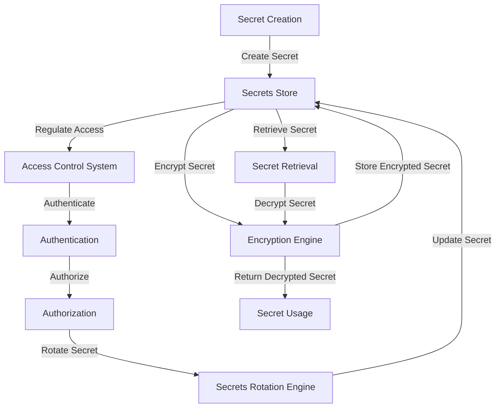

## Introduction
Secrets management is a critical aspect of software engineering, particularly in the realm of security engineering. **Secrets**, in this context, refer to sensitive information such as API keys, passwords, certificates, and other confidential data that are used to authenticate, authorize, or encrypt data. The primary goal of secrets management is to securely store, manage, and retrieve these secrets in a way that minimizes the risk of unauthorized access or exposure. This is crucial because compromised secrets can lead to data breaches, financial losses, and reputational damage. In real-world scenarios, secrets management is essential for ensuring the security and integrity of applications, services, and infrastructure.

> **Note:** Secrets management is not just about storing secrets securely; it's also about managing their lifecycle, including creation, rotation, and revocation.

## Core Concepts
To understand secrets management, it's essential to grasp the following core concepts:
- **Secrets**: Sensitive information that needs to be protected, such as API keys, passwords, and certificates.
- **Secrets Store**: A secure repository that stores secrets, such as HashiCorp's Vault or AWS Secrets Manager.
- **Encryption**: The process of converting plaintext secrets into unreadable ciphertext to protect them from unauthorized access.
- **Access Control**: Mechanisms that regulate who can access secrets, such as authentication, authorization, and role-based access control.
- **Secrets Rotation**: The process of periodically updating secrets to minimize the impact of a potential breach.

> **Tip:** Implementing a secrets management system can help reduce the risk of secrets exposure and improve overall security posture.

## How It Works Internally
Secrets management systems typically consist of the following components:
1. **Secrets Store**: A secure repository that stores secrets, such as a database or a file system.
2. **Encryption Engine**: Responsible for encrypting and decrypting secrets using cryptographic algorithms.
3. **Access Control System**: Regulates access to secrets based on authentication, authorization, and role-based access control.
4. **Secrets Rotation Engine**: Periodically updates secrets to minimize the impact of a potential breach.

Here's a step-by-step overview of how secrets management works internally:
1. **Secret Creation**: A secret is created and stored in the secrets store.
2. **Encryption**: The secret is encrypted using a cryptographic algorithm.
3. **Access Control**: Access to the secret is regulated based on authentication, authorization, and role-based access control.
4. **Secrets Rotation**: The secret is periodically updated to minimize the impact of a potential breach.

## Code Examples
### Example 1: Basic Secrets Management using HashiCorp's Vault
```go
package main

import (
	"fmt"
	"log"

	"github.com/hashicorp/vault/api"
)

func main() {
	// Initialize the Vault client
	config := api.DefaultConfig()
	client, err := api.NewClient(config)
	if err != nil {
		log.Fatal(err)
	}

	// Create a new secret
	secret := map[string]interface{}{
		"key": "value",
	}
	_, err = client.Logical().Write("secret/mysecret", secret)
	if err != nil {
		log.Fatal(err)
	}

	// Read the secret
	secret, err = client.Logical().Read("secret/mysecret")
	if err != nil {
		log.Fatal(err)
	}
	fmt.Println(secret)
}
```

### Example 2: Using AWS Secrets Manager to Store and Retrieve Secrets
```python
import boto3
import json

secrets_manager = boto3.client('secretsmanager')

def create_secret(secret_name, secret_value):
    response = secrets_manager.create_secret(
        Name=secret_name,
        SecretString=secret_value
    )
    return response

def get_secret(secret_name):
    response = secrets_manager.get_secret_value(
        SecretId=secret_name
    )
    return response

# Create a new secret
secret_name = "mysecret"
secret_value = json.dumps({"key": "value"})
create_secret(secret_name, secret_value)

# Read the secret
secret = get_secret(secret_name)
print(secret)
```

### Example 3: Advanced Secrets Management using Vault and AWS IAM
```java
import software.amazon.awssdk.services.iam.IamClient;
import software.amazon.awssdk.services.iam.model.CreateRoleRequest;
import software.amazon.awssdk.services.iam.model.CreateRoleResponse;
import software.amazon.awssdk.services.secretsmanager.SecretsManagerClient;
import software.amazon.awssdk.services.secretsmanager.model.CreateSecretRequest;
import software.amazon.awssdk.services.secretsmanager.model.CreateSecretResponse;

public class AdvancedSecretsManagement {
    public static void main(String[] args) {
        // Initialize the AWS clients
        IamClient iamClient = IamClient.create();
        SecretsManagerClient secretsManagerClient = SecretsManagerClient.create();

        // Create a new IAM role
        CreateRoleRequest createRoleRequest = CreateRoleRequest.builder()
                .roleName("myrole")
                .build();
        CreateRoleResponse createRoleResponse = iamClient.createRole(createRoleRequest);

        // Create a new secret
        CreateSecretRequest createSecretRequest = CreateSecretRequest.builder()
                .name("mysecret")
                .secretString("{\"key\":\"value\"}")
                .build();
        CreateSecretResponse createSecretResponse = secretsManagerClient.createSecret(createSecretRequest);

        // Use Vault to manage the secret
        // ...
    }
}
```

## Visual Diagram

This diagram illustrates the secrets management workflow, from secret creation to retrieval and usage.

> **Warning:** Improperly configured access control can lead to unauthorized access to secrets, compromising the security of the system.

## Comparison
| Approach | Time Complexity | Space Complexity | Pros | Cons | Best For |
|----------|----------------|-----------------|------|------|----------|
| HashiCorp's Vault | O(1) | O(n) | Scalable, secure, and flexible | Complex setup and management | Large-scale enterprises with complex security requirements |
| AWS Secrets Manager | O(1) | O(n) | Easy to use, integrates well with AWS services | Limited scalability and customization options | Small to medium-sized businesses with simple security requirements |
| Google Cloud Secret Manager | O(1) | O(n) | Secure, scalable, and integrates well with GCP services | Limited customization options and complex setup | Large-scale enterprises with complex security requirements and GCP infrastructure |
| Azure Key Vault | O(1) | O(n) | Secure, scalable, and integrates well with Azure services | Limited customization options and complex setup | Large-scale enterprises with complex security requirements and Azure infrastructure |

## Real-world Use Cases
1. **Netflix**: Uses HashiCorp's Vault to manage secrets and encrypt data at rest and in transit.
2. **Amazon**: Uses AWS Secrets Manager to manage secrets and encrypt data at rest and in transit.
3. **Google**: Uses Google Cloud Secret Manager to manage secrets and encrypt data at rest and in transit.

> **Tip:** Implementing a secrets management system can help reduce the risk of secrets exposure and improve overall security posture.

## Common Pitfalls
1. **Inadequate Access Control**: Failing to implement proper access control mechanisms can lead to unauthorized access to secrets.
2. **Insufficient Encryption**: Using weak or outdated encryption algorithms can compromise the security of secrets.
3. **Inadequate Secrets Rotation**: Failing to rotate secrets regularly can increase the risk of secrets exposure.
4. **Insecure Secret Storage**: Storing secrets in plaintext or using insecure storage mechanisms can compromise the security of secrets.

> **Interview:** What is the most common mistake you've seen in secrets management, and how would you prevent it?

## Interview Tips
1. **What is secrets management, and why is it important?**: A strong answer should define secrets management, explain its importance, and provide examples of its use in real-world scenarios.
2. **How do you implement secrets management in your organization?**: A strong answer should describe the secrets management workflow, including secret creation, encryption, access control, and rotation.
3. **What are some common pitfalls in secrets management, and how can you avoid them?**: A strong answer should identify common pitfalls, such as inadequate access control, insufficient encryption, and inadequate secrets rotation, and provide strategies for avoiding them.

> **Warning:** Failing to implement proper secrets management can lead to security breaches and reputational damage.

## Key Takeaways
* Secrets management is critical for ensuring the security and integrity of applications, services, and infrastructure.
* HashiCorp's Vault, AWS Secrets Manager, Google Cloud Secret Manager, and Azure Key Vault are popular secrets management solutions.
* Implementing a secrets management system can help reduce the risk of secrets exposure and improve overall security posture.
* Inadequate access control, insufficient encryption, and inadequate secrets rotation are common pitfalls in secrets management.
* Regularly rotating secrets, implementing proper access control mechanisms, and using secure storage mechanisms can help prevent common pitfalls.
* Secrets management is an ongoing process that requires continuous monitoring and improvement to ensure the security and integrity of secrets.
* Using a secrets management solution can help simplify the secrets management workflow and reduce the risk of human error.
* Implementing a secrets management system can help improve compliance with regulatory requirements and industry standards.