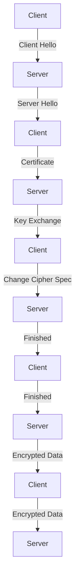

## Introduction
**Transport Layer Security (TLS)** and its predecessor, **Secure Sockets Layer (SSL)**, are cryptographic protocols used to provide secure communication over the internet. They enable secure data transfer between a web server and a client, such as a web browser, by encrypting the data in transit. TLS/SSL is essential for protecting sensitive information, such as passwords, credit card numbers, and personal data, from eavesdropping and tampering. Every engineer should understand how TLS/SSL works, as it is a fundamental aspect of online security.

## Core Concepts
- **TLS/SSL Handshake**: The process of establishing a secure connection between a client and a server. It involves a series of steps, including certificate exchange, key exchange, and encryption.
- **Certificate**: A digital document that verifies the identity of a server or client. It contains the public key and identity information of the entity.
- **Certificate Authority (CA)**: A trusted entity that issues digital certificates to servers and clients. CAs verify the identity of the entity before issuing a certificate.
- **Public Key Infrastructure (PKI)**: A system that enables secure communication by using public-key cryptography and digital certificates.

> **Note:** TLS/SSL is not only used for web browsing but also for other protocols, such as email, file transfer, and virtual private networks (VPNs).

## How It Works Internally
The TLS/SSL handshake involves the following steps:
1. **Client Hello**: The client initiates the handshake by sending a "hello" message to the server, which includes the supported protocol version, cipher suites, and a random session ID.
2. **Server Hello**: The server responds with its own "hello" message, which includes the chosen protocol version, cipher suite, and a random session ID.
3. **Certificate**: The server sends its digital certificate to the client, which includes its public key and identity information.
4. **Key Exchange**: The client and server perform a key exchange, which involves generating a shared secret key.
5. **Change Cipher Spec**: The client and server notify each other that they will start using the shared secret key for encryption.
6. **Finished**: The client and server send a "finished" message to each other, which is encrypted with the shared secret key.

> **Warning:** A common mistake is to use a weak cipher suite, which can compromise the security of the connection.

## Code Examples
### Example 1: Basic TLS/SSL Handshake using Python
```python
import socket
import ssl

# Create a context
context = ssl.create_default_context()

# Load the server certificate
context.load_verify_locations('server.crt')

# Create a socket
server_socket = socket.socket(socket.AF_INET)
server_socket.bind(('localhost', 8080))
server_socket.listen(1)

print("Server started. Waiting for connection...")

# Accept a connection
client_socket, address = server_socket.accept()

# Wrap the socket with the SSL context
ssl_socket = context.wrap_socket(client_socket, server_side=True)

print("Connection established. Waiting for data...")

# Receive data from the client
data = ssl_socket.recv(1024)

print("Received data:", data)

# Send a response back to the client
ssl_socket.sendall(b"Hello, client!")

# Close the socket
ssl_socket.close()
```

### Example 2: TLS/SSL Certificate Generation using OpenSSL
```bash
# Generate a private key
openssl genrsa -out server.key 2048

# Generate a certificate signing request (CSR)
openssl req -new -key server.key -out server.csr

# Generate a self-signed certificate
openssl x509 -req -days 365 -in server.csr -signkey server.key -out server.crt
```

### Example 3: Advanced TLS/SSL Configuration using Java
```java
import javax.net.ssl.SSLContext;
import javax.net.ssl.SSLSocket;
import javax.net.ssl.TrustManagerFactory;
import java.io.FileInputStream;
import java.io.IOException;
import java.security.KeyStore;

public class TlsSslExample {
    public static void main(String[] args) throws Exception {
        // Load the trust store
        KeyStore trustStore = KeyStore.getInstance("JKS");
        trustStore.load(new FileInputStream("truststore.jks"), "password".toCharArray());

        // Create a trust manager factory
        TrustManagerFactory trustManagerFactory = TrustManagerFactory.getInstance("SunX509");
        trustManagerFactory.init(trustStore);

        // Create an SSL context
        SSLContext sslContext = SSLContext.getInstance("TLS");
        sslContext.init(null, trustManagerFactory.getTrustManagers(), null);

        // Create an SSL socket
        SSLSocket sslSocket = (SSLSocket) sslContext.getSocketFactory().createSocket("localhost", 8080);

        // Send a request to the server
        sslSocket.getOutputStream().write("Hello, server!".getBytes());

        // Receive a response from the server
        byte[] response = new byte[1024];
        sslSocket.getInputStream().read(response);

        System.out.println("Received response: " + new String(response));
    }
}
```

## Visual Diagram

The diagram illustrates the TLS/SSL handshake process, including the client hello, server hello, certificate exchange, key exchange, change cipher spec, and finished messages.

> **Tip:** Use a tool like Wireshark to capture and analyze the TLS/SSL handshake process.

## Comparison
| Protocol | Time Complexity | Space Complexity | Pros | Cons | Best For |
| --- | --- | --- | --- | --- | --- |
| TLS 1.2 | O(1) | O(1) | Secure, widely supported | Complex, vulnerable to certain attacks | Web browsing, email |
| TLS 1.3 | O(1) | O(1) | Faster, more secure | Limited support, still evolving | Web browsing, real-time communication |
| SSL 3.0 | O(1) | O(1) | Simple, widely supported | Insecure, deprecated | Legacy systems |
| PGP | O(n) | O(n) | Secure, flexible | Complex, not widely supported | Email encryption |

## Real-world Use Cases
1. **Google**: Google uses TLS/SSL to secure its search engine and other online services.
2. **Amazon**: Amazon uses TLS/SSL to secure its e-commerce platform and protect customer data.
3. **Facebook**: Facebook uses TLS/SSL to secure its social media platform and protect user data.

> **Interview:** What is the difference between TLS and SSL? How do you configure TLS/SSL on a web server?

## Common Pitfalls
1. **Weak Cipher Suites**: Using weak cipher suites can compromise the security of the connection.
2. **Insecure Certificate Storage**: Storing certificates insecurely can lead to unauthorized access.
3. **Insufficient Key Exchange**: Insufficient key exchange can lead to weak encryption.
4. **Inadequate Certificate Validation**: Inadequate certificate validation can lead to man-in-the-middle attacks.

> **Warning:** Always use secure cipher suites and validate certificates properly.

## Interview Tips
1. **What is the difference between TLS and SSL?**: TLS is the successor to SSL and provides improved security and performance.
2. **How do you configure TLS/SSL on a web server?**: Configure the web server to use a secure cipher suite and validate certificates properly.
3. **What is a certificate authority?**: A certificate authority is a trusted entity that issues digital certificates to servers and clients.

> **Tip:** Always use a secure protocol version and cipher suite, and validate certificates properly.

## Key Takeaways
* **TLS/SSL is essential for online security**: Protects sensitive information from eavesdropping and tampering.
* **Use secure cipher suites**: Avoid weak cipher suites that can compromise the security of the connection.
* **Validate certificates properly**: Verify the identity of the server and client to prevent man-in-the-middle attacks.
* **Use a secure protocol version**: Use the latest version of the protocol to ensure maximum security and performance.
* **Configure TLS/SSL properly**: Configure the web server to use a secure cipher suite and validate certificates properly.
* **Use a certificate authority**: Use a trusted certificate authority to issue digital certificates to servers and clients.
* **Monitor and update TLS/SSL configurations**: Regularly monitor and update TLS/SSL configurations to ensure maximum security and performance.
* **Use tools like Wireshark to analyze the TLS/SSL handshake**: Analyze the TLS/SSL handshake process to identify potential security issues.
* **Implement TLS/SSL in production environments**: Implement TLS/SSL in production environments to protect sensitive information and ensure maximum security and performance.