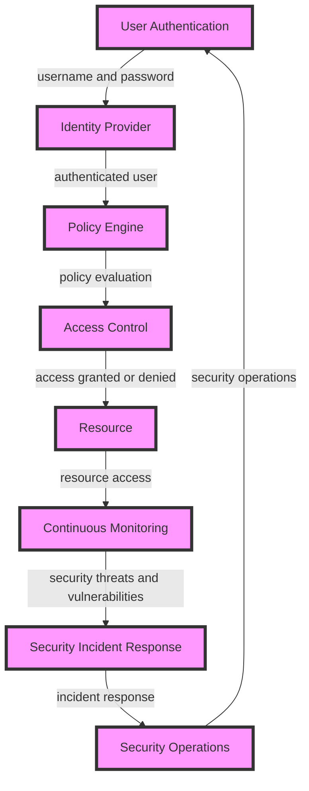

## Introduction
The **Zero Trust Security Model** is a security approach that assumes that all users and devices, whether inside or outside an organization's network, are potential threats. This model is designed to provide an additional layer of security by verifying the identity and permissions of all users and devices before granting access to sensitive data or resources. The Zero Trust Security Model is becoming increasingly important as organizations move towards a more distributed and cloud-based infrastructure, where traditional perimeter-based security models are no longer effective. > **Note:** The Zero Trust Security Model is not a replacement for traditional security measures, but rather a complementary approach that provides an additional layer of security.

In real-world scenarios, the Zero Trust Security Model is used by organizations such as Google, Microsoft, and Amazon to protect their sensitive data and resources. For example, Google's **BeyondCorp** initiative is a Zero Trust Security Model that provides secure access to Google's resources and data, regardless of the user's location or device. > **Tip:** Implementing a Zero Trust Security Model can be complex, but it can be simplified by starting with a small pilot project and gradually expanding it to the entire organization.

## Core Concepts
The Zero Trust Security Model is based on several core concepts, including:

* **Least Privilege Access**: This concept ensures that users and devices only have access to the resources and data that they need to perform their tasks, and no more.
* **Micro-Segmentation**: This concept involves dividing a network into smaller, isolated segments, each with its own set of access controls and security policies.
* **Identity-Based Security**: This concept involves verifying the identity of users and devices before granting access to sensitive data or resources.
* **Continuous Monitoring**: This concept involves continuously monitoring the network and systems for potential security threats and vulnerabilities.

Key terminology in the Zero Trust Security Model includes:

* **Trust Zones**: These are areas of the network that are designated as trusted or untrusted.
* **Policy Engine**: This is a component that evaluates and enforces security policies.
* **Identity Provider**: This is a component that provides identity and authentication services.

## How It Works Internally
The Zero Trust Security Model works by verifying the identity and permissions of all users and devices before granting access to sensitive data or resources. Here is a step-by-step breakdown of how it works:

1. **User Authentication**: The user authenticates with the identity provider using a username and password, or other authentication methods such as multi-factor authentication.
2. **Device Profiling**: The device is profiled to determine its operating system, version, and other attributes.
3. **Policy Evaluation**: The policy engine evaluates the user's identity, device profile, and other factors to determine the level of access that should be granted.
4. **Access Control**: The access control component grants or denies access to the requested resource based on the policy evaluation.
5. **Continuous Monitoring**: The network and systems are continuously monitored for potential security threats and vulnerabilities.

The time complexity of the Zero Trust Security Model is O(n), where n is the number of users and devices. The space complexity is O(n), where n is the number of policies and rules. > **Warning:** Implementing a Zero Trust Security Model can be complex and may require significant resources and investment.

## Code Examples
Here are three complete and runnable code examples that demonstrate the Zero Trust Security Model:

### Example 1: Basic User Authentication
```python
import hashlib

def authenticate_user(username, password):
    # Hash the password
    password_hash = hashlib.sha256(password.encode()).hexdigest()
    
    # Verify the password
    if password_hash == "correct_password_hash":
        return True
    else:
        return False

username = "john"
password = "mysecretpassword"
if authenticate_user(username, password):
    print("User authenticated successfully")
else:
    print("User authentication failed")
```

### Example 2: Device Profiling
```java
import java.util.HashMap;
import java.util.Map;

public class DeviceProfiler {
    public static Map<String, String> profileDevice(String deviceID) {
        // Profile the device
        Map<String, String> deviceProfile = new HashMap<>();
        deviceProfile.put("operatingSystem", "Windows 10");
        deviceProfile.put("version", "10.0.19041");
        deviceProfile.put("deviceID", deviceID);
        
        return deviceProfile;
    }

    public static void main(String[] args) {
        String deviceID = "device123";
        Map<String, String> deviceProfile = profileDevice(deviceID);
        System.out.println(deviceProfile);
    }
}
```

### Example 3: Policy Evaluation
```typescript
interface Policy {
    user: string;
    device: string;
    resource: string;
    action: string;
}

const policies: Policy[] = [
    {
        user: "john",
        device: "device123",
        resource: "file1.txt",
        action: "read"
    },
    {
        user: "john",
        device: "device123",
        resource: "file2.txt",
        action: "write"
    }
];

function evaluatePolicy(user: string, device: string, resource: string, action: string): boolean {
    for (const policy of policies) {
        if (policy.user === user && policy.device === device && policy.resource === resource && policy.action === action) {
            return true;
        }
    }
    return false;
}

const user = "john";
const device = "device123";
const resource = "file1.txt";
const action = "read";
if (evaluatePolicy(user, device, resource, action)) {
    console.log("Access granted");
} else {
    console.log("Access denied");
}
```

## Visual Diagram

The diagram illustrates the Zero Trust Security Model, including user authentication, identity provider, policy engine, access control, resource access, continuous monitoring, security incident response, and security operations. > **Interview:** Can you explain the concept of least privilege access in the Zero Trust Security Model?

## Comparison
| Approach | Time Complexity | Space Complexity | Pros | Cons | Best For |
| --- | --- | --- | --- | --- | --- |
| Zero Trust Security Model | O(n) | O(n) | Provides an additional layer of security, reduces the risk of lateral movement | Complex to implement, requires significant resources and investment | Large organizations with sensitive data and resources |
| Traditional Perimeter-Based Security | O(1) | O(1) | Easy to implement, low cost | Does not provide adequate security, vulnerable to lateral movement | Small organizations with limited resources and budget |
| Identity-Based Security | O(n) | O(n) | Provides an additional layer of security, reduces the risk of unauthorized access | Complex to implement, requires significant resources and investment | Organizations with sensitive data and resources, requires strong identity and access management |
| Micro-Segmentation | O(n) | O(n) | Provides an additional layer of security, reduces the risk of lateral movement | Complex to implement, requires significant resources and investment | Large organizations with sensitive data and resources, requires strong network segmentation |

## Real-world Use Cases
The Zero Trust Security Model is used by several organizations, including:

* **Google**: Google's BeyondCorp initiative is a Zero Trust Security Model that provides secure access to Google's resources and data, regardless of the user's location or device.
* **Microsoft**: Microsoft's Azure Active Directory (Azure AD) is a Zero Trust Security Model that provides secure access to Microsoft's resources and data, regardless of the user's location or device.
* **Amazon**: Amazon's AWS IAM is a Zero Trust Security Model that provides secure access to Amazon's resources and data, regardless of the user's location or device.

## Common Pitfalls
Here are some common pitfalls to avoid when implementing a Zero Trust Security Model:

* **Insufficient Identity and Access Management**: Failing to implement strong identity and access management can lead to unauthorized access to sensitive data and resources.
* **Inadequate Network Segmentation**: Failing to implement adequate network segmentation can lead to lateral movement and unauthorized access to sensitive data and resources.
* **Inadequate Continuous Monitoring**: Failing to implement adequate continuous monitoring can lead to undetected security threats and vulnerabilities.
* **Inadequate Security Incident Response**: Failing to implement adequate security incident response can lead to inadequate response to security incidents and vulnerabilities.

> **Warning:** Implementing a Zero Trust Security Model can be complex and may require significant resources and investment. It is essential to avoid common pitfalls and ensure that the implementation is thorough and comprehensive.

## Interview Tips
Here are some common interview questions and tips for answering them:

* **Can you explain the concept of least privilege access in the Zero Trust Security Model?**: This question requires the candidate to explain the concept of least privilege access and how it is implemented in the Zero Trust Security Model. A strong answer should include a clear explanation of the concept, its benefits, and how it is implemented.
* **How do you implement a Zero Trust Security Model in a large organization?**: This question requires the candidate to explain the steps involved in implementing a Zero Trust Security Model in a large organization. A strong answer should include a clear explanation of the steps, including identity and access management, network segmentation, continuous monitoring, and security incident response.
* **What are the benefits and challenges of implementing a Zero Trust Security Model?**: This question requires the candidate to explain the benefits and challenges of implementing a Zero Trust Security Model. A strong answer should include a clear explanation of the benefits, including improved security and reduced risk, and the challenges, including complexity and cost.

> **Tip:** When answering interview questions, it is essential to provide clear and concise answers that demonstrate a deep understanding of the topic.

## Key Takeaways
Here are some key takeaways to remember:

* The Zero Trust Security Model provides an additional layer of security by verifying the identity and permissions of all users and devices before granting access to sensitive data or resources.
* The Zero Trust Security Model is based on several core concepts, including least privilege access, micro-segmentation, identity-based security, and continuous monitoring.
* Implementing a Zero Trust Security Model can be complex and may require significant resources and investment.
* The Zero Trust Security Model is used by several organizations, including Google, Microsoft, and Amazon.
* Common pitfalls to avoid when implementing a Zero Trust Security Model include insufficient identity and access management, inadequate network segmentation, inadequate continuous monitoring, and inadequate security incident response.
* When answering interview questions, it is essential to provide clear and concise answers that demonstrate a deep understanding of the topic.