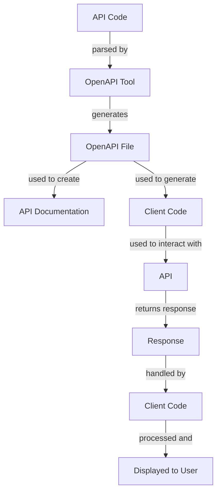

## Introduction
OpenAPI documentation is a crucial component of modern software development, enabling developers to create, share, and maintain APIs with ease. **OpenAPI** is an open-source specification that allows developers to describe, produce, and consume RESTful APIs in a standardized way. With the rise of microservices architecture, OpenAPI has become an essential tool for ensuring seamless communication between different services. In this article, we will delve into the common pitfalls that developers encounter when deploying OpenAPI documentation and provide practical guidance on how to avoid them.

## Core Concepts
To understand the pitfalls of deploying OpenAPI documentation, it's essential to grasp the core concepts of OpenAPI. The **OpenAPI specification** is based on a JSON or YAML file that describes the API's endpoints, methods, parameters, and responses. The specification includes several key components, such as:
* **Paths**: define the API's endpoints and the HTTP methods supported by each endpoint
* **Methods**: describe the HTTP methods (e.g., GET, POST, PUT, DELETE) and their corresponding parameters and responses
* **Parameters**: specify the parameters that can be passed to each method, including their data types and formats
* **Responses**: define the possible responses for each method, including their status codes and response bodies

> **Note:** Understanding the OpenAPI specification is crucial for creating accurate and effective API documentation.

## How It Works Internally
When a developer creates an OpenAPI documentation file, it is typically generated using a tool such as **Swagger** or **OpenAPI Generator**. These tools parse the API code and generate a JSON or YAML file that conforms to the OpenAPI specification. The generated file can then be used to create API documentation, client code, and server code.

Here is a high-level overview of the process:
1. **API Code**: The developer writes the API code using a programming language such as Java, Python, or Node.js.
2. **OpenAPI Tool**: The developer uses an OpenAPI tool to generate the OpenAPI documentation file from the API code.
3. **OpenAPI File**: The OpenAPI tool generates a JSON or YAML file that describes the API's endpoints, methods, parameters, and responses.
4. **API Documentation**: The OpenAPI file is used to create API documentation, such as HTML pages or PDF documents.
5. **Client Code**: The OpenAPI file is used to generate client code, such as Java or Python code, that can be used to interact with the API.

## Code Examples
Here are three complete and runnable examples of OpenAPI documentation:

### Example 1: Basic OpenAPI Documentation
```yml
openapi: 3.0.0
info:
  title: Simple API
  description: A simple API for demonstration purposes
  version: 1.0.0
paths:
  /users:
    get:
      summary: Retrieve a list of users
      responses:
        '200':
          description: A list of users
          content:
            application/json:
              schema:
                type: array
                items:
                  $ref: '#/components/schemas/User'
components:
  schemas:
    User:
      type: object
      properties:
        id:
          type: integer
        name:
          type: string
```
This example demonstrates a basic OpenAPI documentation file that describes a single endpoint, `/users`, with a single method, `GET`.

### Example 2: OpenAPI Documentation with Multiple Endpoints
```yml
openapi: 3.0.0
info:
  title: User Management API
  description: An API for managing users
  version: 1.0.0
paths:
  /users:
    get:
      summary: Retrieve a list of users
      responses:
        '200':
          description: A list of users
          content:
            application/json:
              schema:
                type: array
                items:
                  $ref: '#/components/schemas/User'
    post:
      summary: Create a new user
      responses:
        '201':
          description: A new user was created
          content:
            application/json:
              schema:
                $ref: '#/components/schemas/User'
  /users/{userId}:
    get:
      summary: Retrieve a user by ID
      responses:
        '200':
          description: A user
          content:
            application/json:
              schema:
                $ref: '#/components/schemas/User'
components:
  schemas:
    User:
      type: object
      properties:
        id:
          type: integer
        name:
          type: string
```
This example demonstrates an OpenAPI documentation file that describes multiple endpoints, including `/users` and `/users/{userId}`, with multiple methods, including `GET` and `POST`.

### Example 3: OpenAPI Documentation with Security
```yml
openapi: 3.0.0
info:
  title: Secure API
  description: An API that requires authentication
  version: 1.0.0
paths:
  /users:
    get:
      summary: Retrieve a list of users
      security:
        - bearerAuth: []
      responses:
        '200':
          description: A list of users
          content:
            application/json:
              schema:
                type: array
                items:
                  $ref: '#/components/schemas/User'
components:
  securitySchemes:
    bearerAuth:
      type: http
      scheme: bearer
      bearerFormat: JWT
  schemas:
    User:
      type: object
      properties:
        id:
          type: integer
        name:
          type: string
```
This example demonstrates an OpenAPI documentation file that describes an API that requires authentication using a bearer token.

## Visual Diagram

This diagram illustrates the process of creating and using OpenAPI documentation, from parsing the API code to displaying the response to the user.

## Comparison
Here is a comparison of different approaches to deploying OpenAPI documentation:

| Approach | Time Complexity | Space Complexity | Pros | Cons | Best For |
| --- | --- | --- | --- | --- | --- |
| Manual Documentation | O(1) | O(1) | Easy to implement, low overhead | Prone to errors, difficult to maintain | Small APIs with simple documentation |
| OpenAPI Tool | O(n) | O(n) | Automatic generation, easy to maintain | Steep learning curve, may require additional setup | Medium to large APIs with complex documentation |
| API Gateway | O(n) | O(n) | Centralized management, easy to scale | May require additional infrastructure, added latency | Large APIs with high traffic and complex security requirements |
| Microservices Architecture | O(n^2) | O(n^2) | Highly scalable, flexible | Complex to implement, may require additional tooling | Large, distributed systems with multiple APIs and microservices |

> **Warning:** Manual documentation can be prone to errors and difficult to maintain, especially for large APIs.

## Real-world Use Cases
Here are three real-world use cases for OpenAPI documentation:

1. **Netflix**: Netflix uses OpenAPI documentation to manage its vast array of APIs, which are used to power its streaming service.
2. **Amazon Web Services (AWS)**: AWS uses OpenAPI documentation to provide a standardized way for developers to interact with its APIs, which are used to manage cloud resources.
3. **Google Cloud Platform (GCP)**: GCP uses OpenAPI documentation to provide a centralized way for developers to manage its APIs, which are used to power its cloud services.

## Common Pitfalls
Here are four common pitfalls to watch out for when deploying OpenAPI documentation:

1. **Inconsistent Documentation**: Inconsistent documentation can lead to confusion and errors. **Tip:** Use a standardized approach to documentation, such as OpenAPI, to ensure consistency.
2. **Outdated Documentation**: Outdated documentation can lead to errors and security vulnerabilities. **Warning:** Regularly update documentation to reflect changes to the API.
3. **Insufficient Security**: Insufficient security can lead to security vulnerabilities. **Note:** Use security schemes, such as bearer authentication, to protect APIs.
4. **Poor Error Handling**: Poor error handling can lead to errors and frustration. **Tip:** Use standardized error handling mechanisms, such as HTTP status codes, to provide clear and concise error messages.

## Interview Tips
Here are three common interview questions related to OpenAPI documentation, along with weak and strong answers:

1. **What is OpenAPI documentation?**
	* Weak answer: "It's a way to document APIs."
	* Strong answer: "OpenAPI documentation is a standardized way to describe, produce, and consume RESTful APIs. It provides a clear and concise way to document API endpoints, methods, parameters, and responses."
2. **How do you deploy OpenAPI documentation?**
	* Weak answer: "I use a tool to generate the documentation."
	* Strong answer: "I use a combination of tools, such as OpenAPI Generator and Swagger, to generate and deploy OpenAPI documentation. I also ensure that the documentation is regularly updated to reflect changes to the API."
3. **What are some common pitfalls to watch out for when deploying OpenAPI documentation?**
	* Weak answer: "I'm not sure."
	* Strong answer: "Some common pitfalls to watch out for include inconsistent documentation, outdated documentation, insufficient security, and poor error handling. I use a standardized approach to documentation, regularly update the documentation, and use security schemes and error handling mechanisms to mitigate these risks."

## Key Takeaways
Here are ten key takeaways to remember when deploying OpenAPI documentation:

* **Use a standardized approach to documentation**, such as OpenAPI, to ensure consistency and accuracy.
* **Regularly update documentation** to reflect changes to the API.
* **Use security schemes**, such as bearer authentication, to protect APIs.
* **Implement standardized error handling mechanisms**, such as HTTP status codes, to provide clear and concise error messages.
* **Use tools**, such as OpenAPI Generator and Swagger, to generate and deploy OpenAPI documentation.
* **Test and validate** OpenAPI documentation to ensure accuracy and completeness.
* **Use version control** to track changes to the OpenAPI documentation.
* **Document API endpoints**, methods, parameters, and responses clearly and concisely.
* **Use clear and concise language** in the OpenAPI documentation to avoid confusion.
* **Provide examples** and tutorials to help developers understand how to use the API.