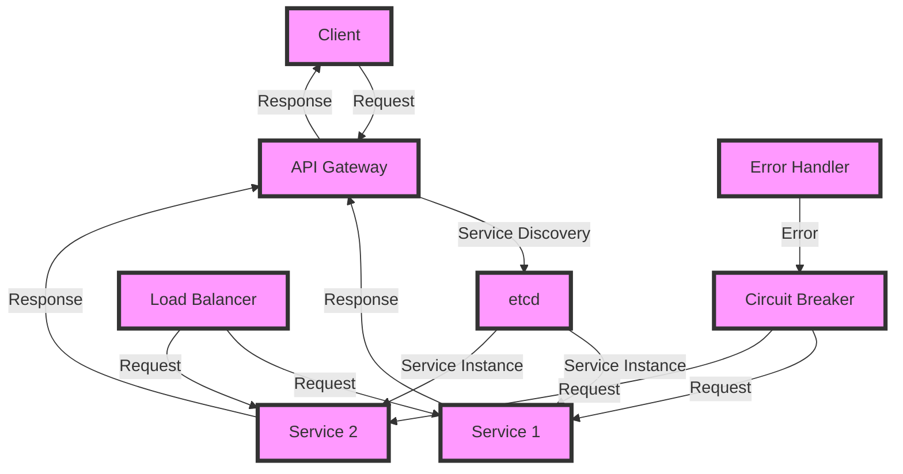

## Introduction
Designing agile systems with microservices communication is a crucial aspect of modern software engineering. **Microservices** are small, independent services that communicate with each other to achieve a common goal. This approach allows for greater flexibility, scalability, and fault tolerance compared to traditional monolithic architectures. In this section, we will explore the world of microservices communication, its benefits, and its applications in real-world systems.

> **Note:** The concept of microservices is not new, but its adoption has increased significantly in recent years due to the rise of cloud computing, containerization, and DevOps practices.

Microservices communication is essential in today's fast-paced software development environment. It enables teams to work independently on different services, reducing the complexity and risk associated with monolithic systems. With microservices, each service can be developed, tested, and deployed independently, allowing for faster time-to-market and improved overall system reliability.

## Core Concepts
To understand microservices communication, we need to grasp some key concepts:

* **Service Discovery**: The process of finding available services in a system. This can be done using techniques such as DNS, load balancing, or service registries like etcd or ZooKeeper.
* **API Gateway**: An entry point for clients to access microservices. API gateways can handle tasks such as authentication, rate limiting, and routing requests to appropriate services.
* **Load Balancing**: Distributing incoming traffic across multiple instances of a service to improve responsiveness and reliability.
* **Circuit Breaker**: A design pattern that detects when a service is not responding and prevents further requests from being sent to it, allowing the system to recover from failures.

> **Warning:** Without proper service discovery and load balancing, microservices can become overwhelmed and lead to cascading failures.

## How It Works Internally
When a client sends a request to a microservices system, the following steps occur:

1. **Request Reception**: The API gateway receives the client's request and authenticates it.
2. **Service Discovery**: The API gateway uses service discovery to find available instances of the requested service.
3. **Load Balancing**: The API gateway distributes the request to one of the available service instances.
4. **Service Execution**: The service instance processes the request and returns a response.
5. **Response Routing**: The API gateway receives the response and routes it back to the client.

This process involves several internal mechanics, including:

* **Inter-Service Communication**: Services communicate with each other using protocols such as HTTP, gRPC, or message queues like RabbitMQ or Apache Kafka.
* **Error Handling**: Services handle errors and exceptions using mechanisms like circuit breakers, retries, and fallbacks.

> **Tip:** Use a combination of synchronous and asynchronous communication patterns to achieve optimal performance and reliability in microservices systems.

## Code Examples
Here are three complete, runnable code examples demonstrating microservices communication:

### Example 1: Basic Service Discovery with etcd
```go
package main

import (
	"context"
	"fmt"
	"log"

	"go.etcd.io/etcd/clientv3"
)

func main() {
	// Create an etcd client
	cfg := clientv3.Config{
		Endpoints: []string{"http://localhost:2379"},
	}
	client, err := clientv3.New(cfg)
	if err != nil {
		log.Fatal(err)
	}

	// Register a service
	serviceName := "my-service"
	serviceAddress := "http://localhost:8080"
	_, err = client.Put(context.Background(), serviceName, serviceAddress)
	if err != nil {
		log.Fatal(err)
	}

	// Discover services
	getResp, err := client.Get(context.Background(), serviceName)
	if err != nil {
		log.Fatal(err)
	}
	fmt.Println(getResp.Kvs[0].Value)
}
```

### Example 2: Load Balancing with HAProxy
```bash
# Create a HAProxy configuration file
echo "frontend http
    bind *:80

    default_backend my-service

backend my-service
    mode http
    balance roundrobin
    server node1 http://localhost:8080 check
    server node2 http://localhost:8081 check" > haproxy.cfg

# Run HAProxy
haproxy -f haproxy.cfg
```

### Example 3: Circuit Breaker with Hystrix
```java
import com.netflix.hystrix.HystrixCommand;
import com.netflix.hystrix.HystrixCommandProperties;

public class MyService extends HystrixCommand<String> {
    private final String serviceName;

    public MyService(String serviceName) {
        super(HystrixCommandProperties.defaultSetter()
                .withExecutionTimeoutInMilliseconds(1000));
        this.serviceName = serviceName;
    }

    @Override
    protected String run() throws Exception {
        // Simulate a service call
        Thread.sleep(2000);
        return "Service responded";
    }

    @Override
    protected String getFallback() {
        return "Service failed";
    }

    public static void main(String[] args) {
        MyService service = new MyService("my-service");
        String response = service.execute();
        System.out.println(response);
    }
}
```

## Visual Diagram

This diagram illustrates the flow of requests and responses in a microservices system, including service discovery, load balancing, and circuit breaking.

## Comparison
| Approach | Time Complexity | Space Complexity | Pros | Cons | Best For |
| --- | --- | --- | --- | --- | --- |
| Monolithic Architecture | O(1) | O(n) | Simple, easy to develop | Limited scalability, tight coupling | Small, simple applications |
| Microservices Architecture | O(n) | O(n) | Scalable, flexible, fault-tolerant | Complex, difficult to manage | Large, complex applications |
| Service-Oriented Architecture (SOA) | O(n) | O(n) | Scalable, flexible, reusable services | Complex, difficult to manage | Enterprise-level applications |
| Event-Driven Architecture (EDA) | O(n) | O(n) | Scalable, flexible, fault-tolerant | Complex, difficult to manage | Real-time systems, IoT applications |

## Real-world Use Cases
1. **Netflix**: Uses a microservices architecture to provide scalable and fault-tolerant video streaming services.
2. **Amazon**: Employs a service-oriented architecture to manage its vast e-commerce platform.
3. **Uber**: Utilizes a microservices architecture to provide real-time ride-hailing services.

## Common Pitfalls
1. **Tight Coupling**: Services are too closely tied together, making it difficult to modify or replace individual services.
2. **Inadequate Service Discovery**: Services are not properly registered or discovered, leading to errors and downtime.
3. **Insufficient Load Balancing**: Services are not properly balanced, resulting in overload and poor performance.
4. **Inadequate Error Handling**: Services do not handle errors properly, leading to cascading failures and system instability.

> **Interview:** Can you explain the difference between a monolithic architecture and a microservices architecture? How would you approach designing a microservices system for a large, complex application?

## Key Takeaways
* Microservices communication is essential for designing agile systems.
* Service discovery, load balancing, and circuit breaking are crucial components of microservices systems.
* Monolithic architectures are simple but limited in scalability, while microservices architectures are complex but offer greater flexibility and fault tolerance.
* Event-driven architectures are suitable for real-time systems and IoT applications.
* Proper error handling and logging are critical for maintaining system stability and reliability.
* Microservices systems require careful planning, design, and management to ensure success.
* The use of containerization, orchestration, and monitoring tools can simplify the management of microservices systems.
* A deep understanding of networking, security, and scalability is necessary for designing and deploying microservices systems.