## Introduction
Open source software has revolutionized the way we develop, collaborate, and innovate in the tech industry. With the benefits of open source, developers can now share their work, learn from others, and create better software together. In this learning path, we'll explore the benefits of open source, focusing on its availability on Linux and Windows platforms. We'll delve into the world of **Swift**, a powerful and intuitive programming language, and discover how open source contributes to its success.

> **Note:** Open source software is not just about free code; it's about community-driven development, transparency, and collaboration. This approach has led to the creation of some of the most popular and reliable software systems in the world.

The importance of open source cannot be overstated. It has democratized access to technology, enabling developers from all over the world to contribute to and benefit from collective knowledge. In real-world scenarios, open source software is used in various industries, including finance, healthcare, and education. Companies like **Google**, **Facebook**, and **Microsoft** rely heavily on open source software to power their infrastructure and services.

## Core Concepts
To understand the benefits of open source, it's essential to grasp some core concepts:

* **Open source license**: A license that allows users to view, modify, and distribute the software freely.
* **Community-driven development**: A collaborative approach to software development, where contributors from around the world work together to create and improve the software.
* **Transparency**: The openness and visibility of the software development process, including code, documentation, and decision-making.
* **Modularity**: The ability to break down software into smaller, independent components, making it easier to maintain, update, and customize.

> **Warning:** One common misconception about open source software is that it's always free and of poor quality. However, many open source projects are well-maintained, secure, and highly reliable, with some even offering commercial support and services.

## How It Works Internally
Let's take a closer look at how open source software works internally:

1. **Contribution**: Developers contribute code, documentation, or other resources to the project.
2. **Review**: The contributed code is reviewed by other developers to ensure it meets the project's standards and guidelines.
3. **Merge**: The reviewed code is merged into the main codebase, becoming part of the official software.
4. **Release**: The updated software is released to the public, often with a new version number and changelog.

> **Tip:** To get the most out of open source software, it's essential to understand the project's governance model, contribution guidelines, and community norms.

The internal mechanics of open source software development are often facilitated by tools like **Git** (version control), **GitHub** (code hosting and collaboration), and **Jenkins** (continuous integration and testing). These tools enable developers to work together efficiently, track changes, and ensure the software's quality and stability.

## Code Examples
Here are three complete and runnable code examples to illustrate the benefits of open source:

### Example 1: Basic Open Source License
```swift
// SPDX-License-Identifier: MIT
// This code is licensed under the MIT License, a permissive open source license.
func greet(name: String) {
    print("Hello, \(name)!")
}
```
This example demonstrates a simple Swift function with an open source license.

### Example 2: Collaborative Development
```swift
// This code is part of a collaborative open source project.
// Multiple developers have contributed to this function.
func calculateArea(length: Double, width: Double) -> Double {
    return length * width
}
```
This example shows a Swift function developed collaboratively by multiple contributors.

### Example 3: Modularity
```swift
// This code demonstrates modularity in open source software.
// The `Calculator` class can be easily extended or modified.
class Calculator {
    func add(x: Int, y: Int) -> Int {
        return x + y
    }
    
    func subtract(x: Int, y: Int) -> Int {
        return x - y
    }
}
```
This example illustrates the modularity of open source software, where components can be easily modified or extended.

## Visual Diagram

```mermaid
graph TD
    A[Developer] -->|contributes code| B[Open Source Project]
    B -->|reviewed by| C[Community]
    C -->|merged into| D[Main Codebase]
    D -->|released as| E[New Version]
    E -->|used by| F[End Users]
    F -->|provides feedback| A
    style A fill:#f9f,stroke:#333,stroke-width:2px
    style B fill:#ccc,stroke:#333,stroke-width:2px
    style C fill:#aaa,stroke:#333,stroke-width:2px
    style D fill:#999,stroke:#333,stroke-width:2px
    style E fill:#666,stroke:#333,stroke-width:2px
    style F fill:#333,stroke:#333,stroke-width:2px
```

This diagram illustrates the open source software development process, from contribution to release and feedback.

The diagram shows how developers contribute code, which is then reviewed by the community, merged into the main codebase, and released as a new version. End users can then use the software, provide feedback, and contribute to the next iteration of the project.

## Comparison
| Approach | Time Complexity | Space Complexity | Pros | Cons | Best For |
| --- | --- | --- | --- | --- | --- |
| Open Source | O(1) ( contribution ) | O(n) ( codebase ) | Community-driven, transparent, modular | Security risks, maintenance challenges | Large-scale, collaborative projects |
| Closed Source | O(n) ( development ) | O(1) ( proprietary ) | Faster development, proprietary | Limited customization, vendor lock-in | Small-scale, proprietary projects |
| Hybrid | O(n) ( development ) | O(n) ( mixed ) | Balanced approach, flexibility | Complexity, mixed licensing | Medium-scale, mixed-model projects |
| Free Software | O(1) ( contribution ) | O(n) ( codebase ) | Freedom, community-driven | Limited commercial support | Social, community-driven projects |

> **Interview:** When asked about the benefits of open source software, be prepared to discuss its pros and cons, such as community-driven development, transparency, and modularity, as well as potential security risks and maintenance challenges.

## Real-world Use Cases
Here are three real-world examples of open source software in production:

1. **Google's Android**: Android is an open source operating system for mobile devices, developed by Google and the Open Handset Alliance. It's used by billions of people worldwide and has become a dominant force in the mobile market.
2. **Facebook's React**: React is an open source JavaScript library for building user interfaces, developed by Facebook and the community. It's widely used in web development and has become a popular choice for building complex, scalable applications.
3. **Microsoft's .NET Core**: .NET Core is an open source, cross-platform version of the .NET framework, developed by Microsoft and the community. It's used for building web applications, microservices, and other types of software, and has become a popular choice for cloud-native development.

## Common Pitfalls
Here are four common mistakes to avoid when working with open source software:

1. **Licensing issues**: Failing to understand the licensing terms and conditions of open source software can lead to legal issues and conflicts.
2. **Security risks**: Open source software can be vulnerable to security risks if not properly maintained and updated.
3. **Compatibility issues**: Integrating open source software with other systems or components can be challenging due to compatibility issues.
4. **Maintenance challenges**: Open source software requires ongoing maintenance and support, which can be time-consuming and resource-intensive.

> **Tip:** To avoid these pitfalls, it's essential to carefully evaluate the open source software, understand its licensing terms, and plan for ongoing maintenance and support.

## Interview Tips
Here are three common interview questions related to open source software, along with weak and strong answer examples:

1. **What are the benefits of open source software?**
	* Weak answer: "It's free, and anyone can use it."
	* Strong answer: "Open source software offers community-driven development, transparency, and modularity, which can lead to faster innovation, improved quality, and reduced costs."
2. **How do you handle licensing issues with open source software?**
	* Weak answer: "I just use whatever license is available."
	* Strong answer: "I carefully evaluate the licensing terms and conditions, ensure compliance with organizational policies, and consult with legal experts if necessary."
3. **What are some common security risks associated with open source software?**
	* Weak answer: "I'm not sure, but I think it's secure because it's open source."
	* Strong answer: "Some common security risks include vulnerabilities in dependencies, insecure coding practices, and lack of maintenance and updates. To mitigate these risks, I would implement secure coding practices, regularly update dependencies, and monitor security advisories."

## Key Takeaways
Here are six key takeaways to remember when working with open source software:

* **Community-driven development**: Open source software is developed and maintained by a community of contributors.
* **Transparency**: Open source software is transparent, with visible code, documentation, and decision-making processes.
* **Modularity**: Open source software is often modular, with components that can be easily modified or extended.
* **Licensing**: Open source software is licensed under a specific license, which governs its use, modification, and distribution.
* **Security**: Open source software can be vulnerable to security risks if not properly maintained and updated.
* **Maintenance**: Open source software requires ongoing maintenance and support to ensure its continued quality and reliability.

> **Note:** These key takeaways highlight the importance of understanding the benefits and challenges of open source software, as well as the need for careful evaluation, planning, and maintenance when using it in production environments.