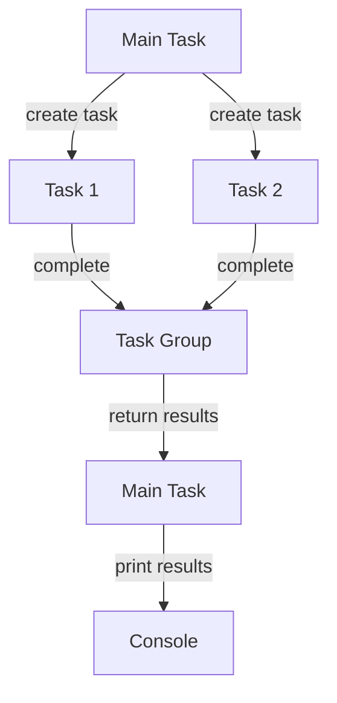

## Introduction
Swift Concurrency is a powerful feature in the Swift programming language that allows developers to write asynchronous code that is easier to read, maintain, and debug. The `async/await` syntax and **Actors** are two key components of Swift Concurrency that enable developers to write concurrent code that is safe, efficient, and scalable. In this section, we will explore the benefits of Swift Concurrency, its real-world relevance, and why every engineer needs to know this.

Swift Concurrency is essential in today's world where mobile and web applications require fast, responsive, and efficient interactions with users. With the increasing demand for real-time data processing, concurrent programming has become a crucial aspect of software development. **Async/await** and **Actors** provide a high-level abstraction that simplifies the process of writing concurrent code, making it more accessible to a wider range of developers.

> **Tip:** When working with Swift Concurrency, it's essential to understand the concept of concurrency and how it differs from parallelism. Concurrency refers to the ability of a program to perform multiple tasks simultaneously, while parallelism refers to the ability of a program to execute multiple tasks at the same time.

## Core Concepts
In this section, we will dive into the core concepts of Swift Concurrency, including **async/await**, **Actors**, and **Tasks**.

* **Async/await**: This is a syntax for writing asynchronous code that is easier to read and maintain. It allows developers to write asynchronous code that looks and feels like synchronous code.
* **Actors**: Actors are a type of concurrent actor that provides a safe and efficient way to share state between concurrent tasks. They are designed to be used with async/await and provide a high-level abstraction for concurrent programming.
* **Tasks**: Tasks are the basic building blocks of Swift Concurrency. They represent a single unit of work that can be executed concurrently with other tasks.

> **Note:** Swift Concurrency is built on top of the existing Swift runtime, which means that it is compatible with existing Swift code and frameworks.

## How It Works Internally
In this section, we will explore the under-the-hood mechanics of Swift Concurrency, including how **async/await** and **Actors** work internally.

When you use **async/await**, the Swift compiler generates a state machine that manages the asynchronous execution of your code. This state machine is responsible for suspending and resuming the execution of your code at the correct points.

**Actors**, on the other hand, use a combination of locks and queues to manage concurrent access to shared state. They provide a safe and efficient way to share state between concurrent tasks, which is essential for writing concurrent code that is free from data races and other concurrency-related bugs.

> **Warning:** When working with **Actors**, it's essential to avoid using shared mutable state between tasks. Instead, use **Actors** to manage shared state and ensure that it is accessed in a thread-safe manner.

## Code Examples
In this section, we will explore three complete and runnable examples of Swift Concurrency in action.

### Example 1: Basic Async/Await
```swift
import Foundation

func performTask() async {
    // Simulate some asynchronous work
    await Task.sleep(nanoseconds: 1_000_000_000)
    print("Task completed")
}

// Create a new task and run it
Task {
    await performTask()
}
```
This example demonstrates the basic usage of **async/await** in Swift. The `performTask` function is marked as `async`, which means that it can be suspended and resumed at specific points. The `Task` type is used to create a new task that runs the `performTask` function.

### Example 2: Using Actors
```swift
import Foundation

actor BankAccount {
    var balance: Int = 0

    func deposit(amount: Int) {
        balance += amount
    }

    func withdraw(amount: Int) {
        balance -= amount
    }
}

// Create a new bank account and perform some transactions
let account = BankAccount()
Task {
    await account.deposit(amount: 100)
    await account.withdraw(amount: 50)
    print("Balance: \(await account.balance)")
}
```
This example demonstrates the usage of **Actors** in Swift. The `BankAccount` actor provides a safe and efficient way to manage shared state between concurrent tasks. The `deposit` and `withdraw` functions are used to modify the balance of the account, and the `balance` property is used to retrieve the current balance.

### Example 3: Advanced Async/Await
```swift
import Foundation

func performTask1() async -> Int {
    // Simulate some asynchronous work
    await Task.sleep(nanoseconds: 1_000_000_000)
    return 1
}

func performTask2() async -> Int {
    // Simulate some asynchronous work
    await Task.sleep(nanoseconds: 2_000_000_000)
    return 2
}

// Create a new task and run it
Task {
    let results = await withTaskGroup(of: (Int).self) { group in
        group.addTask {
            await performTask1()
        }
        group.addTask {
            await performTask2()
        }
        var results: [Int] = []
        for await result in group {
            results.append(result)
        }
        return results
    }
    print("Results: \(results)")
}
```
This example demonstrates the advanced usage of **async/await** in Swift. The `withTaskGroup` function is used to create a new task group that runs multiple tasks concurrently. The `addTask` function is used to add tasks to the group, and the `for await` loop is used to iterate over the results of the tasks.

## Visual Diagram

This diagram illustrates the flow of tasks in the advanced example. The main task creates two tasks, which are then added to a task group. The task group waits for both tasks to complete and returns the results to the main task. The main task then prints the results to the console.

> **Note:** This diagram illustrates the high-level flow of tasks in the advanced example. It does not show the low-level details of how the tasks are executed or how the results are returned.

## Comparison
| Approach | Time Complexity | Space Complexity | Pros | Cons | Best For |
| --- | --- | --- | --- | --- | --- |
| Async/Await | O(1) | O(1) | Easy to read and maintain, high-level abstraction | Limited control over underlying threads | I/O-bound operations, network requests |
| Actors | O(1) | O(n) | Safe and efficient way to share state between tasks | Limited control over underlying threads, overhead of actor creation | Concurrent programming, shared state management |
| Threads | O(n) | O(n) | Low-level control over threads, flexible | Error-prone, difficult to manage | Performance-critical code, low-level system programming |
| Grand Central Dispatch | O(1) | O(1) | High-level abstraction, easy to use | Limited control over underlying threads, overhead of dispatch queue creation | I/O-bound operations, network requests |

> **Tip:** When choosing an approach to concurrency, consider the trade-offs between ease of use, performance, and control. **Async/await** and **Actors** provide a high-level abstraction that simplifies the process of writing concurrent code, while **threads** and **Grand Central Dispatch** provide a low-level control that is essential for performance-critical code.

## Real-world Use Cases
Swift Concurrency is used in a wide range of real-world applications, including:

* **Apple's SwiftNIO**: A cross-platform, open-source framework for building high-performance, concurrent network applications.
* **Instagram's IGListKit**: A framework for building high-performance, concurrent data-driven applications.
* **Pinterest's PDK**: A framework for building high-performance, concurrent data-driven applications.

> **Note:** These examples illustrate the real-world relevance of Swift Concurrency and its applications in industry.

## Common Pitfalls
When working with Swift Concurrency, there are several common pitfalls to avoid:

* **Data races**: When multiple tasks access shared state without proper synchronization, it can lead to data races and other concurrency-related bugs.
* **Deadlocks**: When two or more tasks are blocked indefinitely, waiting for each other to release resources, it can lead to deadlocks and other concurrency-related bugs.
* **Starvation**: When one task is unable to access shared resources due to other tasks holding onto them for an extended period, it can lead to starvation and other concurrency-related bugs.

> **Warning:** When working with Swift Concurrency, it's essential to avoid these common pitfalls by using **Actors** and other synchronization primitives to manage shared state and ensure that tasks are executed safely and efficiently.

## Interview Tips
When interviewing for a position that requires Swift Concurrency, there are several common questions to expect:

* **What is Swift Concurrency, and how does it work?**: This question requires a high-level understanding of Swift Concurrency and its underlying mechanics.
* **How do you use async/await in Swift?**: This question requires a practical understanding of **async/await** and how to use it in Swift.
* **What are Actors, and how do you use them in Swift?**: This question requires a practical understanding of **Actors** and how to use them in Swift.

> **Interview:** When answering these questions, be sure to provide a clear and concise explanation of the concepts and how they are used in practice. Provide examples and code snippets to illustrate your points, and be prepared to answer follow-up questions.

## Key Takeaways
Here are the key takeaways from this section:

* **Swift Concurrency is a powerful feature in Swift that simplifies the process of writing concurrent code**.
* **Async/await and Actors are two key components of Swift Concurrency that provide a high-level abstraction for concurrent programming**.
* **Tasks are the basic building blocks of Swift Concurrency, and they can be used to execute concurrent code**.
* **Swift Concurrency is built on top of the existing Swift runtime, which means that it is compatible with existing Swift code and frameworks**.
* **When working with Swift Concurrency, it's essential to avoid common pitfalls such as data races, deadlocks, and starvation**.
* **Swift Concurrency is used in a wide range of real-world applications, including Apple's SwiftNIO, Instagram's IGListKit, and Pinterest's PDK**.
* **When interviewing for a position that requires Swift Concurrency, be prepared to answer questions about async/await, Actors, and concurrency-related concepts**.