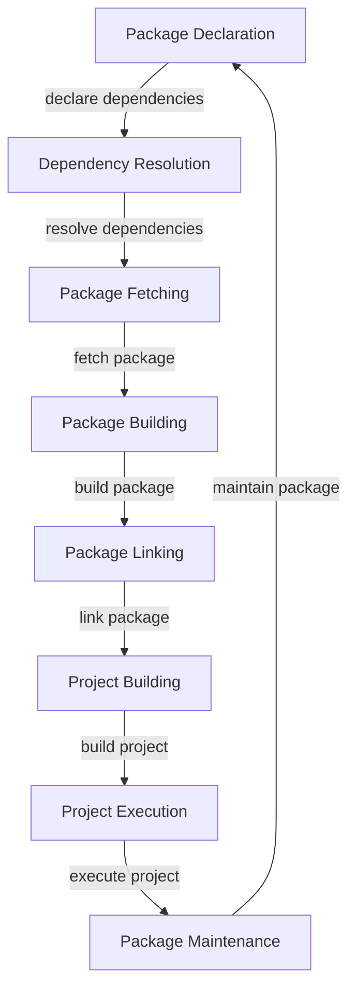

## Introduction
The **Swift Package Manager (SPM)** is a built-in tool for managing dependencies in Swift projects. It allows developers to easily integrate third-party libraries and frameworks into their projects, making it a crucial part of the Swift ecosystem. With SPM, developers can create, manage, and distribute their own packages, making it easier to share and reuse code. In this section, we will explore the benefits of using SPM and why it is an essential tool for any Swift developer.

> **Note:** SPM is not just limited to Swift projects; it can also be used with other languages, such as C and C++, making it a versatile tool for managing dependencies.

SPM is designed to simplify the process of managing dependencies, making it easier to focus on writing code rather than managing dependencies. With SPM, you can easily add, update, and remove dependencies from your project, making it a powerful tool for any Swift developer.

## Core Concepts
To understand how SPM works, it's essential to understand some key concepts:

* **Package**: A package is a collection of Swift code that can be used by other projects. Packages can contain libraries, executables, and other resources.
* **Dependency**: A dependency is a package that is required by another package or project.
* **Target**: A target is a specific build configuration for a package or project.
* **Product**: A product is the result of building a target, such as an executable or library.

> **Tip:** When creating a package, it's essential to define the package's dependencies and targets correctly to ensure that the package can be built and used correctly.

## How It Works Internally
SPM uses a combination of Git and the Swift compiler to manage dependencies. Here's a step-by-step overview of how SPM works internally:

1. **Package Declaration**: The package author creates a `Package.swift` file that declares the package's dependencies, targets, and products.
2. **Dependency Resolution**: When a project depends on a package, SPM resolves the package's dependencies and creates a dependency graph.
3. **Package Fetching**: SPM fetches the package and its dependencies from the package repository.
4. **Package Building**: SPM builds the package and its dependencies using the Swift compiler.
5. **Package Linking**: SPM links the built package and its dependencies to the project.

> **Warning:** If the package's dependencies are not correctly declared, SPM may not be able to resolve the dependencies, leading to build errors.

## Code Examples
Here are three complete and runnable examples of using SPM:

### Example 1: Basic Package
```swift
// Package.swift
import PackageDescription

let package = Package(
    name: "MyPackage",
    products: [
        .library(
            name: "MyPackage",
            targets: ["MyPackage"]),
    ],
    dependencies: [],
    targets: [
        .target(
            name: "MyPackage",
            dependencies: []),
    ]
)
```

### Example 2: Package with Dependencies
```swift
// Package.swift
import PackageDescription

let package = Package(
    name: "MyPackage",
    products: [
        .library(
            name: "MyPackage",
            targets: ["MyPackage"]),
    ],
    dependencies: [
        .package(url: "https://github.com/apple/swift-argument-parser.git", from: "0.3.2"),
    ],
    targets: [
        .target(
            name: "MyPackage",
            dependencies: ["ArgumentParser"]),
    ]
)
```

### Example 3: Package with Multiple Targets
```swift
// Package.swift
import PackageDescription

let package = Package(
    name: "MyPackage",
    products: [
        .library(
            name: "MyPackage",
            targets: ["MyPackage"]),
        .executable(
            name: "MyExecutable",
            targets: ["MyExecutable"]),
    ],
    dependencies: [],
    targets: [
        .target(
            name: "MyPackage",
            dependencies: []),
        .target(
            name: "MyExecutable",
            dependencies: ["MyPackage"]),
    ]
)
```

## Visual Diagram

The diagram shows the workflow of SPM, from package declaration to project execution.

> **Note:** The diagram illustrates the main steps involved in the SPM workflow, but it's not exhaustive.

## Comparison
Here's a comparison of SPM with other package managers:

| Package Manager | Language | Dependencies | Targets | Products |
| --- | --- | --- | --- | --- |
| SPM | Swift | Declared | Multiple | Library, Executable |
| CocoaPods | Objective-C, Swift | Declared | Single | Library |
| Carthage | Objective-C, Swift | Declared | Multiple | Library |
| npm | JavaScript | Declared | Single | Library, Executable |

## Real-world Use Cases
Here are three real-world use cases of SPM:

1. **Apple's Swift-NIO**: Apple's Swift-NIO project uses SPM to manage its dependencies and build its packages.
2. **Swift Package Registry**: The Swift Package Registry uses SPM to manage its packages and dependencies.
3. **IBM's Swift-Kuery**: IBM's Swift-Kuery project uses SPM to manage its dependencies and build its packages.

> **Tip:** Using SPM can simplify the process of managing dependencies and building packages, making it easier to focus on writing code.

## Common Pitfalls
Here are four common pitfalls to avoid when using SPM:

1. **Incorrect Package Declaration**: Incorrectly declaring the package's dependencies and targets can lead to build errors.
2. **Dependency Version Conflicts**: Conflicts between dependency versions can lead to build errors.
3. **Package Fetching Errors**: Errors fetching packages can lead to build errors.
4. **Package Building Errors**: Errors building packages can lead to build errors.

> **Warning:** It's essential to carefully declare the package's dependencies and targets to avoid build errors.

## Interview Tips
Here are three common interview questions related to SPM:

1. **What is SPM and how does it work?**: The interviewer is looking for a detailed explanation of SPM and its workflow.
2. **How do you declare dependencies in SPM?**: The interviewer is looking for an explanation of how to declare dependencies in SPM.
3. **What are some common pitfalls to avoid when using SPM?**: The interviewer is looking for an explanation of common pitfalls to avoid when using SPM.

> **Interview:** When answering interview questions related to SPM, be sure to provide detailed explanations and examples to demonstrate your understanding of the topic.

## Key Takeaways
Here are ten key takeaways to remember:

* SPM is a built-in tool for managing dependencies in Swift projects.
* SPM uses a combination of Git and the Swift compiler to manage dependencies.
* Packages can declare dependencies, targets, and products.
* SPM resolves dependencies and creates a dependency graph.
* SPM fetches and builds packages using the Swift compiler.
* SPM links built packages to the project.
* Incorrect package declaration can lead to build errors.
* Dependency version conflicts can lead to build errors.
* Package fetching errors can lead to build errors.
* Package building errors can lead to build errors.

> **Note:** Remembering these key takeaways can help you understand and use SPM effectively in your Swift projects.