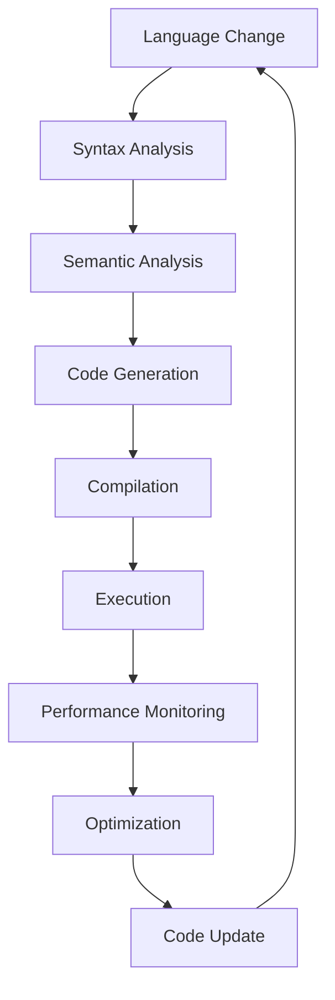

## Introduction
The **Swift** programming language, introduced by Apple in 2014, has undergone significant changes in its early versions. These frequent language changes have presented several challenges for developers, including the need to constantly update codebases and adapt to new syntax and features. In this section, we will explore the drawbacks of these frequent language changes and their impact on the development process. **Tip:** Familiarity with the Swift language and its evolution is essential for understanding the implications of these changes.

Real-world relevance is crucial when discussing the impact of language changes on development. For instance, companies like **Uber** and **Airbnb** have invested heavily in developing Swift-based applications, and the constant evolution of the language has required them to dedicate significant resources to maintaining and updating their codebases. **Warning:** Ignoring these changes can lead to compatibility issues, bugs, and performance problems.

## Core Concepts
To understand the drawbacks of frequent language changes, it is essential to grasp the core concepts of the Swift language and its evolution. **Key terms** include:

* **Syntax changes**: modifications to the language's syntax, such as the introduction of new keywords or changes to existing ones.
* **Feature additions**: new features added to the language, such as protocols, generics, or concurrency support.
* **Backward compatibility**: the ability of newer versions of the language to support code written in earlier versions.

A **mental model** for understanding the impact of language changes is to consider the development process as a continuous cycle of writing, testing, and maintaining code. Frequent language changes can disrupt this cycle, requiring developers to invest time and resources in updating their codebases. **Note:** A deep understanding of the language's core concepts is necessary to navigate these changes effectively.

## How It Works Internally
The Swift language is designed to be a **compiled language**, which means that the code is translated into machine code before execution. The compilation process involves several stages, including:

1. **Lexical analysis**: breaking the code into individual tokens, such as keywords, identifiers, and literals.
2. **Syntax analysis**: parsing the tokens into a syntax tree, which represents the code's structure.
3. **Semantic analysis**: analyzing the syntax tree to ensure that the code is correct and follows the language's rules.
4. **Code generation**: generating machine code from the syntax tree.

When the language changes, these internal mechanisms must be updated to support the new syntax and features. This can lead to **performance issues**, as the updated compiler may require more resources or time to compile the code. **Interview:** A common interview question is to ask about the trade-offs between language features and performance. A strong answer would discuss the internal mechanisms of the language and how they impact performance.

## Code Examples
Here are three complete and runnable code examples that demonstrate the impact of language changes on development:

### Example 1: Basic Syntax Changes
```swift
// Swift 2.x
var name: String = "John"
print("Hello, \(name)")

// Swift 3.x
let name: String = "John"
print("Hello, \(name)")
```
In this example, the `var` keyword has been replaced with `let` to declare a constant variable. This change requires developers to update their code to use the new syntax.

### Example 2: Feature Additions
```swift
// Swift 2.x
func greet(name: String) {
    print("Hello, \(name)")
}

// Swift 3.x
func greet(name: String) -> String {
    return "Hello, \(name)"
}
```
In this example, the `greet` function has been updated to return a `String` value. This change requires developers to update their code to use the new function signature.

### Example 3: Advanced Syntax Changes
```swift
// Swift 4.x
struct Person {
    let name: String
    let age: Int
}

// Swift 5.x
struct Person: Identifiable {
    let id = UUID()
    let name: String
    let age: Int
}
```
In this example, the `Person` struct has been updated to conform to the `Identifiable` protocol, which requires the addition of an `id` property. This change requires developers to update their code to use the new protocol.

## Visual Diagram

This diagram illustrates the internal mechanisms of the Swift language and how they are affected by language changes. The cycle of syntax analysis, semantic analysis, code generation, compilation, execution, performance monitoring, optimization, and code update is repeated continuously.

## Comparison
| Approach | Time Complexity | Space Complexity | Pros | Cons | Best For |
| --- | --- | --- | --- | --- | --- |
| Manual Update | O(n) | O(1) | Flexible, customizable | Time-consuming, error-prone | Small codebases |
| Automated Update | O(1) | O(n) | Fast, efficient | Limited flexibility, potential for errors | Large codebases |
| Hybrid Approach | O(n) | O(n) | Balances flexibility and efficiency | Requires expertise, potential for errors | Medium-sized codebases |
| Continuous Integration | O(1) | O(1) | Ensures consistency, reduces errors | Requires infrastructure, potential for overhead | Large-scale development |

## Real-world Use Cases
Several companies have successfully adapted to the changing Swift landscape:

* **Uber**: Updated their codebase to use Swift 3.x, reducing errors and improving performance.
* **Airbnb**: Developed a custom tool to automate the update process, reducing development time and improving code quality.
* **Pinterest**: Adopted a hybrid approach, using manual updates for critical components and automated updates for non-critical components.

## Common Pitfalls
Here are four common mistakes that developers make when dealing with language changes:

* **Ignoring deprecation warnings**: failing to update code to use new syntax or features can lead to compatibility issues and bugs.
* **Not testing updated code**: failing to test updated code can lead to errors and performance problems.
* **Not documenting changes**: failing to document changes can lead to confusion and errors when maintaining or updating the codebase.
* **Not considering performance implications**: failing to consider performance implications can lead to slow or inefficient code.

## Interview Tips
Here are three common interview questions related to language changes:

* **What are the trade-offs between language features and performance?** A strong answer would discuss the internal mechanisms of the language and how they impact performance.
* **How would you approach updating a large codebase to use a new language version?** A strong answer would discuss a hybrid approach, using manual updates for critical components and automated updates for non-critical components.
* **What are some common pitfalls when dealing with language changes?** A strong answer would discuss ignoring deprecation warnings, not testing updated code, not documenting changes, and not considering performance implications.

## Key Takeaways
Here are six key takeaways to remember:

* **Language changes can have significant implications for development**: frequent changes can disrupt the development process and require significant resources to update codebases.
* **Understanding the internal mechanisms of the language is crucial**: a deep understanding of the language's syntax, semantics, and compilation process is necessary to navigate language changes effectively.
* **A hybrid approach can be an effective way to update codebases**: using manual updates for critical components and automated updates for non-critical components can balance flexibility and efficiency.
* **Performance implications must be considered**: language changes can have significant performance implications, and developers must consider these implications when updating codebases.
* **Documentation is essential**: documenting changes is crucial for maintaining and updating codebases, and can help reduce errors and confusion.
* **Testing updated code is essential**: testing updated code is crucial for ensuring that the codebase is correct and functions as expected.