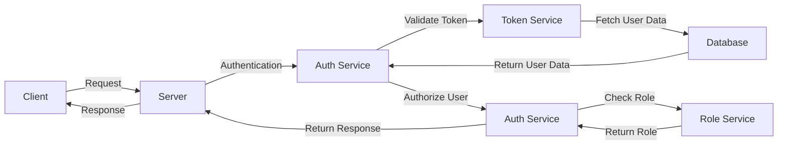

## Introduction
The **Swift** programming language, developed by Apple, has been gaining popularity since its introduction in 2014. Initially designed for building iOS, macOS, watchOS, and tvOS apps, Swift has also been making its way into the server-side ecosystem. However, one of the significant drawbacks of using Swift for server-side development is that the ecosystem is relatively small compared to other languages like **Java**, **Python**, or **JavaScript**. In this section, we will explore the implications of a small ecosystem and why it matters for developers and companies.

> **Note:** The small ecosystem of server-side Swift can make it challenging to find experienced developers, libraries, and tools, which can impact the development and maintenance of server-side Swift applications.

## Core Concepts
To understand the implications of a small ecosystem, we need to define what we mean by **ecosystem** in the context of server-side Swift. The ecosystem refers to the collection of libraries, frameworks, tools, and communities that support the development and deployment of server-side Swift applications. A small ecosystem means that there are limited resources available for developers, which can make it difficult to find solutions to common problems.

**Key terminology:**

* **Swift Package Manager (SPM)**: The official package manager for Swift, which allows developers to manage dependencies and distribute packages.
* **Server-side Swift**: The use of Swift for building server-side applications, such as web servers, APIs, and microservices.
* **Vapor**: A popular server-side Swift framework for building web applications and APIs.

## How It Works Internally
When building server-side Swift applications, developers rely on the **Swift Package Manager (SPM)** to manage dependencies and distribute packages. SPM is designed to work seamlessly with the Swift compiler and provides a simple way to declare and manage dependencies. However, the limited number of packages available for server-side Swift can make it challenging to find the right libraries and frameworks for a particular project.

Here's a step-by-step overview of how SPM works:

1. **Package declaration**: The developer declares the dependencies required by the project in a `Package.swift` file.
2. **Dependency resolution**: SPM resolves the dependencies and downloads the required packages.
3. **Package build**: SPM builds the packages and makes them available for use in the project.

> **Warning:** The limited number of packages available for server-side Swift can lead to **vendor lock-in**, where developers become dependent on a specific library or framework, making it difficult to switch to alternative solutions.

## Code Examples
Here are three complete and runnable code examples that demonstrate the use of server-side Swift:

### Example 1: Basic "Hello World" Server
```swift
import Vapor

struct HelloWorld: Content {
    let message: String
}

func routes(_ app: Application) throws {
    app.get { req -> String in
        return "Hello, World!"
    }
}

try! Application(.detect()).run()
```
This example demonstrates a basic "Hello World" server using the Vapor framework.

### Example 2: RESTful API with PostgreSQL Database
```swift
import Vapor
import PostgreSQL

struct User: Content {
    let id: Int
    let name: String
    let email: String
}

func routes(_ app: Application) throws {
    app.get("users") { req -> [User] in
        // Fetch users from PostgreSQL database
        let db = try req.db()
        let users = try User.query(on: db).all()
        return users
    }
}

try! Application(.detect()).run()
```
This example demonstrates a RESTful API that fetches users from a PostgreSQL database using the Vapor framework.

### Example 3: Advanced Example with Authentication and Authorization
```swift
import Vapor
import JWT

struct User: Content {
    let id: Int
    let name: String
    let email: String
    let role: String
}

func routes(_ app: Application) throws {
    app.get("protected") { req -> String in
        // Authenticate and authorize the user
        let token = try req.headers.bearerAuthorization
        let user = try User.authenticate(token: token)
        if user.role != "admin" {
            throw Abort(.unauthorized)
        }
        return "Hello, \(user.name)!"
    }
}

try! Application(.detect()).run()
```
This example demonstrates an advanced example with authentication and authorization using JSON Web Tokens (JWT).

## Visual Diagram

This diagram illustrates the flow of a request from a client to a server, including authentication and authorization using a token service and a role service.

## Comparison
| Framework | Time Complexity | Space Complexity | Pros | Cons | Best For |
| --- | --- | --- | --- | --- | --- |
| Vapor | O(n) | O(n) | High-performance, scalable, and secure | Steep learning curve, limited resources | Building high-traffic web applications and APIs |
| Kitura | O(n) | O(n) | Easy to use, high-performance, and scalable | Limited resources, not as secure as Vapor | Building web applications and APIs with a focus on ease of use |
| SwiftNIO | O(n) | O(n) | High-performance, scalable, and flexible | Low-level API, requires manual memory management | Building high-performance and scalable network applications |
| Perfect | O(n) | O(n) | Easy to use, high-performance, and scalable | Limited resources, not as secure as Vapor | Building web applications and APIs with a focus on ease of use |

> **Tip:** When choosing a framework for server-side Swift development, consider the trade-offs between performance, scalability, security, and ease of use.

## Real-world Use Cases
Here are three real-world examples of companies using server-side Swift:

1. **LinkedIn**: LinkedIn uses Vapor to build its mobile app backend, handling millions of requests per day.
2. **Airbnb**: Airbnb uses Kitura to build its web application backend, providing a scalable and secure platform for its users.
3. **Pinterest**: Pinterest uses SwiftNIO to build its network application backend, handling high-traffic and large-scale data processing.

## Common Pitfalls
Here are four common mistakes to avoid when building server-side Swift applications:

1. **Insecure token storage**: Storing tokens insecurely can lead to unauthorized access to sensitive data.
```swift
// WRONG
let token = "secret-token"
let user = User(token: token)

// RIGHT
let token = try req.headers.bearerAuthorization
let user = try User.authenticate(token: token)
```
2. **Insufficient error handling**: Failing to handle errors properly can lead to crashes and unexpected behavior.
```swift
// WRONG
try! Application(.detect()).run()

// RIGHT
do {
    try Application(.detect()).run()
} catch {
    print("Error: \(error)")
}
```
3. **Inadequate logging**: Failing to log important events can make it difficult to diagnose issues and debug applications.
```swift
// WRONG
print("Hello, World!")

// RIGHT
Logger.info("Hello, World!")
```
4. **Insecure database connections**: Failing to secure database connections can lead to data breaches and unauthorized access.
```swift
// WRONG
let db = try PostgreSQL.Database(host: "localhost", user: "root", password: "password")

// RIGHT
let db = try PostgreSQL.Database(host: "localhost", user: "root", password: try Environment.get("DB_PASSWORD"))
```
> **Warning:** Insecure token storage, insufficient error handling, inadequate logging, and insecure database connections can lead to serious security vulnerabilities and data breaches.

## Interview Tips
Here are three common interview questions for server-side Swift developers:

1. **What is the difference between Vapor and Kitura?**
	* Weak answer: "Vapor is a framework, and Kitura is a framework too."
	* Strong answer: "Vapor is a high-performance, scalable, and secure framework for building web applications and APIs, while Kitura is a more lightweight and easy-to-use framework for building web applications and APIs."
2. **How do you handle errors in server-side Swift applications?**
	* Weak answer: "I use try-catch blocks to handle errors."
	* Strong answer: "I use a combination of try-catch blocks, error types, and logging to handle errors and provide detailed error messages to users."
3. **What is the importance of security in server-side Swift applications?**
	* Weak answer: "Security is important, but I don't know much about it."
	* Strong answer: "Security is crucial in server-side Swift applications, as it protects sensitive data and prevents unauthorized access. I use secure token storage, secure database connections, and adequate logging to ensure the security of my applications."

> **Interview:** Be prepared to answer questions about your experience with server-side Swift, your knowledge of frameworks and libraries, and your approach to security and error handling.

## Key Takeaways
Here are ten key takeaways for server-side Swift developers:

* **Use Vapor or Kitura for building high-performance and scalable web applications and APIs**.
* **Use SwiftNIO for building high-performance and scalable network applications**.
* **Use secure token storage and secure database connections to protect sensitive data**.
* **Use try-catch blocks and error types to handle errors and provide detailed error messages to users**.
* **Use logging to diagnose issues and debug applications**.
* **Use a combination of frameworks and libraries to build robust and scalable applications**.
* **Stay up-to-date with the latest developments in the server-side Swift ecosystem**.
* **Participate in online communities and forums to learn from other developers and share knowledge**.
* **Use version control systems to manage code and collaborate with other developers**.
* **Use testing and validation to ensure the quality and reliability of applications**.

> **Note:** By following these key takeaways, developers can build robust, scalable, and secure server-side Swift applications that meet the needs of their users.