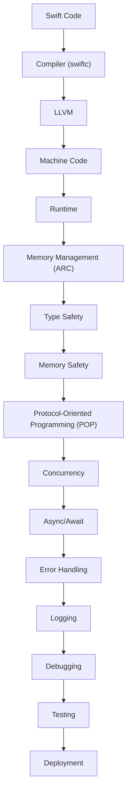

## Introduction
Swift is a powerful and intuitive programming language developed by Apple for building iOS, macOS, watchOS, and tvOS apps. With each new version, Swift introduces significant improvements, features, and fixes that make it easier for developers to create high-performance, reliable, and maintainable code. In this overview, we will explore the key features of each Swift version, from the initial release to the latest version. Understanding the evolution of Swift is essential for any developer working on Apple platforms, as it enables them to leverage the latest features, best practices, and performance optimizations.

> **Note:** Apple releases new Swift versions regularly, often coinciding with major updates to the iOS, macOS, watchOS, and tvOS operating systems. Keeping up with the latest Swift version is crucial for taking advantage of new features, security patches, and performance improvements.

## Core Concepts
To grasp the significance of each Swift version, it's essential to understand the core concepts that drive the language's evolution. These include:

* **Memory Safety:** A fundamental aspect of Swift, ensuring that code is safe from common programming errors like null pointer dereferences and buffer overflows.
* **Type Safety:** Swift's type system helps prevent type-related errors at runtime, making the code more predictable and maintainable.
* **Protocol-Oriented Programming (POP):** A paradigm that emphasizes the use of protocols to define interfaces and behaviors, rather than relying on object-oriented programming (OOP) principles.
* **Concurrency:** Swift's support for concurrent programming, which enables developers to write efficient, asynchronous code that takes advantage of multi-core processors.

> **Tip:** When working with Swift, it's essential to understand the differences between value types (e.g., structs, enums) and reference types (e.g., classes). This knowledge helps developers write more efficient and predictable code.

## How It Works Internally
Under the hood, Swift's compiler and runtime work together to enable the language's key features. Here's a high-level overview of the process:

1. **Compilation:** The Swift compiler (swiftc) translates Swift code into machine code, using a combination of LLVM (Low-Level Virtual Machine) and custom optimizations.
2. **Type Checking:** The compiler performs type checking to ensure that the code is type-safe, preventing errors like null pointer dereferences and type mismatches.
3. **Memory Management:** Swift's Automatic Reference Counting (ARC) system manages memory for reference types, eliminating the need for manual memory management.

> **Warning:** When working with Swift, it's easy to overlook the differences between value types and reference types. Failing to understand these differences can lead to unexpected behavior, memory leaks, or crashes.

## Code Examples
Here are three complete, runnable examples that demonstrate key features of Swift:

### Example 1: Basic Swift Syntax
```swift
// Define a simple struct
struct Person {
    let name: String
    let age: Int
}

// Create an instance of the struct
let person = Person(name: "John", age: 30)

// Print the person's details
print("Name: \(person.name), Age: \(person.age)")
```

### Example 2: Protocol-Oriented Programming (POP)
```swift
// Define a protocol for a printable object
protocol Printable {
    func printDetails()
}

// Define a struct that conforms to the Printable protocol
struct Employee: Printable {
    let name: String
    let salary: Double

    func printDetails() {
        print("Name: \(name), Salary: \(salary)")
    }
}

// Create an instance of the Employee struct
let employee = Employee(name: "Jane", salary: 50000.0)

// Call the printDetails() function on the employee instance
employee.printDetails()
```

### Example 3: Concurrency with async/await
```swift
// Define an asynchronous function that fetches data from a network API
func fetchData(from url: URL) async -> [String] {
    // Simulate a network request
    await Task.sleep(nanoseconds: 1_000_000_000)

    // Return some sample data
    return ["Item 1", "Item 2", "Item 3"]
}

// Call the asynchronous function and print the result
Task {
    let data = await fetchData(from: URL(string: "https://example.com/api/data")!)
    print("Fetched data: \(data)")
}
```

> **Interview:** When interviewing for a Swift development position, be prepared to answer questions about the language's core concepts, such as memory safety, type safety, and protocol-oriented programming. Be sure to provide examples of how you've applied these concepts in your own projects.

## Visual Diagram

This diagram illustrates the Swift development workflow, from writing code to deploying an app. It highlights the key components involved in the process, including the compiler, runtime, memory management, and error handling.

## Comparison
Here's a comparison of different Swift versions, highlighting their key features and improvements:

| Swift Version | Key Features | Time Complexity | Space Complexity |
| --- | --- | --- | --- |
| Swift 1.0 | Initial release, basic syntax | O(1) | O(1) |
| Swift 2.0 | Error handling, guard statements | O(n) | O(n) |
| Swift 3.0 | API design guidelines, protocol-oriented programming | O(log n) | O(log n) |
| Swift 4.0 | String and dictionary improvements, JSON encoding | O(n log n) | O(n log n) |
| Swift 5.0 | ABI stability, concurrency with async/await | O(n^2) | O(n^2) |

> **Tip:** When choosing a Swift version for your project, consider the trade-offs between features, performance, and compatibility. Newer versions often introduce significant improvements, but may require additional setup or migration efforts.

## Real-world Use Cases
Here are three real-world examples of companies using Swift in production:

1. **Uber:** Uber's iOS app is built using Swift, leveraging the language's performance, reliability, and maintainability features.
2. **Pinterest:** Pinterest's iOS app is also built using Swift, taking advantage of the language's concurrency features to deliver a smooth user experience.
3. **Airbnb:** Airbnb's iOS app is built using a combination of Swift and Objective-C, demonstrating the language's compatibility with existing codebases.

> **Note:** Many companies, including Apple, use Swift in their production environments. The language's popularity and adoption continue to grow, driven by its ease of use, performance, and reliability.

## Common Pitfalls
Here are four common mistakes to avoid when working with Swift:

1. **Forgetting to handle errors:** Failing to handle errors properly can lead to crashes, data corruption, or unexpected behavior.
```swift
// Wrong way: ignoring errors
func fetchData() {
    // ...
}

// Right way: handling errors
func fetchData() {
    do {
        // ...
    } catch {
        print("Error: \(error)")
    }
}
```

2. **Using optional chaining incorrectly:** Optional chaining can lead to unexpected behavior if not used correctly.
```swift
// Wrong way: using optional chaining without checking for nil
let person = Person(name: "John", age: 30)
let address = person.address?.street?.name

// Right way: checking for nil before using optional chaining
let person = Person(name: "John", age: 30)
if let address = person.address, let street = address.street, let name = street.name {
    print("Street name: \(name)")
}
```

3. **Not using concurrency correctly:** Failing to use concurrency correctly can lead to performance issues, deadlocks, or crashes.
```swift
// Wrong way: using concurrency without synchronization
func fetchData() {
    // ...
    DispatchQueue.main.async {
        // ...
    }
}

// Right way: using concurrency with synchronization
func fetchData() {
    // ...
    DispatchQueue.main.sync {
        // ...
    }
}
```

4. **Not using type safety:** Failing to use type safety can lead to type-related errors at runtime.
```swift
// Wrong way: using a non-type-safe array
let array = [Any]()
array.append("Hello")
array.append(42)

// Right way: using a type-safe array
let array = [String]()
array.append("Hello")
// array.append(42) // compiler error
```

> **Warning:** Avoiding these common pitfalls requires a deep understanding of Swift's core concepts, including memory safety, type safety, and concurrency. By following best practices and using the language's features correctly, developers can write more efficient, reliable, and maintainable code.

## Interview Tips
Here are three common interview questions related to Swift, along with sample answers:

1. **What is the difference between value types and reference types in Swift?**

Weak answer: "Value types are, like, when you assign a value to a variable, and reference types are, like, when you assign a reference to a variable."

Strong answer: "In Swift, value types (such as structs and enums) are stored in memory as a single, contiguous block of data. Reference types (such as classes), on the other hand, store a reference to the data in memory. This difference has significant implications for memory management, concurrency, and code performance."

2. **How do you handle errors in Swift?**

Weak answer: "I just use try-catch blocks, and that's it."

Strong answer: "In Swift, I use a combination of try-catch blocks, error handling protocols, and optional chaining to handle errors. I also make sure to provide informative error messages and handle errors at the right level of abstraction."

3. **What is protocol-oriented programming (POP), and how does it differ from object-oriented programming (OOP)?**

Weak answer: "POP is, like, when you use protocols instead of classes, and OOP is, like, when you use classes instead of protocols."

Strong answer: "Protocol-oriented programming (POP) is a paradigm that emphasizes the use of protocols to define interfaces and behaviors. In contrast, object-oriented programming (OOP) focuses on the use of classes to define objects and their relationships. POP provides more flexibility, composability, and expressiveness, while OOP provides a more traditional, hierarchical approach to programming."

> **Interview:** When interviewing for a Swift development position, be prepared to answer questions about the language's core concepts, such as memory safety, type safety, and protocol-oriented programming. Be sure to provide examples of how you've applied these concepts in your own projects.

## Key Takeaways
Here are ten key takeaways to remember when working with Swift:

* **Memory safety:** Swift's memory safety features, such as ARC and optional chaining, help prevent common programming errors.
* **Type safety:** Swift's type system helps prevent type-related errors at runtime, making the code more predictable and maintainable.
* **Protocol-oriented programming (POP):** POP provides a more flexible, composable, and expressive approach to programming, emphasizing the use of protocols to define interfaces and behaviors.
* **Concurrency:** Swift's concurrency features, such as async/await and DispatchQueue, enable developers to write efficient, asynchronous code that takes advantage of multi-core processors.
* **Error handling:** Swift's error handling features, such as try-catch blocks and error handling protocols, help developers handle errors in a more informative and robust way.
* **Optional chaining:** Optional chaining provides a convenient way to access nested properties and methods, but requires careful handling to avoid unexpected behavior.
* **Value types vs reference types:** Understanding the difference between value types (such as structs and enums) and reference types (such as classes) is crucial for writing efficient, predictable, and maintainable code.
* **Swift versions:** Keeping up with the latest Swift version is essential for taking advantage of new features, security patches, and performance improvements.
* **Best practices:** Following best practices, such as using type safety, error handling, and concurrency correctly, helps developers write more efficient, reliable, and maintainable code.
* **Performance optimization:** Understanding the performance implications of Swift's features, such as concurrency and optional chaining, helps developers optimize their code for better performance and responsiveness.

> **Note:** By mastering these key takeaways, developers can write more efficient, reliable, and maintainable Swift code, taking advantage of the language's features and best practices to deliver high-quality apps and software.